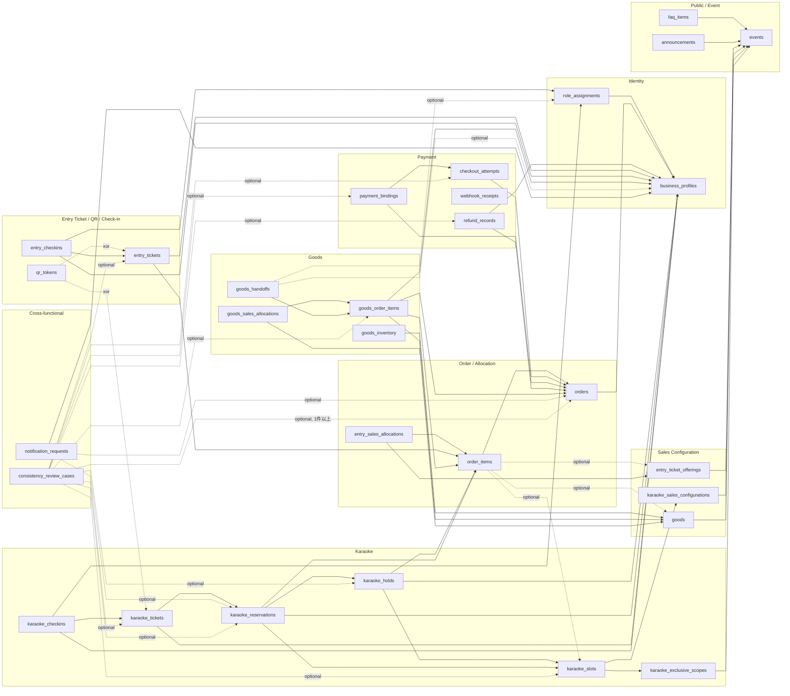
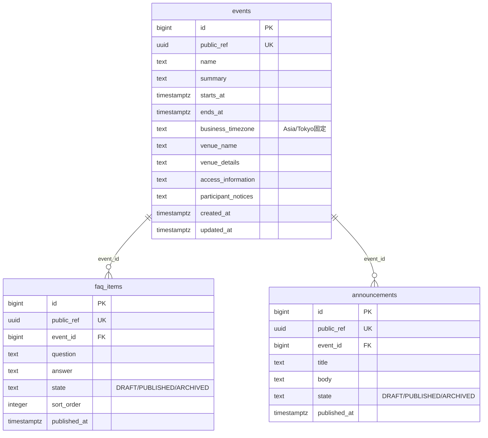
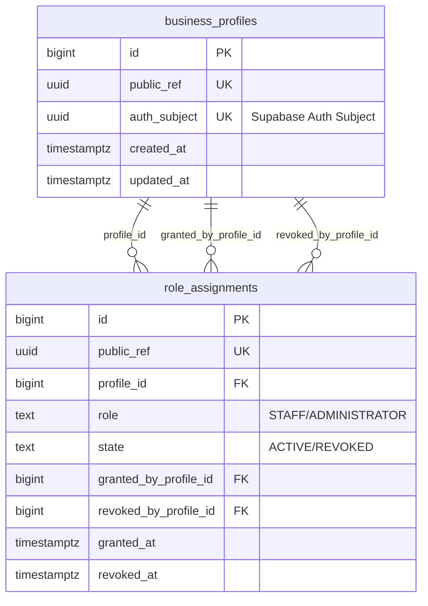
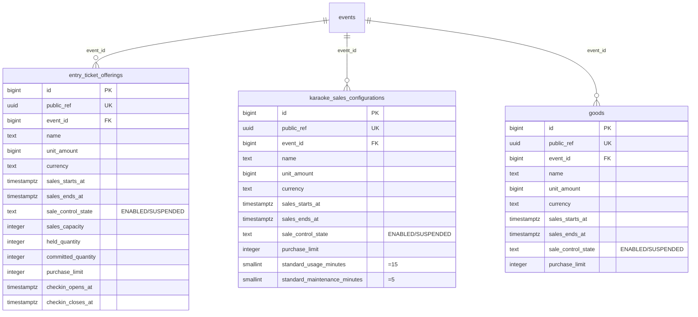
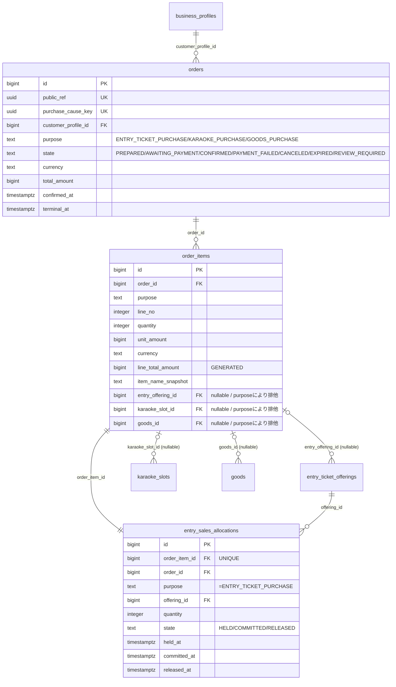
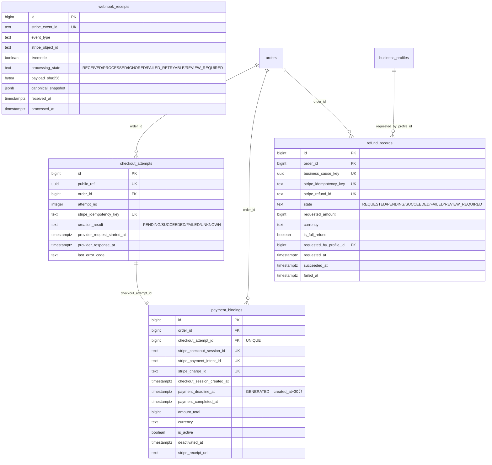
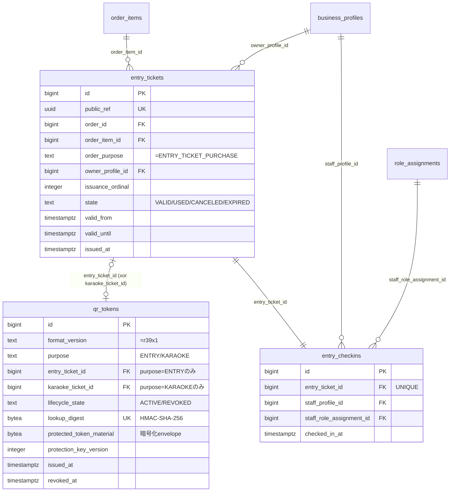
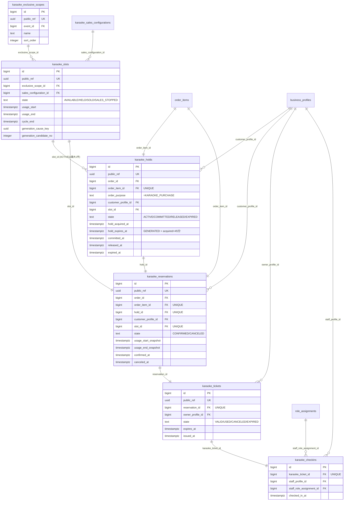
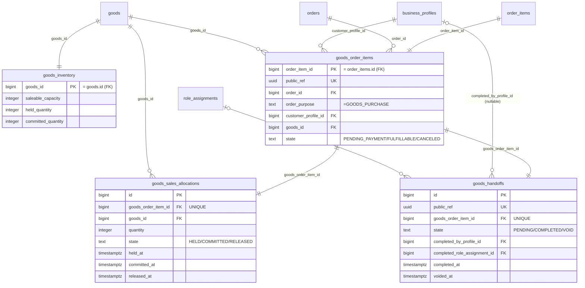
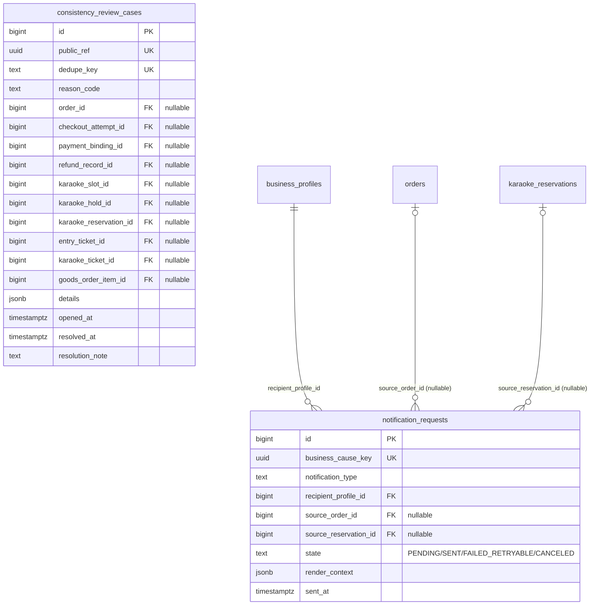

# ER図(off r39'x)

本書は `Requirements/main_req/100-database-design.md`(SPEC-100)の内容をもとに、
実装フェーズ2(DB設計・マイグレーション)向けにER図として可視化したものである。
本書はSPEC-100の要約・可視化であり、Canonicalな定義は常にSPEC-100本文を優先する
(型・制約の詳細、CHECK式、trace先ID等は本書に書き切っていないものがある)。

対象スキーマ: PostgreSQL `app` スキーマ(Supabase)。全テーブル共通で
Internal ID(`id bigint identity`)とPublic Reference(`public_ref uuid`)を分離する方針(DB-ID-001〜003)。

## 目次

0. ER図の表記方法・用語集
1. 全体俯瞰図(全テーブルの関連)
2. Public / Event
3. Identity / Authorization
4. Sales Configuration
5. Order / Allocation
6. Payment Persistence
7. Entry Ticket / QR / Check-in
8. Karaoke
9. Goods
10. Cross-functional Persistence
11. 主要制約一覧
12. Invariantとテーブルの対応

---

## 0. ER図の表記方法・用語集

### 0.1 Mermaid erDiagramの基本構造

本書のER図(2〜10章)は[Mermaid](https://mermaid.js.org/)の`erDiagram`記法で記述している。基本形は次のとおり。

```
erDiagram
    entity_name {
        type column_name KEY "comment"
    }
    entity_a ||--o{ entity_b : "relationship label"
```

- **entity定義ブロック** (`entity_name { ... }`): テーブル1つに対応する。各行が1カラムを表す。
  - `type`: カラムの型(`bigint`, `uuid`, `text`, `timestamptz`, `integer`, `smallint`, `jsonb`, `bytea`, `boolean`など)。PostgreSQLの型名をそのまま使用。
  - `column_name`: カラム名。
  - `KEY`: そのカラムの制約種別。本書では`PK`/`FK`/`UK`のいずれか1つのみを表記する(理由は0.3参照)。
  - `"comment"`: 補足説明。状態の取り得る値(例: `"ACTIVE/REVOKED"`)や、GENERATEDである旨などを記載。
- **リレーションシップ行**: `entity_a <カーディナリティ記号> entity_b : "label"`の形式で、2テーブル間の関連(主に外部キー関係)を表す。`label`には対応するFKカラム名や補足を記載している。

### 0.2 リレーションシップのカーディナリティ記号

Mermaid erDiagramのカーディナリティは、線の両端にある2文字の記号で「その側から見た相手の数」を表す。

| 記号 | 意味 |
|---|---|
| `\|\|` | ちょうど1件(exactly one) |
| `o\|` | 0件または1件(zero or one) |
| `}o` | 0件以上(zero or many) |
| `}\|` | 1件以上(one or many) |

線種は2種類あるが、本書では区別を重視せず**実線(`--`)**のみを使用している(FK関係の表現が目的で、identifying/non-identifyingの区別は本システムの設計方針上重要ではないため)。

本書で実際に使われている組み合わせの読み方:

| 表記例 | 意味 |
|---|---|
| `events \|\|--o{ faq_items : "event_id"` | 1件のEventに対しFAQ Itemは0件以上(1対多、通常の親子関係) |
| `goods \|\|--\|\| goods_inventory : "goods_id"` | GoodsとGoods Inventoryは1対1(必ず対になる) |
| `order_items \|o--o{ entry_ticket_offerings : "entry_offering_id (nullable)"` | Order ItemからEntry Ticket Offeringへの参照は0件または1件(FKがnullableであることを表す)、Offering側からは0件以上のOrder Itemが対応 |
| `entry_tickets \|o--o\| qr_tokens : "entry_ticket_id (xor karaoke_ticket_id)"` | 双方が0件または1件(どちらか一方だけが実際に存在しうる、排他的な関係) |

矢印の向き(左に書いた側が「1」寄り、右に書いた側が「多」寄り)は、本書では原則として「親テーブル(参照される側) → 子テーブル(参照する側、FKを持つ側)」の順で統一している。

### 0.3 属性キー(PK / FK / UK)の表記ルール

- **PK (Primary Key)**: そのテーブルの主キー。
- **FK (Foreign Key)**: 他テーブルの主キーを参照する外部キー。
- **UK (Unique Key)**: 主キー以外の一意制約。

あるカラムが複数の性質(例: 主キーかつ外部キー、外部キーかつ一意)を同時に持つ場合、本書では**1つのキーワードのみ表記し、残りはコメントで補足する**表記ルールを採用している。

```
bigint goods_id PK "= goods.id (FK)"
bigint order_item_id FK "UNIQUE"
```

これはMermaidのerDiagram構文が`FK UK`のようなスペース区切りの複数キー指定を安定して解釈できず(レンダラーによっては構文エラーになる)、実際に本書でもこれが原因で5〜9章の図が表示されない不具合が発生したための表記上の回避策である。実際のDB制約(どのカラムが本当にUNIQUEか等)は、必ず11章「主要制約一覧」またはSPEC-100本文を正とする。

同様の理由で、entity内のコメント(`"..."`)には**カンマ(,)を含めない**(スラッシュ`/`や全角の区切りを代わりに使う)。カンマを含むコメントも同じ構文エラーの原因になることを確認している。

### 0.4 DB設計用語集(SPEC-100 “Canonical Database Terms” 準拠)

SPEC-100(100-database-design.md)の3章で定義されている、本書のER図でも頻出する用語。

| 用語 | 解説 |
|---|---|
| Internal ID | DB内部のjoin/FKにのみ使用する非公開の識別子。`id bigint GENERATED ALWAYS AS IDENTITY`。Browser/API境界には露出しない。 |
| Public Reference | Browser/API境界でEntityを参照するための推測困難なUUID(`public_ref`)。Internal IDとは別物で、FKには原則使わない。知っているだけでは認可(Authorization)されない点に注意(DB-ID-001)。 |
| Business Schema | 本システムが所有するPostgreSQLスキーマ`app`。Supabase管理下の`auth`/`storage`等とは区別する。 |
| Auth Subject | Supabase Auth上のIdentityを一意に参照するUUID。Business Database(`app`スキーマ)側はパスワード等のCredentialを一切保持しない。 |
| Business Cause Key | リトライ時に「同一の業務操作である」ことを識別するための永続key。二重注文・二重通知等を防ぐために使う(例: `purchase_cause_key`, `business_cause_key`)。 |
| Historical Row | financial(決済)/entitlement(チケット等の権利)/payment/check-in/role historyなど、通常運用でhard deleteしない行。監査・追跡のため保持し続ける。 |
| Current-state Row | 現在の状態(State)を1カラムで保持し、条件付きUPDATE(`WHERE state = :expected`)によってのみ遷移させる行。 |
| Constraint Fallback | アプリケーション側のvalidationやrow lockが万一漏れた場合でも、重大な不変条件(critical invariant)を破らせないための、DB制約による最終防御。 |
| Owner-safe Query | Public Referenceだけで対象行を特定するのではなく、検証済みのBusiness Profile(ログインユーザー本人)との関係を同一クエリ条件に含めて参照する方法。他人のデータを覗き見される(IDOR)ことを防ぐ。 |

### 0.5 型・制約関連の用語

| 用語 | 解説 |
|---|---|
| `bigint identity` (`GENERATED ALWAYS AS IDENTITY`) | PostgreSQLが自動採番する整数型の主キー。本書のInternal IDに使用。 |
| `timestamptz` (timestamp with time zone) | タイムゾーン情報を持つ絶対時刻型。本システムはUTCで保存し、表示時にAsia/Tokyoへ変換する方針(Business calendar dateが必要な箇所は`date`型を別途使用)。 |
| Generated Column (`GENERATED ALWAYS AS (...) STORED`) | 他のカラムの値から自動計算され、実体としてディスクに保存される列。アプリケーション側から直接値を指定できないため、期限や合計金額の改ざんを防げる。例: `payment_deadline_at`(決済期限=作成+30分)、`hold_expires_at`(Hold期限=取得+45分)、`line_total_amount`(明細合計)。 |
| CHECK制約 | 列やテーブル全体に対して条件式を強制するDB制約。許可される状態値の列挙、数値範囲、時刻の前後関係、排他条件などを守るために使う。 |
| UNIQUE制約 / Partial Unique Index | 一意性を強制する制約。Partial Unique(`CREATE UNIQUE INDEX ... WHERE ...`)はWHERE句の条件を満たす行の中でのみ一意性を強制する(例: 「Stateが`ACTIVE`の行に限り、同じSlotは1件まで」)。 |
| GiST Exclusion Constraint (`EXCLUDE USING gist`) | 複数行の間である条件(主に時間範囲の重複など)が同時に成立しないことをDBレベルで保証する制約。本書ではカラオケ枠の時間帯重複防止に使用。 |
| Row Lock (`FOR UPDATE`) | トランザクション内で特定の行を排他ロックし、他のトランザクションによる同時更新を防ぐ仕組み。在庫・Hold・チケットの同時実行制御に多用される。 |
| Composite FK | 複数カラムの組み合わせを外部キーとする方式。関連する複数テーブル間の値の一致(例: Order ItemのpurposeとOrderのpurposeが一致していること)をDBレベルで保証する。 |

---

## 1. 全体俯瞰図(全テーブルの関連)

属性は省略し、テーブル間の参照関係(子→親)のみを示す。詳細な属性は2章以降を参照。



---

## 2. Public / Event



- `events`: hard delete禁止(state管理)。`business_timezone`は`'Asia/Tokyo'`固定のCHECK。
- 公開クエリは`state='PUBLISHED'`のみ返す(DB-SAL-001)。

---

## 3. Identity / Authorization



- `business_profiles.auth_subject`はUNIQUE(1:1)。`auth.users`へのDB FKは張らない(別System of Record)。
- `role_assignments`: `(profile_id, role) WHERE state='ACTIVE'`のpartial unique(1Profile1Role最大1 ACTIVE)。
- 最後のAdministrator喪失防止はrevoke時にadvisory lock(`pg_advisory_xact_lock`)で保護(DBのみでは表現不可)。

---

## 4. Sales Configuration



- `entry_ticket_offerings`: `held_quantity + committed_quantity <= sales_capacity`のCHECK(在庫上限のcounter方式)。
- `karaoke_sales_configurations`: 標準15分利用+5分整備はCHECKで固定。例外Slotは`karaoke_slots`側の3時刻で個別表現(この設定値自体は変更しない)。
- Goodsに配送先/carrier/tracking系のカラムは無い(仕様上、対象外)。

---

## 5. Order / Allocation



- 1 Order = 1 Purpose(`order_items.purpose`は`orders.purpose`とcomposite FKで一致必須)。
- `order_items`のsource CHECK: purposeごとに`entry_offering_id`/`karaoke_slot_id`/`goods_id`のうちどれか1つのみNOT NULL。KARAOKE_PURCHASEは`quantity=1`固定。
- `line_total_amount`は`unit_amount * quantity`のGENERATED列。
- Entry容量は`entry_ticket_offerings`行ロック+counter CHECK+`entry_sales_allocations`のState管理で二層防御。

> 注: CR-070-001(カート機能で複数Domain混在Orderを許容するか)が確定するまで、
> `order_items`のPurpose CHECK制約は本書の内容(1 Order = 1 Purpose)のまま実装すること。

---

## 6. Payment Persistence



- `webhook_receipts`はOrder等への直接FKを持たない独立テーブル(Stripe Event単位の冪等性記録)。生payloadは保存せず`canonical_snapshot`(最小限のJSON)のみ保持。
- Active Checkoutは1 Orderにつき最大1件(`ux_payment_bindings_order_active`のpartial unique)。
- 正常full refundは同一Orderに対し重複してactive/succeededにできない(`ux_refund_records_order_live_full`)。
- `payment_deadline_at`(30分)はGENERATED列でDB固定。Client入力を信用しない。

> 注: CR-070-003(Konbini対応)、OPEN-PAY-020(Idempotency-Key発行単位)が未決定。
> 現行スキーマは「card only」「Checkout Attempt単位でstripe_idempotency_keyをUNIQUE」を前提とする。

---

## 7. Entry Ticket / QR / Check-in



- `qr_tokens`はEntry/Karaokeどちらか一方のみへ属するpolymorphic relation(CHECKで排他)。ActiveなTokenは各Ticketにつき最大1件(partial unique)。
- QR平文は保存しない。`lookup_digest`はkeyed HMAC、`protected_token_material`はAES-256-GCM等で暗号化したopaque envelope。
- `entry_checkins`はImmutable(UPDATE/DELETE禁止)。Check-inは対象Ticket行ロック+条件付き`VALID→USED`更新と同一トランザクション。

---

## 8. Karaoke



- `karaoke_slots`: Occupancy `[usage_start, cycle_end)` の重複をGiST Exclusion制約(`ex_karaoke_slots_scope_occupancy`)で禁止。State(AVAILABLE/HELD/SOLD/SALES_STOPPED)を問わず全件対象。
- `karaoke_holds`: 同一SlotのACTIVE Holdは最大1件(partial unique)。有効期限45分はGENERATED列。
- Checkout活性化条件(cross-table precondition、DB CHECKではなくtransaction内で検証):
  `payment_deadline_at <= hold_expires_at - 5分` かつ `payment_deadline_at <= slot.usage_end`
- `karaoke_reservations`: Order Item/Slot/Holdそれぞれにつき最大1件。取消(CANCELED)後もSlotは`SOLD`のまま、Holdは`COMMITTED`のまま維持(no resale方針)。
- Check-in窓: `usage_start_snapshot - 10分 <= now < usage_end_snapshot`(Reservationのsnapshotを権威値とし、冗長列は持たない)。

---

## 9. Goods



- `goods_inventory`は1 Goodsにつき1行。`held_quantity + committed_quantity <= saleable_capacity`。
- `goods_order_items`はbase `order_items`の1:1拡張(PK=`order_item_id`)。
- `goods_handoffs`も1 Goods Order Itemにつき1行、Goods購入開始と同時に`PENDING`で作成(欠落を許容しない)。

---

## 10. Cross-functional Persistence



- `consistency_review_cases`は対象FK(10種)のうち**少なくとも1つがNOT NULL**というCHECKのみで、業務State enumは追加しない。`resolved_at IS NULL`が未解決の物理条件。
- `notification_requests`は`source_order_id`/`source_reservation_id`の少なくとも一方が必須。Email送信の成否がDomain処理をロールバックしない設計(INV-010-06)。
- Audit(監査ログ)専用テーブルはSPEC-100では作成せず、SPEC-160が後続migrationで追加する方針(本書のスコープ外)。

---

## 11. 主要制約一覧

| 種別 | 対象 | 内容 |
|---|---|---|
| Partial Unique | `role_assignments` | `(profile_id, role) WHERE state='ACTIVE'` — 1Profile1Roleの同時ACTIVEは最大1件 |
| Partial Unique | `payment_bindings` | `(order_id) WHERE is_active` — Active Checkoutは1 Orderにつき最大1件 |
| Partial Unique | `refund_records` | `(order_id) WHERE is_full_refund AND state IN (REQUESTED,PENDING,SUCCEEDED,REVIEW_REQUIRED)` |
| Partial Unique | `qr_tokens` | Entry/Karaokeそれぞれ `WHERE lifecycle_state='ACTIVE'` — Ticketごとに最大1 Active Token |
| Partial Unique | `karaoke_holds` | `(slot_id) WHERE state='ACTIVE'` — 同一SlotのACTIVE Holdは最大1件 |
| Unique | `karaoke_reservations` | `order_item_id`, `slot_id`, `hold_id` それぞれ最大1件 |
| Unique | `karaoke_tickets` | `reservation_id` — Reservationごとに最大1 Ticket |
| Unique | `entry_tickets` | `(order_item_id, issuance_ordinal)` — 発行単位の重複防止 |
| Unique | `entry_checkins` / `karaoke_checkins` | Ticket FKにUNIQUE — Check-inは最大1回 |
| Unique | `checkout_attempts` | `stripe_idempotency_key`, `(order_id, attempt_no)` |
| Unique | `payment_bindings` | `stripe_checkout_session_id`, `stripe_payment_intent_id`, `stripe_charge_id` |
| Unique | `webhook_receipts` | `stripe_event_id` — Webhook冪等性の要 |
| GiST Exclusion | `karaoke_slots` | `ex_karaoke_slots_scope_occupancy`: 同一Scope内 `[usage_start, cycle_end)` の重複禁止(全State対象) |
| CHECK | `orders` | Purpose 3値、State 7値、State⇔timestampの整合 |
| CHECK | `order_items` | Purposeごとのsource(entry/karaoke/goods) FK排他、`karaoke`は`quantity=1` |
| CHECK | `entry_ticket_offerings` | `held_quantity + committed_quantity <= sales_capacity` |
| CHECK | `goods_inventory` | `held_quantity + committed_quantity <= saleable_capacity` |
| CHECK | `karaoke_slots` | `usage_start < usage_end <= cycle_end` |
| Generated Column | `order_items.line_total_amount` | `unit_amount * quantity` |
| Generated Column | `payment_bindings.payment_deadline_at` | `checkout_session_created_at + 30分` |
| Generated Column | `karaoke_holds.hold_expires_at` | `hold_acquired_at + 45分` |

- PostgreSQL native enumは不採用。Stateは全て`text NOT NULL` + named CHECK。
- 全テーブルで`ON UPDATE NO ACTION`、confirmed financial/entitlement/check-in historyへの`ON DELETE CASCADE`は禁止。
- `app`スキーマへの`anon`/`authenticated`ロールの直接write権限は`REVOKE`し、Hono API専用DBロールのみに権限を付与(RLSは不採用)。

---

## 12. Invariantとテーブルの対応

| System Invariant | 内容 | 対応するDB保護機構 |
|---|---|---|
| `INV-010-01` | 購入情報を失わない | Order先行永続化、RESTRICT retention、Checkout Attempt / Consistency Review Case |
| `INV-010-02` | Order二重確定禁止 | Order行ロック + 条件付きState更新 + entitlement系unique key |
| `INV-010-03` | チケット二重発行禁止 | `entry_tickets(order_item_id, issuance_ordinal)`、`karaoke_tickets(reservation_id)` |
| `INV-010-04` | カラオケ二重販売禁止 | GiST Exclusion、Slot行ロック、ACTIVE Hold partial unique、`karaoke_reservations(slot_id)` unique |
| `INV-010-05` | QRチケット二重利用禁止 | Ticket行ロック + 条件付き`VALID→USED` + Check-in Ticket unique |
| `INV-010-06` | メール失敗でロールバックしない | `notification_requests`をDomain transactionから分離 |
| `INV-010-07` | 決済/権利発行の部分確定禁止 | Purpose別Business Confirmationを単一transactionで実行 |
| `INV-010-08` | Ownership/Roleはサーバー側 | `auth_subject` unique、Owner FK、`role_assignments`、owner-safe index |
| `INV-010-09` | クライアント価格不信用 | DB price snapshot + integer amount + currency一致のcomposite FK |
| `INV-010-10` | 外部リトライ耐性 | Business Cause Key、Stripe外部ID unique、Webhook Event unique、各partial unique |

---

## 補足

- 本書は実装(Drizzle schema / migration)の設計レビュー用であり、実装時は必ずSPEC-100本文の該当セクション
  (Part IV「Table Design」、Part XI「Index Design」、Part XII「Transaction / Concurrency Design」)を参照すること。
- CR-070-001〜003(カート機能、Order取消主体、Konbini対応)の決定内容によっては、`orders`/`order_items`の
  Purpose CHECK制約や`checkout_attempts`/`payment_bindings`の構造に変更が入る可能性がある
  ([Requirements/implementation-plan.md](implementation-plan.md) の未決事項一覧を参照)。
