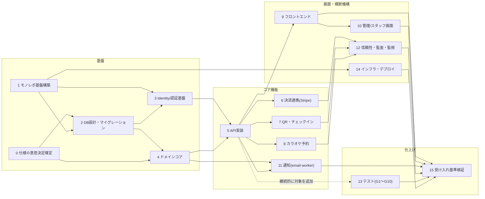

# 実装計画書(off r39'x)

本書は `Requirements/main_req/000〜200` の仕様書、`change-requests-spec070.md`、
`payment-spec-decision-items.md`、および `Dev/payment-mock` の調査結果をもとに、
本開発(フロントエンド/バックエンド/DB)の実装手順をまとめたものである。

複数名での開発を前提とし、各フェーズの依存関係・並行実施可否を明記することで、
担当者が「どこまで一人でまとめて実施できるか」を判断できるようにすることを目的とする。

## 0. 前提

- 標準スタック: TypeScript / pnpm workspaces / Next.js(Web, Vercel) / Hono(API, Railway) /
  Zod / Supabase PostgreSQL(Drizzle) / Supabase Auth / Stripe Checkout / Resend+React Email /
  Vitest / Playwright / Biome。
- モノレポ構成(190準拠): `apps/{web,api,email-worker,reconciliation-worker}` /
  `packages/{domain,application,api-contract,db,auth,providers,email,security,reliability,observability}`。
  依存方向は外側→内側のみ。**WebからDB直接アクセスは禁止**、Web→API→DBの一方向経路のみ。
- `Dev/payment-mock` はサーバー/DBを持たないクライアント完結モック(状態はlocalStorageのみ)。
  画面構成・UIコンポーネント(shadcnベース)・型定義(`types.ts`)・状態遷移ロジック
  (`store.tsx`, `karaoke.ts`)は仕様書番号がコメントで紐づいており、本開発の出発点として利用する。
  決済/DB/認証/権限まわりは全面的に作り直しが必要。
- 全フェーズ横断で `INV-010-01〜10`(購入情報消失防止、注文二重確定禁止、チケット二重発行禁止、
  カラオケ二重販売禁止、QR二重利用禁止 等)を保護すること。

## 1. 未決事項一覧

以下はコードに着手する前、または該当フェーズに入る前に確定させる必要がある事項。
未確定のままDB設計・API設計を進めると手戻りが大きいため、フェーズ0で優先的に解消する。

| ID               | 内容                                  | 論点                                                                                                                       | 影響範囲                                                                       | 出典                           |
| ---------------- | ------------------------------------- | -------------------------------------------------------------------------------------------------------------------------- | ------------------------------------------------------------------------------ | ------------------------------ |
| CR-070-001       | カート機能(複数Domain混在Order)の可否 | 「カートで複数商材をまとめて購入可能にする」方針と、SPEC-070の「1 Order = 1 Purpose」原則が矛盾                            | DB(`order_items`のPurpose CHECK制約)、Order状態機械、API(`/self/purchases/*`)  | change-requests-spec070.md     |
| CR-070-002       | Order取消の主体                       | 「Order取消は運営限定」という決定と、SPEC-070の「利用者によるセルフキャンセル許可」が矛盾                                  | API(`/self/orders/{ref}/cancel`)、権限設計(060/140)                            | change-requests-spec070.md     |
| CR-070-003       | コンビニ決済(Konbini)対応の可否       | 「Konbini対応」の決定と、SPEC-070「card onlyがCanonical」が矛盾。対応する場合は非同期支払い・返金semanticsの追加設計が必要 | 決済フロー全体、Webhook設計、DB(`checkout_attempts`等)、フロントエンド決済画面 | change-requests-spec070.md     |
| OPEN-PAY-020     | Stripe Idempotency-Keyの発行単位      | Order単位で使い回すか、Checkout Attempt単位で都度新規発行するか未決定                                                      | 決済API実装、リトライ処理                                                      | payment-spec-decision-items.md |
| UCR-130-001〜006 | Admin機能の一部がAPI仕様に未反映      | Entry/Karaoke販売条件管理画面等が現行API仕様だけでは完成しない(`FR-ADM-014〜015`)                                          | 管理画面(フェーズ10)、API仕様(110)拡張                                         | 130 / 200                      |
| UCR-150-001〜002 | 専用Recovery APIが未反映              | 障害復旧手順に必要なAPIが仕様化されていない                                                                                | 信頼性機構(フェーズ12)                                                         | 150 / 200                      |
| UCR-170-001      | Operation IDの仕様不足                | テスト・監査で参照するOperation IDの体系が未定義                                                                           | テスト設計(フェーズ13)、監査ログ(160)                                          | 170 / 200                      |

> 上記が未反映のまま実装した機能は「仮実装」として扱わず、200(受け入れ基準)に従い
> 該当箇所は要件未確定として明示し、実装を保留するか、確定後に実装する。

## 2. フェーズ一覧と依存関係

「独立」＝他フェーズの成果物がなくても着手・完結できる。
「従属」＝先行フェーズの成果物(スキーマ・型・APIコントラクト等)が確定しないと着手・完結できない。
「並行可否」は同時期に複数担当者が別フェーズを進める場合の目安。

| #   | フェーズ                      | 依存(前提)                                   | 独立/従属            | 並行実施の目安                                                      | 主な参照仕様                                                    |
| --- | ----------------------------- | -------------------------------------------- | -------------------- | ------------------------------------------------------------------- | --------------------------------------------------------------- |
| 0   | 仕様の意思決定確定            | なし                                         | 独立                 | 最優先・単独タスク。他フェーズより先に完了させる                    | 070, change-requests-spec070.md, payment-spec-decision-items.md |
| 1   | モノレポ基盤構築              | なし(0の結論を待たずに着手可)                | 独立                 | 1名で完結可。フェーズ2と並行可                                      | 190                                                             |
| 2   | DB設計・マイグレーション      | 0(CR解消)、1(リポジトリ構成)                 | 従属                 | 1名でスキーマ設計→レビューが基本。3以降の前提                       | 100                                                             |
| 3   | Identity/認証基盤             | 1, 2(business_profiles/role_assignments確定) | 従属                 | 2と並行しづらい(スキーマ待ち)。4とは並行可                          | 060, 140                                                        |
| 4   | ドメインコア(packages/domain) | 2(テーブル/状態定義)、0                      | 従属                 | 3と並行可。5の前提                                                  | 010, 070, 080, 090                                              |
| 5   | API実装(apps/api)             | 3, 4                                         | 従属                 | エンドポイント単位で複数名分担可能                                  | 110                                                             |
| 6   | 決済連携(Stripe)              | 4, 5(Order/Checkout API)                     | 従属                 | 5と一部並行可(契約を先に固めれば)                                   | 070                                                             |
| 7   | チケット/QR・チェックイン     | 4, 5                                         | 従属                 | 6と並行可(独立ドメイン)                                             | 080                                                             |
| 8   | カラオケ予約                  | 4, 5                                         | 従属                 | 6, 7と並行可(独立ドメイン)                                          | 090                                                             |
| 9   | フロントエンド(apps/web)      | 5(APIコントラクト確定分から着手可)           | 従属(部分的に独立)   | 画面単位でAPIコントラクトのモックを使い先行着手可能。5〜8と並行推奨 | 040, 050, payment-mock資産                                      |
| 10  | 管理/スタッフ画面             | 5, 9の共通コンポーネント、UCR-130解消        | 従属                 | 9と並行可、UCR解消が前提                                            | 130                                                             |
| 11  | 通知(email-worker)            | 4(ドメインイベント), 5                       | 従属                 | 6〜8と並行可(独立ワーカー)                                          | 120                                                             |
| 12  | 信頼性・監査・監視            | 5, 6(Outbox/Webhook実装後)                   | 従属                 | 横断機構のため専任担当推奨。9, 10と並行可                           | 150, 160, UCR-150                                               |
| 13  | テスト(G1〜G10)               | 各対象フェーズの実装完了分から順次着手       | 従属(段階的)         | 実装と並行して継続実施(test-firstを推奨)                            | 170, UCR-170                                                    |
| 14  | インフラ・デプロイ            | 1(モノレポ構成確定)                          | 独立寄り(早期着手可) | 1と並行可。環境構築は早めに着手すると後工程がスムーズ               | 180                                                             |
| 15  | 受け入れ基準検証              | 全フェーズ                                   | 従属(最終)           | リリース前の単独ゲート                                              | 200                                                             |

### 依存関係の流れ(概略)

- フェーズ13(テスト)は特定フェーズの後続ではなく、各フェーズの実装が完了した部分から順次追従する(test-first推奨)。
- フェーズ14(インフラ)はフェーズ1完了後、他フェーズと並行していつでも着手可能。
- フェーズ15(受け入れ基準検証)は実質的に全フェーズの完了後に実施する最終ゲート。

## 3. 各フェーズの詳細

### フェーズ0: 仕様の意思決定確定

- **内容**: CR-070-001〜003、OPEN-PAY-020について方針を決定(暫定合意でも可)。
- **成果物**: 決定事項を`payment-spec-decision-items.md`または新規ADRに追記。
- **担当**: 仕様策定者/プロダクトオーナー。エンジニア単独では完結しない。
- **詳細タスク**:
  - [ ] CR-070-001: カート機能(複数Domain混在Order)を許容するか、「1 Order = 1 Purpose」を維持するかを決定
  - [ ] CR-070-002: Order取消を利用者セルフキャンセル可とするか運営限定のままとするかを決定
  - [ ] CR-070-003: Konbini決済を対応するか、Card onlyのままとするかを決定(対応する場合は非同期支払い・返金semanticsの追加設計をスコープ化)
  - [ ] OPEN-PAY-020: Stripe Idempotency-KeyをOrder単位で使い回すかCheckout Attempt単位で新規発行するかを決定
  - [ ] UCR-130/150/170の扱い(先送りかスコープインするか)を決定し、対象フェーズに反映
  - [ ] 決定内容をSPEC-070本体または`payment-spec-decision-items.md`に反映し、DB設計・API設計担当へ共有

### フェーズ1: モノレポ基盤構築

- **内容**: pnpm workspaces、`apps/*` `packages/*` の雛形作成、TypeScript/Biome/Vitest設定、CI雛形。
- **成果物**: 空のモノレポ構造、Lint/Test/Build がCIで通る状態。
- **備考**: 現状の`Dev/`直下構成をこの形に再編する必要がある。
- **詳細タスク**:
  - [ ] `pnpm-workspace.yaml`定義、ルート`package.json`・`tsconfig.base.json`作成
  - [ ] `apps/{web,api,email-worker,reconciliation-worker}`の空プロジェクト作成(各々の`package.json`/エントリポイント)
  - [ ] `packages/{domain,application,api-contract,db,auth,providers,email,security,reliability,observability}`の空パッケージ作成、依存方向(外側→内側)を`package.json`の`dependencies`で強制
  - [ ] Biome設定(lint/format)をルートに集約、各パッケージから継承
  - [ ] Vitest共通設定(ルートconfig + パッケージ別override)
  - [ ] CI(GitHub Actions等)で`lint`/`typecheck`/`test`/`build`を実行するワークフロー作成
  - [ ] 既存`Dev/payment-mock`の扱いを決定(新モノレポへの移行 or 参照専用として保持)し、移行する場合は`apps/web`への取り込み計画を作成
  - [ ] 環境変数管理方針(`.env.example`、Secrets命名規則)を整備

### フェーズ2: DB設計・マイグレーション

- **内容**: 100準拠でDrizzle schemaを作成(`orders`/`order_items`/`entry_tickets`/`qr_tokens`/
  `karaoke_*`/`refund_records`等)。Supabase(production/staging/development/test)を4環境分離で用意。
- **成果物**: `packages/db` のスキーマ定義・マイグレーションファイル一式。
- **詳細タスク**:
  - [ ] 100準拠でER図(全テーブル・リレーション)を作成しレビュー
  - [ ] `packages/db`にDrizzleセットアップ、`app`スキーマ配下にテーブル定義
  - [ ] Identity系: `business_profiles`, `role_assignments`
  - [ ] 注文/決済系: `orders`, `order_items`, `entry_sales_allocations`, `checkout_attempts`, `payment_bindings`, `webhook_receipts`, `refund_records`
  - [ ] チケット/QR系: `entry_tickets`, `qr_tokens`, `entry_checkins`
  - [ ] カラオケ系: `karaoke_exclusive_scopes`, `karaoke_slots`, `karaoke_holds`, `karaoke_reservations`, `karaoke_tickets`, `karaoke_checkins`
  - [ ] グッズ系: `goods_inventory`, `goods_order_items`, `goods_sales_allocations`, `goods_handoffs`
  - [ ] 運用系: `notification_requests`, `consistency_review_cases`, `audit_events`(160)
  - [ ] Internal ID(bigint)とPublic Reference(UUID)の分離を全テーブルに適用
  - [ ] Money=bigint(最小通貨単位)、時刻=`timestamptz`(UTC保存)、State=text+CHECK制約の規約を適用
  - [ ] Unique制約(QR/Check-in等)・GiST Exclusion制約(カラオケOccupancy)を実装
  - [ ] 最小権限DBロール(`app_api_runtime`等)を設計・付与、RLSは不使用の方針を反映
  - [ ] Supabaseプロジェクトをproduction/staging/development/testの4環境で作成
  - [ ] マイグレーション適用をデプロイ時のみに限定するCIジョブを作成(起動時自動実行禁止)

### フェーズ3: Identity/認証基盤

- **内容**: Supabase Auth連携、`business_profiles`(1:1)、`role_assignments`、
  060・140準拠の認可ミドルウェア(Public判定→認証→Email確認→Profile解決→Owner/Role→Domain precondition)。
- **成果物**: `packages/auth`、APIミドルウェア。
- **詳細タスク**:
  - [ ] Supabase Auth連携(サインアップ/ログイン/パスワードリセット/Email確認)
  - [ ] `business_profiles`自動作成フロー(Auth Subjectとの1:1紐付け)
  - [ ] `role_assignments`管理ロジック(STAFF/ADMINISTRATORの付与・剥奪、暗黙継承禁止)
  - [ ] 認可ミドルウェア実装(Public判定→認証→Email確認→Profile解決→Owner/Role→Domain precondition→実行の順序を固定)
  - [ ] Permission Matrix(Capability一覧)をコードとテストに落とし込み
  - [ ] Continuation Intent実装(内部route keyのみ許可、外部URL・オープンリダイレクト拒否)
  - [ ] CSRF対策(256bit Cookie + Header方式)実装
  - [ ] CSP nonce方式の導入
  - [ ] CORS設定(Browser cross-originを許可しない)

### フェーズ4: ドメインコア(packages/domain)

- **内容**: Order/Payment状態機械、Invariant(`INV-010-01〜10`)の実装。
  payment-mockの`types.ts`の状態列挙(Order 7状態、Refund独立ライフサイクル等)を正規化して移植。
- **成果物**: `packages/domain` のエンティティ・状態遷移関数・単体テスト。
- **詳細タスク**:
  - [ ] payment-mockの`types.ts`を精査し、`packages/domain`向けにOrder/Payment/Refund/Ticket/Slotの型を正規化(CR-070決定を反映)
  - [ ] Order状態機械実装(`PREPARED/AWAITING_PAYMENT/CONFIRMED/PAYMENT_FAILED/CANCELED/EXPIRED/REVIEW_REQUIRED`と許可される遷移)
  - [ ] Refund独立ライフサイクル実装(`requested/pending/succeeded/failed/review_required`)
  - [ ] Entry/Karaoke Ticket状態機械実装(`VALID→USED/CANCELED/EXPIRED`)
  - [ ] Karaoke Slot状態機械実装(`available/held/sold/sales_stopped`、no resale方針を反映)
  - [ ] `INV-010-01〜10`を関数の事前/事後条件・不変条件としてコード化し、各Invariantに対応する単体テストを作成
  - [ ] ドメインイベント定義(Outbox用: 注文確定、チケット発行、Check-in等)
  - [ ] 金額計算ロジック(クライアント価格不信用の原則をサーバー側で担保)

### フェーズ5: API実装(apps/api, Hono)

- **内容**: 110準拠のエンドポイント実装(`/self/purchases/*`, `/self/orders/{ref}/checkout` 等)。
  `packages/api-contract`にZodスキーマを定義。
- **成果物**: 各エンドポイント + 契約テスト。エンドポイント単位で分担可能。
- **詳細タスク**:
  - [ ] `packages/api-contract`にリクエスト/レスポンスのZodスキーマを定義(JSON snake_case、金額はdecimal文字列、Public Referenceのみ露出)
  - [ ] Honoアプリのルーティング構成(`/api/v1/{public|self|staff|admin|webhooks}`)
  - [ ] Public系: イベント/告知/商品一覧・詳細の参照系エンドポイント
  - [ ] Self系: `POST /self/purchases/{entry|karaoke|goods}`, `POST /self/orders/{ref}/checkout`, `POST /self/orders/{ref}/cancel`, `GET /self/orders/{ref}`, `GET /self/entry-tickets/{ref}/qr`
  - [ ] Staff系: `POST /staff/check-ins/{entry|karaoke}`, `POST /staff/goods-handoffs/{ref}/complete`
  - [ ] Admin系: `POST /admin/orders/{ref}/refund`, `POST /admin/karaoke/slots/generate`, `POST /admin/role-assignments`
  - [ ] エラーコード体系の実装(`STATE_CONFLICT`, `SOLD_OUT`, `CONSISTENCY_REVIEW_REQUIRED`等)を共通ミドルウェア化
  - [ ] Idempotency-Key必須操作の実装(フェーズ0のOPEN-PAY-020決定に従う)
  - [ ] DB制約違反時の分類処理(blind retry禁止)を実装
  - [ ] api-contractとの整合性を検証する契約テスト作成

### フェーズ6: 決済連携(Stripe)

- **内容**: Checkout Session発行、Webhook(`checkout.session.completed/expired`, `refund.*`)、
  Event ID冪等性、Outboxパターン(reconciliation-worker連携)。
- **成果物**: `packages/providers`(Stripeクライアント)、Webhookハンドラ。
- **備考**: payment-mockの`resolveCheckoutAttempt`が状態遷移ロジックの参考になる。CR-070-003(Konbini)の結論待ち。
- **詳細タスク**:
  - [ ] Stripeプロジェクトを4環境分セットアップ、APIキー・Webhook Secretの管理
  - [ ] Checkout Session発行ロジック(card only、寿命30分)実装
  - [ ] Hold取得(Checkout Session作成時)とDB排他制御(Row-level Lock + Unique制約)を実装
  - [ ] Webhookエンドポイント(`/webhooks/stripe`)実装、署名検証
  - [ ] `checkout.session.completed/expired`, `refund.created/updated/failed`の各ハンドラ実装
  - [ ] Webhook Event IDの記録による冪等性担保
  - [ ] 決済確定〜Domain反映のOutboxパターン実装(reconciliation-workerとの連携)
  - [ ] Refund実行ロジック(全額のみ、運営操作限定)実装
  - [ ] (CR-070-003でKonbini対応が決定した場合)非同期支払いフロー・返金semanticsの追加実装

### フェーズ7: チケット/QR・チェックイン

- **内容**: QRトークン生成(`r39x1.<ent|krk>.<43文字base64url>`)、keyed HMAC lookup、
  AES-256-GCM暗号化、Staff Check-in API(行ロック+条件付きUPDATE)。
- **成果物**: QR発行・検証ロジック、`/staff/check-ins/*` API。
- **詳細タスク**:
  - [ ] QR Payload生成(256bit CSPRNGベースの`r39x1.<ent|krk>.<...>`形式)実装
  - [ ] Keyed HMAC digestによるlookup機構実装(DB連番等の推測可能値を含めない)
  - [ ] 保護材料のAES-256-GCM暗号化実装
  - [ ] QR TokenとTicket Entityの分離、Administrator限定rotation機能(compromise時のみ)実装
  - [ ] Staff Check-in API実装(対象Ticket行ロック+条件付きUPDATE+Check-in一意制約で単一成立を保証)
  - [ ] 並行/再送リクエストが既存結果へ収束することの実装・確認
  - [ ] Staffへ返す情報の最小化(必要最低限の表示項目に限定)

### フェーズ8: カラオケ予約

- **内容**: Slot生成、Hold(45分)/Payment Deadline(30分)/Safety Buffer(5分)、
  GiST Exclusion制約による排他制御。
- **成果物**: `/self/purchases/karaoke`, `/admin/karaoke/slots/generate` 等。
- **備考**: payment-mockの`karaoke.ts`が時間計算ロジックの参考になる。数値定数は一箇所(reliabilityレジストリ等)に集約すること(190 DEV-REL-003)。
- **詳細タスク**:
  - [ ] Slot生成ロジック(利用15分+整備5分=20分サイクル、`usage_start<usage_end<=cycle_end`)実装
  - [ ] Occupancy `[usage_start, cycle_end)` のGiST Exclusion制約による排他をDB/ドメイン両面で実装
  - [ ] Hold取得・有効期限(45分)管理実装
  - [ ] Payment Deadline(30分)とSafety Buffer(5分)の整合チェック実装
  - [ ] Checkout活性化条件(`payment_deadline <= hold_expires_at-5分` かつ `<= usage_end`)の実装
  - [ ] Reservation取消後もSlotを`SOLD`のまま維持するno resaleロジック実装
  - [ ] Karaoke Check-in窓(`[usage_start-10分, usage_end)`)の実装
  - [ ] Hold/Deadline/Buffer等の数値定数を`packages/reliability`等に一元管理(190 DEV-REL-003準拠)
  - [ ] `POST /admin/karaoke/slots/generate`等の管理系エンドポイント実装

### フェーズ9: フロントエンド(apps/web)

- **内容**: payment-mockの画面・UIコンポーネント(shadcnベース)を移植し、
  `store.tsx`のContext+localStorageをAPIフェッチ+Supabase Authに置き換え。
- **成果物**: 公開画面・マイページ・購入フロー一式。
- **備考**: APIコントラクト(フェーズ5の型)が固まった部分から画面単位で先行着手可能。
- **詳細タスク**:
  - [ ] payment-mockの画面・UIコンポーネント(shadcnベース)を`apps/web`へ移植
  - [ ] 公開系画面: Event Home、Announcement一覧/詳細、Entry Ticket販売、Karaoke販売案内/日別スケジュール/枠詳細、Goods一覧/詳細
  - [ ] 認証系画面: 登録、Email確認、Login、Password reset開始/完了(Supabase Auth連携に置換)
  - [ ] 購入状態画面: Purchase Status(Browser ReturnとConfirmedの分離表示)
  - [ ] マイページ画面: Overview、Profile、Order一覧/詳細、Entry/Karaoke Ticket一覧/詳細/QR、Goods一覧/詳細
  - [ ] 共通画面: Not Found、Access Denied/Ownership Failure
  - [ ] `store.tsx`のContext+localStorageロジックをAPIクライアント(api-contractの型使用)+データフェッチライブラリに置換
  - [ ] QRコード表示コンポーネントの実装(payment-mockの`qr-code.tsx`を実データに接続)
  - [ ] レスポンシブ対応確認、主要ブラウザでの動作確認

### フェーズ10: 管理/スタッフ画面

- **内容**: Role/Capability連携を追加した管理画面・スタッフ受付画面。
  payment-mockでは権限チェックなしのデモ画面のみ。
- **成果物**: `/admin/*`, `/staff/*` 画面。
- **備考**: UCR-130-001〜006(Admin API不足)の解消が前提。
- **詳細タスク**:
  - [ ] UCR-130-001〜006の解消状況を確認し、対応するAdmin APIが揃った範囲から着手
  - [ ] Admin画面: 注文管理、Refund処理、Entry/Karaoke/Goods Ticket管理、コンテンツ管理、Role管理、Consistency Review、Notification管理
  - [ ] Staff画面: Check-in(Entry/Karaoke)、Goods Handoff
  - [ ] Role/Capabilityに基づく画面・操作の表示制御実装
  - [ ] QRコード入力/スキャンによるCheck-in UI実装(payment-mockのコード入力方式を実カメラ読み取り等へ拡張するか要検討)

### フェーズ11: 通知(email-worker)

- **内容**: Resend + React Emailによるメール送信基盤、120準拠の通知種別実装。
- **成果物**: `apps/email-worker`。
- **詳細タスク**:
  - [ ] Resendプロジェクトを4環境分セットアップ
  - [ ] React Emailテンプレート作成(120準拠の通知種別: 注文確定、決済失敗、返金、チケット発行等)
  - [ ] `notification_requests`テーブルを介した送信トリガー実装(ドメインイベント→キュー→送信)
  - [ ] 送信失敗時のリトライ・記録実装(メール失敗によるドメイン処理のロールバック禁止を担保)
  - [ ] 送信ログ・監査連携(160)

### フェーズ12: 信頼性・監査・監視

- **内容**: reconciliation-worker、`app.audit_events`、Better Stack Telemetry / Healthchecks.io連携。
- **成果物**: `packages/reliability`, `packages/observability`。
- **備考**: UCR-150-001〜002(専用Recovery API)の解消が前提。
- **詳細タスク**:
  - [ ] `apps/reconciliation-worker`実装(内部tick 15秒、Outbox未処理イベントの再処理)
  - [ ] `app.audit_events`への記録実装(160準拠、raw QR/Secret/PIIのログ出力禁止を遵守)
  - [ ] Better Stack Telemetry連携(主系監視)
  - [ ] Healthchecks.io連携(独立死活監視)
  - [ ] バックアップ(Cloudflare R2)設定・復元手順の整備
  - [ ] Production限定ジョブ(監査purge/backup/alert-canary)の実装
  - [ ] UCR-150-001〜002解消後の専用Recovery API実装

### フェーズ13: テスト(170)

- **内容**: G1〜G10(unit/db-migration/db-integration/api/security/reliability-recovery/
  observability/e2e/provider-contract-smoke/hot-concurrency)。Critical Testはretry=0・quarantine禁止。
- **成果物**: 各テストスイート。実装フェーズと並行して継続的に追加(test-first推奨)。
- **詳細タスク**:
  - [ ] G1 unit: ドメインコア(フェーズ4)の状態遷移・Invariantの単体テスト
  - [ ] G2 db-migration: マイグレーション適用・ロールバックのテスト
  - [ ] G3 db-integration: 制約(Unique/GiST Exclusion/Row-level Lock)の統合テスト
  - [ ] G4 api: 各エンドポイントの契約・異常系テスト
  - [ ] G5 security: 認可順序・CSRF/CORS/CSPのテスト
  - [ ] G6 reliability-recovery: Webhook再送・Outbox再処理・障害復旧のテスト
  - [ ] G7 observability: 監査ログ・監視連携のテスト
  - [ ] G8 e2e: 主要ユーザーフロー(購入〜チケット発行〜Check-in)のE2Eテスト(Playwright)
  - [ ] G9 provider-contract-smoke: Stripe/Resend等外部プロバイダとの契約スモークテスト
  - [ ] G10 hot-concurrency: カラオケHold・QR Check-in等の同時実行競合テスト
  - [ ] Critical Testについてretry=0・quarantine禁止をCI設定に反映
  - [ ] UCR-170-001(Operation ID体系)解消後、テスト識別子をOperation IDに整合させる

### フェーズ14: インフラ・デプロイ

- **内容**: Vercel/Railway/Supabase/Stripe/Resendを4環境で個別プロジェクト構築。
  Node.js 24、PostgreSQL 17固定。Migration適用はデプロイ時のみ(起動時自動実行禁止)。
- **成果物**: 各環境のデプロイパイプライン。
- **詳細タスク**:
  - [ ] Vercel(Web)プロジェクトをproduction/staging/development/testの4環境で作成
  - [ ] Railway(`api`/`email-worker`/`reconciliation-worker`)サービスを4環境で作成
  - [ ] Supabase 4環境の作成、最小権限DBロールの環境ごとの発行
  - [ ] Stripe/Resendのプロジェクト・APIキーを4環境分用意
  - [ ] Node.js 24 / PostgreSQL 17バージョン固定をCI/デプロイ設定に反映
  - [ ] マイグレーションをデプロイパイプラインに組み込み(アプリ起動時の自動実行を禁止)
  - [ ] シークレット管理(各環境のSecrets/環境変数)の整備とアクセス権限設定

### フェーズ15: 受け入れ基準検証(200)

- **内容**: `ACCEPTED`/`REJECTED`の二値判定。`INV-010-01〜10`は1件でもFail/Skip/Quarantineなら`REJECTED`。
  未反映UCRによる機能欠落は仮実装せず、該当基準をFAILとして記録。
- **成果物**: 受け入れ判定レポート。
- **詳細タスク**:
  - [ ] `INV-010-01〜10`(Critical Blocking Criterion)を網羅的に検証
  - [ ] G1〜G10全テストグループを実行し、Critical TestのFail/Skip/Quarantineが無いことを確認
  - [ ] 未反映UCR(UCR-130/150/170)による機能欠落を仮実装扱いにせず、該当Acceptance基準をFAILとして記録
  - [ ] `ACCEPTED`/`REJECTED`の最終判定レポートを作成し、関係者へ共有

## 4. payment-mock活用方針(再掲)

| payment-mockの資産                   | 活用方法                                                                                          |
| ------------------------------------ | ------------------------------------------------------------------------------------------------- |
| `src/lib/types.ts`                   | ドメイン状態モデル(Order 7状態等)の出発点として`packages/domain`に正規化移植                      |
| `src/lib/store.tsx`                  | Order/Checkout/Refundのユースケースロジックの参考。DB/外部API呼び出しに置き換えて`apps/api`へ移植 |
| `src/lib/karaoke.ts`                 | Hold/Cycle計算等の純粋関数をドメインロジックのベースにする                                        |
| 画面・UIコンポーネント(shadcnベース) | `apps/web`にそのまま移植し、認証・データ取得部分のみAPI接続に置き換え                             |
| 決済フローUI(`checkout/*`)           | 画面遷移・UI構造は流用可。決済確定処理はStripe連携に置き換え                                      |

## 5. 補足

- 依存順序は仕様書番号の前提関係(Identity/DB基盤 → Order/Payment → Ticket/QR → Karaoke →
  Admin/Staff → Notification → Security/Reliability/Observability横断機構 → Infra/CI)に沿う。
- モノレポ構成・禁則事項(190)は全担当者が着手前に必読とする
  (上流仕様にない State/API/Capability追加禁止、DBトランザクション内での外部API呼び出し禁止、
  Provider Result Unknownのblind retry禁止 等)。
