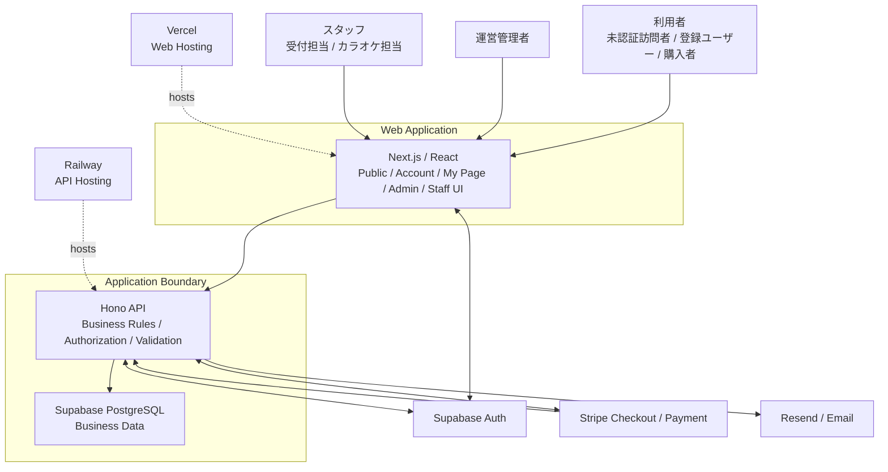

# off r39'x システム概要仕様

## 1. 文書の目的

### SYS-001 本書の目的

本書は、off r39'x のWebサービスおよび関連運用システムについて、完成形のシステム全体像、システム境界、Actor、主要Domain、外部システムとの関係、および高レベルな利用・運用ジャーニーを定義する。

本書は、個別Domainの状態モデル、業務ルール、API Contract、DB物理構造、権限体系、画面詳細等を定義するものではない。これらは各Authority仕様へ委譲する。

### SYS-002 Authority

本書は以下に対するAuthorityを持つ。

- システムの目的および提供価値
- システムに含まれる主要な機能領域
- システム内外の高レベル境界
- Actorの高レベル分類
- 主要Domainと責任境界
- Web / API / Database / Auth / Payment / Email / Hostingの高レベルな関係
- 利用者・管理者・スタッフの高レベルなジャーニー
- 個別仕様へ委譲する責任範囲

本書はProject Constitution（`PRJ`）に従う。矛盾が発見された場合は `PRJ` を黙示的に読み替えず、Spec Conflictとして扱う。

---

## 2. システム概要

### SYS-010 システムの位置づけ

off r39'x システムは、イベント参加者に対する情報提供、アカウント管理、チケット・カラオケ・グッズの販売、電子的な権利提示、会場受付、および運営者による管理・監査を一つのWebサービス群として提供する。

対象イベントは「off r39'x in 大阪らへん2027」を起点とする。同イベントはコミュニティ由来のオフ会でありつつ、コミュニティ外の一般参加者にもチケットを販売するイベントとして位置づける。

### SYS-011 提供価値

本システムは、利用者に対して以下の一貫した体験を提供する。

- イベント情報を確認できる
- アカウントを作成・利用できる
- 入場チケット、カラオケ予約、グッズ等の購入対象を確認できる
- Stripeを利用して安全に決済できる
- 購入済みの注文、電子チケット、予約、受け取り情報をマイページで確認できる
- 入場および対象サービス利用時にQR等の電子的な権利証跡を提示できる
- 必要な通知を受け取れる

運営者・スタッフに対しては、販売・注文・決済状況・権利・予約・在庫・受け渡し・受付を、権限に応じて安全かつ監査可能に運用するための管理機能を提供する。

### SYS-012 完成形としての定義

本書が定義するシステム全体像は、公開Webサイト、アカウント、チケット、カラオケ、グッズ、管理、受付、通知、監査等を含む長期運用上の完成形である。

個々の機能の実装順序やリリース順序は、本書のシステム境界および責務を変更しない。

---

## 3. イベント・サービスの位置づけ

### SYS-020 Event-aware Service

本システムは特定の開催イベントを運営するためのサービスであり、商品、販売、チケット、予約、在庫、受付等はイベント運営上の文脈と関連して扱われ得る。

ただし、本システムを汎用イベントプラットフォームまたは過剰なマルチテナント基盤として設計することを目的としない。イベント概念を各データへどのように関連付けるかは各Domain仕様および `DATA` へ委譲する。

### SYS-021 イベント固有情報

開催日時、会場、アクセス、注意事項、FAQ、お知らせ等のイベント固有情報は公開サイトから利用者へ提供する。

これらの具体的な内容、公開管理方法、更新フローはPublic Site / Content領域の後続仕様へ委譲する。会場候補等の企画上未確定な情報は、本書のSystem Invariantとはしない。

---

## 4. システムの目的

### SYS-030 利用者向け目的

本システムは、参加検討から購入、参加権利の確認、会場利用までの主要なデジタル接点を一貫して提供し、利用者が自身の購入・予約・権利状態を追跡できるようにする。

### SYS-031 運営向け目的

本システムは、運営管理者およびスタッフが、販売・決済・予約・在庫・受付等の業務状態を確認し、許可された操作を実行し、重要な操作を後から追跡できるようにする。

### SYS-032 安全性の目的

本システムは、Project Constitutionで定義された購入情報ロスト防止、二重販売防止、二重利用防止、サーバー側認可、復旧可能性、監査可能性を、全Domainを横断する設計前提として扱う。

本書はこれらの詳細な実現方式を再定義せず、各Authority仕様が `PRJ` のInvariantを具体化することを要求する。

---

## 5. システム境界

### SYS-040 システム内に含むもの

本システム境界には、少なくとも以下を含む。

- Next.js / ReactによるWebアプリケーション
- Honoによる業務API
- Supabase PostgreSQL上の業務データ
- 利用者向け公開サイト
- アカウント・プロフィール利用体験
- 商品・販売
- 注文
- 決済・返金連携
- 入場チケット
- カラオケ予約
- グッズ・在庫・会場受け渡し
- マイページ
- 管理画面
- スタッフ向け受付
- QR・電子チケットを用いた権利提示・検証
- 通知・メール送信に必要な内部処理
- 監査・運用に必要な内部記録および管理能力
- 外部サービスとの連携境界

### SYS-041 システム外に存在するもの

以下は本システムの外部に存在し、本システムから連携または利用される。

- 利用者が操作するブラウザ・端末
- 管理者・スタッフが操作するブラウザ・端末および必要なQR読取機能
- Supabase Auth
- Stripe
- Resend
- Vercel
- Railway
- DNS、ネットワーク、メール受信環境等の一般インターネット基盤
- イベント会場そのものおよび現実の受付・カラオケ・グッズ受け渡し業務
- 法務文書そのもの、およびシステム外で管理される法務Authority

### SYS-042 現実業務との境界

本システムは、会場への実際の入場、カラオケ設備の物理利用、グッズの物理引き渡し等を直接実行するものではない。

本システムは、これらの現実業務を安全に判断・記録・追跡するための権利情報、予約情報、受付状態、在庫・受け渡し情報および運用インターフェースを提供する。

---

## 6. Actor

### SYS-050 Actorの定義

Actorは、本システムと目的を持って相互作用する主体を表す。Actorは権限Roleそのものではない。

具体的なRole / Capability体系、Role名称、権限継承、個別Capabilityは `SEC` その他のAuthorization Authority仕様へ委譲する。

### SYS-051 利用者Actor

| Actor | 高レベルな関心 |
|---|---|
| 未認証の訪問者 | 公開情報、商品・販売情報等を閲覧し、必要に応じて登録・ログインへ進む |
| 登録ユーザー | 認証済みのアカウント領域を利用し、自身に紐づく購入・予約・プロフィール等を扱う |
| 購入者 | 注文・決済を行い、その結果を追跡する |
| チケット保有者 | 入場等に必要な電子チケット・QRを確認し、受付で提示する |
| カラオケ予約利用者 | 空き状況を確認し、予約・購入後にカラオケ用権利を利用する |
| グッズ購入者 | グッズを購入し、会場受け渡しに必要な情報を確認・提示する |

同一人物は、状況に応じて複数Actorの特性を同時に持ち得る。

### SYS-052 運営Actor

| Actor | 高レベルな関心 |
|---|---|
| 運営管理者 | 販売・注文・決済・権利・予約・在庫・受付・運用状態を管理する |
| スタッフ | 許可された現場業務を実行する |
| 受付担当 | 入場用の権利を確認し、受付結果を記録する |
| カラオケ担当 | カラオケ予約・権利を確認し、利用受付を行う |

これらはActor分類であり、実際のRole / Capability構成を規定しない。

---

## 7. External Systems

### SYS-060 Supabase Auth

Supabase Authは認証を提供するExternal Systemである。

Webは認証UIおよび認証クライアントとしてSupabase Authを利用できる。保護された業務操作については、APIが認証情報を検証したうえで利用者を識別し、Authorization仕様に基づいて認可する。

プロフィールや業務上のユーザー情報をどの範囲でAuth側・業務DB側に保持するかは `IDN` および `DATA` へ委譲する。

### SYS-061 Stripe

Stripeは決済処理を提供するExternal Systemであり、標準の決済UIとしてStripe Checkoutを利用する。

本システムはカード情報を自システムで保持せず、決済の成立判定はブラウザ遷移だけに依存しない。注文・決済・返金の具体的な状態、照合、Webhookイベント、冪等性、返金条件等は `PAY` および `ORD` へ委譲する。

### SYS-062 Resend

Resendはメール送信を提供するExternal Systemである。

本システムは、アカウント、購入、チケット、予約、運用上必要な通知等を送信するためにResendを利用し得る。メール失敗が正しく成立した重要業務状態を失わせてはならない。

通知種別、テンプレート、再試行、送信履歴、配信条件等はNotification / Operations / Technical仕様へ委譲する。

### SYS-063 Vercel

Vercelは標準のWeb Hosting基盤であり、Next.js Webを提供する。

具体的な環境、リージョン、デプロイ、Preview、キャッシュ、Secret、監視等はTechnical / Operations仕様へ委譲する。

### SYS-064 Railway

Railwayは標準のAPI Hosting基盤であり、Hono APIを提供する。

具体的なランタイム、スケール、ネットワーク、デプロイ、Secret、監視等はTechnical / Operations仕様へ委譲する。

### SYS-065 Supabase PostgreSQL

Supabase PostgreSQLは本システムの業務データを保持する標準Databaseである。

業務データへの正式なアプリケーションアクセスはAPIを経由する。物理Schema、Index、Constraint、Transaction、Lock、Migration等は `DATA` へ委譲する。

---

## 8. 主要Domain

### SYS-070 Domain構成

本システムは、少なくとも以下の主要Domainまたは機能責任領域から構成する。

| Domain / 領域 | 主責任 |
|---|---|
| Identity / Account / Profile | 認証済み利用者と業務上のアカウント・プロフィールの関連を扱う |
| Public Site / Content | イベント情報、案内、FAQ、お知らせ、販売導線等の公開情報を提供する |
| Product / Catalog | 販売対象の種類、表示可能な商品情報、販売可能性に必要なカタログ概念を扱う |
| Order | 購入意思と購入明細を内部で追跡する注文基盤を扱う |
| Payment / Refund | Stripeとの決済・返金連携および金銭状態の照合を扱う |
| Event Ticket | 入場に必要な購入済み権利、電子チケットを扱う |
| Karaoke | カラオケ枠、空き状況、予約、利用権利を扱う |
| Goods / Inventory / Fulfillment | グッズ、有限在庫、販売、会場受け渡しを扱う |
| My Page | 利用者自身の注文・権利・予約・プロフィール等を横断表示・操作する利用者向け領域 |
| Notification | メール等の利用者・運営向け通知を扱う |
| Check-in / Reception | QR等を用いた権利検証、受付、利用済み記録を扱う |
| Administration | 運営管理者が複数Domainを管理するための管理インターフェースを提供する |
| Audit / Operations | 重要操作の追跡、運用監視、復旧支援等を扱う |

### SYS-071 Core DomainとInteraction Domainの区別

Order、Payment / Refund、Event Ticket、Karaoke、Goods / Inventory / Fulfillment等は、業務上の独立したライフサイクルまたはInvariantを持ち得るDomainとして扱う。

My Page、Administration、Check-in / Receptionは、複数Domainの情報を利用して利用者または運営者へ能力を提供するInteraction / Operational Domainとして扱う。

My Pageや管理画面の表示都合だけで、Order・Payment・Ticket等の正式状態を別体系として再定義してはならない。

---

## 9. Domain Responsibility Map

### SYS-080 Domain責任境界

| 関心事 | 主Authority / 責任領域 | 本書で確定する範囲 |
|---|---|---|
| 認証・アカウント・プロフィール | IDN | システムにアカウント領域が存在し、保護された利用体験の基礎となる |
| 公開情報 | Public Site / Content Spec | 公開Webサイトをシステムの正式領域とする |
| 商品・販売対象 | Product / Catalog Spec | チケット・カラオケ・グッズ等の販売入口を共通の販売体験に接続する |
| 注文ライフサイクル | ORD | すべての購入対象を追跡可能な内部注文へ接続する |
| 決済・返金 | PAY | Stripeを外部決済として利用し、内部注文と照合可能にする |
| 入場チケット | TKT | 購入後の入場権利を電子的に提示可能にする |
| カラオケ | KAR | 有限枠の予約・購入・利用受付を提供する |
| グッズ・在庫・受け渡し | GDS | グッズ販売、有限在庫、会場受け渡しを提供する |
| マイページ | My Page / Web Spec | 複数Domainの利用者自身の情報を統合して提示する |
| 通知 | Notification Spec | 業務確定と分離可能な通知能力を提供する |
| QR・受付 | Check-in / QR Spec | サーバー側検証に基づく受付能力を提供する |
| 権限 | SEC | Role / Capability / Least Privilegeを定義する |
| 監査・運用 | Audit / Operations Spec | 重要操作の追跡、監視、復旧運用を定義する |
| DB物理構造 | DATA | Domain Invariantを物理Schema・Constraint等へ変換する |
| API Contract | API | Domain能力をHTTP/API契約へ変換する |
| 非機能要件 | NFR | 性能、可用性、アクセシビリティ、保持等の具体基準を定義する |

### SYS-081 共有注文基盤

入場チケット、カラオケ、グッズ等の販売対象は、購入追跡と金銭照合のためにOrder Domainへ接続する。

各販売対象が同一カートで同時購入可能であるか、Order Itemの具体構造、商品種別表現等は `ORD`、Product / Catalog、`DATA` へ委譲し、本書では確定しない。

---

## 10. 利用者向け機能領域

### SYS-090 公開Webサイト

公開Webサイトは、未認証の訪問者を含む利用者に対し、イベント概要、開催情報、会場・アクセス、注意事項、FAQ、お知らせ、チケット、カラオケ、グッズ等への導線を提供する正式なシステム領域である。

SEO、SSR、Routing等のWeb技術能力はNext.js Webが担う。ページ構造、URL、CMS相当の管理方法、コンテンツモデルは後続Web / Content仕様へ委譲する。

### SYS-091 アカウント領域

アカウント領域は、新規登録、認証、ログイン、ログアウト、認証回復、およびプロフィール管理に必要な利用体験を提供する。

購入・予約・マイページ等の利用者固有の保護された操作は、原則として認証された利用者に紐づけて処理する。具体的な認証方式、必須プロフィール項目、アカウント削除、Session、Token等は `IDN` および `SEC` へ委譲する。

### SYS-092 商品・販売領域

利用者は、入場チケット、カラオケ予約枠、グッズ等の販売対象を確認し、購入可能なものについて注文・決済へ進むことができる。

価格、販売期間、購入上限、在庫、販売停止等の具体的業務値は、それぞれのDomain Authorityで定義する。

### SYS-093 マイページ

マイページは、認証済み利用者に対して、自身に紐づく情報への統合的な入口を提供する。

少なくとも以下の種類の情報を扱い得る。

- 保有する入場チケット
- 入場用QR等の権利提示手段
- カラオケ予約とカラオケ用QR等の権利提示手段
- グッズ購入・会場受け渡し情報
- 注文・購入履歴
- 決済事業者が提供する領収情報への導線
- プロフィール

マイページ自体はOrder、Payment、Ticket、Karaoke、Goods等の正式な状態Authorityを持たない。

---

## 11. 運営・管理者向け機能領域

### SYS-100 管理画面

管理画面は、運営管理者が権限に応じて複数Domainを横断管理するためのWebインターフェースである。

少なくとも以下の管理能力を対象とする。

- 注文の検索・確認
- 決済・返金状態の確認
- 入場チケットの確認・管理
- カラオケ枠・予約の確認・管理
- 商品・販売状態の管理
- グッズ・在庫・受け渡しの管理
- 購入者・利用者情報の業務上必要な確認
- 受付状況の確認
- 運用上必要な監査・復旧支援情報の確認

具体的な操作権限、強制操作、状態変更、検索項目、画面構成は各Domain仕様、`SEC`、Administration仕様へ委譲する。

### SYS-101 管理操作の原則

管理画面は、通常のDomain状態遷移やInvariantを迂回するための汎用DB編集画面としてはならない。

重要な管理操作はAPIを通じて実行し、必要な認可・Validation・監査を受けなければならない。

---

## 12. スタッフ向け機能領域

### SYS-110 スタッフ向け受付

スタッフ向け領域は、イベント当日の現場業務を支援するため、入場受付、カラオケ受付、必要に応じてグッズ受け渡し等の操作を提供する。

スタッフ画面は、一般利用者向け画面や管理者向け画面と権限境界を分離できなければならない。

### SYS-111 QR・電子チケット

本システムは、入場およびカラオケ等の一回利用を伴う権利について、QR等の電子的な提示手段を利用できる。

QRに含めるトークン形式、保存形式、検証方式、失効、再発行、具体的状態遷移はCheck-in / QR、`TKT`、`KAR`、`SEC`、`DATA` へ委譲する。

### INV-SYS-001 入場権利とカラオケ権利の非互換性

入場受付に用いる権利と、カラオケ利用受付に用いる権利は、システム上区別しなければならない。

一方のQRまたは電子チケットを、他方の受付権利として正常利用させてはならない。

### SYS-112 サーバー側受付

通常の受付は、提示されたQR情報だけで成立させず、APIを通じてサーバー側の現在状態と権利有効性を確認し、受付結果を記録する。

会場通信障害時の例外運用は本書で定義せず、Operations / Check-in仕様で `PRJ-194` に従って定義する。

---

## 13. Web / API / Databaseの責務

### SYS-120 Web

Next.js Webは主に以下を担当する。

- 利用者・管理者・スタッフ向けUI
- ページとRouting
- SSR / SEO
- 認証UI
- API Client
- 利用者体験上の入力補助・表示制御

Webは業務DBへ直接アクセスせず、正式な業務ロジック、認可、状態遷移のAuthorityにはならない。

### SYS-121 API

Hono APIは、業務操作に対するサーバー側の正式な境界として、少なくとも以下を担う。

- 認証済み主体の識別
- 認可
- 入力Validation
- Domain Serviceの実行
- 正式な状態遷移
- 業務DBへのアクセス
- 外部サービス連携のサーバー側処理
- Webhook等の外部入力境界
- 重要操作の監査接続

HTTP endpoint、request / response、error contract等は `API` へ委譲する。

### SYS-122 Database

Supabase PostgreSQLは、業務上の永続状態と重要Invariantを支えるデータ基盤である。

重要な整合性は、APIの事前検証だけに依存せず、可能な範囲でDB Constraint、Transaction、排他制御等により保護する。

物理データモデルは `DATA` がAuthorityを持つ。

### INV-SYS-002 表示領域は独自の業務真実を持たない

My Page、Administration、Staff UI等の表示・操作領域は、Order、Payment、Ticket、Karaoke、Goods等の正式Domain状態とは別の独立した業務真実を持ってはならない。

表示や操作はAPIを通じて各Authority Domainの状態を参照・更新する。

---

## 14. 外部サービスとの高レベル連携

### SYS-130 Auth連携

利用者はWebを通じてSupabase Authで認証し、保護された業務操作ではAPIへ認証情報を提示する。APIはその情報を検証し、Authorization仕様に従って操作を許可または拒否する。

### SYS-131 Payment連携

購入処理では、内部で追跡可能な注文状態を確立したうえでStripe Checkoutへ接続する。

決済確定の根拠は、Stripeから得る検証済みのサーバー側証跡とする。具体的なStripeイベント、Webhook Contract、照合方法等は `PAY` に委譲する。

### SYS-132 Email連携

業務処理の結果として必要なメールは、内部で追跡可能な状態を基礎としてResendへ送信する。

メール送信失敗を理由として、成立済みの正しい注文・決済・権利状態を巻き戻してはならない。

### SYS-133 Hosting連携

標準構成では、WebをVercel、APIをRailway、DatabaseをSupabaseで提供する。

これらのサービス間通信はインターネット境界を越えるものとして扱い、認証・暗号化・Secret管理・ネットワーク・Observability等の具体要件をTechnical / NFR / Operations仕様で定義する。

---

## 15. 高レベルユーザージャーニー

### SYS-140 情報閲覧から利用開始

高レベルな利用開始ジャーニーは以下とする。

1. 訪問者が公開Webサイトへアクセスする。
2. イベント情報、販売対象、FAQ等を確認する。
3. 利用者固有の操作が必要な場合、登録またはログインへ進む。
4. 認証後、購入・予約・マイページ等の保護された利用体験へ進む。

個別ページURLや画面遷移の詳細はWeb / UX仕様へ委譲する。

### SYS-141 入場チケット購入から入場

高レベルな入場チケットジャーニーは以下とする。

1. 利用者が入場チケットの販売情報を確認する。
2. 認証された利用者として購入操作を開始する。
3. システムが購入を内部で追跡可能な状態にする。
4. Stripe Checkoutで決済する。
5. システムが信頼できるサーバー側証跡に基づいて決済結果を確定・照合する。
6. 成立条件を満たした場合、入場権利を利用者に関連付ける。
7. 利用者はマイページ等から電子チケット・入場用QRを確認する。
8. 会場でスタッフが入場用権利をサーバー照会し、受付結果を記録する。

注文状態、決済状態、発券条件、返金時の権利処理、受付状態等の詳細は `ORD`、`PAY`、`TKT`、Check-in / QR仕様へ委譲する。

### SYS-142 カラオケ予約から利用

高レベルなカラオケジャーニーは以下とする。

1. 利用者が日付・時間帯・具体的な利用枠の空き状況を確認する。
2. 利用可能な枠を選択し、購入・予約操作を開始する。
3. システムは競合する利用者による同一枠の二重販売を成立させないために必要な予約保護を行う。
4. 内部注文を追跡可能にしたうえでStripe Checkoutへ接続する。
5. 決済成立後、予約およびカラオケ利用権利を確定する。
6. 利用者はマイページ等から予約情報とカラオケ用QRを確認する。
7. 会場でカラオケ担当が予約と権利をサーバー照会し、受付結果を記録する。

利用時間、整備時間、空き表示、Hold、予約状態、購入上限、時間外受付等の具体ルールは `KAR` へ委譲する。

### SYS-143 グッズ購入から会場受け渡し

高レベルなグッズジャーニーは以下とする。

1. 利用者がグッズ情報と販売可否を確認する。
2. 購入操作を開始し、内部注文と在庫整合性を保ちながらStripe Checkoutへ接続する。
3. 決済成立後、購入権利および受け渡し対象を内部で追跡可能にする。
4. 利用者はマイページ等から購入・受け渡し情報を確認する。
5. 会場でスタッフが必要な確認を行い、物品を引き渡して受け渡し結果を記録する。

グッズ領域では会場受け渡しを主要なFulfillmentとして位置づける。発送の可否・例外、在庫引当、受け渡し証跡等の詳細は `GDS` へ委譲する。

### SYS-144 購入履歴・領収情報

利用者はマイページから、自身の注文・購入履歴と関連する決済情報を確認できる。

領収情報については、Stripe等の決済事業者が提供するReceiptへの導線を利用し得る。独自領収書の要否・形式はPayment / Legal / Domain仕様へ委譲する。

---

## 16. 高レベル管理・運用フロー

### SYS-150 日常運営

運営管理者は、権限に応じて管理画面から販売対象、注文、決済、チケット、カラオケ、グッズ、受付等の状況を確認し、各Domainが許可する管理操作を実行する。

管理操作はDomain Invariantを破壊してはならず、重要操作は監査可能でなければならない。

### SYS-151 当日運営

イベント当日は、スタッフ向け領域を通じて少なくとも以下の現場フローを支援する。

- 入場チケットの検証と受付
- カラオケ予約・権利の確認と受付
- グッズの会場受け渡し確認
- 問題発生時の権限に応じたエスカレーション

通信障害、外部サービス障害、誤受付、重複提示等の具体的な障害対応はOperations / Check-in / Domain仕様へ委譲する。

### SYS-152 照合・復旧

注文、決済、権利、在庫、受付等の重要業務は、外部サービス障害や部分失敗後でも内部状態と外部識別子を用いて照合・復旧できる構造を持たなければならない。

具体的な照合手順、復旧手順、再試行、手動介入、RPO/RTO等は `PAY`、Operations、`NFR`、Technical仕様へ委譲する。

---

## 17. System Context

### SYS-160 System Context Diagram

図は責務関係の概略であり、通信方式、endpoint、認証方式、ネットワーク構成、Webhook Route等の技術Contractを定義するものではない。

### SYS-161 Contextの意味

- 利用者、管理者、スタッフはWebを主要な操作入口とする。
- Webは業務APIを通じて正式な業務状態を扱う。
- APIは業務ロジック、認可、Validation、DBアクセス、外部業務連携の中心境界となる。
- PostgreSQLは業務状態の永続化と重要Invariantの最終防衛線を担う。
- Supabase Authは認証を提供するが、業務認可のAuthorityではない。
- Stripeは決済を提供するが、内部Order / EntitlementのAuthorityではない。
- Resendはメール配送を提供するが、業務確定のAuthorityではない。
- Vercel / Railway / Supabaseは標準Hosting / Data基盤として利用する。

---

## 18. Domain間の依存関係

### SYS-170 高レベル依存関係

Domain間の主な依存関係は以下のとおりとする。

- Identityは、利用者固有のOrder、Ticket、Karaoke、Goods、My Page等の主体識別に利用される。
- Product / Catalogは、Orderが購入対象を識別するための販売情報を提供する。
- Orderは、Paymentとの金銭照合および各販売Domainへの購入結果接続の中心となる。
- Paymentは、Orderへ決済・返金に関する信頼できる外部結果を接続する。
- Event Ticketは、成立した購入結果に基づく入場権利を表す。
- Karaokeは、有限な時間枠と予約を管理し、Order / Paymentと連携して販売を成立させる。
- Goodsは、有限在庫・購入・会場受け渡しをOrder / Paymentと連携させる。
- My Pageは、Identityを起点に複数Domainの利用者向け情報を集約する。
- Check-in / Receptionは、Ticket、Karaoke、Goods等の利用・受け渡し権利を検証し、結果を各Authority Domainへ反映する。
- Administrationは複数Domainの管理能力を統合する。
- Notificationは各Domainの確定済み業務事象を受けて、通知を配送する。
- Audit / Operationsは複数Domainを横断して追跡・監視・復旧を支援する。

### SYS-171 循環Authorityの禁止

複数Domainが連携する場合でも、一つの概念について複数Domainが競合する正式状態Authorityを持ってはならない。

具体的なAuthority Keyと所有仕様は仕様インデックスで一意に管理し、後続仕様は本書の責任境界に従う。

---

## 19. 本仕様の責任外

### SYS-180 非Authority事項

本書は、以下を確定しない。

- 注文の具体的な状態一覧・遷移表
- 決済・返金の具体的な状態・条件
- Stripe Webhookの具体的イベント名・payload
- チケット種類、価格、販売枚数、販売期間、購入上限
- カラオケの具体的価格、Hold時間、詳細な予約状態、時間外受付ルール
- グッズの個別SKU、在庫引当方式、発送例外、受け渡し状態一覧
- プロフィールの具体的な必須項目
- Role / Capability一覧
- QRトークン形式、暗号・Hash方式、有効期限
- DB Table / Column / Index / Constraintの物理定義
- API endpoint、request / response / error contract
- UIの詳細レイアウト、具体的URL構造
- メール本文・テンプレート
- 具体的なSLO、RPO、RTO、性能目標
- ログ保持期間
- Secret値、環境変数値
- 法務文面

これらは各Authority仕様へ委譲する。

---

## 20. 後続仕様への責任委譲

### SYS-190 Single Source of Truth委譲

本書が定義する高レベル責務を、以下のAuthorityへ委譲する。

| Authority Key / 概念 | 委譲先 |
|---|---|
| `identity` / account / profile | `IDN` |
| `authorization` | `SEC` |
| `product.catalog` | Product / Catalog Domain Spec |
| `order.lifecycle` | `ORD` |
| `payment.lifecycle` / refund | `PAY` |
| `ticket.lifecycle` / entry entitlement | `TKT` |
| `karaoke.slot` / `karaoke.reservation` | `KAR` |
| `goods.inventory` / fulfillment | `GDS` |
| `checkin` / QR validation | Check-in / QR Authority Spec |
| `notification` | Notification Authority Spec |
| `audit` / operations workflow | Audit / Operations Authority Spec |
| `database.physical` | `DATA` |
| `api.contract` | `API` |
| non-functional requirements | `NFR` |
| test strategy / acceptance automation | `TEST` |
| cross-spec terminology | `GLO` |

仕様Prefixが本書で確定していない委譲先については、仕様インデックスで正式なAuthority Key所有仕様を登録する。本書はそのPrefixを先回りして確定しない。

### SYS-191 再定義禁止

後続仕様は、本書のSystem-level責務を前提としてよいが、本書のAuthorityに属するシステム境界・Domain責任を黙示的に変更してはならない。

変更が必要な場合は、本書の正式改訂とDecisionを必要とする。

---

## 21. 受け入れ条件

### SYS-200 Review Acceptance

本書は、少なくとも以下を満たしたときSystem Overviewとしてレビュー可能な完成版とみなす。

- [ ] `PRJ` と矛盾しない。
- [ ] 完成形のシステム全体像を示している。
- [ ] 公開Webサイト、アカウント、商品・販売、注文、決済・返金、入場チケット、カラオケ、グッズ、マイページ、管理画面、スタッフ受付、QR、通知、監査・運用を包含している。
- [ ] 利用者、運営管理者、スタッフのActorをRoleと混同せず整理している。
- [ ] Web / API / Databaseの責務境界を示している。
- [ ] Supabase Auth、Stripe、Resend、Vercel、Railway、Supabase PostgreSQLとの高レベルな関係を示している。
- [ ] 各Domainの責任とDomain間の主要依存関係を示している。
- [ ] 個別Domainの状態、価格、上限、API、DB、権限等を先回りして確定していない。
- [ ] 利用者向けの主要な購入・利用ジャーニーを示している。
- [ ] 管理・受付・復旧の高レベルフローを示している。
- [ ] Single Source of Truthの委譲先を明示している。
- [ ] Handoffが後続仕様の作成に必要な前提を提供している。

---

## 22. Decision Log

### DEC-SYS-001 完成形の領域構成

**決定:** 公開サイト、アカウント、販売、注文、決済、入場チケット、カラオケ、グッズ、マイページ、管理、受付、通知、監査・運用を完成形の正式なシステム領域として扱う。

**理由:** Project Constitutionの主要領域とイベント固有要件を一つの長期運用システムとして整合させるため。

**却下した主要案:** 一部領域を短期的な開発対象外であることを理由に正式仕様から除外する案。

**影響範囲:** すべてのDomain Specs、Web、API、DATA、Operations。

### DEC-SYS-002 DomainとInteraction Surfaceの分離

**決定:** Order、Payment、Ticket、Karaoke、Goods等の業務Domainと、My Page、Administration、Staff UI等のInteraction / Operational領域を区別する。

**理由:** UI都合で業務状態のAuthorityが重複することを防ぐため。

**却下した主要案:** マイページや管理画面ごとに独立した業務状態を持たせる案。

**影響範囲:** Domain Specs、Web、API、DATA。

### DEC-SYS-003 Web / API / Databaseの高レベル境界

**決定:** Webを主要UI、APIを正式な業務・認可境界、PostgreSQLを業務データ基盤とし、Webから業務DBへ直接アクセスしない。

**理由:** `PRJ-050`、`PRJ-051` に従い、認可・整合性・監査の責務を一貫させるため。

**却下した主要案:** Webから業務DBを直接操作する構成。

**影響範囲:** Web、API、DATA、SEC、Technical。

### DEC-SYS-004 External Systemsの位置づけ

**決定:** Supabase Auth、Stripe、Resendをそれぞれ認証・決済・メール配送のExternal Systemとして利用し、Vercel、Railway、Supabaseを標準Hosting / Data基盤として利用する。

**理由:** `PRJ-060` の標準技術構成に従い、外部サービスと内部業務Authorityを明確に分離するため。

**却下した主要案:** 外部サービス自体を内部Order / Authorization / Notification状態の唯一のAuthorityとする案。

**影響範囲:** IDN、PAY、Notification、Technical、Operations。

### DEC-SYS-005 入場とカラオケの電子権利分離

**決定:** 入場用権利とカラオケ用権利をシステム上区別し、相互代用させない。

**理由:** 用途・受付場所・利用条件が異なる権利を混同すると、誤受付と二重利用防止の境界が曖昧になるため。

**却下した主要案:** 一つのQRを入場・カラオケの共通権利として扱う案。

**影響範囲:** TKT、KAR、Check-in / QR、My Page、Staff UI。

### DEC-SYS-006 グッズFulfillmentの位置づけ

**決定:** グッズ領域は会場受け渡しを主要なFulfillmentとしてシステム全体像に含める。

**理由:** 現行イベント運用要件が会場受け取りを中心としているため。

**却下した主要案:** 配送を本システムの主要Fulfillmentとして前提化する案。

**影響範囲:** GDS、Order、Payment、My Page、Staff UI。

### DEC-SYS-007 個別ライフサイクルの委譲

**決定:** System Overviewでは個別Domainの状態一覧、価格、上限、Hold、Webhook Event、API、DB、Role等を確定しない。

**理由:** Authority重複と後続仕様の先回りを防ぐため。

**却下した主要案:** 引き継ぎ資料の具体例をそのままSystem-levelの確定仕様へ昇格する案。

**影響範囲:** 全後続仕様。

---

## 23. Open Issues

本書の作成時点で、System Overviewレベルの未解決事項は存在しない。

イベント固有の価格、販売量、開催コンテンツ、会場の最終確定、各Domainの状態・制約、権限体系、技術Contract等は、本書のOpen Issueではなく、それぞれのAuthority仕様で決定・管理する。

---

## 24. Handoff

### 24.1 この仕様書で確定した事項

- off r39'x システムは、公開情報、アカウント、販売、注文、決済、入場チケット、カラオケ、グッズ、マイページ、管理、受付、通知、監査・運用を含む完成形のWebサービスである。
- 利用者向けには、情報閲覧から認証、購入、電子権利確認、会場利用までを一貫して支援する。
- 運営者向けには、複数Domainの管理、受付、監査、照合・復旧を支援する。
- WebはNext.js、APIはHono、DatabaseはSupabase PostgreSQLを標準構成とし、正式な業務ロジックとDBアクセスはAPI側へ集約する。
- Supabase Authは認証、Stripeは決済、Resendはメール配送のExternal Systemである。
- VercelはWeb Hosting、RailwayはAPI Hosting、SupabaseはDatabase / Auth基盤として位置づける。
- My Page、Administration、Staff UIは複数Domainを利用するInteraction / Operational領域であり、独自の業務ライフサイクルAuthorityを持たない。
- 入場権利とカラオケ権利は区別する。
- グッズの主要Fulfillmentは会場受け渡しとする。
- 個別Domainの状態、価格、上限、Hold、Webhook Event、DB、API、Role等は後続Authority仕様へ委譲する。

### 24.2 他仕様が前提としてよいInvariant

- `INV-SYS-001` **入場権利とカラオケ権利の非互換性**  
  入場受付に用いる権利とカラオケ利用受付に用いる権利は区別し、一方を他方の正常利用権利として扱ってはならない。

- `INV-SYS-002` **表示領域は独自の業務真実を持たない**  
  My Page、Administration、Staff UI等は、Order、Payment、Ticket、Karaoke、Goods等のAuthority Domainと競合する独立状態を持ってはならない。

### 24.3 他仕様への要求

#### `020-glossary-domain-language.md`

- 本書のActor名、Domain名、権利、注文、購入、予約、受付、受け渡し等の正式用語を定義する。
- 「チケット」「電子チケット」「QR」「権利」「予約」「受付」「利用済み」等の近接概念を区別する。
- Product / Catalog、Entitlement、Fulfillment等の日本語・英語表記を統一する。
- ActorとRoleの用語を混同しない定義を与える。
- Authority仕様間で使用するDomain名称を統一する。

#### `030-non-functional-requirements.md`

- 利用者向けMobile First、Accessibilityの具体基準を定義する。
- 販売開始時・イベント当日の可用性、性能、同時利用、監視条件を定義する。
- Backup、復旧、RPO/RTO相当、ログ・監査保持、障害通知の具体基準を定義する。
- External System障害時の許容遅延・再試行・運用要件を定義する。
- Web / API / Databaseの観測可能性に関する具体要件を定義する。

#### Domain Specs

- `IDN` は認証・アカウント・プロフィール・アカウント削除等を定義する。
- Product / Catalog仕様は販売対象と販売可能性の高レベルモデルを定義する。
- `ORD` は注文ライフサイクル、Order Item、購入追跡、各販売Domainとの関連を定義する。
- `PAY` はStripe連携、決済・返金ライフサイクル、信頼できる決済確定、照合、冪等性を定義する。
- `TKT` は入場権利、電子チケット、発行・失効・返金連携等を定義する。
- `KAR` は枠、空き状況、予約、排他、Hold、販売・利用ルールを定義する。
- `GDS` は商品、在庫、引当、販売、会場受け渡し、例外Fulfillmentを定義する。
- Check-in / QR仕様はQR・Token、検証、受付、二重利用防止、会場通信障害時の整合性を定義する。
- Notification仕様は通知種別、配送条件、再試行、重複防止、送信履歴を定義する。
- Administration関連仕様はDomain Authorityを迂回しない管理操作を定義する。

#### Operations Specs

- イベント当日の受付運用、障害時のエスカレーション、外部サービス障害、通信障害、手動復旧を定義する。
- 重要操作の監査・照合・再試行・手動補正の手順を定義する。
- Production DB直接操作を通常運用にせず、例外時の管理手順を定義する。

#### Technical Specs

- Web / API / Database / Auth / Payment / Email間の具体的な通信・認証境界を定義する。
- Vercel / Railway / Supabaseの環境、デプロイ、Secret、ネットワーク、Observabilityを定義する。
- `DATA` はDomain Invariantを物理Schema、Constraint、Transaction、Lock、Migrationへ変換する。
- `API` はDomain能力をHTTP Contractへ変換する。
- `SEC` はRole / Capability / Least Privilegeと各操作の認可を具体化する。
- `TEST` は本書および各DomainのInvariantを自動テストへ対応付ける。

### 24.4 未確定事項

System Overviewレベルではなし。

後続Domain・Operations・Technical仕様で決める事項は、本書では未確定事項として重複管理しない。

### 24.5 次に作成することを推奨する仕様

`020-glossary-domain-language.md`

本書で確定したActor、Domain、権利、購入、予約、受付、受け渡し等の用語を先に固定することで、その後のDomain Specsにおける語彙の揺れとAuthority重複を防止できる。
