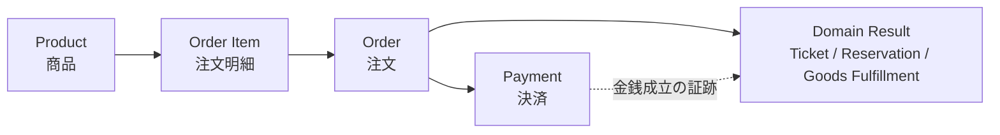
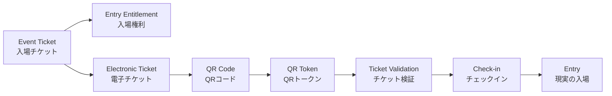
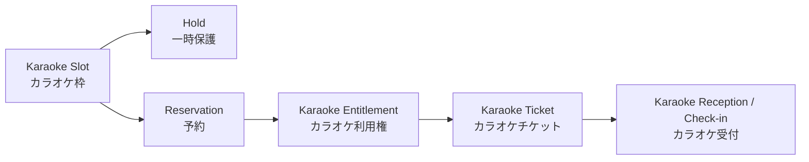
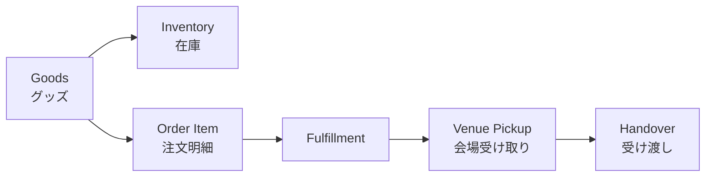
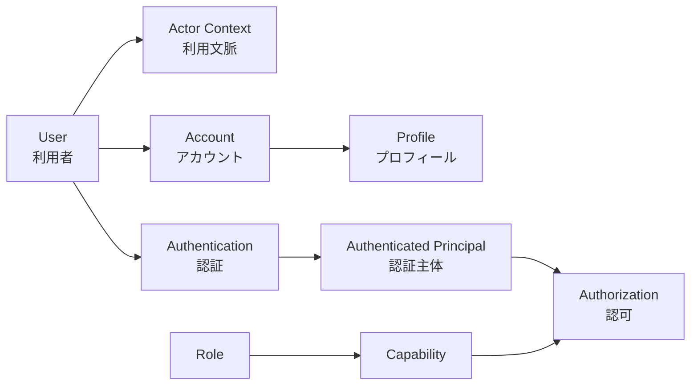

# off r39'x 用語・Domain Language仕様

## 1. 文書の目的

### GLO-001 本書の目的

本書は、off r39'x の正式仕様書、TypeScriptコード、API設計、データ設計、テスト、運用手順で使用するDomain Languageの意味を統一する。

本書は、同一概念を複数名称で呼ぶこと、同一名称を異なる意味で使用すること、UI上の便宜的な文言をDomain上の正式概念として扱うことを防止し、AIエージェントおよび人間の実装担当が同じ語から同じ業務概念を解釈できる状態を作る。

### GLO-002 Authority

本書は以下に対するAuthorityを持つ。

- 仕様書群で使用する正式な日本語Domain用語
- Domain概念に対応する推奨英語表現
- 近接概念間の意味の境界
- Actor、Role、Capability等の分類上の意味
- UI表現と内部Domain Languageの区別
- 曖昧語、禁止表現、単独使用を避ける表現
- 用語間の意味上の関係

本書はProject Constitution（`PRJ`）およびSystem Overview（`SYS`）に従う。

`PRJ` は本プロジェクトの最上位Authorityであり、`SYS` はシステム全体像、Actor、高レベルDomain、システム境界のAuthorityである。本書はそれらの意味を変更せず、用語として一意に解釈できるよう具体化する。

### GLO-003 本書が確定するもの

本書は「言葉の意味」を確定する。

本書で推奨英語表現を定義しても、それだけで以下を確定したことにはならない。

- TypeScriptの具体的な型名
- class / interface / enum名
- DB Table / Column名
- API endpoint名
- request / response field名
- Event名
- 外部サービス上のObject名

これらは各Technical / DATA / API Authorityが、本書の意味を保ったうえで具体化する。

---

## 2. 適用範囲

### GLO-010 適用対象

本書のDomain Languageは、少なくとも以下へ適用する。

- 正式仕様書
- Decision Log
- Open Issue
- Handoff
- TypeScriptのDomain概念
- API / DATA設計上の概念説明
- テスト名およびテスト説明
- 管理・受付・復旧手順
- ログおよび監査項目の意味定義
- UI文言を設計する際の内部概念との対応

### GLO-011 完成形の語彙

本書の用語は、完成形および長期運用時のシステムを表す。

実装順序、リリース順序、短期的な実装対象を理由として、正式用語の意味を狭めたり変更したりしてはならない。

### GLO-012 責任外

本書は以下を確定しない。

- 注文状態の具体一覧
- 決済状態の具体一覧
- Ticket State Machine
- Karaoke State Machine
- Refund条件
- 購入上限
- Role / Capabilityの具体一覧
- DB Schema
- API Contract
- QR Token形式
- 価格
- 販売期間の具体値
- Hold期限
- 在庫引当方式
- ログ保持期間
- 具体的な認証方式・Session仕様
- 具体的な強制操作一覧

これらは各Authority仕様へ委譲する。

---

## 3. Domain Languageの原則

### GLO-020 一概念一名称

同一Domain概念には、原則として一つの正式名称を使用する。

UI上の自然な言い換え、一般会話上の同義語、外部サービス固有用語が存在しても、正式仕様、コード、テストでは本書の正式Domain用語へ対応付けて使用する。

### GLO-021 異なる責任を持つ概念は分離する

以下のように業務上の責任またはライフサイクルが異なる概念を、同一語で代用してはならない。

- 利用者 / アカウント / プロフィール
- Actor / Role / Capability
- 購入 / 注文 / 決済
- 注文 / 注文明細
- 入場権利 / 入場チケット / 電子チケット / QRコード
- カラオケ予約 / Hold / カラオケ利用権
- 在庫 / 在庫数 / Fulfillment / 会場受け渡し
- 検証 / チェックイン / 現実の入場
- 取消 / 返金 / 無効化 / 削除
- 監査ログ / 運用ログ

### GLO-022 日本語を第一言語とする

正式仕様本文では日本語を第一言語とする。

必要なDomain概念には、本書で推奨英語表現を定義する。推奨英語表現はTypeScriptその他の技術表現を設計する際の意味上の基準とする。

### GLO-023 状態名と概念名を分離する

「決済済み」「使用済み」「無効」「キャンセル済み」等の自然言語は、Domain概念または状態の意味を説明するために使用できるが、具体的なState Enum値を意味しない。

`PAID`、`USED`、`INVALID` 等の具体的な状態値、列挙値、遷移条件は、該当Domain Authorityが定義する。

### GLO-024 UI文言とDomain Languageを分離する

ユーザー向けUIは、理解しやすさのためにDomain Languageと異なる表現を使用してよい。

ただし、UI上の表示文言を理由としてDomain概念を統合したり、正式仕様内の意味を変更したりしてはならない。

### GLO-025 修飾なしでは曖昧な語を限定する

複数Domainで意味が変わる語は、原則としてDomain名または対象を付けて使用する。

例:

- `Availability` ではなく `販売可否` / `カラオケ空き状況`
- `チケット` ではなく `入場チケット` / `カラオケチケット`
- `受付` ではなく `入場受付` / `カラオケ受付`
- `キャンセル` ではなく `注文取消` / `予約取消`
- `使用済み` ではなく `入場権利利用済み` 等

### GLO-026 外部サービス用語は内部Domain概念を上書きしない

Stripe、Supabase Authその他の外部サービスに同名・類似の概念が存在しても、それらは内部Domain概念と自動的に同一視しない。

外部サービス固有ObjectやStatusは、連携Authorityで内部Domain概念へ明示的に対応付ける。

### GLO-027 抽象語は共通実装を要求しない

本書で `権利（Entitlement）`、`利用可能性（Availability）` 等の共通意味を定義しても、共通Base Class、共通Table、共通Interface等の実装上の抽象化を必須とはしない。

本書が確定するのは意味であり、実装構造ではない。

### GLO-028 時刻・通貨・言語の語義

時刻、通貨、言語に関する記述は `PRJ` の定義に従う。

- 内部絶対時刻: UTC
- 利用者・運営表示: `Asia/Tokyo`
- 第一言語: 日本語
- 原則通貨: JPY

本書はこれらを再定義しない。

---

## 4. 命名規則

### GLO-030 日本語名称の規則

仕様本文では、正式日本語名称を優先する。

初出または意味の曖昧さを避ける必要がある箇所では、`正式日本語（Recommended English）` の形式を使用してよい。

### GLO-031 推奨英語表現の規則

推奨英語表現は、原則としてDomain概念を表す単数形の名詞または名詞句とする。

例:

- 注文 → `Order`
- 注文明細 → `Order Item`
- 入場チケット → `Event Ticket`
- カラオケ枠 → `Karaoke Slot`
- 監査ログ → `Audit Log`

具体的なコード識別子のCase、複数形、Prefix / Suffixは本書では固定しない。

### GLO-032 `User` の使用制限

英語 `User` は広義のシステム利用者を表す一般語としてのみ使用する。

永続的なアカウント、認証主体、プロフィール、購入者、チケット利用者等をすべて `User` で表してはならない。対象概念に応じて `Account`、`Authenticated User`、`Purchaser`、`Ticket Holder` 等を使用する。

### GLO-033 `Owner` の使用制限

`Owner` / 「所有者」は、所有権、現在の関連主体、購入者、利用者のいずれを意味するか曖昧であるため、正式Domain用語として原則使用しない。

特定Domainで法的または業務的な「所有」が必要な場合は、当該Authority仕様で意味を明示して導入する。

### GLO-034 `Status` の使用規則

`Status` は「対象Domain Objectの現在状態を表す概念」として使用できる。

ただし、`Status` 単独でDomainを跨ぐ共通状態モデルを意味してはならない。`Payment Status`、`Ticket Status` 等、対象を明示する。

---

## 5. システム・イベント用語

### GLO-100 システム・イベント用語

| 正式日本語 | 推奨英語 | 定義 | 使用上の注意 | Authority |
|---|---|---|---|---|
| イベント | Event | 本システムが情報提供、販売、権利、予約、在庫、受付等の文脈として扱う開催イベント | 汎用イベントプラットフォームのTenantを意味しない。データへの関連方法はDomain / DATAへ委譲 | `SYS`（位置づけ）、`GLO`（意味） |
| システム | System | off r39'x のWebサービス、業務API、業務データ、利用者・運営向け機能を含むシステム境界上の全体 | Supabase Auth、Stripe、Resend等は利用するExternal Systemであり、内部業務Authorityではない | `SYS` |
| 公開サイト | Public Site | 未認証訪問者を含む利用者にイベント情報、販売導線、FAQ等を提供する公開Web領域 | `Public Site` 自体はOrder等の業務状態Authorityを持たない | `SYS` |
| マイページ | My Page | 認証済み利用者が自身の注文、権利、予約、受け渡し情報、プロフィール等へ横断的にアクセスする利用者向けInteraction Surface | 独自のOrder / Payment / Ticket状態を持たない | `SYS` |
| 管理領域 | Administration | 運営管理者が複数Domainを権限に応じて管理するInteraction / Operational Domain | UIとして指す場合は「管理画面」。Role名ではない | `SYS` |
| 管理画面 | Administration UI / Admin UI | Administrationの能力を提供するWeb UI | `Administrator` Actorや具体的なRoleを意味しない | `SYS` / Administration Spec |
| 受付業務 | Reception | 会場でスタッフが権利・予約・受け渡し対象等を確認し、現実業務を遂行する運用活動 | システム上の一回利用確定操作は「チェックイン」と区別する。グッズは原則「受け渡し」と呼ぶ | `SYS` / Operations |
| チェックイン | Check-in | 有効な一回利用権利について、サーバー側の現在状態を検証し、正常な受付結果を記録するシステム上の業務操作 | 単なるQR読取やValidationではない。物理的な入場そのものでもない | Check-in / QR Spec |
| 外部システム | External System | システム境界外に存在し、本システムが連携・利用するサービスまたは基盤 | 外部システム固有状態を内部Domain状態と同一視しない | `SYS` |

### GLO-101 `Public Site` と `My Page` の区別

`Public Site` は公開情報の提供領域、`My Page` は認証済み利用者自身の情報を集約する領域であり、同一概念ではない。

### GLO-102 `Administration` と `Role` の区別

`Administration` は機能領域であり、Authorization上のRoleではない。

「管理画面へアクセスできること」と「管理者Roleを持つこと」を同義としてはならない。具体的な認可は `SEC` が定義する。

---

## 6. Actor・利用者用語

### GLO-200 Actorの意味

Actorは、本システムと目的を持って相互作用する主体の分類である。

ActorはRoleではなく、Capabilityの集合でもない。同一人物は状況に応じて複数Actorの性質を同時に持ち得る。

### GLO-201 Actor用語

| 正式日本語 | 推奨英語 | 定義 | 使用上の注意 | Authority |
|---|---|---|---|---|
| 訪問者 | Visitor | 公開サイトへアクセスする利用者。認証済みか否かを含み得る広い閲覧文脈のActor | 未認証に限定する場合は「未認証訪問者」を使用 | `SYS` / `GLO` |
| 未認証訪問者 | Unauthenticated Visitor | 現在の利用文脈で認証されていない訪問者 | Accountを持っていないことまでは意味しない | `SYS` / `GLO` |
| 利用者 | User | システムを利用する人を広く表す総称 | 永続IdentityやAccountの正式名称として使用しない | `GLO` |
| 認証済み利用者 | Authenticated User | 現在の利用文脈で認証が成立し、システムが認証主体を識別できる利用者 | 認証済みであることは個別操作の認可を意味しない | `PRJ` / `GLO` |
| 購入者 | Purchaser | 注文を開始・成立させる購入主体として業務上関連付けられる利用者 | Ticket Holder、Ticket User、Goods受取者と必ず同一とは限らない | `ORD` / `GLO` |
| チケット保有者 | Ticket Holder | 入場チケットまたはその入場権利が現在関連付けられている主体 | 購入者との同一性、譲渡可否、名義変更可否は `TKT` が定義 | `TKT` / `GLO` |
| チケット利用者 | Ticket User | 入場チケットの入場権利を実際に利用する主体として扱われる人 | Ticket Holderと概念上区別する。システム上別主体を許すかは `TKT` へ委譲 | `TKT` / `GLO` |
| カラオケ予約利用者 | Karaoke Reservation User | カラオケ予約に基づく利用権を実際に利用する主体として扱われる人 | 予約作成者、購入者との同一性は `KAR` が定義 | `KAR` / `GLO` |
| グッズ購入者 | Goods Purchaser | グッズを含む注文の購入主体として扱われる利用者 | 実際の受取者と必ず同一とは限らない。受取主体の扱いは `GDS` に委譲 | `GDS` / `ORD` / `GLO` |
| 運営管理者 | Administrator | 運営上、複数Domainの管理業務を行うActor | `Administrator` という具体Roleの存在を意味しない | `SYS` / `GLO` |
| スタッフ | Staff | 会場その他で許可された現場業務を実行するActorの総称 | 具体的Capabilityは `SEC` が定義 | `SYS` / `GLO` |
| 受付担当 | Reception Staff | 主として入場受付を行うStaff Actor | Role名ではない | `SYS` / `GLO` |
| カラオケ担当 | Karaoke Staff | 主としてカラオケ予約・利用権の受付を行うStaff Actor | Role名ではない | `SYS` / `GLO` |

### GLO-202 Actor名を権限判定に使用しない

`Administrator`、`Staff`、`Reception Staff`、`Karaoke Staff` 等のActor名を、そのままAPI認可の具体的RoleまたはCapability名として扱ってはならない。

認可は `SEC` が定義するRole / Capabilityに基づく。

### GLO-203 購入者・保有者・利用者の非同一性

購入者、チケット保有者、チケット利用者、カラオケ予約利用者、グッズ受取主体は、同一人物である場合があっても、Domain概念として同一視してはならない。

後続Domain仕様が同一性を必須とする場合は、そのDomainの業務ルールとして明示する。

---

## 7. Identity・Account用語

### GLO-300 Identity用語

| 正式日本語 | 推奨英語 | 定義 | 使用上の注意 | Authority |
|---|---|---|---|---|
| アカウント | Account | 認証済み利用者を業務上継続して識別し、プロフィールや利用者固有情報への関連の基点となる論理的なアカウント概念 | Supabase Auth上の具体Objectと必ず一対一とは限らない。構造は `IDN` / `DATA` | `IDN` / `GLO` |
| 利用者 | User | 人としてのシステム利用者の総称 | Accountと同義ではない | `GLO` |
| プロフィール | Profile | 利用者について業務・表示上必要な属性を保持・表現する概念 | Password、Session、権限そのものをProfileに含める意味ではない | `IDN` |
| 認証 | Authentication | 主体が誰であるかをシステムが確認・検証すること | 操作を許可することではない | `PRJ` / `IDN` |
| 認可 | Authorization | 認証済みまたは識別済みの主体が、特定操作を実行してよいか判断すること | UI非表示だけで代替してはならない | `PRJ` / `SEC` |
| Role | Role | 業務上の権限分類として、複数Capabilityをまとめるための概念 | Actor分類とは別物。具体一覧は `SEC` | `PRJ` / `SEC` |
| Capability | Capability | 特定の操作または能力を許可する認可上の最小単位となる概念 | 具体名称・粒度は `SEC` | `PRJ` / `SEC` |
| 認証主体 | Authenticated Principal | 認証処理の結果としてシステムが識別した主体 | `User`、`Account`、外部Auth Objectとの物理的対応は `IDN` が定義 | `IDN` / `SEC` |

### GLO-301 AuthenticationとAuthorizationの非同一性

「ログイン済み」「認証済み」は、特定の購入、管理、受付、返金その他の操作権限を意味しない。

### GLO-302 AccountとProfileの非同一性

Accountは利用者固有の業務情報を関連付ける識別上の基点であり、Profileは利用者属性の表現である。

Profileを削除・匿名化したことが、Account、Order、Paymentその他の保持義務がある業務記録の削除を自動的に意味してはならない。

---

## 8. Product・Catalog用語

### GLO-400 Product / Catalog用語

| 正式日本語 | 推奨英語 | 定義 | 使用上の注意 | Authority |
|---|---|---|---|---|
| 商品 | Product | 利用者へ販売対象として提示され、Order Itemの購入対象になり得る商業上の提供物を表す概念 | 入場チケット、カラオケ枠、グッズ等との具体的マッピングはProduct / 各Domain Specで定義 | Product / Catalog Spec |
| カタログ | Catalog | 利用者または運営に対し、販売対象の商品情報と販売上必要な表示情報を構造化して提供する概念 | OrderやInventoryの正式状態を保持する領域ではない | Product / Catalog Spec |
| 販売 | Sale | システム運営側が商品を条件に基づいて購入可能な対象として提供すること | 購入者側の「購入」、内部追跡単位の「注文」、金銭処理の「決済」と区別 | Product / Catalog / 各Domain |
| 販売期間 | Sale Period | 商品または販売対象について販売を許容し得る開始・終了の時間的条件 | 期間内であることだけで必ず購入可能とは限らない | Product / 各Domain |
| 販売可否 | Sale Availability | 現在の条件下で対象を販売操作へ進められるかという販売上の可否 | 在庫、販売期間、停止、上限等の結果を含み得るが、具体判定はAuthority Domain | Product / 各Domain |
| 公開状態 | Publication State | 商品・コンテンツ等が利用者へ表示可能かという公開上の状態概念 | 販売可否と同一ではない | Product / Content Spec |

### GLO-401 `Availability` の単独使用を避ける

`Availability` は「販売可能」「在庫あり」「予約枠が空いている」等の複数意味を持つため、正式仕様では原則として修飾して使用する。

推奨:

- 販売可否 → `Sale Availability`
- カラオケ空き状況 → `Karaoke Availability`
- 在庫可用数等 → `Inventory Availability` 等、`GDS` が定義する名称

### GLO-402 商品とDomain Resourceを自動同一視しない

`Product` は商業上の販売対象概念であり、`Karaoke Slot`、`Event Ticket`、在庫レコード等のDomain Resourceそのものと自動的に同一視しない。

具体的な関連は各Domain Authorityが定義する。

---

## 9. Order用語

### GLO-500 Order用語

| 正式日本語 | 推奨英語 | 定義 | 使用上の注意 | Authority |
|---|---|---|---|---|
| 注文 | Order | 購入意思、購入対象、金銭処理との関連、および購入結果を自システムで追跡するための業務上の中心単位 | 決済成功後に初めて存在するものではない。外部決済遷移前に追跡可能な状態が必要 | `ORD` |
| 注文明細 | Order Item | 一つのOrder内で、個別の購入対象と数量・関連情報を表す明細単位 | Product、Ticket、Reservation、Inventoryそのものではない | `ORD` |
| 購入 | Purchase | 利用者が商品・権利等を取得するために行う商業上の行為または結果を表す上位概念 | 独立したライフサイクルEntity名として安易に使用しない。具体追跡はOrder / Payment / 各Domainに分解する | `GLO` / `ORD` |
| 購入者 | Purchaser | Orderの購入主体として関連付けられる利用者 | Ticket User等と同義ではない | `ORD` / `GLO` |
| 購入履歴 | Purchase History | 利用者向けに、過去のOrderおよび関連する購入結果を理解可能な形で提示する概念 | 独立した業務Authorityではなく、Order等の情報から構成するInteraction表現 | `ORD` / My Page |

### GLO-501 OrderとPaymentの分離

Orderは内部の購入追跡単位であり、Paymentは金銭処理である。

`Order exists`、`Payment succeeded`、`Entitlement issued` を同一事象として扱ってはならない。

### GLO-502 `購入済み` の使用制限

「購入済み」はUI表現として許容できるが、正式仕様の状態名として単独使用する場合は意味が曖昧である。

必要に応じて以下を区別する。

- 注文がどの状態か
- 決済が成立したか
- 権利が発行・確定したか
- 予約が確定したか
- グッズ受け渡しが完了したか

---

## 10. Payment・Refund用語

### GLO-600 Payment用語

| 正式日本語 | 推奨英語 | 定義 | 使用上の注意 | Authority |
|---|---|---|---|---|
| 決済 | Payment | Orderに関連する金銭の支払い処理およびその内部追跡概念 | Stripe上の単一Objectと同義とは限らない | `PAY` |
| 決済状態 | Payment Status | Paymentの現在の業務状態を表す概念 | 具体的Enum、遷移、外部状態との対応は `PAY` | `PAY` |
| チェックアウト | Checkout | 利用者が支払方法の入力・確認等を行い、決済処理を進めるための外部または内部の支払フロー | Checkout完了画面への到達を決済確定根拠としてはならない | `PAY` |
| 返金 | Refund | 成立済みまたは処理済みの金銭について、全部または一部を利用者へ返す金銭処理 | 注文取消、予約取消、チケット無効化を自動的に意味しない | `PAY` |
| 領収情報 | Receipt | 決済事業者等が支払いの証跡として提供する領収情報またはその参照 | 独自領収書の法的要件や形式は別Authority | `PAY` / Legal |
| 決済照合 | Payment Reconciliation | 内部Order / Payment状態と外部決済事業者の識別子・証跡を突き合わせ、整合性を確認すること | 障害復旧・部分失敗時の重要運用概念 | `PAY` / Operations |

### GLO-601 `決済済み` の意味

「決済済み」は、Paymentが当該Domainの定義する成立条件を満たしたことを説明する自然言語として使用できる。

ただし、具体的な `Payment Status` 値、Order状態、Ticket状態、Reservation状態を意味しない。

### GLO-602 RefundはCancellationではない

Refundは金銭の返還であり、Cancellationは業務上の継続・予約・注文等を取り消す操作または結果である。

返金と取消が連動する条件は各Domain Authorityが定義する。

---

## 11. Event Ticket用語

### GLO-700 権利・Ticket基礎用語

| 正式日本語 | 推奨英語 | 定義 | 使用上の注意 | Authority |
|---|---|---|---|---|
| 権利 | Entitlement | システムが、特定主体に対して入場、サービス利用その他の業務上の行為を正当に行えるものとして認識するDomain上の権利概念 | 共通Tableや共通Base Typeを要求しない。Domainごとに具体化する | `GLO` / 各Domain |
| 入場権利 | Entry Entitlement | イベント会場へ入場するためにシステム上認められる一回利用を前提とし得る権利 | カラオケ利用権と相互代用してはならない | `TKT` / `SYS` |
| 入場チケット | Event Ticket | 入場権利をDomain上で表現・追跡するチケット概念 | ProductやOrder Itemそのものではない | `TKT` |
| 電子チケット | Electronic Ticket | Event Ticketおよびその入場権利を利用者が電子的に確認・提示するための表現 | underlyingな入場権利と同一視しない。QRコードを含み得る | `TKT` / My Page |
| チケット保有者 | Ticket Holder | Event Ticket / Entry Entitlementが現在関連付けられている主体 | Purchaser、Ticket Userと自動同一視しない | `TKT` |
| チケット利用者 | Ticket User | 入場権利を実際に行使する主体として扱われる人 | Holderとの分離可否は `TKT` | `TKT` |
| チケット状態 | Ticket Status | Event Ticketの現在の業務状態を表す概念 | 具体的Enum・遷移は `TKT` | `TKT` |
| 入場 | Entry | 人が現実のイベント会場へ入る物理的・運用上の事象 | システムが直接実行するものではない。Check-inは入場を支援・記録するシステム操作 | `SYS` / Operations |
| 入場受付 | Entry Reception | 会場で入場権利を確認し、入場判断を行う受付業務 | Check-inを含み得るが、Receptionは現実業務全体を指す | Check-in / Operations |

### GLO-701 Event TicketとElectronic Ticketの区別

`Event Ticket` はDomain上の入場チケット概念、`Electronic Ticket` はそれを利用者へ電子的に提示する表現である。

画面表示やQR画像が失われても、Domain上のEvent Ticketが自動的に失効したことにはならない。

### GLO-702 TicketとProductの区別

販売される「入場チケット商品」と、購入成立後に利用者へ関連付けられる `Event Ticket` / `Entry Entitlement` を同一Objectとして前提化してはならない。

両者の具体的関連はProduct Spec、`ORD`、`TKT` が定義する。

---

## 12. Karaoke用語

### GLO-800 Karaoke用語

| 正式日本語 | 推奨英語 | 定義 | 使用上の注意 | Authority |
|---|---|---|---|---|
| カラオケ枠 | Karaoke Slot | 予約・販売の対象となる、日時その他の条件で区切られた有限かつ排他的な利用単位 | 商品概念と自動同一視しない | `KAR` |
| 利用時間 | Usage Time | 利用者がカラオケ設備・サービスを利用できる時間 | Maintenance Timeを含めるかは `KAR` が具体化。意味上は分離する | `KAR` |
| 整備時間 | Maintenance Time | 次の利用等に備え、清掃・入替・準備その他の運用に確保する非利用時間 | 利用者の通常利用時間として販売しない意味を持つ | `KAR` |
| 予約 | Reservation | 特定のKaraoke Slotが、成立条件を満たした利用者・注文等に対して確定的に割り当てられた業務上の予約概念 | Holdと同義ではない | `KAR` |
| Hold | Hold | 購入・決済処理中等に、競合する販売からKaraoke Slot等を一時的に保護する暫定的な排他概念 | Reservation、Payment成功、利用権確定を意味しない | `KAR` |
| カラオケ空き状況 | Karaoke Availability | 特定のKaraoke Slotが現在予約・購入操作の対象になり得るかという可用性 | 具体判定条件は `KAR` | `KAR` |
| カラオケ利用権 | Karaoke Entitlement | 確定した予約等に基づき、対象カラオケサービスを利用できるDomain上の権利 | Entry Entitlementと相互代用してはならない | `KAR` / `SYS` |
| カラオケチケット | Karaoke Ticket | カラオケ利用権を利用者が電子的に確認・提示するためのチケット表現 | ReservationそのものでもEvent Ticketでもない | `KAR` |
| カラオケ受付 | Karaoke Reception | 会場でReservationとKaraoke Entitlementを確認し、利用開始判断を行う受付業務 | QR読取だけを意味しない | `KAR` / Check-in / Operations |

### GLO-801 ReservationとHoldの非同一性

Holdは一時保護、Reservationは確定的な割当である。

Hold中の枠を「予約済み」と表現してはならない。

### GLO-802 入場権利とカラオケ利用権の非互換性

`Entry Entitlement` と `Karaoke Entitlement` は別Domain権利であり、一方を他方の正常利用権利として扱ってはならない。

これは `INV-SYS-001` の用語上の具体化である。

---

## 13. Goods・Inventory用語

### GLO-900 Goods用語

| 正式日本語 | 推奨英語 | 定義 | 使用上の注意 | Authority |
|---|---|---|---|---|
| グッズ | Goods | イベントに関連して販売される物理的な商品カテゴリまたは物品 | `Product` は販売概念、`Goods` は物品Domainの概念 | `GDS` |
| 在庫 | Inventory | 有限なグッズ数量を販売・引当・受け渡しと整合させるために管理するDomain概念 | 単なる画面表示の個数ではない | `GDS` |
| 在庫数 | Stock / Stock Quantity | 特定のグッズについて物理的または業務的に管理する数量 | `Inventory` 全体と同義ではない。具体的な数量区分は `GDS` | `GDS` |
| Fulfillment | Fulfillment | 成立した注文・注文明細に対して、購入対象の提供・受け渡しを完了させる業務概念 | PaymentやOrder成立そのものではない | `GDS` / `ORD` |
| 会場受け取り | Venue Pickup | 利用者または受取主体がイベント会場でグッズを受け取るFulfillment方式 | `SYS` では主要なFulfillmentとして位置づける | `SYS` / `GDS` |
| 受け渡し | Handover | 会場等でスタッフが対象物品を受取主体へ物理的に引き渡し、その結果を業務上記録する行為 | `Delivery` という曖昧語の代わりに使用する | `GDS` / Operations |
| 配送 | Shipping | 物流事業者等を介して物品を送付するFulfillment方式 | 会場受け渡しとは別概念。採用可否は `GDS` | `GDS` |

### GLO-901 InventoryとStockの区別

`Inventory` は在庫管理Domain全体の概念、`Stock` は数量または数量状態を表す限定的な概念として使用する。

### GLO-902 `Delivery` の単独使用を避ける

英語 `Delivery` は、会場での手渡し、配送、Fulfillment全体のいずれも意味し得るため、正式仕様では原則使用しない。

意味に応じて `Fulfillment`、`Venue Pickup`、`Handover`、`Shipping` を使用する。

---

## 14. QR・Check-in用語

### GLO-1000 QR / Check-in用語

| 正式日本語 | 推奨英語 | 定義 | 使用上の注意 | Authority |
|---|---|---|---|---|
| QRコード | QR Code | QR Tokenその他の提示情報を二次元コードとして視覚的に表現したもの | QR画像自体は権利Authorityではない | Check-in / QR Spec |
| QRトークン | QR Token | QRコード等に含め、サーバー側で権利・対象を安全に参照・検証するための推測困難なToken概念 | 形式、長さ、署名、Hash、期限等はQR / SEC / DATAへ委譲 | Check-in / QR / `SEC` |
| チケット検証 | Ticket Validation | 提示された情報を用いて、Event Ticket / Entry Entitlementの現在の有効性・対象・利用可否等を確認すること | 原則として検証それ自体はCheck-in成立と同義ではない | `TKT` / Check-in |
| 権利検証 | Entitlement Validation | 対象のEntitlementが現在その用途で利用可能かをサーバー側状態に基づいて確認すること | QRの内容だけを信頼して成立させない | Check-in / 各Domain |
| チェックイン | Check-in | 検証に成功した一回利用権利について、正常な受付結果を原子的に記録する業務操作 | Validationと分離する。二重利用を正常成立させない | Check-in / QR Spec |
| 利用済み | Used | 一回利用権利が正常な利用によって既に行使され、同じ権利で再度正常利用してはならないという状態概念 | 具体的Enum値ではない。取消・無効化とは別 | 各Domain |
| 読み取り | Scan | 端末がQRコード等を読み取って入力情報を取得する技術的操作 | Scan成功はValidation成功、Check-in成功を意味しない | Staff UI / QR |

### GLO-1001 QR Code / QR Token / Entitlementの分離

以下を同一視してはならない。

1. `QR Code`: 視覚的表現
2. `QR Token`: サーバー検証へ使用する提示Credential
3. `Entitlement`: 実際の業務上の権利
4. `Check-in`: 権利を利用済みとして扱う受付操作

### GLO-1002 ValidationとCheck-inの分離

Validationは「利用可能か確認する」操作、Check-inは「正常な利用として受付結果を記録する」操作である。

確認画面表示や事前照会のためのValidationを行っただけで、権利を利用済みにしてはならない。

### GLO-1003 `Used` の意味

`Used` / 「利用済み」は、正常な一回利用が既に成立したことを意味する概念である。

以下とは同義ではない。

- Expired / 期限切れ
- Invalidated / 無効化済み
- Cancelled / 取消済み
- Refunded / 返金済み

具体状態モデルは各Domain Authorityが定義する。

---

## 15. Administration・Operations用語

### GLO-1100 Operations用語

| 正式日本語 | 推奨英語 | 定義 | 使用上の注意 | Authority |
|---|---|---|---|---|
| 監査ログ | Audit Log | 金銭、権限、受付、強制操作等の重要操作について、誰が、いつ、何を、どのように変更したかを後から追跡するための監査記録 | 通常のアプリケーションログと同義ではない。任意編集・削除を前提としない | Audit / Operations / `PRJ` |
| 運用ログ | Operational Log | 障害調査、性能、処理追跡、Observability等のために出力する技術・運用上のログ | 監査証跡の代替として安易に扱わない | NFR / Operations / Technical |
| 強制操作 | Forced Operation | 通常の状態遷移または通常条件を超えて、管理上の必要性により明示的に許可される例外操作 | 「Adminなら何でも変更可能」を意味しない。実行者、日時、対象、前後状態、理由等を監査可能にする | 各Domain / `SEC` / Audit |
| 手動復旧 | Manual Recovery | 障害、外部サービス不整合、部分失敗等から正しい業務状態へ戻すため、人が管理された手順で介入する復旧行為 | 本番DB直接編集を通常手段として意味しない | Operations / 各Domain |
| 取消 | Cancellation | 予定・注文・予約等について、以後の通常履行または利用を取り消す業務概念 | Domainを必ず修飾する。Refund、Invalidation、Deletionとは別 | 各Domain |
| 無効化 | Invalidation | 権利、Tokenその他の対象を、履歴を保持したまま今後正常利用できない状態にする業務概念 | 物理削除ではない。取消・返金との連動は各Domainで定義 | 各Domain |
| 削除 | Deletion | データまたは記録を論理的または物理的に除去する操作概念 | 取消・無効化・匿名化と同義にしない。重要業務履歴は安易に削除しない | `PRJ` / `DATA` / Privacy |
| 匿名化 | Anonymization | 保持が必要な記録から、可能な範囲で個人識別性を低減するデータ処理概念 | 削除と同義ではない | Privacy / `DATA` |
| 照合 | Reconciliation | 内部状態、外部識別子、業務証跡等を突き合わせて整合性を確認する運用行為 | Payment以外の重要Domainでも利用し得る | Operations / 各Domain |
| 復旧 | Recovery | 障害や不整合の後に、追跡可能かつ正しい業務状態・サービス状態へ戻す活動 | 手動復旧はRecoveryの一手段 | NFR / Operations |

### GLO-1101 強制操作の語義

Forced Operationは、通常の業務ルールを無視する汎用編集機能ではない。

特定Domainが明示的に許可した例外操作だけを指し、`PRJ-103` に従って監査可能でなければならない。

### GLO-1102 Manual RecoveryとDB直接操作の区別

Manual Recoveryは、人が判断・承認・操作する復旧プロセス全体を意味する。

Production DBへの直接変更は `PRJ-182` により通常運用ではなく、避けられない場合の限定的手段である。

---

## 16. UI表現と内部Domain Language

### GLO-1200 UI表現の原則

UIでは、利用者の理解を優先した短い表現を使用してよい。

ただし、UI表示と内部Domain概念の対応を設計・実装上追跡できなければならない。

### GLO-1201 推奨UI表現対応

| 正式Domain用語 | 推奨UI表現の例 | UIで避けたい表現 | 理由 |
|---|---|---|---|
| Event Ticket | 入場チケット / チケット | 「権利」だけ | 利用者に用途を明確にする |
| Electronic Ticket | 電子チケット | QRそのものを「チケット」と断定 | QRは提示手段であり権利本体ではない |
| Entry Check-in | 入場受付 / 受付完了 | 読み取り完了 | QR読取と受付成立を区別する |
| Karaoke Reservation | カラオケ予約 | Hold中に「予約完了」 | 暫定保護と確定予約を区別する |
| Karaoke Entitlement / Ticket | カラオケ利用チケット等 | 入場チケットと共通の「チケット」だけ | 用途混同を防ぐ |
| Venue Pickup | 会場受け取り | 配送 | 現実のFulfillment方式を正しく示す |
| Handover | 受け渡し完了 | 配送完了 | 会場手渡しとShippingを区別する |
| Payment succeededの説明 | お支払い完了 | 「注文完了」と常に同義化 | Order / Payment / Entitlementの状態を混同しない |
| Invalidation | 利用できません / 無効 | 削除済み | 履歴保持と利用可否を区別する |

### GLO-1202 UI上の「チケット」

利用者文脈で対象が明白な画面では、UI上「チケット」と短縮表示してよい。

正式仕様、API設計説明、コード、テストでは、`Event Ticket` と `Karaoke Ticket` 等を区別する。

### GLO-1203 UI上の「予約」

UI上「予約」と表示する場合、Hold中、決済処理中、確定済みのどの状態を指すか誤認させてはならない。

具体的な表示条件と文言は `KAR` / UX仕様へ委譲する。

---

## 17. 禁止・非推奨表現

### GLO-1300 曖昧語の使用ルール

| 表現 | ルール | 代替・修飾 |
|---|---|---|
| ユーザー / User | 総称以外では単独使用を避ける | Account、Authenticated User、Purchaser、Ticket User等 |
| 所有者 / Owner | 原則禁止 | Ticket Holder、Purchaser、受取主体等 |
| 購入済み | 状態名として単独使用を避ける | Order / Payment / Entitlementのどの成立を指すか明示 |
| 販売済み | 単独使用を避ける | 売上数量、Order成立、Inventory消費等の対象を明示 |
| 予約済み | Holdを含めない | Reservationが確定した意味でのみ使用 |
| チケット | 正式仕様では単独使用を避ける | Event Ticket、Karaoke Ticket |
| 受付 | 正式仕様では単独使用を避ける | Entry Reception、Karaoke Reception、Handover |
| 使用済み / Used | 対象を明示する | Event Ticket Used、Karaoke Entitlement Used等 |
| キャンセル | Domainを修飾する | Order Cancellation、Reservation Cancellation等 |
| 無効 | 原因・対象を明示する | Invalidated、Expired等をAuthority仕様で区別 |
| 削除 | 取消・無効化・匿名化の代わりに使わない | Cancellation、Invalidation、Anonymization |
| 決済済み | Payment以外の状態を意味させない | Payment Statusの意味として使用 |
| Availability | 単独使用を避ける | Sale Availability、Karaoke Availability等 |
| Delivery | 原則単独使用を避ける | Fulfillment、Venue Pickup、Handover、Shipping |
| QR | 権利本体の意味で使わない | QR Code、QR Token、Entitlement |
| Admin | Actor、Role、UIのどれか不明な文脈では避ける | Administrator、Administration UI、具体Role |
| Staff | 認可Roleの意味で使わない | Staff Actor、具体Role / Capability |

### GLO-1301 「削除」で履歴消去を暗示しない

注文、決済、返金、チケット利用、受付、監査等の重要業務履歴について、「削除」を業務上の取消・無効化の代用語として使用してはならない。

### GLO-1302 「QRで入場」の解釈

「QRで入場」はUIや会話上の簡略表現としては許容されるが、正式仕様では以下へ分解する。

1. QR Codeを提示する
2. QR Token等を読み取る
3. サーバー側でEntitlementをValidationする
4. Check-inを原子的に記録する
5. 現実の入場業務を行う

---

## 18. 用語間の関係

### GLO-1400 購入系の関係

この図は概念関係を示すものであり、発行条件、状態遷移、Transaction境界を定義しない。

### GLO-1401 入場Ticket系の関係

`QR Code` および `QR Token` はEntry Entitlementそのものではない。

### GLO-1402 Karaoke系の関係

HoldはReservationを意味せず、ReservationはPaymentそのものを意味しない。

### GLO-1403 Goods系の関係

在庫、注文、決済、Fulfillment、受け渡しは異なる責任を持つ。

### GLO-1404 Actor / Identity / Authorizationの関係

Actor分類はRole / Capabilityを直接決定しない。

### GLO-1405 取消・返金・無効化・削除の関係

`Cancellation`、`Refund`、`Invalidation`、`Deletion` は互いに独立した概念である。

ある業務操作が複数を連動させる場合でも、各効果を個別に定義する。

例として、予約取消が発生した場合に返金を行うか、利用権を無効化するか、履歴を保持するかは、該当Domain Authorityが定義する。

---

## 19. 他仕様へのAuthority委譲

### GLO-1500 Authority委譲原則

本書は用語の意味を定義し、具体的なライフサイクル、値、物理構造、HTTP Contractを各Authorityへ委譲する。

### GLO-1501 委譲一覧

| 概念 | 本書が確定するもの | 委譲先で確定するもの |
|---|---|---|
| Account / Profile / Authentication | 用語の区別 | Identity model、Session、Auth連携、必須属性 → `IDN` |
| Role / Capability / Authorization | 用語の区別 | 具体Role、Capability、割当、認可規則 → `SEC` |
| Product / Catalog / Sale | 意味の区別 | Product model、販売条件、公開管理 → Product / Catalog Spec |
| Order / Order Item / Purchase | 意味の区別 | 状態、遷移、Order Item構造、取消 → `ORD` |
| Payment / Refund / Checkout | 意味の区別 | 状態、Stripe連携、Webhook、返金条件、照合 → `PAY` |
| Event Ticket / Entry Entitlement | 意味の区別 | 発行条件、State Machine、譲渡等 → `TKT` |
| Karaoke Slot / Reservation / Hold | 意味の区別 | 枠生成、Hold期限、状態、競合、利用条件 → `KAR` |
| Goods / Inventory / Fulfillment | 意味の区別 | 在庫引当、数量区分、受け渡し状態、Shipping例外 → `GDS` |
| QR Code / QR Token / Validation / Check-in | 意味の区別 | Token形式、検証、原子更新、失効、再発行 → Check-in / QR Spec |
| Audit Log / Operational Log | 意味の区別 | 保存先、保持期間、検索、監視 → NFR / Audit / Operations |
| Cancellation / Invalidation / Deletion | 意味の区別 | 各Domainで許可される操作と状態効果 → 各Domain / DATA / Privacy |
| Type / Table / API名 | Domain英語の意味 | 具体的命名・Schema・Contract → `DATA` / `API` / Technical |

### GLO-1502 後続仕様の再定義禁止

後続仕様は、本書の正式用語と異なる名称を導入する必要がある場合、単なる言い換えとして黙示的に追加してはならない。

新しい概念であることを明示するか、本書をDecision付きで改訂する。

---

## 20. 受け入れ条件

### GLO-1600 Review Acceptance

本書は、少なくとも以下を満たしたときGlossary / Domain Language Authorityとしてレビュー可能な完成版とみなす。

- [ ] `PRJ` の最上位原則と矛盾しない。
- [ ] `SYS` のActor、Domain、システム境界を変更していない。
- [ ] 日本語の正式用語と推奨英語表現が対応している。
- [ ] Actor、Role、Capabilityを明確に分離している。
- [ ] User、Account、Profile、Authentication、Authorizationを区別している。
- [ ] Product、Sale、Order、Purchase、Paymentを区別している。
- [ ] Purchaser、Ticket Holder、Ticket User等を同一視していない。
- [ ] Event Ticket、Electronic Ticket、Entry Entitlement、QR Code、QR Tokenを区別している。
- [ ] ReservationとHoldを区別している。
- [ ] Event Ticket系権利とKaraoke系権利の非互換性を保持している。
- [ ] Inventory、Stock、Fulfillment、Venue Pickup、Handoverを区別している。
- [ ] Validation、Check-in、Entryを区別している。
- [ ] Audit LogとOperational Logを区別している。
- [ ] Forced Operation、Manual Recovery、Cancellation、Invalidation、Deletionを区別している。
- [ ] 状態概念と具体State Enumを分離している。
- [ ] UI文言と内部Domain Languageの使い分けを定義している。
- [ ] 曖昧語・非推奨語の使用ルールを定義している。
- [ ] DB Schema、API Contract、Role一覧、状態一覧等を先回りして確定していない。
- [ ] Handoffが後続仕様へ必要な用語上の前提を提供している。

---

## 21. Decision Log

### DEC-GLO-001 User / Account / Profileの分離

**決定:** `User` は人としての利用者の総称、`Account` は継続的な業務識別の基点、`Profile` は利用者属性として分離する。

**理由:** 認証情報、利用者属性、業務記録を一つの「ユーザー」概念へ混在させると、Identity設計、削除、プライバシー、実装命名が曖昧になるため。

**却下した主要案:** すべてを `User` Entityとして一語で扱う案。

**影響範囲:** `IDN`、`DATA`、`API`、My Page、Privacy。

### DEC-GLO-002 Actor / Role / Capabilityの分離

**決定:** Actorは利用文脈上の主体分類、Roleは認可上の権限分類、Capabilityは許可能力として分離する。

**理由:** `SYS-050` および `PRJ-100`〜`PRJ-102` に従い、業務上の人物分類と認可実装を混同しないため。

**却下した主要案:** Administrator、Staff等のActor名をそのままRole名として固定する案。

**影響範囲:** `SEC`、Administration、Staff UI、`API`。

### DEC-GLO-003 Purchase / Order / Paymentの分離

**決定:** Purchaseを利用者側の上位概念、Orderを内部追跡単位、Paymentを金銭処理として分離する。

**理由:** 購入情報ロスト防止、外部決済前の内部追跡、障害時照合を用語上も一貫させるため。

**却下した主要案:** 「購入」をOrderとPaymentの両方の正式Entity名として使用する案。

**影響範囲:** `ORD`、`PAY`、Product、My Page、`DATA`、`API`。

### DEC-GLO-004 Entitlement / Ticket / QRの分離

**決定:** 権利を `Entitlement`、入場Domain上のチケットを `Event Ticket`、電子表示を `Electronic Ticket`、提示媒体を `QR Code`、検証用Tokenを `QR Token` として分離する。

**理由:** 画面・Token・業務権利を同一視すると、再表示、失効、二重利用防止、検証責任が曖昧になるため。

**却下した主要案:** QRコード自体を入場権利またはチケット本体とみなす案。

**影響範囲:** `TKT`、`KAR`、Check-in / QR、My Page、Staff UI、`SEC`。

### DEC-GLO-005 Validation / Check-in / Entryの分離

**決定:** Validationを有効性確認、Check-inを正常受付結果の記録、Entryを現実の入場として分離する。

**理由:** QRの事前確認や読み取りだけで一回利用権利を消費する誤実装を防ぐため。

**却下した主要案:** QR読取、検証、受付成立を一つの「チェックイン」処理として意味上統合する案。

**影響範囲:** Check-in / QR、`TKT`、`KAR`、Staff UI、`TEST`。

### DEC-GLO-006 Reservation / Holdの分離

**決定:** Reservationは確定的な枠割当、Holdは購入処理中等の一時的な排他保護として分離する。

**理由:** 二重販売防止と、未確定処理を予約済みと誤認させないため。

**却下した主要案:** Hold取得時点を予約成立と同義にする案。

**影響範囲:** `KAR`、`ORD`、`PAY`、`DATA`、My Page。

### DEC-GLO-007 入場権利とカラオケ利用権の分離

**決定:** `Entry Entitlement` と `Karaoke Entitlement` を別用途の権利として定義し、相互代用しない。

**理由:** `INV-SYS-001` を用語上明確にし、誤受付を防ぐため。

**却下した主要案:** 共通の「チケット権利」だけで用途を区別しない案。

**影響範囲:** `TKT`、`KAR`、Check-in / QR、My Page、Staff UI。

### DEC-GLO-008 Inventory / Stock / Fulfillmentの分離

**決定:** Inventoryを在庫管理Domain、Stockを数量概念、Fulfillmentを購入対象提供の履行、Venue Pickup / Handoverを会場受け渡しの方式・行為として分離する。

**理由:** 数量管理、販売成立、物理受け渡しを混同しないため。

**却下した主要案:** 「在庫」「受け渡し」「配送」を一つの販売完了状態として扱う案。

**影響範囲:** `GDS`、`ORD`、My Page、Staff UI、`DATA`。

### DEC-GLO-009 Cancellation / Refund / Invalidation / Deletionの分離

**決定:** 取消、返金、無効化、削除を相互に独立した効果として扱う。

**理由:** 金銭、権利、履歴保持、プライバシーの責務を誤って連動させないため。

**却下した主要案:** 「キャンセル」操作一つで返金・権利失効・履歴削除を暗黙に表す案。

**影響範囲:** `ORD`、`PAY`、`TKT`、`KAR`、`GDS`、`DATA`、Privacy、Operations。

### DEC-GLO-010 Availabilityの修飾必須化

**決定:** `Availability` は正式仕様では原則として対象Domainを修飾し、`Sale Availability`、`Karaoke Availability` 等を使用する。

**理由:** 販売可否、在庫、枠の空き状況が異なる業務意味を持つため。

**却下した主要案:** 全Domainで共通の `Availability` 状態を導入する案。

**影響範囲:** Product、`KAR`、`GDS`、Web、`API`。

### DEC-GLO-011 Audit Log / Operational Logの分離

**決定:** 監査責任を持つ `Audit Log` と、Observability・障害調査用の `Operational Log` を分離する。

**理由:** 通常ログだけで重要操作の監査可能性を満たしたと誤認しないため。

**却下した主要案:** 全ログを同一の「ログ」として扱う案。

**影響範囲:** NFR、Audit / Operations、Technical、`DATA`。

---

## 22. Open Issues

本書の作成時点で、Glossary / Domain Languageレベルの未解決事項は存在しない。

以下は本書のOpen Issueではなく、それぞれのAuthority仕様で決定する事項である。

- Ticket HolderとTicket Userをシステム上別主体として保持できるか
- Karaoke Reservation UserとPurchaserの同一性要件
- グッズ購入者と受取主体の同一性要件
- Productと各Domain Resourceの具体的なモデリング
- 具体的State Enum
- Hold期限
- Refund条件
- Role / Capability一覧
- QR Token形式
- 在庫数量区分
- Cancellation時の連動効果

---

## 23. Handoff

### 23.1 この仕様書で確定した事項

後続仕様は、少なくとも以下のDomain Languageを正式名称として使用する。

- Event / System / Public Site / My Page / Administration / Reception / Check-in
- User / Account / Profile / Authenticated User
- Actor / Role / Capability
- Purchaser / Ticket Holder / Ticket User / Karaoke Reservation User / Goods Purchaser
- Product / Catalog / Sale / Sale Period / Sale Availability
- Order / Order Item / Purchase
- Payment / Payment Status / Checkout / Refund / Receipt / Reconciliation
- Entitlement / Entry Entitlement / Event Ticket / Electronic Ticket
- Karaoke Slot / Usage Time / Maintenance Time / Reservation / Hold / Karaoke Availability / Karaoke Entitlement / Karaoke Ticket
- Goods / Inventory / Stock / Fulfillment / Venue Pickup / Handover / Shipping
- QR Code / QR Token / Ticket Validation / Entitlement Validation / Used
- Audit Log / Operational Log / Forced Operation / Manual Recovery / Cancellation / Invalidation / Deletion / Anonymization

また、以下の近接概念は明示的に分離した。

- User ≠ Account ≠ Profile
- Actor ≠ Role ≠ Capability
- Purchase ≠ Order ≠ Payment
- Purchaser ≠ Ticket Holder ≠ Ticket User
- Entitlement ≠ Electronic Ticket ≠ QR Code ≠ QR Token
- Validation ≠ Check-in ≠ Entry
- Reservation ≠ Hold
- Entry Entitlement ≠ Karaoke Entitlement
- Inventory ≠ Stock ≠ Fulfillment ≠ Handover
- Cancellation ≠ Refund ≠ Invalidation ≠ Deletion
- Audit Log ≠ Operational Log

### 23.2 他仕様が前提としてよい用語上のInvariant

- **GLO-021:** 責任・ライフサイクルが異なる概念を同一語で代用しない。
- **GLO-023:** 概念上の状態名と具体State Enumを区別する。
- **GLO-026:** 外部サービス固有用語は内部Domain概念を上書きしない。
- **GLO-202:** Actor名を具体的な認可Role / Capabilityとして使用しない。
- **GLO-203:** 購入者、保有者、利用者を自動的に同一視しない。
- **GLO-501:** OrderとPaymentを分離する。
- **GLO-701:** Event TicketとElectronic Ticketを分離する。
- **GLO-801:** ReservationとHoldを分離する。
- **GLO-802:** Entry EntitlementとKaraoke Entitlementを相互代用しない。
- **GLO-1001:** QR Code、QR Token、Entitlement、Check-inを分離する。
- **GLO-1002:** ValidationとCheck-inを分離する。
- **GLO-1102:** Manual RecoveryをProduction DB直接操作と同義にしない。

### 23.3 他仕様への要求

#### `030-non-functional-requirements.md`

- `Audit Log` と `Operational Log` を区別したうえで、保持、検索性、Observability、Alerting要件を定義すること。
- `Check-in`、Payment連携、Order等の重要操作について、性能・可用性・復旧要件をDomain用語と一致させること。
- 「利用者」「管理者」「スタッフ」等のActor分類を、認可Roleと混同せず性能・アクセシビリティ・運用条件の対象として使用すること。
- `Recovery` / `Manual Recovery` / `Reconciliation` の意味を本書に従わせること。
- UI上の「受付」「チケット」等の簡略語を、内部要件では正式Domain用語へ対応付けること。

#### Identity Spec

- User / Account / Profile / Authenticated Principalを混同しないこと。
- AuthenticationとAuthorizationを分離すること。
- Account削除、Profile削除、匿名化、業務記録保持を別効果として定義すること。
- Role / Capabilityの具体化をIdentityへ混在させる場合は `SEC` のAuthority境界を明示すること。

#### Product Spec

- Product / Catalog / Sale / Sale Period / Sale Availabilityを本書の意味で使用すること。
- ProductとEvent Ticket、Karaoke Slot、Goods等のDomain Resourceの関連を明示すること。
- Publication StateとSale Availabilityを区別すること。

#### Order Spec

- Orderを内部追跡単位として定義し、PurchaseやPaymentと同義にしないこと。
- Order ItemとProduct / Entitlement / Reservation / Inventoryの関係を明示すること。
- Order CancellationをRefundや権利Invalidationと別効果として定義すること。

#### Payment Spec

- Payment / Checkout / Refund / Receipt / Reconciliationを本書の意味で使用すること。
- Stripe固有Statusと内部Payment Statusの対応を明示すること。
- 「決済済み」を具体的なPayment Statusと混同しないこと。
- RefundによるOrder / Ticket / Reservation等への影響を他Authorityと明示的に連携させること。

#### Event Ticket Spec

- Entry Entitlement / Event Ticket / Electronic Ticket / Ticket Holder / Ticket User / Ticket Statusを本書に従って定義すること。
- HolderとUserの同一性要件を明示すること。
- Event TicketとProduct / Order Itemの関係を明示すること。
- Validation、Check-in、Used、Invalidationのライフサイクル上の意味を具体化すること。

#### Karaoke Spec

- Karaoke Slot / Usage Time / Maintenance Time / Hold / Reservation / Karaoke Availability / Karaoke Entitlement / Karaoke Ticketを本書に従って使用すること。
- HoldからReservationへ至る成立条件を具体化すること。
- Purchaser、Reservation User、Entitlementの主体関係を明示すること。
- Entry Entitlementとの非互換性を保持すること。

#### Goods Spec

- Goods / Inventory / Stock / Fulfillment / Venue Pickup / Handover / Shippingを本書に従って使用すること。
- 購入成立、在庫引当、Fulfillment、Handover完了を別状態として扱うこと。
- `Delivery` を曖昧な総称として使用しないこと。

#### Check-in Spec

- QR Code / QR Token / Validation / Check-in / Usedを本書の意味で使用すること。
- QR読取成功とValidation成功、Check-in成功を分離すること。
- Entry EntitlementとKaraoke Entitlementを用途ごとに検証し、相互代用を許可しないこと。
- 一回利用権利の二重正常利用を成立させないこと。
- オフライン例外運用を定義する場合も、本書の用語境界を維持すること。

#### DATA Spec

- 本書の推奨英語表現を物理Schema命名の意味上の基準として参照すること。
- ただし本書の英語名をそのままTable / Column名にする義務はない。
- Order / Payment / Entitlement / Reservation / Hold / Inventory等の責務を物理モデル上も不用意に統合しないこと。
- Deletion / Invalidation / Anonymizationの違いを物理データ操作へ反映すること。

#### API Spec

- request / response / error contractの用語を本書へ対応付けること。
- `user`、`status`、`ticket`、`availability` 等の曖昧なfield名を採用する場合、Domain文脈が一意であることを保証すること。
- ValidationとCheck-in等、異なる副作用を持つ操作を意味上区別すること。
- 外部サービス固有Object名と内部Domain名の対応を明示すること。

### 23.4 未確定事項

Glossaryレベルではなし。

後続Domain / Operations / Technical仕様が定義すべき具体的な状態、値、Role、Token、Schema、API Contract等は、本書では未確定事項として重複管理しない。

### 23.5 次に作成することを推奨する仕様

`030-non-functional-requirements.md`

`PRJ` が定義する可用性、性能、Mobile First、Accessibility、Backup、Recovery、Observability等の原則を、`SYS` のシステム境界と本書のDomain Languageに従って測定可能な非機能要件へ具体化する。
