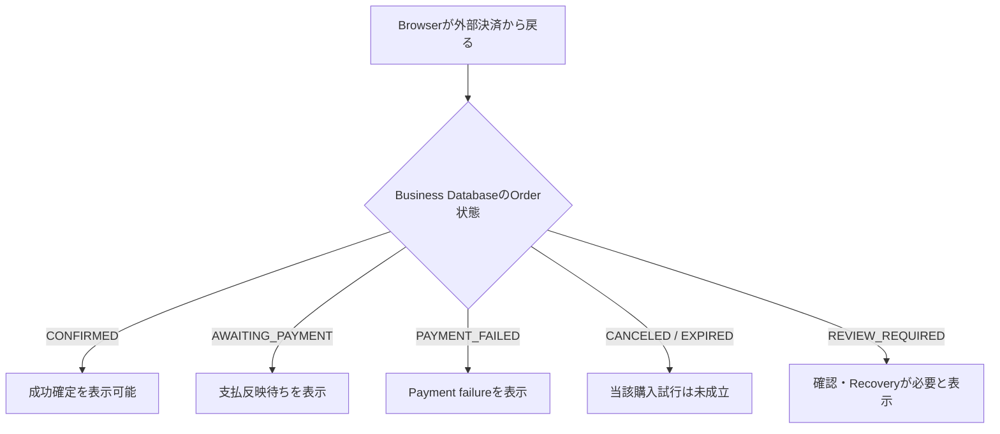
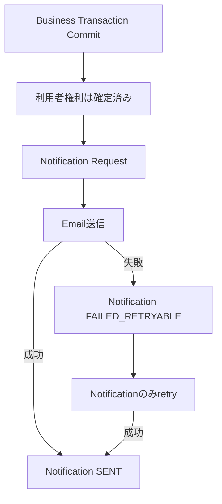

# 040 User Flows

## 1. 目的

本書は、**off r39'x in 大阪らへん2027** Webシステムの完成形において、Guest / Authenticated User / Customerを中心とする利用者が、公開情報閲覧、認証、Entry Ticket購入、Karaoke購入・予約、Goods購入、マイページ、当日受付、通知失敗・回復までをどの順序で利用し、各段階でどのBusiness outcomeを認識できなければならないかを定義する。

本書は `SPEC-010 System Overview` のActor・System Boundary・System Invariant、`SPEC-020 Functional Requirements` の `FR-*`、`SPEC-030 Domain Model & Business Rules` のEntity・State Machine・`BR-*`・`DI-030-*` を変更または弱化せず、これらを**利用者から観測可能な一連の操作、待機、分岐、失敗、再試行、完了**へ変換するCanonical Ownerである。

本書がCanonical Ownerとなるのは少なくとも以下である。

- Actorごとの主要User FlowとFlow開始条件
- 利用者操作と、利用者から観測可能なSystem responseの順序
- 成功・失敗・競合・待機・再試行・再開の論理分岐
- Browser上の遷移とBusiness Database上の確定状態を混同しないFlow
- 同一処理のretryと、新しいOrder / Holdを必要とする新規業務試行の区別
- 自己所有Dataだけへ到達する利用者Flow
- Entry / Karaoke / Goods / Check-in / Notification failureの主要例外Flow
- `FR-*`、`BR-*`、`DI-030-*`、`INV-010-*` へのTraceability

本書はURL、Route、画面Field、Layout、Component、Role Permission Matrix、Stripe Event名、Checkout Session field、HTTP Status、API Endpoint、QR Token形式、Karaoke hold具体秒数、DB Table / Column / Index / Constraint、Email Template、retry回数を定義しない。これらは各下流Canonical Ownerへ委譲する。

## 2. 適用範囲

本書は以下の利用者Flowへ適用する。

- 公開イベント情報・販売案内の閲覧
- 認証必須操作への遷移
- Account登録、Email確認、Login、Logout、Password reset
- Business Profile参照・更新
- Entry Ticket購入と購入後確認
- Karaoke空き状況確認、Hold、購入、Reservation / Ticket確認
- Goods購入、購入後確認、会場Handoff
- マイページからの自己所有Data参照
- Entry / Karaokeの参加者側Check-in
- 支払待ち、Business Database反映待ち、Payment failure、競合、失効、外部Service障害、Email failure、`REVIEW_REQUIRED` の利用者向け扱い
- Retry / Resumeの利用者側Rule

Administrator / Staffが利用する内部管理画面・受付画面の操作手順は `SPEC-130` がCanonical Ownerである。本書では、一般利用者がStaff受付と接する業務境界、およびUser Flow成立のために観測可能でなければならないStaff側結果だけを扱う。

## 3. 前提・依存仕様

本書は以下へ依存する。

- `SPEC-000 Specification Governance`: Canonical Owner、依存関係、用語、Upstream Change Request、未決定事項の決定規則
- `SPEC-010 System Overview`: Actor、System Boundary、System of Record、主要Data Flow、`INV-010-*`
- `SPEC-020 Functional Requirements`: 完成システムの `FR-*`
- `SPEC-030 Domain Model & Business Rules`: Domain Entity、Ownership、State Machine、`BR-*`、`DI-030-*`

本書は上流Stateを新しい名称へ読み替えない。特にOrder、Ticket、Karaoke Slot / Hold / Reservation、Goods Order Item / Handoff、Notification RequestのStateは `SPEC-030` のCanonical Stateをそのまま使用する。

## 4. Canonical Flow Terms

| Term | 本書での意味 |
|---|---|
| Entry Point | URLではなく、利用者が当該Flowへ入る論理的な起点 |
| Trigger | Precondition成立後、Flowを開始させる利用者操作または外部結果 |
| Main Success Flow | 競合・障害がなく、最終Business outcomeが正常確定する順序 |
| Alternative Flow | 正常な業務上の分岐であり、必ずしも障害ではない経路 |
| Failure / Conflict Flow | 認証失敗、購入条件不成立、競合、外部Service障害等により当該試行を成功確定しない経路 |
| Waiting / Pending Flow | 外部処理または非同期反映がまだ確定しておらず、成功・失敗を断定してはいけない経路 |
| Retry | 同一の論理的な業務原因を再評価・再送し、重複Domain effectを発生させない再実行 |
| Resume | 既存のFlow contextまたは既存Orderを参照して利用を継続すること |
| New Business Attempt | Terminalな失敗・取消・失効後などに、新しいOrderまたは新しいHoldを用いて開始する別の購入試行 |
| Browser Return | 外部決済等からBrowserが本システムへ戻った事実。Business Transaction確定を意味しない |
| Business Confirmation | Business Database上でCanonical Stateが確定し、必須権利生成まで成立したこと |
| Ownership Failure | 認証済みであっても対象Dataが本人所有ではなく、参照・更新を成立させない結果 |
| Recovery Required | 自動的に成功・失敗へ確定することが安全でなく、Order `REVIEW_REQUIRED` 等として追跡される状態 |

## 5. User Flow共通原則

### 5.1 Client表示はDomain Authorityではない

利用者が「販売中」「空きあり」「在庫あり」「支払成功」等の表示を見た後でも、Business operation実行時にはServer-sideの現在状態を再評価する。古いBrowser表示だけで購入、権利発行、Check-inを成立させてはならない。

Trace: `FR-XFN-016`, `FR-XFN-026`, `BR-SAL-005`, `DI-030-011`, `INV-010-08`, `INV-010-09`.

### 5.2 Browser ReturnとBusiness Confirmationの分離

外部決済からBrowserが戻った事実だけでは購入完了としない。

`CONFIRMED` 以外を購入成功確定として表示してはならない。

Trace: `FR-TKT-011〜018`, `FR-KRK-017`, `FR-KRK-027`, `FR-GDS-009`, `FR-XFN-010`, `FR-XFN-028〜029`, `BR-ORD-004〜007`, `DI-030-002`, `DI-030-009`, `INV-010-02`, `INV-010-07`.

### 5.3 自己所有Dataの原則

Authenticated User向けFlowでは、対象識別子を利用者が指定できる場合でも、Server-sideで認証IdentityからBusiness Profileを解決し、Owner関係を検証する。OwnerでないDataは返さず、存在の詳細を不要に開示しない。

Trace: `FR-AUTH-009〜012`, `FR-MYP-001〜002`, `FR-MYP-012`, `FR-XFN-002〜003`, `FR-XFN-017`, `BR-USR-001`, `BR-USR-004〜006`, `DI-030-010`, `INV-010-08`.

### 5.4 同一retryと新規業務試行

以下を本書の共通Ruleとする。

| Situation | Flow上の扱い |
|---|---|
| 同一Orderの状態再取得 | 同じOrderを参照する。新Orderを作らない |
| Browser reload / revisit | 現在のDomain stateを再取得する。Ticket / Reservation / Handoffを新規生成しない |
| Webhook反映待ちの再読込 | 同一 `AWAITING_PAYMENT` Orderを参照する |
| Checkout開始前の一時障害 | `PREPARED` Orderと有効なAllocation / Holdを再利用できる間は同一試行として安全にretryできる |
| `PAYMENT_FAILED` / `CANCELED` / `EXPIRED` 後の再購入 | Terminal stateを戻さず、新しいOrderを作成する |
| Karaoke Hold `EXPIRED` / `RELEASED` 後の再購入 | 新しい購入可否判定を行い、新しい有効Holdを取得する |
| Check-in retry / 並行Scan | 既存Check-in結果を参照し、2件目を作らない |
| Notification retry | 同一Notificationを再送対象とし、Order確定・Ticket発行等を再実行しない |

Trace: `BR-ORD-006`, `BR-ORD-008〜009`, `BR-SAL-007`, `BR-TKT-006`, `BR-KRK-006〜007`, `BR-KRK-014`, `BR-KRK-020`, `BR-GDS-011`, `BR-CHK-004〜005`, `BR-NTF-004〜005`, `DI-030-012`, `INV-010-10`.

### 5.5 利用者が区別できなければならないOutcome

画面Layoutや具体文言は `SPEC-050` へ委譲するが、利用者または受付Staffは少なくとも以下を区別できなければならない。

- 成功確定
- 支払待ち / Business Database反映待ち
- 購入開始失敗
- Payment failure
- 販売開始前 / 販売終了 / 販売停止
- 売り切れ / Slot競合 / Inventory競合
- Purchase Limit超過
- Hold期限切れ
- Authentication failure
- Authorization / Ownership failure
- External Service一時障害
- Email failure（購入自体は確定済み）
- QR invalid
- QR already used
- Ticket `CANCELED` / `EXPIRED`
- Recovery / `REVIEW_REQUIRED`

未確定のOutcomeを成功確定として偽装してはならない。

## 6. Flow ID体系

| Prefix | Category |
|---|---|
| `UF-PUB-*` | 公開サイト・公開販売情報 |
| `UF-AUTH-*` | Account / Authentication / Business Profile |
| `UF-TKT-*` | Entry Ticket購入 |
| `UF-KRK-*` | Karaoke販売・購入・Reservation |
| `UF-GDS-*` | Goods販売・購入・Handoff |
| `UF-MYP-*` | マイページ・自己所有Data |
| `UF-CHK-*` | 参加者側Check-in |
| `UF-XFN-*` | Cross-functional Pending / Failure / Retry / Notification / Recovery |

同一Flow IDを別Flowへ再利用してはならない。

# Part I — Public / Authentication Flows

## 7. UF-PUB-001 公開情報・販売案内閲覧

- **Flow ID:** `UF-PUB-001`
- **Primary Actor:** Guest / Authenticated User
- **Secondary Actor / External System:** Hono API / Business Database
- **Entry Point:** 公開イベントサイト、または公開情報へのNavigation
- **Precondition:** なし。認証不要
- **Trigger:** 利用者がイベント情報または販売案内を閲覧する

### 7.1 Main Success Flow

1. **User** は公開イベント情報の閲覧を開始する。
2. **Web** は公開情報取得を要求する。
3. **API** はBusiness Database上の公開対象情報を取得する。
4. **System** はEvent概要、開催日時、会場・アクセス、注意事項、`PUBLISHED` のFAQ / Announcementを返す。
5. **User** はEntry Ticket販売案内、Karaoke販売案内・対象日・1時間単位の空き状況、Goods販売案内へ進める。
6. **API** は各販売対象の現在の販売期間、Sale Control State、容量 / 在庫 / Slot availability等から公開上の購入可否を導出する。
7. **Web** は取得できた値だけを表示し、利用者が「販売開始前 / 販売中 / 販売終了 / 販売停止 / 売り切れ等」を区別できる結果を提示する。

### 7.2 Alternative Flow

- 利用者が認証済みであっても、公開情報自体の取得RuleはGuestと同じ公開範囲を基本とする。
- Karaokeの1時間単位表示は、`usage_start` に基づく `Asia/Tokyo` のbucket集約から空き状況を示し、具体Slot選択へ進める。

### 7.3 Failure / Conflict Flow

1. 公開情報取得が失敗した場合、Webは未取得値を「空」「0件」「売り切れ」等の正常値へ変換してはならない。
2. 対象領域の取得に失敗したことを利用者が識別できる結果を提示する。
3. 既に取得済みの別領域まで誤って失敗扱いにする必要はないが、取得できていない情報を推測して補完してはならない。
4. 再取得が可能であっても、成功データを捏造せず、再試行は新しい購入権利等を作らない単純なread retryとして扱う。

### 7.4 Success Postcondition

利用者は、公開対象のイベント情報と販売判断情報を参照できる。購入権利・Order・Hold等はまだ成立しない。

### 7.5 Failure Postcondition

取得できなかった情報は未取得のままであり、Business Transactionは発生しない。

### 7.6 Traceability

- `FR-PUB-001〜011`, `FR-PUB-013〜014`, `FR-KRK-002〜004`
- `BR-EVT-001〜004`, `BR-SAL-003〜005`, `BR-XFN-001〜004`
- `INV-010-08`, `INV-010-09`

## 8. UF-PUB-002 Guestから認証必須操作への遷移

- **Flow ID:** `UF-PUB-002`
- **Primary Actor:** Guest
- **Secondary Actor / External System:** Supabase Auth / Hono API
- **Entry Point:** 購入開始、マイページ利用、Profile等の認証必須操作
- **Precondition:** Guestである
- **Trigger:** Guestが認証必須操作を開始する

### 8.1 Main Success Flow

1. **Guest** が購入・マイページ等の認証必須操作を選ぶ。
2. **Web** は当該操作に認証が必要であることを識別できる状態へ遷移させる。
3. **System** はGuestのままOrder作成、Hold確保、Profile取得等のBusiness operationを成立させない。
4. **Guest** はAccount登録またはLoginを完了する。
5. **Web / API** は認証済みIdentityを新しいRequestで検証する。
6. 認証前に選択していた論理的な利用目的が安全に継続可能であれば、その目的へ戻る。
7. 購入を再開する場合、販売条件・在庫・Slot等は認証前の表示を信用せず、購入実行時の現在状態で再検証する。

### 8.2 Alternative / Failure Flow

- Login / Account登録を中止した場合、Guestのまま公開領域へ戻れる。Business operationは成立しない。
- 認証中に販売終了、売り切れ、Slot競合等が発生した場合、認証前表示を根拠に購入を保証せず、対象購入Flowの現在状態Failureへ分岐する。
- Auth Serviceが一時障害の場合は `UF-AUTH-007` へ分岐する。

### 8.3 Success Postcondition

ActorはAuthenticated Userとなり、対象操作のPreconditionを改めて満たす場合に限り業務Flowを継続できる。

### 8.4 Failure Postcondition

Guestのまま認証必須Business operationは成立しない。

### 8.5 Traceability

- `FR-PUB-012`, `FR-AUTH-004〜005`, `FR-XFN-001〜003`, `FR-XFN-026`
- `BR-USR-001`, `BR-SAL-005`
- `DI-030-010`
- `INV-010-08`

## 9. UF-AUTH-001 Account登録

- **Flow ID:** `UF-AUTH-001`
- **Primary Actor:** Guest
- **Secondary Actor / External System:** Supabase Auth / Hono API / Business Database
- **Entry Point:** Account登録
- **Precondition:** Guestである
- **Trigger:** Guestが新規Account登録を送信する

### 9.1 Main Success Flow

1. **Guest** はAccount登録に必要な情報を入力し、登録を開始する。
2. **Web** はSupabase Authの登録Flowを利用する。
3. **Supabase Auth** がIdentityを作成し、Email確認が必要な認証状態であれば確認Flowを開始する。
4. **System** は確認未完了Identityを確認済みと偽装しない。
5. 認証済み業務操作を初めて行うまでに、**API** は検証済みAuth Identityと1対1で対応するBusiness Profileを一意に解決可能な状態にする。
6. 登録後の利用可否はSupabase Authの認証状態と `SPEC-060` のSession / Access Ruleに従う。

### 9.2 Failure Flow

- Supabase Authが登録を受理しない場合、Account登録は未成立として利用者へ示す。
- Business Profileとの対応を安全に確立できない状態では、購入等の業務操作へ進めない。
- CredentialをBusiness Databaseへ保存するFlowを作らない。

### 9.3 Success Postcondition

Supabase Auth Identityが存在し、Email確認が必要な場合は `UF-AUTH-002` へ進める。Business Profileは当該Identityと1対1で対応する。

### 9.4 Traceability

- `FR-AUTH-001〜003`, `FR-AUTH-008〜009`
- `BR-USR-001`
- `DI-030-010`
- `INV-010-08`

## 10. UF-AUTH-002 Email確認

- **Flow ID:** `UF-AUTH-002`
- **Primary Actor:** Account登録済みUser
- **Secondary Actor / External System:** Supabase Auth
- **Entry Point:** Supabase AuthのEmail確認Flow
- **Precondition:** Email確認が要求される未確認Identityが存在する
- **Trigger:** Userが正規のEmail確認操作を完了する

### 10.1 Main Success Flow

1. **User** はSupabase Authが提供するEmail確認を開始する。
2. **Supabase Auth** が確認情報を検証する。
3. 確認成功後、IdentityはSupabase Auth上で確認済みとして扱われる。
4. **Web / API** は以後の認証必須操作でSupabase Authの現在状態を基準に利用可否を判断する。
5. UserはLoginまたは、認証状態が成立している場合は元の利用目的へ進める。

### 10.2 Failure Flow

- 無効・失効等により確認が成立しない場合、確認済みとして扱わない。
- 確認失敗を理由に既存Business Profileや確定済み購入を削除しない。

### 10.3 Success Postcondition

Email確認がSupabase Auth上で完了している。

### 10.4 Traceability

- `FR-AUTH-002〜003`, `FR-EML-001`
- `BR-USR-001`
- `INV-010-08`

## 11. UF-AUTH-003 Login / Login失敗

- **Flow ID:** `UF-AUTH-003`
- **Primary Actor:** Guest / 登録済みUser
- **Secondary Actor / External System:** Supabase Auth
- **Entry Point:** Login
- **Precondition:** 登録済みIdentityが存在する
- **Trigger:** UserがCredentialを用いてLoginを試行する

### 11.1 Main Success Flow

1. **User** はCredentialを入力してLoginを開始する。
2. **Supabase Auth** がCredentialを検証する。
3. 成功時、UserはAuthenticated UserとしてSessionを取得する。
4. 認証必須Business operationでは、**API** がRequestごとに認証IdentityをServer-sideで検証する。
5. 認証前に開始していた合理的な利用目的があれば、現在状態を再取得して継続する。

### 11.2 Failure Flow

1. Credential検証が失敗した場合、Authenticated Userとして扱わない。
2. 認証必須Business operationを継続しない。
3. Userは再入力、Password reset、または公開領域へ戻ることができる。
4. Login retryはOrderやTicket等のBusiness effectを発生させない。

### 11.3 Success Postcondition

有効な認証状態が成立し、Server-side検証を通過するRequestで認証必須Flowへ進める。

### 11.4 Failure Postcondition

認証は未成立で、認証必須操作は成立しない。

### 11.5 Traceability

- `FR-AUTH-004〜005`, `FR-AUTH-009`, `FR-XFN-001〜002`
- `BR-USR-001`
- `DI-030-010`
- `INV-010-08`

## 12. UF-AUTH-004 Logout

- **Flow ID:** `UF-AUTH-004`
- **Primary Actor:** Authenticated User
- **Secondary Actor / External System:** Supabase Auth
- **Entry Point:** Account操作
- **Precondition:** 有効なSessionがある
- **Trigger:** UserがLogoutを実行する

### 12.1 Main Success Flow

1. **Authenticated User** がLogoutを選ぶ。
2. **System** は現在の認証SessionをLogoutする。
3. 以後、認証必須FlowをGuestのまま成立させない。
4. 公開情報は引き続きGuestとして閲覧できる。

### 12.2 Postcondition

SessionはLogoutされる。既存Order、Ticket、Reservation、Goods購入等のBusiness Dataは削除・取消されない。

### 12.3 Traceability

- `FR-AUTH-006`, `FR-XFN-001`
- `INV-010-01`, `INV-010-08`

## 13. UF-AUTH-005 Password reset開始・完了後の利用再開

- **Flow ID:** `UF-AUTH-005`
- **Primary Actor:** Guest / Login不能なUser
- **Secondary Actor / External System:** Supabase Auth
- **Entry Point:** Password reset
- **Precondition:** UserがPassword resetを必要としている
- **Trigger:** UserがPassword resetを開始する

### 13.1 Main Success Flow

1. **User** がPassword resetを開始する。
2. **Supabase Auth** が認証基盤のPassword reset Flowを処理する。
3. **User** が正規の手順でPasswordを更新する。
4. reset完了後、UserはLoginしてAuthenticated Userとなる。
5. **API** は新しい認証状態をServer-sideで検証し、Business Profileと自己所有Dataを従来どおり解決する。
6. Userは購入・マイページ等の利用を再開できる。

### 13.2 Failure Flow

- resetが未完了の場合、認証済みとして扱わない。
- reset失敗・未達等を理由にBusiness DatabaseへCredentialを保存・代替認証しない。
- Password resetは既存Order / Ticket / ReservationのOwnerを変更しない。

### 13.3 Success Postcondition

認証基盤上のPassword resetが完了し、通常Login Flowへ復帰できる。

### 13.4 Traceability

- `FR-AUTH-007〜009`, `FR-EML-001`
- `BR-USR-001`, `BR-USR-006`
- `DI-030-010`
- `INV-010-08`

## 14. UF-AUTH-006 Business Profile参照・更新

- **Flow ID:** `UF-AUTH-006`
- **Primary Actor:** Authenticated User
- **Secondary Actor / External System:** Hono API / Business Database
- **Entry Point:** 自身のProfile
- **Precondition:** 認証済みであり、Auth Identityに対応するBusiness Profileが一意に解決できる
- **Trigger:** UserがProfile参照または更新を行う

### 14.1 Main Success Flow

1. **User** が自身のProfile参照を要求する。
2. **API** は認証IdentityをServer-sideで検証する。
3. **API** はIdentityに1対1で対応するBusiness Profileを解決する。
4. **System** は本人所有Profileだけを返す。
5. Userが更新可能項目を変更した場合、**API** は再度Owner関係と入力を検証する。
6. 成立する更新だけをBusiness Profileへ反映し、更新後状態を返す。

### 14.2 Failure / Ownership Flow

- 他者Profileの識別子を指定しても、本人Ownerでなければ返さず更新しない。
- Auth IdentityとBusiness Profileの対応が一意に解決できない場合、業務操作を安全に停止し、他Profileへフォールバックしない。

### 14.3 Success Postcondition

本人Business Profileが参照または正規に更新される。

### 14.4 Traceability

- `FR-AUTH-010〜012`, `FR-MYP-011〜012`, `FR-XFN-003`, `FR-XFN-017`
- `BR-USR-001`, `BR-USR-006`
- `DI-030-010`
- `INV-010-08`

## 15. UF-AUTH-007 認証Service一時障害

- **Flow ID:** `UF-AUTH-007`
- **Primary Actor:** Guest / Authenticated User
- **Secondary Actor / External System:** Supabase Auth
- **Entry Point:** Login、認証必須操作、Session検証
- **Precondition:** 認証Serviceが一時的に正常応答できない
- **Trigger:** Userが認証または認証必須操作を試行する

### 15.1 Failure / Waiting Flow

1. **System** は認証Identityを安全に検証できないことを検出する。
2. 未検証のIdentityをAuthenticated Userとして扱わない。
3. 認証必須の購入、Profile更新、マイページ参照等を成立させない。
4. 既にBusiness Databaseへ `CONFIRMED` 等として確定済みのOrder / Ticket / Reservation / Goods購入を削除・取消しない。
5. Userには認証Service障害により当該操作を完了できないことを識別できる結果を返す。
6. Service回復後、Userは認証または対象操作を再試行できる。再試行は確定済みBusiness Transactionを重複実行しない。

### 15.2 Failure Postcondition

新しい認証必須Business operationは成立しない。既存確定業務データは保持される。

### 15.3 Traceability

- `FR-AUTH-014`, `FR-XFN-020`, `FR-XFN-032`
- `BR-ORD-010`, `DI-030-001`, `DI-030-012`
- `INV-010-01`, `INV-010-08`, `INV-010-10`

# Part II — Entry Ticket Flows

## 16. UF-TKT-001 Entry Ticket購入

- **Flow ID:** `UF-TKT-001`
- **Primary Actor:** Authenticated User / Customer
- **Secondary Actor / External System:** Hono API / Business Database / Stripe / Notification subsystem
- **Entry Point:** 公開Entry Ticket販売案内または購入可能なEntry Ticket Offering
- **Precondition:** ActorがAuthenticated Userであり、対象Offeringが公開されている
- **Trigger:** UserがTicket種別・数量を選択して購入開始する

### 16.1 Main Success Flow

1. **User** はEntry Ticket販売情報を確認し、Ticket種別と数量を選択する。
2. **Web / API** は認証状態を確認し、Guestなら `UF-PUB-002` へ分岐する。
3. **API** はServer-sideでEntry Ticket Offeringの現在状態を再取得する。
4. **API** はSales Period、Sale Control State、必要数量、Purchase Limitを再検証する。
5. **API** は同一Business Profileの確定済み数量と有効な一時確保数量を考慮し、Account購入制限を検証する。
6. **API / Business Database** は必要数量のEntry Sales Allocationを排他的に `HELD` として確保する。
7. Allocation確保成功後、**API** は認証済みBusiness ProfileをCustomerとするOrderを `PREPARED` として外部決済前に永続化する。
8. OrderにはServer-side販売Configurationから決定した購入時価格Snapshotと購入対象が結び付く。
9. **API** は外部Checkout開始を要求する。
10. Checkout開始が成立したらOrderを `AWAITING_PAYMENT` とし、**User** はStripe Checkoutで支払操作を行う。
11. **Browser** が外部決済から本システムへ戻る。
12. **Web** はBrowser Returnを成功確定根拠にせず、Business Databaseの同じOrder状態を取得する。
13. Orderがまだ `AWAITING_PAYMENT` の場合、Userへ支払 / Business Database反映待ちであることを示し、`UF-XFN-001` のPending Flowとして同じOrderを参照する。
14. **Stripeからの権威ある支払確定入力をAPIが検証**し、同一Orderに対する確定処理を開始する。
15. **Business Database** は一貫した業務更新として、Entry Sales Allocation `HELD -> COMMITTED`、必要数量のEntry Ticket発行、Order `AWAITING_PAYMENT -> CONFIRMED` を成立させる。
16. 各Entry Ticketは `VALID` であり、正規購入数量単位ごとに最大1枚だけ存在する。
17. **System** はOrder確定後にNotification Requestを生成する。Email送信成否は購入確定条件にしない。
18. **User** はマイページで同じ `CONFIRMED` Order、購入数量に対応するEntry Ticket、Entry QR、およびReceipt情報への導線を確認する。

### 16.2 Alternative Flow — 販売開始前 / 販売終了 / 販売停止

- Sales Period開始前、終了後、またはSale Control Stateが新規販売を許可しない場合、新Orderを作成せず購入開始を失敗させる。
- 利用者は現在購入不可であるBusiness outcomeを識別できる。
- 既存Order / Ticketを変更しない。

### 16.3 Alternative Flow — 売り切れ / Allocation競合

1. User表示時点では残数があっても、購入開始時に現在容量を再検証する。
2. 必要数量の `HELD` Allocationを確保できない場合、OrderをCheckoutへ進めない。
3. 並行購入で同じ残数を複数Customerへ確保しない。
4. Userには現在必要数量を確保できないことを示し、別数量・別Offering等を選び直せる。

### 16.4 Alternative Flow — Account購入制限超過

- 確定済み数量 + 有効Allocation数量を含むPurchase Limit判定で上限を超える場合、購入を開始しない。
- 並行Requestやretryによって上限を回避させない。

### 16.5 Failure Flow — Checkout開始失敗

1. OrderとAllocationがすでに成立している場合、Orderを削除しない。
2. Checkout自体が未成立ならOrderは `PREPARED` に留まる。
3. Userには支払開始に失敗しており購入確定していないことを示す。
4. Allocationが有効かつ上流Rule上安全な間は、**同一Order** のCheckout開始をretryできる。
5. retryで新しいOrderや追加Allocationを無条件に作成しない。
6. Allocationが失効・解放された場合は同一Orderを支払待ちへ進めず、新規購入時に新しいOrder / Allocationを取得する。

### 16.6 Waiting Flow — Checkout離脱 / Payment未確定

- Checkoutを開始したがUserが離脱し、権威ある成功・失敗が未確定の場合、`AWAITING_PAYMENT` を成功扱いしない。
- 有効期限や取消等のDomain Triggerが成立した場合は、Orderを `CANCELED` または `EXPIRED` とし、Allocationを `RELEASED` にする。
- `CANCELED` / `EXPIRED` 後に購入する場合は新Orderを作る。

### 16.7 Failure Flow — Payment failure

1. 支払不成立が権威ある結果として確定した場合、Orderは `PAYMENT_FAILED` となる。
2. `HELD` Allocationを `RELEASED` にする。
3. Entry Ticketを有効権利として発行しない。
4. Userには当該Orderが支払成功していないことを示す。
5. 再購入は同じOrderを `PREPARED` へ戻さず、新Orderで開始する。

### 16.8 Waiting Flow — Browser success return済みだがWebhook未反映

- Browser Return後にOrderが `AWAITING_PAYMENT` なら「成功確定」ではなく反映待ちとして扱う。
- reload / revisit / status retryは同一Orderを取得する。
- 新Order・新Ticketを生成しない。
- `CONFIRMED` へ変わった時点で初めてTicket / QRを確定済み権利として表示する。

### 16.9 Failure / Recovery Flow — 外部支払と内部反映の不整合

1. 外部では支払成功が権威的に確認できるが、Order確定・Allocation確定・Ticket発行を安全に一貫して反映できない場合、通常成功として表示しない。
2. Orderを `REVIEW_REQUIRED` またはConsistency Review Caseで追跡する。
3. Userには処理状況の確認が必要であり、Ticketを未確定のまま有効とみなせないことを示す。
4. 安全なRecoveryにより必須Domain updateが成立した場合のみ `CONFIRMED` へ進む。
5. Recovery詳細は `SPEC-150` へ委譲する。

### 16.10 Alternative Flow — Email failure

- Order / Allocation / TicketのBusiness Transactionは `CONFIRMED` のまま維持する。
- Notificationのみ `FAILED_RETRYABLE` とし、`UF-XFN-002` へ分岐する。
- UserはマイページからTicket / QR / Orderを確認できる。

### 16.11 Retry / Resume Rule

- `PREPARED`: 必要なAllocationが有効でCheckout未成立なら同一OrderのCheckout開始retryが可能。
- `AWAITING_PAYMENT`: 同一Orderの状態確認だけを行い、新Orderを作らない。
- `CONFIRMED`: reload / revisitは既存Order / Ticketを返し、新Ticketを発行しない。
- `PAYMENT_FAILED` / `CANCELED` / `EXPIRED`: 新しい購入は新Order + 新Allocation。
- `REVIEW_REQUIRED`: 新規Ticket発行をUser操作retryで行わず、Recovery対象として扱う。

### 16.12 Success Postcondition

- Order: `CONFIRMED`
- Entry Sales Allocation: `COMMITTED`
- Entry Ticket: 購入数量分が `VALID`
- Customer / Owner: Order Customerと一致
- Notification Request: Purchase transaction確定後に生成可能

### 16.13 Failure Postcondition

失敗種類に応じてOrderは `PREPARED` / `AWAITING_PAYMENT` / `PAYMENT_FAILED` / `CANCELED` / `EXPIRED` / `REVIEW_REQUIRED` のいずれかで追跡される。`CONFIRMED` でないOrderから有効Entry Ticketを提供しない。

### 16.14 Traceability

- **FR:** `FR-TKT-001〜026`, `FR-MYP-003〜004`, `FR-MYP-007〜008`, `FR-MYP-010`, `FR-EML-002`, `FR-EML-006〜011`, `FR-XFN-009〜013`, `FR-XFN-016〜017`, `FR-XFN-019〜021`, `FR-XFN-026〜029`, `FR-XFN-032`
- **BR:** `BR-USR-001`, `BR-USR-003〜006`, `BR-SAL-001〜007`, `BR-ORD-001〜012`, `BR-TKT-001〜011`, `BR-NTF-001〜006`
- **DI:** `DI-030-001`, `DI-030-002`, `DI-030-003`, `DI-030-004`, `DI-030-009`, `DI-030-010`, `DI-030-011`, `DI-030-012`
- **INV:** `INV-010-01`, `INV-010-02`, `INV-010-03`, `INV-010-06`, `INV-010-07`, `INV-010-08`, `INV-010-09`, `INV-010-10`

# Part III — Karaoke Flows

## 17. UF-KRK-001 Karaoke販売案内・空き状況確認

- **Flow ID:** `UF-KRK-001`
- **Primary Actor:** Guest / Authenticated User
- **Secondary Actor / External System:** Hono API / Business Database
- **Entry Point:** Karaoke販売案内
- **Precondition:** なし
- **Trigger:** UserがKaraokeの対象日・空き状況を確認する

### 17.1 Main Success Flow

1. **User** はKaraoke販売案内を閲覧する。
2. **System** は公開対象の販売条件、価格、対象日、利用単位を返す。
3. **User** は `Asia/Tokyo` の対象日を選択する。
4. **API** は対象日のKaraoke Slotを取得する。
5. **System** はSlotの `usage_start` に基づき1時間単位へ集約した空き状況を返す。
6. **User** は1時間単位の空き状況から具体的なSlot候補へ進む。
7. **System** は個別Slotについて、少なくとも現在 `AVAILABLE` かつ販売条件を満たすものを購入候補として扱う。

### 17.2 Alternative Flow

- Slotが `HELD` なら他Customerへ空きとして扱わない。
- Slotが `SOLD` または `SALES_STOPPED` なら新規購入候補にしない。
- 公開表示後に状態が変わり得るため、購入開始時には `UF-KRK-002` で再検証する。

### 17.3 Failure Flow

取得障害時は「空き0」と偽装せず、空き状況を正常取得できていないことを示す。

### 17.4 Success Postcondition

Userは対象日・1時間単位・個別Slotの購入判断に必要な情報を確認できる。Hold / Order / Reservationはまだ成立しない。

### 17.5 Traceability

- `FR-PUB-008`, `FR-PUB-010`, `FR-KRK-001〜007`
- `BR-KRK-001〜003`, `BR-KRK-005`, `BR-KRK-012`, `BR-XFN-001`, `BR-XFN-003〜004`
- `DI-030-005`
- `INV-010-04`

## 18. UF-KRK-002 Karaoke購入・予約確定

- **Flow ID:** `UF-KRK-002`
- **Primary Actor:** Authenticated User / Customer
- **Secondary Actor / External System:** Hono API / Business Database / Stripe / Notification subsystem
- **Entry Point:** 個別Karaoke Slot選択
- **Precondition:** Userが具体的なSlotを選択している
- **Trigger:** Userが当該Slotの購入を開始する

### 18.1 Main Success Flow

1. **User** は対象日と1時間単位の空き状況から個別Slotを選択する。
2. **Web / API** は認証状態を確認し、Guestなら `UF-PUB-002` へ分岐する。
3. **API** は選択Slotの現在StateをServer-sideで再取得する。
4. **API** はSlotが `AVAILABLE`、Karaoke販売期間内、販売停止でないことを再検証する。
5. **API** は同一Business Profileの確定Reservationと `ACTIVE` Holdを含めてPurchase Limitを検証する。
6. **Business Database** は同一排他的Slotに対して最大1件だけ成立するKaraoke Holdを `ACTIVE` で取得する。
7. Hold成立と同時にSlotは `AVAILABLE -> HELD` となり、他Customerへ販売不可となる。
8. **API** は当該Business ProfileをCustomerとし、1つのKaraoke Slotだけを対象とするOrderを `PREPARED` で永続化する。
9. Orderには対応Karaoke Hold、Slot、Server-side価格Snapshotが結び付く。
10. **API** は外部Checkout開始を要求する。
11. Checkout開始が成立するとOrderを `AWAITING_PAYMENT` とする。
12. **User** はStripe Checkoutで支払操作を行う。
13. **Browser** が外部決済から戻る。
14. **Web** は同じOrderのBusiness Database上の状態を取得する。Browser Returnだけでは成功確定しない。
15. Orderが `AWAITING_PAYMENT` の場合は `UF-XFN-001` のPending Flowとして同一Orderを参照する。
16. 権威ある支払確定入力をAPIが検証し、同一Orderの確定処理を開始する。
17. 一貫したBusiness Transactionとして、Karaoke Slot `HELD -> SOLD`、Karaoke Hold `ACTIVE -> COMMITTED`、Karaoke Reservation `CONFIRMED`、Karaoke Ticket `VALID` 発行、Order `AWAITING_PAYMENT -> CONFIRMED` を成立させる。
18. Karaoke ReservationのCustomerはOrder Customerと一致し、ReservationのSlotはHoldのSlotと一致する。
19. 同一ReservationにKaraoke Ticketは1件だけ存在する。
20. Order確定後、Notification Requestを生成する。
21. **User** はマイページでReservation日時、Reservation state、Karaoke Ticket、Karaoke QR、Order、Receipt情報への導線を確認する。

### 18.2 Failure / Conflict Flow — 同一Slot競合

1. 2人以上が同一Slotをほぼ同時に購入開始しても、`ACTIVE` Holdは最大1件だけ成立する。
2. 先にHoldを取得したCustomerだけがSlot `HELD` へ進む。
3. 競合した他Customerには、そのSlotを取得できなかったことを示す。
4. 競合側は別Slotを選択するか、現在状態を再取得する。
5. 競合失敗側に同一SlotのOrder / Reservationを成立させない。

### 18.3 Failure Flow — 他Customerが先にHold取得済み

- 購入開始時の再検証でSlotが `HELD` なら、新しいHoldを作らない。
- 当該Slotを空きとして扱わず、Userに選択し直しを求めるBusiness outcomeとする。

### 18.4 Failure Flow — Purchase Limit超過

- 確定Reservation + `ACTIVE` Holdの合計を基準に制限超過ならHoldを取得しない。
- 並行Requestで制限を回避させない。

### 18.5 Failure Flow — 販売停止 / 販売期間外

- Karaoke販売全体または対象Slotが新規販売不可の場合、Hold / Orderを新規成立させない。
- `SALES_STOPPED` は既存Reservationを取消すFlowではない。

### 18.6 Failure Flow — Hold期限切れ

1. `ACTIVE` Holdの有効期限が終了した場合、Holdは `EXPIRED` になる。
2. 他の禁止条件がなければSlotは `HELD -> AVAILABLE` となり、再販売可能になる。
3. 期限切れHoldをそのまま支払確定権利として使用しない。
4. Userには当該購入試行のSlot確保が失効したことを示す。
5. 再購入する場合は現在状態を再検証し、**新しいHoldと新しいOrder** を取得する。
6. Hold具体秒数・期限計算は `SPEC-090` へ委譲する。

### 18.7 Failure Flow — Checkout開始失敗

1. HoldとOrderが成立済みでCheckout開始だけが失敗した場合、Orderを削除しない。
2. Checkout未成立ならOrderは `PREPARED` に留まる。
3. Holdが `ACTIVE` で安全に継続できる間だけ、同一OrderのCheckout開始retryを許可できる。
4. retryで2つ目のHold / Orderを無条件に作らない。
5. retry前にHoldが `EXPIRED` / `RELEASED` なら、そのOrderを支払待ちへ進めない。

### 18.8 Waiting Flow — Checkout離脱 / Payment未完了

- Order `AWAITING_PAYMENT` と `ACTIVE` Holdが有効な間は購入未確定として扱う。
- Hold継続条件を失った場合、Holdは `RELEASED` または `EXPIRED`、Slotは条件を満たせば `AVAILABLE`、Orderは `CANCELED` / `EXPIRED` 等へ遷移する。
- 有効Karaoke Reservation / Ticketを表示しない。

### 18.9 Failure Flow — Payment failure

1. 支払不成立が権威ある結果として確定した場合、Orderは `PAYMENT_FAILED` となる。
2. `ACTIVE` Holdを `RELEASED` にする。
3. 他条件を満たせばSlotを `AVAILABLE` へ戻す。
4. Reservation / Karaoke Ticketを確定権利として成立させない。
5. 再購入は新Order / 新Holdで行う。

### 18.10 Waiting Flow — Browser success return済みだがDomain未確定

- Orderが `AWAITING_PAYMENT` の間、Reservationを `CONFIRMED`、Ticketを `VALID` として新規表示しない。
- reload / revisitは同じOrderを参照する。
- Browser success表示をSlot `SOLD` の根拠にしない。

### 18.11 Failure / Recovery Flow — 支払結果と内部状態の不整合

1. 外部支払成功が権威的に確認できても、Hold / Slot / Reservation / Ticket / Orderを安全に一貫確定できない場合、通常成功として扱わない。
2. Orderを `REVIEW_REQUIRED` またはConsistency Review Caseで追跡する。
3. Userへは予約確定済みと断定せず、確認が必要な状態であることを示す。
4. Recoveryで同一Slot二重販売や重複Ticketを起こしてはならない。

### 18.12 Alternative Flow — Email failure

- Order `CONFIRMED`、Slot `SOLD`、Hold `COMMITTED`、Reservation `CONFIRMED`、Ticket `VALID` は維持する。
- Notificationだけを `FAILED_RETRYABLE` とする。
- UserはEmailなしでもマイページでReservation / Ticket / QRを確認できる。

### 18.13 Retry / Resume Rule

- `ACTIVE` Hold + `PREPARED` Orderが有効でCheckout未成立: 同一購入試行としてCheckout開始retry可。
- `AWAITING_PAYMENT`: 同一Orderの状態確認。新Hold / 新Orderを作らない。
- `CONFIRMED`: 既存Reservation / Ticketを返す。重複生成しない。
- Hold `EXPIRED` / `RELEASED`: 新規購入時は新Hold + 新Order。
- Order `PAYMENT_FAILED` / `CANCELED` / `EXPIRED`: 新Order。
- `REVIEW_REQUIRED`: User retryで新Reservationを作らずRecovery対象。

### 18.14 Success Postcondition

- Karaoke Slot: `SOLD`
- Karaoke Hold: `COMMITTED`
- Karaoke Reservation: `CONFIRMED`
- Karaoke Ticket: `VALID`
- Order: `CONFIRMED`
- Owner / Customer: Order Customerと一致

### 18.15 Failure Postcondition

未確定時は有効Reservation / Ticketを提供しない。解放・失効したHoldは再使用せず、SlotはRuleに従い再販売可能となる。

### 18.16 Traceability

- **FR:** `FR-KRK-001〜027`, `FR-KRK-030`, `FR-MYP-005〜008`, `FR-MYP-010`, `FR-EML-003`, `FR-EML-006〜011`, `FR-XFN-009〜014`, `FR-XFN-016〜017`, `FR-XFN-019〜021`, `FR-XFN-026〜029`, `FR-XFN-032`
- **BR:** `BR-USR-001`, `BR-USR-003〜006`, `BR-SAL-001〜007`, `BR-ORD-001〜012`, `BR-KRK-001〜024`, `BR-NTF-001〜006`, `BR-XFN-001〜004`
- **DI:** `DI-030-001`, `DI-030-002`, `DI-030-003`, `DI-030-005`, `DI-030-009`, `DI-030-010`, `DI-030-011`, `DI-030-012`
- **INV:** `INV-010-01`, `INV-010-02`, `INV-010-03`, `INV-010-04`, `INV-010-06`, `INV-010-07`, `INV-010-08`, `INV-010-09`, `INV-010-10`

## 19. UF-KRK-003 Reservation取消後・Ticket無効化後の利用者確認

- **Flow ID:** `UF-KRK-003`
- **Primary Actor:** Customer
- **Secondary Actor / External System:** Hono API / Business Database
- **Entry Point:** マイページのKaraoke Reservation / Ticket確認
- **Precondition:** 過去に `CONFIRMED` Reservationが存在する
- **Trigger:** ReservationまたはTicketの状態が取消・失効等により変化した後、Customerが確認する

### 19.1 Main / Alternative Flow

1. **Customer** が自身のKaraoke Reservationを参照する。
2. **API** はOwnerを検証し、Business Databaseの現在状態を返す。
3. Reservationが `CONFIRMED` ならReservation日時を確認できる。
4. Reservationが `CANCELED` なら、取消済みであることを明確に示し、対応Karaoke Ticketを受付可能として表示しない。
5. Ticketが `CANCELED` または `EXPIRED` の場合、Karaoke QRを通常受付可能な権利として扱わない。
6. Ticketが `USED` の場合、利用済みであることを示す。
7. 過去のOrder / Reservation履歴自体はOwnerの履歴として保持し、取消を理由に他CustomerへOwnerを付け替えない。

### 19.2 Postcondition

Customerは現在のReservation / Ticket stateを誤認せず、取消・失効済み権利を有効QRとして利用しない。

### 19.3 Traceability

- `FR-KRK-024〜026`, `FR-MYP-005〜006`, `FR-STF-011〜012`
- `BR-KRK-017〜018`, `BR-KRK-021`, `BR-KRK-023〜024`, `BR-USR-004〜006`
- `DI-030-007`, `DI-030-010`
- `INV-010-05`, `INV-010-08`

# Part IV — Goods Flows

## 20. UF-GDS-001 Goods購入

- **Flow ID:** `UF-GDS-001`
- **Primary Actor:** Authenticated User / Customer
- **Secondary Actor / External System:** Hono API / Business Database / Stripe / Notification subsystem
- **Entry Point:** 公開Goods一覧またはGoods詳細の購入操作
- **Precondition:** Goodsが公開対象である
- **Trigger:** UserがGoodsと数量を選択して購入開始する

### 20.1 Main Success Flow

1. **User** はGoods一覧を閲覧し、商品・数量を選択する。
2. **Web / API** は認証状態を確認し、Guestなら `UF-PUB-002` へ分岐する。
3. **API** はGoodsのSales Period、Sale Control State、現在Inventory、その他販売条件をServer-sideで再検証する。
4. **API** はClient申告価格・在庫を権威値として使用せず、Server-side販売Configurationから金額を決定する。
5. **Business Database** は必要数量のGoods Sales Allocationを `HELD` として排他的に確保する。
6. Allocation確保後、**API** はCustomerと購入対象を結び付けたOrderを `PREPARED` で永続化する。
7. Goods Order Itemは支払前状態として `PENDING_PAYMENT` であり、会場受け渡し不可である。
8. **API** は外部Checkoutを開始する。
9. Checkout開始成立後、Orderは `AWAITING_PAYMENT` となる。
10. **User** はStripe Checkoutで支払操作を行う。
11. **Browser** が本システムへ戻った後、**Web** は同じOrderをBusiness Databaseから取得する。
12. `AWAITING_PAYMENT` なら `UF-XFN-001` として支払 / 反映待ちを表示する。
13. 権威ある支払確定入力をAPIが検証する。
14. 一貫したBusiness Transactionとして、Goods Sales Allocation `HELD -> COMMITTED`、Goods Order Item `PENDING_PAYMENT -> FULFILLABLE`、Order `AWAITING_PAYMENT -> CONFIRMED` を成立させる。
15. Goods Handoffは会場受け渡し前の `PENDING` として扱われる。
16. Order確定後、Notification Requestを生成する。
17. **Customer** はマイページでGoods購入内容、`FULFILLABLE` 状態、会場受け取り状態、Order、Receipt情報への導線を確認する。
18. 会場受け渡しは `UF-GDS-002` へ進む。

### 20.2 Failure Flow — 売り切れ / 在庫不足

- 購入開始時に必要数量の在庫が確保できなければ、Checkoutへ進めない。
- 売り切れを正常購入可能として表示しない。
- Userは数量変更または別Goods選択へ戻れる。

### 20.3 Failure / Conflict Flow — 並行購入によるInventory競合

1. 表示時点では在庫があっても、Allocation取得時の現在状態を基準にする。
2. `held_quantity + committed_quantity` が `saleable_capacity` を超えるAllocationを作らない。
3. 競合で確保できなかったUserの購入を失敗させる。
4. 競合側に未確保の在庫を前提としたCheckoutを開始させない。

### 20.4 Failure Flow — 販売期間外 / 販売停止

現在条件が新規販売を許可しない場合、Allocation / Orderを新規成立させない。

### 20.5 Failure Flow — Checkout開始失敗

- OrderとAllocationを削除せず、Checkout未成立ならOrderは `PREPARED` に留まる。
- `HELD` Allocationが有効な間だけ同一Orderで安全なCheckout開始retryを行える。
- retryで追加在庫を二重確保しない。
- Allocation解放・失効後に購入する場合は新しいOrder / Allocationを取得する。

### 20.6 Waiting Flow — 未決済 / Browser return後の反映待ち

- `AWAITING_PAYMENT` を支払済みと表示しない。
- Goods Order Item `PENDING_PAYMENT` を会場受け渡し対象にしない。
- reloadは同一Orderを参照し、新しいGoods購入を作らない。

### 20.7 Failure Flow — Payment failure

1. Orderは `PAYMENT_FAILED` となる。
2. Goods Sales Allocationは `RELEASED` となり在庫を回復する。
3. Goods Order Itemを `FULFILLABLE` にしない。
4. 再購入は新Order + 新Allocationで開始する。

### 20.8 Alternative Flow — Goods Order Item取消 / Handoff前の取消

1. 確定済みGoods Order Itemについて正規の取消条件が成立し、Handoffが未完了の場合、Itemは `CANCELED` へ遷移できる。
2. Goods Handoffは `VOID` となり、新規受け渡しを禁止する。
3. 在庫復元を行う場合は、正規取消Ruleが在庫復元対象とする場合だけ成立させる。
4. Refundの存在だけを在庫復元根拠にしない。
5. Customerはマイページで取消済みであることを確認できる。

### 20.9 Failure Flow — 既に受け渡し済みの場合

- Handoff `COMPLETED` 後は、通常の取消Flowで在庫復元対象にしない。
- 受け渡し済みを未受け渡し `PENDING` へ通常操作で戻さない。

### 20.10 Alternative Flow — Email failure

購入Business Transactionは `CONFIRMED` のまま維持し、Notificationだけを `FAILED_RETRYABLE` とする。CustomerはマイページからGoods購入とHandoff状態を確認できる。

### 20.11 Retry / Resume Rule

- `PREPARED` + 有効Allocation + Checkout未成立: 同一OrderでCheckout開始retry可。
- `AWAITING_PAYMENT`: 同一Order状態確認。
- `CONFIRMED`: 既存Goods Order Item / Handoffを返す。
- `PAYMENT_FAILED` / `CANCELED` / `EXPIRED`: 新規購入は新Order / 新Allocation。
- Handoff操作retry: `COMPLETED` なら既存完了結果を返し、2回目を成立させない。

### 20.12 Success Postcondition

- Order: `CONFIRMED`
- Goods Sales Allocation: `COMMITTED`
- Goods Order Item: `FULFILLABLE`
- Goods Handoff: `PENDING`
- Owner: Order Customerと一致

### 20.13 Failure Postcondition

未決済Goodsは受け渡し不可であり、確保失敗・支払失敗時には在庫を過剰消費しない。

### 20.14 Traceability

- **FR:** `FR-GDS-001〜017`, `FR-MYP-007〜010`, `FR-EML-004`, `FR-EML-006〜011`, `FR-XFN-009〜013`, `FR-XFN-016〜017`, `FR-XFN-019〜021`, `FR-XFN-026〜029`, `FR-XFN-032`
- **BR:** `BR-USR-001`, `BR-USR-003〜006`, `BR-SAL-001〜008`, `BR-ORD-001〜012`, `BR-GDS-001〜013`, `BR-NTF-001〜006`
- **DI:** `DI-030-001`, `DI-030-002`, `DI-030-006`, `DI-030-009`, `DI-030-010`, `DI-030-011`, `DI-030-012`
- **INV:** `INV-010-01`, `INV-010-02`, `INV-010-06`, `INV-010-07`, `INV-010-08`, `INV-010-09`, `INV-010-10`

## 21. UF-GDS-002 Goods会場Handoff

- **Flow ID:** `UF-GDS-002`
- **Primary Actor:** Customer
- **Secondary Actor:** Staff / Administrator（具体権限は `SPEC-060` / `SPEC-130`）
- **Entry Point:** 会場受け取り
- **Precondition:** Customerが自身のGoods Order Itemを持ち、正規Handoff対象である
- **Trigger:** Customerが会場で受け取りを求める

### 21.1 Main Success Flow

1. **Customer** は自身のGoods購入を会場で受け取るため、必要な購入情報を提示する。
2. **Staff / Administrator側System** は対象Goods Order ItemとHandoffの現在状態をBusiness Databaseから確認する。
3. Goods Order Itemが `FULFILLABLE` かつGoods Handoffが `PENDING` であることを検証する。
4. 正規の受け渡しが成立した場合、Handoffを `PENDING -> COMPLETED` にする。
5. **Customer** は受け渡し完了を確認できる。
6. 以後、同一Goods Order Itemについて通常の2回目受け渡しを成立させない。

### 21.2 Failure Flow — 未決済 / 取消済み

- Itemが `PENDING_PAYMENT` または `CANCELED` の場合、Handoffを `COMPLETED` にしない。
- `CANCELED` に対応するHandoffが `VOID` なら受け渡し不可とする。

### 21.3 Failure Flow — 二重受け渡し要求 / retry

1. 既にHandoffが `COMPLETED` なら、新しい完了を追加しない。
2. 既存の受け渡し済み結果として扱う。
3. retryや並行操作で `COMPLETED` を複数回成立させない。

### 21.4 Success Postcondition

Goods Handoffは `COMPLETED`。通常FlowではTerminalである。

### 21.5 Failure Postcondition

不適格Itemの受け渡しは成立しない。Handoff stateはBusiness Ruleに反して変更されない。

### 21.6 Traceability

- `FR-GDS-013〜015`, `FR-MYP-009`, `FR-ADM-017`, `FR-XFN-025`
- `BR-GDS-010〜013`, `BR-USR-007`
- `DI-030-012`
- `INV-010-07`, `INV-010-10`

# Part V — Mypage Flows

## 22. UF-MYP-001 自己所有Dataのマイページ参照

- **Flow ID:** `UF-MYP-001`
- **Primary Actor:** Authenticated User / Customer
- **Secondary Actor / External System:** Hono API / Business Database
- **Entry Point:** マイページ
- **Precondition:** Authenticated Userである
- **Trigger:** Userがマイページまたは対象詳細を開く

### 22.1 Main Success Flow

1. **User** がマイページを開く。
2. **API** はSupabase Auth IdentityをServer-sideで検証する。
3. **API** は対応Business Profileを一意に解決する。
4. **System** は当該ProfileがOwner / CustomerであるDataだけを取得する。
5. **User** は自身のProfileを確認できる。
6. **User** は自身のOrder一覧を確認できる。
7. **User** はOrder詳細として購入対象、現在のOrder state、購入後権利との関係を確認できる。
8. **Customer** は自身のEntry Ticketと、現在有効なEntry QRを確認できる。
9. **Customer** は自身のKaraoke Reservation日時・現在state・Karaoke Ticket / Karaoke QRを確認できる。
10. **Customer** は自身のGoods購入内容とGoods Handoff stateを確認できる。
11. 対象Orderについて、利用可能なReceipt情報への導線を確認できる。
12. `AWAITING_PAYMENT` / `PAYMENT_FAILED` / `CANCELED` / `EXPIRED` / `REVIEW_REQUIRED` 等のOrderは `CONFIRMED` と区別して表示される。
13. Emailが未達でも、Business Database上で確定済みの権利は同じように確認できる。

### 22.2 Alternative Flow — 有効でないTicket

- Entry / Karaoke Ticketが `USED` / `CANCELED` / `EXPIRED` の場合、その現在状態を示し、通常利用可能なQRとして誤認させない。
- Reservationが `CANCELED` の場合、Karaoke Ticketを有効受付権利として扱わない。

### 22.3 Waiting Flow — Order反映待ち

- Order `AWAITING_PAYMENT` は確定済み権利と分離して表示し、`UF-XFN-001` の同一Order状態確認へ接続できる。
- Browser reloadで新Order / Ticket / Reservationを作らない。

### 22.4 Success Postcondition

Userは自己所有の最新Business stateを確認できる。

### 22.5 Traceability

- `FR-AUTH-010〜012`, `FR-TKT-019〜023`, `FR-KRK-024〜027`, `FR-GDS-012〜013`, `FR-MYP-001〜011`, `FR-EML-011`, `FR-XFN-017`, `FR-XFN-028〜029`
- `BR-USR-001〜006`, `BR-ORD-004`, `BR-TKT-007〜010`, `BR-KRK-013`, `BR-KRK-021〜024`, `BR-GDS-005`, `BR-GDS-008`, `BR-NTF-006`
- `DI-030-010`
- `INV-010-01`, `INV-010-07`, `INV-010-08`

## 23. UF-MYP-002 Ownership violation / Authorization failure

- **Flow ID:** `UF-MYP-002`
- **Primary Actor:** Authenticated User
- **Secondary Actor / External System:** Hono API / Business Database
- **Entry Point:** 自己所有Dataの一覧または詳細取得
- **Precondition:** Userは認証済みだが、指定対象が本人所有とは限らない
- **Trigger:** Userが他者所有またはOwner不一致のProfile / Order / Ticket / Reservation / Goods購入識別子を指定する

### 23.1 Failure Flow

1. **API** は認証IdentityからBusiness Profileを解決する。
2. **API** は対象DataとのOwner関係をServer-sideで検証する。
3. Owner関係が成立しない場合、対象Dataを返さない。
4. 対象識別子を知っていることだけを権限根拠にしない。
5. 更新要求なら更新を成立させない。
6. FailureはAuthorization / Ownership failureとして扱い、Userが許可されていないことを識別できる結果を返す。
7. 当該Failureで対象DataのOwner、state、購入内容等を不必要に漏えいしない。

### 23.2 Retry Rule

同じ不正対象識別子へのretryで権限は獲得できない。本人所有Dataを選び直すか、権限が正規に変わる別の上流操作が必要である。

### 23.3 Failure Postcondition

他者Dataは参照・更新されず、Business Database stateも変更されない。

### 23.4 Traceability

- `FR-AUTH-009〜012`, `FR-TKT-023`, `FR-MYP-001〜002`, `FR-MYP-012`, `FR-XFN-002〜003`, `FR-XFN-017`, `FR-XFN-025`
- `BR-USR-001`, `BR-USR-003〜006`
- `DI-030-010`
- `INV-010-08`

# Part VI — Check-in Flows

## 24. UF-CHK-001 Entry Check-in（参加者側）

- **Flow ID:** `UF-CHK-001`
- **Primary Actor:** Customer / Entry Ticket Holder
- **Secondary Actor:** Staff
- **External System:** Hono API / Business Database
- **Entry Point:** 会場Entry受付
- **Precondition:** CustomerがEntry Ticketを所有している。Staff側が正規受付Capabilityを利用できる
- **Trigger:** CustomerがEntry QRをStaffへ提示する

### 24.1 Main Success Flow

1. **Customer** は自身のEntry QRを提示する。
2. **Staff側System** はEntry受付として検証を開始する。
3. **API** はStaffの認証・認可を検証する。詳細なRole Permissionは `SPEC-060` / `SPEC-130` に従う。
4. **API** は提示された権利がEntry Ticketとして解決できることを確認する。
5. **API** はBusiness Database上のEntry Ticket現在Stateと受付条件を確認する。
6. Ticketが `VALID` で正規受付条件を満たす場合、Entry Check-in作成とEntry Ticket `VALID -> USED` を同一の原子的Business operationとして成立させる。
7. **Staff** は受付成功を識別できる結果を受け取る。
8. **Customer** はEntry受付が成立したものとして会場運用へ進む。

### 24.2 Failure Flow — QR invalid

- QRから正規Entry Ticketを解決できない、またはEntry受付用権利でない場合、Entry Check-inを成立させない。
- Staffが無効結果を識別できる。
- Customerの既存Ticket stateを変更しない。

### 24.3 Failure Flow — `CANCELED` / `EXPIRED`

- Ticket stateが `CANCELED` または `EXPIRED` の場合、Check-inを成立させない。
- Ticket stateを `VALID` へ戻さない。

### 24.4 Alternative / Retry Flow — already used / 再Scan

1. Ticketが `USED` の場合、2件目のEntry Check-inを作らない。
2. Staffへ使用済みであることを識別できる結果を返す。
3. 並行Scanで1件目が成立した直後の2件目も同様に既存利用済み結果として扱う。
4. retryは既存Check-in結果を再利用し、新しいBusiness eventを追加しない。

### 24.5 Success Postcondition

- Entry Ticket: `USED`
- Entry Check-in: 1件だけ成立

### 24.6 Failure Postcondition

Entry Check-inは新規成立せず、無効・取消・失効・使用済みTicketのStateはBusiness Ruleに反して変更されない。

### 24.7 Traceability

- `FR-STF-001〜007`, `FR-XFN-015`, `FR-XFN-030〜031`
- `BR-TKT-009`, `BR-CHK-001〜006`, `BR-CHK-008`, `BR-USR-007`
- `DI-030-007`, `DI-030-012`
- `INV-010-05`, `INV-010-08`, `INV-010-10`

## 25. UF-CHK-002 Karaoke Check-in（参加者側）

- **Flow ID:** `UF-CHK-002`
- **Primary Actor:** Customer / Karaoke Ticket Holder
- **Secondary Actor:** Staff
- **External System:** Hono API / Business Database
- **Entry Point:** Karaoke受付
- **Precondition:** CustomerがKaraoke Reservation / Ticketを所有し、Staff側が正規受付Capabilityを利用できる
- **Trigger:** CustomerがKaraoke QRをStaffへ提示する

### 25.1 Main Success Flow

1. **Customer** は自身のKaraoke QRを提示する。
2. **Staff側System** はKaraoke受付として検証を開始する。
3. **API** はStaffの認証・認可を検証する。
4. **API** は提示された権利がKaraoke Ticketとして解決できることを確認する。
5. **API** はKaraoke Ticketが `VALID`、対応Reservationが `CONFIRMED` であることを確認する。
6. **API** はReservation日時に基づく通常受付時間条件を現在時刻で判定する。
7. 条件を満たす場合、Karaoke Check-in作成とTicket `VALID -> USED` を同一の原子的Business operationとして成立させる。
8. **Staff** はReservation日時と受付成功を識別できる結果を受け取る。
9. **Customer** は当該Karaoke利用へ進む。

### 25.2 Failure Flow — Entry QRの誤提示

- Entry Ticket / Entry QRをKaraoke受付へ提示してもKaraoke Check-inを成立させない。
- Entry Ticket stateを変更しない。
- Staffが権利種別不一致を識別できる結果を得る。

### 25.3 Failure Flow — `CANCELED` / `EXPIRED`

- Karaoke Ticketが `CANCELED` / `EXPIRED` の場合は受付不能。
- Reservationが `CANCELED` の場合も通常受付を成立させない。

### 25.4 Failure Flow — 通常受付時間外

1. TicketとReservation自体が存在していても、通常受付時間条件を満たさなければ通常Karaoke Check-inを成立させない。
2. Staffには時間条件を満たしていないことを識別できる結果を返す。
3. 通常Rule外の例外受付が必要な場合は、`SPEC-060` / `SPEC-080` / `SPEC-090` / `SPEC-130` で明示的に定義された別Capabilityを必要とし、通常Staff FlowだけでInvariantを迂回しない。

### 25.5 Alternative / Retry Flow — already used / 再Scan

- Ticketが `USED` なら2件目のKaraoke Check-inを成立させない。
- 使用済み結果を返し、既存Check-inを再利用する。
- 並行Scanでも最大1件だけ成立する。

### 25.6 Success Postcondition

- Karaoke Ticket: `USED`
- Karaoke Check-in: 1件だけ成立
- Reservation: `CONFIRMED` のまま。利用済みをReservationへ重複Stateとして追加しない

### 25.7 Failure Postcondition

Karaoke Check-inは成立せず、Ticket / Reservation stateを不正に変更しない。

### 25.8 Traceability

- `FR-KRK-024〜026`, `FR-STF-001`, `FR-STF-008〜016`, `FR-XFN-015`, `FR-XFN-018`, `FR-XFN-030〜031`
- `BR-KRK-022〜024`, `BR-CHK-001〜008`, `BR-USR-007`, `BR-XFN-001`
- `DI-030-007`, `DI-030-010`, `DI-030-012`
- `INV-010-05`, `INV-010-08`, `INV-010-10`

# Part VII — Cross-functional Pending / Failure / Retry Flows

## 26. UF-XFN-001 Payment / Business Database反映待ち

- **Flow ID:** `UF-XFN-001`
- **Primary Actor:** Customer
- **Secondary Actor / External System:** Hono API / Business Database / Stripe
- **Entry Point:** 外部CheckoutからのBrowser Return、マイページの未確定Order、購入後状態確認
- **Precondition:** 既存Orderが存在する
- **Trigger:** Userが購入結果を確認する

### 26.1 Main Waiting Flow

1. **User** が購入結果を確認する。
2. **Web / API** は新Orderを作らず、対象の既存Orderを取得する。
3. Orderが `AWAITING_PAYMENT` なら、支払またはBusiness Database反映が未確定であることを表示する。
4. Entry Ticket、Karaoke Reservation / Ticket、Goods `FULFILLABLE` 等の確定権利をBrowser Returnだけで生成・表示しない。
5. **User** がreload / revisitしても同じOrderを再取得する。
6. 後にOrderが `CONFIRMED` へ遷移した場合、次回状態取得で成功確定と対応権利を表示する。
7. Orderが `PAYMENT_FAILED` / `CANCELED` / `EXPIRED` へ遷移した場合、そのTerminal resultを表示し、成功確定へ自動変換しない。
8. Orderが `REVIEW_REQUIRED` なら `UF-XFN-003` へ分岐する。

### 26.2 Retry Rule

状態確認retryはread operationであり、新Order、Allocation、Hold、Ticket、Reservation、Goods Handoffを作らない。

### 26.3 Postcondition

Userは現在のCanonical Order stateを認識でき、未確定を確定済みと誤認しない。

### 26.4 Traceability

- `FR-TKT-011`, `FR-TKT-017〜018`, `FR-KRK-017`, `FR-KRK-027`, `FR-GDS-009`, `FR-XFN-010`, `FR-XFN-028〜029`, `FR-XFN-032`
- `BR-ORD-004〜007`, `BR-TKT-007`, `BR-KRK-013`, `BR-GDS-005`
- `DI-030-002`, `DI-030-009`, `DI-030-012`
- `INV-010-02`, `INV-010-07`, `INV-010-10`

## 27. UF-XFN-002 Email failure / Notification retry

- **Flow ID:** `UF-XFN-002`
- **Primary Actor:** Customer
- **Secondary Actor / External System:** Notification subsystem / Resend / Hono API / Business Database
- **Entry Point:** Entry / Karaoke / GoodsのBusiness Transaction確定後
- **Precondition:** Order等のBusiness Transactionが正常Commit済み
- **Trigger:** 購入完了通知の送信要求が処理される

### 27.1 Main Success Flow

1. Entry / Karaoke / GoodsのBusiness Transactionが正常Commitする。
2. この時点でOrder / Ticket / Reservation / Goods購入等の利用者権利は確定済みである。
3. **System** は対応Notification Requestを `PENDING` として送信対象にする。
4. Email Providerへの送信が成功扱いとなればNotificationは `SENT` となる。

### 27.2 Failure Flow — Email送信失敗

1. Email送信に失敗した場合、Notificationだけを `FAILED_RETRYABLE` にする。
2. Order `CONFIRMED`、Entry Ticket、Karaoke Reservation / Ticket、Goods Order Itemの確定状態をRollback・削除・取消しない。
3. CustomerはEmailが届かなくてもマイページから確定済み権利を確認できる。
4. Email未達を「購入失敗」と表示しない。

### 27.3 Retry Flow

1. Notification retryは同一の論理通知を再送する。
2. retryでOrder confirmation、Ticket発行、Reservation確定、Allocation commit等を再実行しない。
3. retry成功時はNotification `SENT` へ進む。
4. 再度失敗した場合は `FAILED_RETRYABLE` のまま追跡できる。
5. retry回数・Backoff等は `SPEC-120` / `SPEC-150` へ委譲する。

### 27.4 Success Postcondition

Notification `SENT`。元Business Transactionはもともと確定済みのまま。

### 27.5 Failure Postcondition

Notification `FAILED_RETRYABLE`。元Business Transactionは確定済みのまま維持される。

### 27.6 Traceability

- `FR-EML-002〜012`, `FR-MYP-003〜010`, `FR-XFN-019〜021`
- `BR-NTF-001〜006`
- `DI-030-008`, `DI-030-012`
- `INV-010-01`, `INV-010-02`, `INV-010-03`, `INV-010-06`, `INV-010-10`

## 28. UF-XFN-003 `REVIEW_REQUIRED` / Recovery待ち

- **Flow ID:** `UF-XFN-003`
- **Primary Actor:** Customer
- **Secondary Actor:** Administrator / Recovery operation（詳細は `SPEC-150`）
- **External System:** Hono API / Business Database / Stripe等
- **Entry Point:** 購入結果確認、マイページ、運用上の不整合検出後
- **Precondition:** 外部権威情報と内部状態の間に安全に自動確定できない不整合がある
- **Trigger:** Orderが `REVIEW_REQUIRED` になる、または対応Consistency Review Caseが作成される

### 28.1 Waiting / Recovery Flow

1. **System** は自動retryだけでは二重確定・二重発行・二重販売の危険がある不整合を検出する。
2. 既存Order・権利・支払照合情報を削除せず保持する。
3. Orderを `REVIEW_REQUIRED` として追跡するか、対応Consistency Review Caseを作成する。
4. **Customer** には通常の購入成功確定として表示しない。
5. Customerには処理確認が必要な状態であることを識別できる結果を示す。
6. Userのreload / status retryは同じOrder / Caseの現在状態を参照し、新しい権利を生成しない。
7. Recovery側が権威ある支払結果とBusiness Databaseを安全に照合する。
8. 必須Domain updateが一貫して成立可能なら、既存Orderを `CONFIRMED` へ進め、重複しない既存または正規権利を成立させる。
9. 支払不成立を安全に確定できる場合は `PAYMENT_FAILED` 等の許可状態へ進む。
10. 具体的な自動retry、再同期、Case解消、Runbookは `SPEC-150` が定義する。

### 28.2 Prohibited Flow

- Userの「再試行」ボタン等だけを根拠に同じ支払を新しいOrderへ二重確定しない。
- 不整合を隠すためにTicket / Reservation / Goods購入を捏造しない。
- 既に確定済みの権利を破壊して整合したように見せない。

### 28.3 Postcondition

解消前はRecovery待ちとして追跡可能。解消後は `SPEC-030` の許可状態遷移だけを通る。

### 28.4 Traceability

- `FR-ADM-021`, `FR-XFN-020〜021`, `FR-XFN-024`, `FR-XFN-032`
- `BR-ORD-010`, `BR-NTF-003〜005`
- `DI-030-001`, `DI-030-002`, `DI-030-009`, `DI-030-012`
- `INV-010-01`, `INV-010-02`, `INV-010-07`, `INV-010-10`

## 29. UF-XFN-004 外部Service一時障害の共通Flow

- **Flow ID:** `UF-XFN-004`
- **Primary Actor:** Guest / Authenticated User / Customer
- **Secondary Actor / External System:** Supabase Auth / Stripe / Resend等
- **Entry Point:** 各利用者Flow中の外部Service依存箇所
- **Precondition:** 外部Serviceが一時的に利用不能または不確定
- **Trigger:** Userが依存操作を行う

### 29.1 Failure / Waiting Flow

1. **System** は外部Service障害を検出する。
2. 当該操作の成功条件を検証できない場合、未確定処理を成功として表示しない。
3. Stripe Checkout開始前の障害は、作成済みOrderを `PREPARED` 等の追跡可能Stateに保持する。
4. 支払確定反映に関する障害は `AWAITING_PAYMENT` または安全な場合に `REVIEW_REQUIRED` として追跡する。
5. Resend障害はNotification failureとして `UF-XFN-002` へ分離する。
6. Supabase Auth障害は `UF-AUTH-007` へ分離する。
7. 既に `CONFIRMED` 等で確定済みのBusiness Dataを外部Service障害の副作用で削除・取消しない。
8. Service回復後のretryは対象Domainのretry ruleに従い、同一業務原因から重複権利・重複販売・重複Check-inを作らない。

### 29.2 Traceability

- `FR-AUTH-014`, `FR-EML-010`, `FR-XFN-020〜021`, `FR-XFN-027`, `FR-XFN-032`
- `BR-ORD-001`, `BR-ORD-010`, `BR-NTF-003〜005`
- `DI-030-001`, `DI-030-008`, `DI-030-012`
- `INV-010-01`, `INV-010-06`, `INV-010-10`

# Part VIII — Flow-wide Rules and Traceability

## 30. Purchase Flow共通状態と利用者認識

### 30.1 Order Stateと利用者Outcome

| Order State | 利用者が認識すべきOutcome | 利用者に提供してよい確定権利 | 同一Orderの通常retry |
|---|---|---|---|
| `PREPARED` | 購入試行は記録済みだが外部支払待ちへ進んでいない | なし | Checkout未成立かつ必要確保が有効な場合に限りCheckout開始retry |
| `AWAITING_PAYMENT` | 支払 / 反映待ち。成功未確定 | なし | 状態確認。同一Orderを参照 |
| `CONFIRMED` | 購入成功確定 | Purposeに必要な確定権利 | reloadは既存結果を返す。再確定しない |
| `PAYMENT_FAILED` | 支払不成立 | なし | 新規購入は新Order |
| `CANCELED` | 当該購入試行は取消済み | なし | 新規購入は新Order |
| `EXPIRED` | 当該購入試行は失効済み | なし | 新規購入は新Order |
| `REVIEW_REQUIRED` | 自動確定できず確認が必要 | 未確定を有効権利として提供しない | 状態確認のみ。Recoveryは専用Flow |

### 30.2 Domain別確保状態

| Domain | 支払前確保 | 成功確定 | 支払前失敗・失効 |
|---|---|---|---|
| Entry | Entry Sales Allocation `HELD` | `COMMITTED` + Entry Ticket `VALID` | Allocation `RELEASED` |
| Karaoke | Hold `ACTIVE` + Slot `HELD` | Hold `COMMITTED` + Slot `SOLD` + Reservation `CONFIRMED` + Ticket `VALID` | Hold `RELEASED` / `EXPIRED`; Slotは条件を満たせば `AVAILABLE` |
| Goods | Goods Sales Allocation `HELD` + Item `PENDING_PAYMENT` | Allocation `COMMITTED` + Item `FULFILLABLE` | Allocation `RELEASED`; Itemは確定権利として扱わない |

## 31. Retry / Resume Decision Table

| Scenario | Same attemptとして扱うか | 必須Flow Rule |
|---|---|---|
| 公開情報取得失敗後の再取得 | Yes | Read retryのみ。Business effectなし |
| Login失敗後の再入力 | Yes | 認証成立までBusiness operationなし |
| `PREPARED` OrderのCheckout開始一時失敗 | 条件付きYes | 必要Allocation / Holdが有効であること。同じOrderを再利用 |
| `AWAITING_PAYMENT` 中のreload | Yes | 同一Orderの状態確認だけ |
| Browser success return後のreload | Yes | Business Database stateを再取得。新Ticket等を作らない |
| Webhook処理retry | Yes | 同一Orderの確定効果を最大1回にする |
| `PAYMENT_FAILED` 後にもう一度購入 | No | 新Order |
| `CANCELED` / `EXPIRED` 後にもう一度購入 | No | 新Order |
| Karaoke Hold `EXPIRED` / `RELEASED` 後の再購入 | No | 新しいHold + 新Order |
| Entry Allocation `RELEASED` 後の再購入 | No | 新しいAllocation + 新Order |
| Goods Allocation `RELEASED` 後の再購入 | No | 新しいAllocation + 新Order |
| Entry / Karaoke QR再Scan | Same check-in cause | 2件目を作らず既存使用済み結果 |
| Goods Handoff再送 / retry | Same handoff cause | `COMPLETED` なら既存完了結果。2回目を作らない |
| Notification `FAILED_RETRYABLE` の再送 | Same notification | Notificationのみ再送。Order等を再確定しない |
| `REVIEW_REQUIRED` のUser reload | Same Order | 状態確認のみ。User操作で新権利を作らない |

## 32. Flow別Traceability Matrix

| Flow ID | Primary FR | Primary BR | Primary DI | Primary INV |
|---|---|---|---|---|
| `UF-PUB-001` | FR-PUB-001〜011, 013〜014 | BR-EVT-001〜004, BR-SAL-003〜005, BR-XFN-001〜004 | - | INV-010-08, 09 |
| `UF-PUB-002` | FR-PUB-012, FR-XFN-001〜003 | BR-USR-001, BR-SAL-005 | DI-030-010 | INV-010-08 |
| `UF-AUTH-001` | FR-AUTH-001〜003, 008〜009 | BR-USR-001 | DI-030-010 | INV-010-08 |
| `UF-AUTH-002` | FR-AUTH-002〜003, FR-EML-001 | BR-USR-001 | DI-030-010 | INV-010-08 |
| `UF-AUTH-003` | FR-AUTH-004〜005, 009 | BR-USR-001 | DI-030-010 | INV-010-08 |
| `UF-AUTH-004` | FR-AUTH-006 | - | - | INV-010-01, 08 |
| `UF-AUTH-005` | FR-AUTH-007〜009 | BR-USR-001, 006 | DI-030-010 | INV-010-08 |
| `UF-AUTH-006` | FR-AUTH-010〜012, FR-MYP-011〜012 | BR-USR-001, 006 | DI-030-010 | INV-010-08 |
| `UF-AUTH-007` | FR-AUTH-014, FR-XFN-020, 032 | BR-ORD-010 | DI-030-001, 012 | INV-010-01, 08, 10 |
| `UF-TKT-001` | FR-TKT-001〜026 | BR-SAL-001〜007, BR-ORD-001〜012, BR-TKT-001〜011 | DI-030-001〜004, 009〜012 | INV-010-01〜03, 06〜10 |
| `UF-KRK-001` | FR-KRK-001〜007 | BR-KRK-001〜005, 012, BR-XFN-001, 003〜004 | DI-030-005 | INV-010-04 |
| `UF-KRK-002` | FR-KRK-007〜027, 030 | BR-ORD-001〜012, BR-KRK-003〜024 | DI-030-001〜003, 005, 009〜012 | INV-010-01〜04, 06〜10 |
| `UF-KRK-003` | FR-KRK-024〜026 | BR-KRK-017〜024 | DI-030-007, 010 | INV-010-05, 08 |
| `UF-GDS-001` | FR-GDS-001〜017 | BR-ORD-001〜012, BR-GDS-001〜013 | DI-030-001, 002, 006, 009〜012 | INV-010-01, 02, 06〜10 |
| `UF-GDS-002` | FR-GDS-013〜015 | BR-GDS-010〜013 | DI-030-012 | INV-010-07, 10 |
| `UF-MYP-001` | FR-MYP-001〜011 | BR-USR-001〜006 | DI-030-010 | INV-010-01, 07, 08 |
| `UF-MYP-002` | FR-MYP-012, FR-XFN-017, 025 | BR-USR-001, 003〜006 | DI-030-010 | INV-010-08 |
| `UF-CHK-001` | FR-STF-001〜007, FR-XFN-030〜031 | BR-TKT-009, BR-CHK-001〜006, 008 | DI-030-007, 012 | INV-010-05, 08, 10 |
| `UF-CHK-002` | FR-STF-008〜016, FR-XFN-018, 030〜031 | BR-KRK-022〜024, BR-CHK-001〜008 | DI-030-007, 010, 012 | INV-010-05, 08, 10 |
| `UF-XFN-001` | FR-XFN-010, 028〜029, 032 | BR-ORD-004〜007 | DI-030-002, 009, 012 | INV-010-02, 07, 10 |
| `UF-XFN-002` | FR-EML-002〜012, FR-XFN-019〜021 | BR-NTF-001〜006 | DI-030-008, 012 | INV-010-01〜03, 06, 10 |
| `UF-XFN-003` | FR-ADM-021, FR-XFN-020〜021, 024, 032 | BR-ORD-010 | DI-030-001, 002, 009, 012 | INV-010-01, 02, 07, 10 |
| `UF-XFN-004` | FR-AUTH-014, FR-EML-010, FR-XFN-020〜021, 027, 032 | BR-ORD-001, 010, BR-NTF-003〜005 | DI-030-001, 008, 012 | INV-010-01, 06, 10 |

## 33. FR Category Coverage

### 33.1 `FR-PUB-*`

- 公開情報・販売案内: `UF-PUB-001`
- 認証必須操作: `UF-PUB-002`
- 公開取得障害: `UF-PUB-001`

### 33.2 `FR-AUTH-*`

- 登録: `UF-AUTH-001`
- Email確認: `UF-AUTH-002`
- Login / failure: `UF-AUTH-003`
- Logout: `UF-AUTH-004`
- Password reset: `UF-AUTH-005`
- Business Profile: `UF-AUTH-006`
- Auth Service障害: `UF-AUTH-007`

### 33.3 `FR-TKT-*`

Entry販売、Order永続化、Allocation、Checkout、Payment confirmation、Ticket発行、Pending、Ownership、Purchase Limit、Receipt導線を `UF-TKT-001` と `UF-MYP-001` で追跡する。

### 33.4 `FR-KRK-*`

- 販売案内・1時間空き状況: `UF-KRK-001`
- Hold / Order / Payment / Reservation / Ticket: `UF-KRK-002`
- 取消・無効化後表示: `UF-KRK-003`
- 当日受付: `UF-CHK-002`
- Administrator固有のSlot生成・編集内部操作は `SPEC-130` へ委譲し、User Flowへ関係する販売停止結果だけ `UF-KRK-001` / `UF-KRK-002` で扱う。

### 33.5 `FR-GDS-*`

- Goods購入・Inventory: `UF-GDS-001`
- Handoff: `UF-GDS-002`
- 購入後確認: `UF-MYP-001`

### 33.6 `FR-MYP-*`

- 自己所有Data参照: `UF-MYP-001`
- Ownership violation: `UF-MYP-002`
- Profile: `UF-AUTH-006`

### 33.7 User Flowに関係する `FR-ADM-*`

- `FR-ADM-001`, `FR-ADM-019〜020`: Staff / Admin内部操作はAPI認可・Business Ruleを越えないという前提として `UF-GDS-002`, `UF-CHK-001`, `UF-CHK-002` に適用する。
- `FR-ADM-012`: Karaoke販売停止の利用者側効果を `UF-KRK-001` / `UF-KRK-002` で扱う。
- `FR-ADM-017`: Goods Handoffの利用者側境界を `UF-GDS-002` で扱う。
- `FR-ADM-021`: Recovery待ちの利用者側結果を `UF-XFN-003` で扱う。
- Adminの画面内部操作・Filter・例外Capabilityは `SPEC-130` へ委譲する。

### 33.8 User Flowに関係する `FR-STF-*`

Entry / Karaoke受付の参加者側境界を `UF-CHK-001` / `UF-CHK-002` で扱う。Staff UI内部の画面操作は `SPEC-130` へ委譲する。

### 33.9 `FR-EML-*`

認証通知は `UF-AUTH-002` / `UF-AUTH-005`、Business通知とfailure / retryは `UF-XFN-002` で扱う。

### 33.10 `FR-XFN-*`

- Authentication / Ownership: `UF-PUB-002`, `UF-AUTH-*`, `UF-MYP-002`
- Order / Payment / retry: `UF-TKT-001`, `UF-KRK-002`, `UF-GDS-001`, `UF-XFN-001`, `UF-XFN-003`
- Check-in: `UF-CHK-001`, `UF-CHK-002`
- Notification: `UF-XFN-002`
- 外部Service障害: `UF-XFN-004`

## 34. Business Rule Coverage

| Rule Category | 主なFlow |
|---|---|
| `BR-EVT-*` | `UF-PUB-001` |
| `BR-USR-*` | `UF-PUB-002`, `UF-AUTH-*`, `UF-TKT-001`, `UF-KRK-002`, `UF-GDS-001`, `UF-MYP-*`, `UF-CHK-*` |
| `BR-SAL-*` | `UF-PUB-001`, `UF-TKT-001`, `UF-KRK-002`, `UF-GDS-001` |
| `BR-ORD-*` | `UF-TKT-001`, `UF-KRK-002`, `UF-GDS-001`, `UF-XFN-001`, `UF-XFN-003`, `UF-XFN-004` |
| `BR-TKT-*` | `UF-TKT-001`, `UF-MYP-001`, `UF-CHK-001` |
| `BR-KRK-*` | `UF-KRK-001〜003`, `UF-MYP-001`, `UF-CHK-002` |
| `BR-GDS-*` | `UF-GDS-001〜002`, `UF-MYP-001` |
| `BR-CHK-*` | `UF-CHK-001〜002` |
| `BR-NTF-*` | `UF-TKT-001`, `UF-KRK-002`, `UF-GDS-001`, `UF-XFN-002`, `UF-XFN-004` |
| `BR-XFN-*` | `UF-PUB-001`, `UF-KRK-001〜002`, `UF-CHK-002` |

## 35. Domain Invariant Coverage

| Domain Invariant | User Flow上の具体化 |
|---|---|
| `DI-030-001` Order Persistence Before External Payment | Entry / Karaoke / GoodsでCheckout前に `PREPARED` Orderを保持 |
| `DI-030-002` Exactly-once Logical Order Confirmation | Webhook待機・reload・retryで同一Orderを再確定しない |
| `DI-030-003` Unique Entitlement Source | Entry Ticket / Karaoke Reservation / Karaoke Ticketを正規発行元ごと最大1件にする |
| `DI-030-004` Entry Capacity Safety | Entry Allocation競合で販売上限超過を防ぐ |
| `DI-030-005` Karaoke Slot Exclusivity | 同一Slotへ最大1 `ACTIVE` Hold / 1 Reservation |
| `DI-030-006` Goods Inventory Safety | Goods Allocation競合で在庫超過を防ぐ |
| `DI-030-007` Single-use Ticket | Entry / Karaoke Check-inで `VALID -> USED` とCheck-inを原子的に1回だけ成立 |
| `DI-030-008` Notification Independence | Email failureをBusiness Transactionから分離 |
| `DI-030-009` Atomic Entitlement Confirmation | `CONFIRMED` になる時だけ必須権利を一貫して成立 |
| `DI-030-010` Ownership Integrity | マイページ / Profile /購入後権利で本人所有だけを返す |
| `DI-030-011` Server-authoritative Pricing | 購入時価格をServer-sideから再決定 |
| `DI-030-012` Retry-safe Domain Effects | reload / Webhook / Check-in / Handoff / Notification retryで重複効果を作らない |

## 36. System Invariant Coverage

| System Invariant | 主なFlow |
|---|---|
| `INV-010-01` 購入情報を失わない | `UF-TKT-001`, `UF-KRK-002`, `UF-GDS-001`, `UF-XFN-003〜004` |
| `INV-010-02` Orderを二重確定しない | 購入3Flow, `UF-XFN-001`, `UF-XFN-003` |
| `INV-010-03` Ticketを二重発行しない | `UF-TKT-001`, `UF-KRK-002`, `UF-XFN-002` |
| `INV-010-04` Karaoke Slotを二重販売しない | `UF-KRK-001〜002` |
| `INV-010-05` QR Ticketを二重利用させない | `UF-CHK-001〜002`, `UF-KRK-003` |
| `INV-010-06` Email失敗で購入確定をRollbackしない | `UF-XFN-002` |
| `INV-010-07` 決済確定と権利発行を中途半端に残さない | 購入3Flow, `UF-XFN-001`, `UF-XFN-003` |
| `INV-010-08` 所有権と権限をServer-sideで検証する | `UF-PUB-002`, `UF-AUTH-*`, `UF-MYP-*`, `UF-CHK-*` |
| `INV-010-09` 金額をClient入力だけで確定しない | 購入3Flow |
| `INV-010-10` 外部処理の再送に耐える | 購入3Flow, `UF-GDS-002`, `UF-CHK-*`, `UF-XFN-*` |

## 37. 下流Canonical Ownerとの境界

| SPEC | SPEC-040から委譲する詳細 |
|---|---|
| `SPEC-050 Page / Screen Specification` | URL / Route、画面一覧、画面Field、Layout、Component、Navigation、具体表示文言、loading / empty / errorの画面表現 |
| `SPEC-060 Authentication / Authorization` | Session、Role、Permission Matrix、Admin / Staff細分化、認可判定の詳細 |
| `SPEC-070 Order / Payment` | Stripe Event名、Checkout Session field、Webhook Event別処理、Refund implementation、Checkout期限、決済状態Mapping |
| `SPEC-080 Ticket / QR / Check-in` | QR Token形式、hash、Token lifecycle、Scan API、受付有効期間、check-in競合実装 |
| `SPEC-090 Karaoke Reservation` | Hold具体秒数、Slot生成詳細、排他Scope、Lock方式、時間外受付Rule詳細 |
| `SPEC-100 Database Design` | Table / Column / Index / Constraint / Transaction SQL / Lock / Isolation |
| `SPEC-110 API Specification` | Endpoint、Request / Response、Zod、HTTP Status、Error code |
| `SPEC-120 Email Notification` | Email Template、Provider field、retry回数、Backoff、通知種別詳細 |
| `SPEC-130 Admin / Staff` | Administrator / Staff個別画面、内部操作手順、Filter、例外Capability |
| `SPEC-140 Security` | 詳細Security Control、Secret、Threat、CSRF / CORS等 |
| `SPEC-150 Reliability / Error Recovery` | Retry回数、再同期、Consistency Review解消、Recovery Runbook |
| `SPEC-160 Observability / Audit Log` | Audit Event schema、Log / Metric / Trace |
| `SPEC-170 Test Specification` | Flow / Branchごとの具体Test Case |
| `SPEC-180 Infrastructure / Deployment` | Hosting / Runtime / Environment / Network |
| `SPEC-190 AI Development Guidelines` | Repository coding rule / 実装作業手順 |
| `SPEC-200 System Acceptance Criteria` | 本Flowを利用したAcceptance testcaseと最終判定 |

本書のFlow IDと分岐意味を下流仕様が変更・弱化してはならない。画面分割やAPI分割により1つのFlowが複数画面・複数Requestへ展開されても、Business outcomeの意味は本書を維持する。

## 38. 実装上のFlow禁止事項

以下のUser Flowを実装してはならない。

- Guestのまま購入Order、Karaoke Hold、マイページ自己所有Data取得を成立させる
- 公開情報取得失敗を「0件」「売り切れ」「未設定」等の正常値として偽装する
- BrowserがStripeから戻っただけでOrderを `CONFIRMED` と表示する
- `AWAITING_PAYMENT` OrderからEntry / Karaoke Ticketを有効権利として表示する
- Checkout開始失敗時に追跡用Orderを削除する
- `PAYMENT_FAILED` / `CANCELED` / `EXPIRED` Orderを通常操作で `PREPARED` へ戻す
- Hold `EXPIRED` / `RELEASED` 後に同じHoldを再利用する
- Karaoke Slot `HELD` 中に別Customerへ購入可能として扱う
- Goods在庫確保前にCheckoutへ進める
- `PENDING_PAYMENT` Goodsを会場Handoff対象にする
- `COMPLETED` Goods Handoffを通常操作で `PENDING` へ戻す
- Ticket `USED` 再Scanで2件目のCheck-inを作る
- Entry QRをKaraoke受付に、Karaoke QRをEntry受付に利用する
- Ticket `CANCELED` / `EXPIRED` を通常Check-inへ進める
- 他者識別子を知っていることだけでOrder / Ticket / Reservation / Profile / Goods購入を返す
- Email failureを購入取消・Ticket取消のTriggerにする
- Notification retryでOrder confirmationやTicket発行を再実行する
- `REVIEW_REQUIRED` を通常成功として隠す

## 39. 受入条件

本仕様書は以下をすべて満たす場合に成立する。

1. Guest / Authenticated User / Customerを中心とする主要Flowに一意なFlow IDがある。
2. 公開情報閲覧でイベント概要、日時、会場・アクセス、注意事項、FAQ、お知らせ、Entry / Karaoke / Goods販売案内を扱う。
3. 公開情報取得失敗を正常値として偽装しないFlowがある。
4. Guestが認証必須操作を開始した場合、未認証のままBusiness operationを成立させず、認証後に現在状態を再検証して継続できる。
5. Account登録、Email確認、Login / failure、Logout、Password reset、Business Profile、Auth Service障害のFlowがある。
6. Entry Ticket Flowが販売情報、数量選択、認証、Server-side再検証、Purchase Limit、Allocation、Order `PREPARED`、Checkout、`AWAITING_PAYMENT`、Browser Return、Webhook待機、支払確定、`CONFIRMED`、Ticket発行、Mypage、QR、Receipt導線まで通っている。
7. Entry Ticket Flowに販売開始前、終了、停止、売り切れ、Purchase Limit、Allocation競合、Checkout開始失敗、Checkout離脱、Payment failure、Webhook未反映、不整合、Email failure、retryがある。
8. Karaoke Flowが対象日、1時間空き状況、Slot選択、`AVAILABLE` 再検証、Purchase Limit、Hold `ACTIVE`、Slot `HELD`、Order `PREPARED` / `AWAITING_PAYMENT`、支払確定、Slot `SOLD`、Hold `COMMITTED`、Reservation `CONFIRMED`、Ticket `VALID`、Order `CONFIRMED`、Mypageまで通っている。
9. Karaoke Flowに同一Slot競合、他Customer先行Hold、Hold期限切れ・解放後再販売、Checkout failure、未決済、Browser Return後未確定、Payment failure、不整合、販売停止、Purchase Limit、Email failure、取消後表示、`CANCELED` / `EXPIRED` Ticketがある。
10. Karaoke Hold具体秒数を定義していない。
11. Goods Flowが一覧、数量選択、認証、販売 / Inventory再検証、Allocation `HELD`、Order `PREPARED` / `AWAITING_PAYMENT`、支払確定、Allocation `COMMITTED`、Item `FULFILLABLE`、Order `CONFIRMED`、Mypage、Handoff `COMPLETED` まで通っている。
12. Goods Flowに売り切れ、Inventory競合、Checkout failure、未決済、Payment failure、反映待ち、Item取消、Handoff前取消、受け渡し済み、二重Handoff、Email failureがある。
13. 配送物流Flowを追加していない。
14. マイページでProfile、Order一覧・詳細、Entry Ticket / QR、Karaoke Reservation / Ticket / QR、Goods / Handoff、Receipt導線を扱う。
15. 他者識別子指定時のOwnership violation Flowがある。
16. Entry / Karaokeの参加者側Check-in Flowがあり、`VALID -> USED`、invalid、used、`CANCELED`、`EXPIRED`、誤種別、Karaoke時間外を区別する。
17. Check-in retryで2件目のCheck-inを作らない。
18. Business Transaction CommitとEmail送信を分離し、Email failureで購入をRollbackしない。
19. Notification retryでBusiness Transactionを再実行しない。
20. `PREPARED`、`AWAITING_PAYMENT`、`CONFIRMED`、`PAYMENT_FAILED`、`CANCELED`、`EXPIRED`、`REVIEW_REQUIRED` を別の利用者Outcomeとして扱う。
21. Browser success returnとBusiness Confirmationを分離している。
22. reload / retryで新しいOrder / Ticket / Reservation / Check-in / Handoffを不要に作らない。
23. Terminalな失敗・取消・失効後の再購入は新しいOrderを作る。
24. Hold失効後の再購入は新しい有効Holdを取得する。
25. `FR-*`、`BR-*`、`DI-030-*`、`INV-010-*` へ追跡可能である。
26. URL、Screen Field、Stripe Event、API Endpoint、HTTP Status、QR Token形式、DB物理設計等の下流Canonical Ownerを侵食していない。
27. 長期運用される完成システムとして記述され、MVP / Step等でFlowを分断していない。
28. `SPEC-000` のCanonical Owner、depends_on、Upstream Change Request規則に従っている。

## 40. 上流仕様変更要求

なし。
