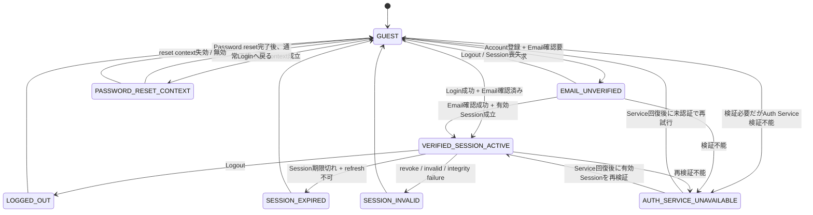

# 060 Authentication / Authorization

## 1. 目的

本書は、**off r39'x in 大阪らへん2027** Webシステムの完成形におけるAuthentication、Session、Supabase Auth IdentityとBusiness Profileの対応、Authorization、Role Assignment、Permission Matrix、自己所有Dataの認可境界、およびAdministrator / Staffの権限制御を定義する。

本書は `SPEC-010 System Overview`、`SPEC-020 Functional Requirements`、`SPEC-030 Domain Model & Business Rules`、`SPEC-040 User Flows`、`SPEC-050 Page / Screen Specification` を変更または弱化せず、そこで定義済みのActor、System Boundary、System of Record、Ownership、Business Rule、User Flow、Page / Routeを、Server-sideで強制可能なAuthentication / Authorization Ruleへ具体化するCanonical Ownerである。

本書がCanonical Ownerとなるのは少なくとも以下である。

- Authentication state model
- Email確認済み / 未確認を含むAccess state
- Session成立、維持、refresh、失効、Logout、再検証の論理仕様
- Browser / Next.js Web / Hono API間のAuthentication responsibility
- Supabase Auth IdentityとBusiness Profileの1:1 resolution / provisioning rule
- Guest / Authenticated User / Customer / Staff / Administratorの認可上の意味
- Staff / AdministratorのRole Assignment論理モデル
- Permission Matrix
- 自己所有DataのAuthorization Rule
- Operation-level authorization evaluation order
- Page / Route protectionに必要な認証・認可Rule
- GuestからAuthentication Gateへ入るContinuation Intentの安全要件
- Authentication / Authorization / Session / Auth Service failure時の論理結果
- Client role申告、Client user ID、UI表示、URL識別子を権限根拠にしないRule
- `FR-*`、`BR-*`、`DI-030-*`、`UF-*`、`PG-*`、`INV-010-*` へのTraceability

本書はAPI Endpoint、HTTP Status、DB Table / Column / Index、Stripe Event処理、QR Token形式、Administrator / Staff個別画面、CSRF / CORS / CSP等のSecurity Control詳細、Audit Event schemaをCanonicalに定義しない。

## 2. 適用範囲

本書は以下へ適用する。

- Account登録
- Email確認
- Login / Logout
- Password reset
- Browser Session
- Next.js WebからHono APIへ渡される認証Context
- Hono APIによるAuthenticated RequestのServer-side identity verification
- Business Profileの解決
- 一般利用者向け本人所有Dataの参照・更新
- Entry / Karaoke / Goods購入開始時の本人認証
- Purchase Status / Mypageの保護
- Entry / Karaoke Check-inおよびGoods HandoffのStaff authorization
- Administrator管理Capabilityのauthorization
- Role Assignment管理
- 認証・認可・Session失効・Auth Service障害時のFail Closed behavior

## 3. 前提・依存仕様

本書は以下を前提とする。

- `SPEC-000`: Canonical Owner、依存関係、Upstream Change Request、正式仕様と実装フェーズの分離
- `SPEC-010`: Actor、System Boundary、Supabase Auth / Next.js Web / Hono API / Business Databaseの責務、System Invariant
- `SPEC-020`: `FR-AUTH-*`, `FR-MYP-*`, `FR-ADM-*`, `FR-STF-*`, `FR-XFN-*` のCanonical Owner
- `SPEC-030`: Business Profile、Ownership、Customer導出、`BR-USR-*`、関連Business Rule、`DI-030-*` のCanonical Owner
- `SPEC-040`: Authentication / Ownership / Check-in / FailureのUser Flow outcomeのCanonical Owner
- `SPEC-050`: 一般利用者向けPage ID、Route、Authentication Requirement、Continuation、Mypage ownership-safe表示境界のCanonical Owner

本書は上流のActor、Business State、Ownership、Page ID、Routeを再定義しない。

## 4. Canonical Authentication / Authorization Terms

| Term | 本書での意味 |
|---|---|
| Auth Identity | Supabase AuthがSystem of Recordとして保持する認証主体 |
| Auth Subject | Server-sideで検証済みAuth Identityを一意に参照する安定した識別子。具体形式は下流仕様へ委譲する |
| Business Profile | Auth Identityと1:1で対応するBusiness Database上の本人・所有者Entity |
| Authentication | Request主体が正規のSupabase Auth IdentityであることをServer-sideで確認すること |
| Authorization | 検証済みIdentityが対象Operation / Dataへアクセス可能かをServer-sideで判定すること |
| Session | Browser利用を継続するためにSupabase Authの認証状態を保持・更新するContext |
| Authentication Gate | Guestまたは有効な認証状態を持たないActorを認証Flowへ遷移させる境界 |
| Continuation Intent | 認証前に開始した論理的利用目的へ安全に戻るための非権威情報 |
| Authorization Principal | 検証済みAuth Identity、一意に解決したBusiness Profile、および当該Requestで有効なOperational Role Assignmentから構成する認可主体 |
| Operational Role | `STAFF` または `ADMINISTRATOR`。Customerは含まない |
| Role Assignment | 検証済みAuth IdentityにOperational Roleを明示的に付与するBusiness Database上の論理的な権限関係 |
| Ownership Path | 本人所有Dataへ、Auth Identity → Business Profile → Domain Owner関係で認可する経路 |
| Operational Permission Path | Staff / AdministratorがRole AssignmentとCapabilityに基づいて業務対象へアクセスする経路 |
| Fail Closed | Identity / Role / Ownershipを安全に検証できない場合にOperationを成立させないこと |

## 5. Rule ID体系

本書のNormative Ruleには以下のIDを使用する。

| Prefix | Category |
|---|---|
| `AR-AUTH-*` | Authentication / account state |
| `AR-SES-*` | Session / server-side verification |
| `AR-ID-*` | Auth Identity / Business Profile |
| `AR-AZ-*` | Authorization evaluation |
| `AR-OWN-*` | Ownership authorization |
| `AR-ROLE-*` | Staff / Administrator Role Assignment |
| `AR-CONT-*` | Authentication Continuation |
| `AR-FAIL-*` | Failure / expiry / outage |

同一Rule IDを別の意味へ再利用しない。

# Part I — Actor / Principal Model

## 6. ActorのAuthentication / Authorization上の意味

### 6.1 Guest

Guestは、当該RequestについてServer-sideで有効なAuth Identityを成立させられないActorである。

Guestは以下を行える。

- `PG-PUB-001〜003` の公開閲覧
- `PG-TKT-001` の閲覧
- `PG-KRK-001〜003` の閲覧
- `PG-GDS-001〜002` の閲覧
- `PG-AUTH-001〜005` のうち各FlowのPreconditionを満たす認証操作

Guestは以下を成立させてはならない。

- Entry / Karaoke / Goods購入開始
- Order作成
- Karaoke Hold確保
- Profile参照・更新
- `PG-XFN-001`
- `PG-MYP-001〜012`
- Owner限定Data参照
- Staff operation
- Administrator operation

**AR-AUTH-001:** Guestに認証必須Business operationを成立させてはならない。

### 6.2 Authenticated User

Authenticated Userは、本書が定義する有効な認証状態を持ち、Hono APIが当該RequestごとにSupabase Auth IdentityをServer-sideで検証可能なActorである。

本人向け業務機能を利用するためには、追加で対応Business Profileを一意に解決できなければならない。

**AR-AUTH-002:** BrowserまたはNext.js Webが「ログイン済み」と表示していることだけではAuthenticated Userとして業務操作を認可しない。

### 6.3 Customer

Customerは `SPEC-030` に従い、Order、Entry Ticket、Karaoke Reservation / Karaoke Ticket、Goods Order Item等のBusiness relationshipから文脈ごとに導出するActor分類である。

CustomerはOperational Roleではない。

**AR-AZ-001:** `Customer` をRole Assignmentとして保存してはならず、Customerであることだけを高権限Operationの認可根拠にしてはならない。

### 6.4 Staff

Staffは、Server-sideで検証済みのAuth Identityに対して有効な `STAFF` Role Assignmentが存在するActorである。

StaffはPermission Matrixで明示的に許可された受付・Handoff CapabilityだけをOperational Permission Pathで実行できる。

**AR-ROLE-001:** Staffであることだけを理由にAdministrator Capabilityまたは無関係Customer Dataへの参照権限を付与してはならない。

### 6.5 Administrator

Administratorは、Server-sideで検証済みのAuth Identityに対して有効な `ADMINISTRATOR` Role Assignmentが存在するActorである。

AdministratorはPermission Matrixで明示的に許可された管理Capabilityを実行できるが、Business Rule / System Invariantを通常操作で回避するsuperuserではない。

**AR-ROLE-002:** Administrator authorization成功はDomain Business Ruleを迂回する根拠にならない。

### 6.6 Roleの重なり

同一Auth Identityが `STAFF` と `ADMINISTRATOR` の両方を明示的に付与されることは許可する。

ただしRole inheritanceは定義しない。

- `ADMINISTRATOR` は自動的に `STAFF` を継承しない。
- Staff Check-in CapabilityをAdministratorにも与える必要がある運用者には、別途 `STAFF` Role Assignmentを付与する。
- Administratorに明示的に許可されたGoods Handoff管理Capabilityは、`STAFF` Roleを持たなくても実行可能である。

**AR-ROLE-003:** Effective operational permissionは、当該Requestで有効なRole AssignmentごとのAllow Capabilityの和集合とし、Permission Matrixに列挙されていないCapabilityはDenyとする。ただしDomain Ruleまたは個別Operation constraintによるDenyが常に優先する。

# Part II — Authentication State

## 7. Authentication State Model

### 7.1 State一覧

| State | 意味 | 認証必須Business operation |
|---|---|---|
| `GUEST` | 有効なSessionがない | Deny |
| `EMAIL_UNVERIFIED` | Auth Identityは存在しSessionが成立し得るが、Supabase Auth上でEmail確認未完了 | Deny |
| `VERIFIED_SESSION_ACTIVE` | Email確認済みIdentityに対する有効Sessionがあり、Server-side検証可能 | 条件付きAllow |
| `SESSION_EXPIRED` | Accessに必要なSession有効期限が切れ、refreshでも有効Sessionを再成立させられない | Deny |
| `SESSION_INVALID` | Sessionが無効、改ざん、revoke相当、または正規Identityへ解決不能 | Deny |
| `LOGGED_OUT` | 現在のBrowser SessionがLogout済み | Guestとして扱う |
| `PASSWORD_RESET_CONTEXT` | Supabase Authの正規Password reset context内 | Password reset completionのみ |
| `AUTH_SERVICE_UNAVAILABLE` | Identity / Sessionの正当性を安全に検証できない | Deny |

`Business Profile` の未解決はAuthentication Stateではなく、後段のPrincipal construction failureとして扱う。

### 7.2 Email確認Rule

**AR-AUTH-003:** Email確認が要求される本システムでは、Email確認未完了Identityへ購入、Mypage、Profile、Owner限定Data、Staff / Administrator operationを許可しない。

**AR-AUTH-004:** `EMAIL_UNVERIFIED` 状態では `PG-AUTH-002` のEmail Verification Flow、Logout、および公開Page閲覧を許可する。認証済み業務Operationを開始した場合はEmail確認完了を要求する。

**AR-AUTH-005:** Email確認成功はSupabase Auth上の現在状態をServer-sideで確認できた場合だけ成立する。Browser上の確認完了表示だけでは成立しない。

### 7.3 Authentication State transition



この図は論理状態遷移であり、Supabase内部Token lifecycleを再定義しない。

# Part III — Session / Server-side Verification

## 8. Session保持方針

### 8.1 Browser

Browserは、Supabase Authに由来するSession materialを、Next.js WebのServer-side authentication integrationから利用可能なCookie-based Session contextとして保持する。

本書はCookie属性の具体値を定義しない。`Secure`、`HttpOnly`、`SameSite`、CSRF対策等の詳細は `SPEC-140` がCanonical Ownerである。

**AR-SES-001:** Business DatabaseへPassword Credential、refresh credential、またはSupabase Auth内部Credential stateを保存してはならない。

**AR-SES-002:** Client-side表示用authentication stateは利便性のため保持してよいが、それをAPI authorizationの権威値にしてはならない。

### 8.2 Next.js Webの責務

Next.js Webは以下を行う。

1. BrowserからSession contextを受け取る。
2. Supabase Authの正規Server-side mechanismによりSessionを復元・必要に応じてrefreshする。
3. 保護PageのServer-side renderingまたはBusiness API呼出し前に、認証状態を確認する。
4. Hono APIへ認証が必要なRequestを送る場合、当該Sessionに対応するSupabase Authの認証情報をServer-to-server経路で伝達する。
5. Clientが任意に付けたuser ID、role、profile IDを本人性または権限としてHono APIへ確定伝達しない。

Next.js WebのPage guardはUX / early rejectionのための境界であり、最終Authorization boundaryではない。

**AR-SES-003:** Next.js Webが認証済みと判定していても、Hono APIは認証必須Requestごとに独立してIdentity verificationを行う。

### 8.3 Hono APIの責務

Hono APIは認証必須Requestごとに以下を行う。

1. Supabase Auth由来の認証情報が存在することを確認する。
2. Supabase Authが提供するServer-side検証方式を用いて、署名、発行元、有効期限その他必要な認証条件を検証する。
3. 検証結果からAuth Subjectを取得する。
4. Email確認が必要なOperationでは確認済み状態を検証する。
5. Business Profileが必要なOperationではAuth SubjectからProfileを一意に解決する。
6. Owner / Role / Permission / Business Ruleを後続順序で評価する。

**AR-SES-004:** Token payloadを単にdecodeしただけ、Clientから受け取ったuser IDだけ、またはNext.js Webが付加した未検証headerだけを本人性根拠にしてはならない。

**AR-SES-005:** Hono APIがIdentityの正当性を安全に確立できない場合はFail Closedとする。

Supabase Authの信頼済み署名鍵等を用いてProvider推奨方式でローカル検証可能な場合、その検証が安全に完了する限り「Auth Service検証不能」には当たらない。必要な信頼情報を取得できず、正当性を確立できない場合は `AUTH_SERVICE_UNAVAILABLE` または `SESSION_INVALID` としてOperationを拒否する。

## 9. Session refresh

**AR-SES-006:** Session refreshの責務はBrowser / Next.js Web側のSupabase Auth integrationが担い、Hono APIはBusiness Requestの途中でClientの代わりに長期Session lifecycleを所有しない。

- 有効なrefresh contextがある場合、Next.js Webは保護Page / API利用を継続するためSessionを更新してよい。
- refresh成功後の新しい認証情報もHono APIでRequestごとに検証する。
- refresh失敗後、古い期限切れSessionを継続利用しない。
- refresh失敗をGuestの本人性証明として利用しない。

Sessionの具体的な有効時間はSupabase Auth設定および `SPEC-140` / `SPEC-180` のSecurity / environment policyに従い、本書では独自固定時間を定義しない。

## 10. Session expiry / invalidation / Logout

### 10.1 Session expiry

**AR-SES-007:** 保護Pageまたは保護ActionでSessionが期限切れかつ安全にrefreshできない場合、保護Dataを返さず、Authentication Gateへ遷移する。

- Mypage / Purchase Status: `PG-AUTH-003` Loginへ安全なContinuation Intent付きで遷移する。
- 購入開始Action: 元の公開販売PageをContinuationとして保持しLoginへ遷移する。
- Staff / Administrator operation: operationを成立させず、運用領域側のAuthentication failureとして扱う。個別画面は `SPEC-130` が定義する。

### 10.2 Session invalid / revoke相当

**AR-SES-008:** Sessionが無効、改ざん、revoke相当、またはIdentityへ解決不能な場合、当該RequestをAuthenticated Userとして継続しない。

無効理由の詳細をClientへ不必要に開示しない。

### 10.3 Logout

**AR-SES-009:** Logoutでは現在BrowserのSession materialを利用不能化し、Supabase Authの正規sign-out / revocation mechanismを適用可能な範囲で実行する。

Logout後:

- ActorはGuestとして扱う。
- `PG-PUB-001` へ遷移する。
- Browser back / cached UIから保護Dataを再利用してはならない。
- 新しい保護Requestは必ず再認証を要求する。
- Order、Ticket、Reservation、Goods購入、Business ProfileのOwnershipを変更・削除・取消しない。

Auth Service障害によりProvider側の失効確認を完了できない場合でも、現在Browserに保持されたSession materialは破棄し、そのBrowserからの保護Requestを継続させない。別Device / 別Sessionの失効範囲はSupabase AuthのSession semanticsに従う。

# Part IV — Account / Credential Flow

## 11. Account登録

### 11.1 Registration

**AR-AUTH-006:** `PG-AUTH-001` のAccount登録はSupabase Authを利用し、Business DatabaseはPassword Credentialを受け取った業務Credential storeとして機能してはならない。

Registration成功時:

1. Supabase Auth Identityが作成される。
2. Email確認が必要なら `EMAIL_UNVERIFIED` として扱う。
3. Business Profile provisioningを第15章に従って開始可能にする。
4. Email確認未完了のまま購入 / Mypageへ進めない。

Registration failure時:

- Authenticated Userとして扱わない。
- Order / Hold / Allocationを認証済み購入者として作成しない。
- retryは新しいBusiness Transactionを発生させない。

## 12. Email確認

**AR-AUTH-007:** `PG-AUTH-002` はSupabase Authの正規Email verification resultだけを確認根拠にする。

| Result | Access result |
|---|---|
| Verification success | 有効Sessionを再評価し、`VERIFIED_SESSION_ACTIVE` へ進める |
| Invalid / expired | 未確認のまま。Protected operation Deny |
| Auth Service unavailable | 確認結果を確定せずretry可能なFailure |
| User canceled | Guest / 未確認状態のまま公開領域へ戻れる |

Email確認失敗・失効は、既存Business Profile、既存Order、Ticket、Reservation、Goods購入のOwnerを変更しない。

## 13. Login

**AR-AUTH-008:** `PG-AUTH-003` Login成功はSupabase AuthがCredentialを検証し、有効Sessionが成立した場合だけとする。

Login成功後:

1. Email確認状態を評価する。
2. 未確認なら `PG-AUTH-002` へ進める。
3. 確認済みならBusiness Profileを解決可能にする。
4. Continuation Intentがあれば第27章に従って安全に復帰する。
5. Continuationがなければ `PG-MYP-001` へ進む。

Credential failure時:

- Login未成立。
- Passwordのどの部分が誤っていたか、Account存在の詳細等を不必要に開示しない。
- Order / Ticket / Reservation等のBusiness effectを発生させない。

## 14. Password reset

### 14.1 Reset request

**AR-AUTH-009:** `PG-AUTH-004` のPassword reset要求はSupabase Authへ委譲する。

Account列挙を助長しないため、Auth Serviceが要求を処理可能な場合、入力Emailが登録済みかどうかを利用者向け結果から不必要に確定できる文言を使用しない。

Auth Service自体が利用不能な場合は、Password resetを完了できないService failureとして扱ってよい。

### 14.2 Reset completion

**AR-AUTH-010:** `PG-AUTH-005` はSupabase Authの正規で有効なreset contextがある場合だけPassword更新を許可する。

- invalid / expired reset contextではPassword更新を成立させない。
- reset完了後は通常Login Flowへ戻る。
- Password reset contextを一般のMypage / purchase authorizationとして使わない。
- Password resetはBusiness Profile、Order Customer、Ticket Owner、Reservation Customer、Goods Customerを変更しない。

# Part V — Auth Identity → Business Profile

## 15. 1:1対応原則

`SPEC-030` のCardinalityを維持する。

```text
Supabase Auth Identity 1 ─── 1 Business Profile
```

**AR-ID-001:** Auth IdentityからBusiness Profileを解決する際は、Server-sideで検証したAuth Subjectだけを起点にする。

**AR-ID-002:** Request body、query、route、Client storageに含まれる任意user ID / profile IDを本人Profileの選択根拠にしてはならない。

**AR-ID-003:** 同一Auth Identityに複数Business Profileを対応させてはならず、1 Business Profileを複数Auth Identityで共有してはならない。

## 16. Business Profile provisioning

### 16.1 Provisioning時点

Business Profileは、Supabase Auth Identity作成後に安定したAuth SubjectをServer-sideで取得できた時点でprovisioningを試行してよい。

遅くとも、Email確認済みIdentityが初めてProfileを必要とする認証済みBusiness operationを実行する前に、一意なBusiness Profileが解決可能でなければならない。

**AR-ID-004:** Profile provisioningは同一Auth Subjectに対してidempotentに実行し、retry / parallel requestで複数Profileを作成してはならない。具体的なDB constraint / transactionは `SPEC-100` が定義する。

### 16.2 Profile未作成

検証済みAuth Identityに対応Profileが0件の場合:

1. 当該IdentityがProfile provisioning対象であることを確認する。
2. Server-sideで同一Auth Subjectに対する安全なcreate-or-resolveを実行する。
3. 成功後に一意Profileを再解決する。
4. 成立できなければProfile依存Business operationを実行しない。
5. retryで別Profileへfallbackしない。

**AR-ID-005:** Profileが未作成であることを理由に、Email一致等で既存の別Profileを自動的に本人へ付け替えてはならない。

### 16.3 Profile重複 / 解決不能

同一Auth Subjectから複数Profileが解決される、Profile関係が破損している、または一意性を確立できない場合:

- Fail Closedとする。
- 購入、Profile更新、Mypage、Staff / AdministratorのBusiness operationを成立させない。
- どれか1件を便宜的に選ばない。
- Clientに別Profileの存在や内容を返さない。
- Reliability / recovery対象として追跡可能にする。具体Runbookは `SPEC-150`。
- 既存確定Order / Ticket / Reservation / Goodsを削除・Owner変更しない。

**AR-ID-006:** Business Profile resolution failureはOwnershipを再割当する理由にならない。

## 17. Role変更・Credential変更とOwnership

**AR-ID-007:** 以下は既存Business ownershipを変更しない。

- Login / Logout
- Session refresh
- Session expiry
- Password reset
- Email確認
- `STAFF` Role付与 / revoke
- `ADMINISTRATOR` Role付与 / revoke

Order Customer、Entry Ticket Owner、Karaoke Reservation / Ticket Customer、Goods Order Item Customerは `SPEC-030` のOwnership Ruleに従い保持する。

# Part VI — Authorization Model

## 18. Authorization Principal construction

Protected operationでAuthorization Principalを構成する場合、以下を順に確立する。

1. Supabase Auth IdentityをServer-sideで検証する。
2. 必要なEmail確認状態を満たす。
3. Business Profileを必要とするOperationではProfileを一意に解決する。
4. Operational operationでは有効Role AssignmentをBusiness Databaseから解決する。
5. 対象Domain DataとOwner / Permissionの関係を評価する。

**AR-AZ-002:** Clientから送信されたrole、permission、customer flag、profile IDをPrincipalへ直接採用してはならない。

## 19. Authorization判定順序

全Operationは論理的に次の順序で判定可能でなければならない。

1. **Public / Protected判定**  
   対象Operationがpublicかauthentication requiredかを決定する。
2. **Identity verification**  
   ProtectedならSupabase Auth IdentityをServer-sideで検証する。
3. **Business Profile resolution**  
   Profileを必要とする場合、検証済みIdentityから一意Profileを解決する。
4. **Ownership authorization**  
   Owner限定DataならProfileと対象Domain DataのOwner関係を検証する。
5. **Operational permission authorization**  
   Staff / Administrator operationなら有効Role AssignmentとCapabilityを検証する。
6. **Domain Business Rule**  
   現在State、販売条件、Ticket state、Reservation time、Handoff state等のBusiness Ruleを検証する。
7. **Operation execution**  
   すべて成立した場合だけBusiness effectを実行する。

Owner限定一般利用者OperationではStep 5は不要である。Staff / Administratorの他者Data操作ではStep 4の「本人Ownerであること」は要求せず、Step 5のOperational Permission Pathへ進む。ただし対象DataのCustomer / Ownerを任意に差し替えることはできない。

**AR-AZ-003:** Authentication successだけでAuthorization successとしてはならない。

**AR-AZ-004:** Authorization successだけでDomain Business Ruleを迂回してはならない。

**AR-AZ-005:** Route guard / Navigation visibility / Button visibilityはStep 1〜6の代替にならない。

# Part VII — Ownership Authorization

## 20. Ownership共通Rule

**AR-OWN-001:** Owner限定Dataの参照・更新は、Server-sideで検証したAuth Identity → Business Profile → Domain Owner関係で認可する。

**AR-OWN-002:** `{order_ref}`、`{ticket_ref}`、`{reservation_ref}`、`{goods_item_ref}` 等を知っていること自体はAuthorization根拠ではない。

**AR-OWN-003:** Owner不一致の場合、対象DataをClientへ返さない。Clientへ返してからUIでHideする実装を禁止する。

**AR-OWN-004:** Ownership failure結果は、対象の存在、Owner、state、購入内容、金額、QR、個人情報を不必要に開示してはならない。

**AR-OWN-005:** Ownership failureでBusiness Databaseの対象stateを変更してはならない。

## 21. Domain別Ownership Rule

| Domain Data | 一般利用者の正規Ownership path | Owner不一致時 |
|---|---|---|
| Business Profile | Verified Auth Subject → 1:1 Business Profile | Dataを返さず更新しない |
| Order | Verified Profile == Order Customer | Order detail / state / purchase contentを返さない |
| Entry Ticket | Verified Profile == Ticket Owner。Ownerは対応Order Customerと一致 | Ticket / QR / stateを返さない |
| Karaoke Reservation | Verified Profile == Reservation Customer | Reservation日時 / stateを返さない |
| Karaoke Ticket | Verified Profile == Ticket Owner == Reservation Customer | Ticket / QRを返さない |
| Goods Order Item | Verified Profile == Goods Order Item Customer == Order Customer | 商品明細 / Handoff stateを返さない |
| Goods HandoffのCustomer参照 | Verified Profile == 対応Goods Order Item Customer | Handoff状態を返さない |

### 21.1 Business Profile

**AR-OWN-006:** Profile自身の参照・更新では、Client指定profile referenceを選択基準にせず、Auth SubjectからProfileを直接解決する。

### 21.2 Order / Ticket / Reservation / Goods

**AR-OWN-007:** 詳細Page用ReferenceをRequestに含む場合でも、対象を取得するServer-side query / authorization処理はOwner relationを同時に制約できる設計とし、他者Data payloadを一旦取得してClientへ渡す設計にしない。

### 21.3 Operational accessとの分離

**AR-OWN-008:** Staff / AdministratorがOperational Permission PathでCustomer Dataへアクセスする場合、それをCustomer ownershipとして偽装しない。

Operational accessは:

- 有効Role Assignment
- 明示Capability
- Operation scope
- Domain Rule

の組合せで成立する。

# Part VIII — Operational Role Assignment

## 22. Role Assignment model

Operational Roleは次の2種類だけとする。

- `STAFF`
- `ADMINISTRATOR`

Customerをこの一覧へ追加しない。

### 22.1 Logical state

Role Assignmentは少なくとも次の論理状態を区別する。

- `ACTIVE`: Authorizationに使用可能
- `REVOKED`: Authorizationに使用不可。履歴として保持してよい

物理Table / Column / Constraintは `SPEC-100` が定義する。

**AR-ROLE-004:** Operational RoleはBusiness Database側のServer-side authorityから解決し、Supabase Auth user metadata、Client claim、localStorage、query parameter等を権威値にしない。

**AR-ROLE-005:** Privileged operationごとに現在有効なRole AssignmentをServer-sideで評価する。古いUI stateまたはLogin時に取得したrole表示だけを権限根拠にしない。

### 22.2 Role付与対象

Role Assignment対象は:

- Supabase Authで正規に識別可能なAuth Identityであること
- Business Profileが1:1で一意に解決可能であること

を要求する。

### 22.3 Role付与 / revoke

**AR-ROLE-006:** Role Assignmentの通常管理は、有効な `ADMINISTRATOR` Roleを持ち、`role_assignment.manage` Capabilityを認可されたActorだけが実行できる。

**AR-ROLE-007:** Guest、Authenticated User、Customer、Staffは自分または他者へOperational Roleを付与・変更・revokeできない。

**AR-ROLE-008:** Administratorも通常のRole管理Operationから自身の `ADMINISTRATOR` Assignmentを新規作成・変更・revokeしてはならない。自己昇格・自己権限書換えを認可経路にしない。

**AR-ROLE-009:** 通常操作で最後の有効Administratorを失わせるRole変更を成立させてはならない。初期Administrator bootstrapおよび緊急復旧は通常の利用者向けRole管理とは分離し、`SPEC-150` / `SPEC-180` の運用境界に従う。

### 22.4 Role changeの反映

**AR-ROLE-010:** Role revokeは次のprivileged RequestのAuthorization評価から効力を持つ。既存Session自体をCustomer ownershipとともに削除する必要はないが、revoke済みRoleをSession内の古いrole claimから継続使用してはならない。

# Part IX — Permission Matrix

## 23. Capability定義

本書では以下のCapabilityをCanonicalに定義する。

| Capability | 意味 |
|---|---|
| `public.read` | 公開Event / Announcement / sales情報を閲覧 |
| `profile.self.read` | 自身のBusiness Profile参照 |
| `profile.self.update` | 自身の更新可能Profile項目を更新 |
| `orders.self.read` | 自身のOrder参照 |
| `tickets.self.read` | 自身のEntry Ticket参照 / QR到達 |
| `karaoke.self.read` | 自身のReservation / Karaoke Ticket参照 / QR到達 |
| `goods.self.read` | 自身のGoods購入 / Handoff参照 |
| `purchase.start` | Entry / Karaoke / Goodsの購入開始 |
| `entry_checkin.execute` | Entry QR検証と通常Check-in実行 |
| `karaoke_checkin.execute` | Karaoke QR検証と通常Check-in実行 |
| `goods_handoff.execute` | Goods Handoff対象確認と通常完了 |
| `orders.manage.read` | Order運用一覧 / 詳細参照 |
| `tickets.manage.read` | Entry Ticket運用参照 |
| `karaoke_slots.manage` | Karaoke Slot生成 / 許可属性編集 / 販売停止・再開 |
| `karaoke_reservations.manage.read` | Karaoke Reservation運用参照 |
| `goods_inventory.manage` | Goods公開情報 / 販売状態 / Inventory管理 |
| `goods_handoff.manage` | AdministratorとしてGoods Handoff状態を確認・許可された更新を実行 |
| `public_content.manage` | Event / FAQ / Announcement等の運営公開情報管理 |
| `role_assignment.manage` | Staff / Administrator Role Assignment管理 |
| `recovery.review` | Recovery / consistency review対象の参照 |
| `recovery.exception.execute` | `SPEC-150` 等で明示された特定Recovery operationの実行。汎用Invariant bypassではない |

## 24. Permission Matrix

`Allow (self)` はOwnership Path、`Allow (role)` はOperational Permission Pathを意味する。

| Capability | Guest | Authenticated User | Customer | Staff Role | Administrator Role |
|---|---|---|---|---|---|
| `public.read` | Allow | Allow | Allow | Allow | Allow |
| `profile.self.read` | Deny | Allow (self) | Allow (self) | Allow (self) | Allow (self) |
| `profile.self.update` | Deny | Allow (self) | Allow (self) | Allow (self) | Allow (self) |
| `orders.self.read` | Deny | Allow (self) | Allow (self) | Allow (self) | Allow (self) |
| `tickets.self.read` | Deny | Allow (self) | Allow (self) | Allow (self) | Allow (self) |
| `karaoke.self.read` | Deny | Allow (self) | Allow (self) | Allow (self) | Allow (self) |
| `goods.self.read` | Deny | Allow (self) | Allow (self) | Allow (self) | Allow (self) |
| `purchase.start` | Deny | Allow | Allow | Allow as authenticated user | Allow as authenticated user |
| `entry_checkin.execute` | Deny | Deny | Deny | Allow (role) | Deny unless also `STAFF` |
| `karaoke_checkin.execute` | Deny | Deny | Deny | Allow (role) | Deny unless also `STAFF` |
| `goods_handoff.execute` | Deny | Deny | Deny | Allow (role) | Deny unless also `STAFF` |
| `orders.manage.read` | Deny | Deny | Deny | Deny | Allow (role) |
| `tickets.manage.read` | Deny | Deny | Deny | Deny | Allow (role) |
| `karaoke_slots.manage` | Deny | Deny | Deny | Deny | Allow (role) |
| `karaoke_reservations.manage.read` | Deny | Deny | Deny | Deny | Allow (role) |
| `goods_inventory.manage` | Deny | Deny | Deny | Deny | Allow (role) |
| `goods_handoff.manage` | Deny | Deny | Deny | Deny | Allow (role) |
| `public_content.manage` | Deny | Deny | Deny | Deny | Allow (role) |
| `role_assignment.manage` | Deny | Deny | Deny | Deny | Allow (role), subject to AR-ROLE-008〜009 |
| `recovery.review` | Deny | Deny | Deny | Deny | Allow (role) |
| `recovery.exception.execute` | Deny | Deny | Deny | Deny | Conditional: only explicitly defined recovery operation |

### 24.1 Matrix解釈

**AR-ROLE-011:** Staff / Administratorも一人のAuthenticated Userとして自分自身のBusiness DataをOwnership Pathで利用できる。Operational Roleが自己所有権を上書きするわけではない。

**AR-ROLE-012:** `ADMINISTRATOR` は `STAFF` を継承しない。Check-inを行うAdministratorは `STAFF` Roleも必要とする。

**AR-ROLE-013:** Administratorの `goods_handoff.manage` は `FR-ADM-017` に対応する独立管理Capabilityであり、Staffの `goods_handoff.execute` と同一権限経路ではない。

**AR-ROLE-014:** `recovery.exception.execute` はgeneric superuser bypassを意味しない。実行可能なRecovery operationは `SPEC-150` 等で対象、Precondition、Invariant保持Ruleが明示されたものに限る。

# Part X — Staff Customer Data Boundary

## 25. Staffの最小参照範囲

Staffは受付対象Operationのために必要な情報だけを参照できる。

### 25.1 Entry Check-in

`entry_checkin.execute` によりStaffへ返してよい論理情報は、少なくとも以下の受付判断に必要な範囲へ限定する。

- Entry Ticketとして解決できたか
- Ticket現在state
- 受付可能 / 不可結果
- already used等の受付結果
- 当日運用で本人照合が本当に必要な場合に `SPEC-130` が定義する最小情報

Staff Roleだけを根拠にCustomerの全Order履歴、他Ticket、Goods、Karaoke履歴、Profile編集情報を返さない。

### 25.2 Karaoke Check-in

`karaoke_checkin.execute` では以下を許可する。

- Karaoke Ticket / Reservationの受付可否
- Reservation日時
- Ticket / Reservation現在state
- already used / time condition failure等の受付結果
- `SPEC-130` が定義する受付に必要な最小Customer情報

無関係なOrder / Entry / Goods履歴は返さない。

### 25.3 Goods Handoff

`goods_handoff.execute` では以下を許可する。

- 対象Goods Order Item
- Goods名称 / 数量
- `FULFILLABLE` 等の受け渡し可否に必要なstate
- Goods Handoff `PENDING` / `COMPLETED` / `VOID`
- 受け渡し完了結果
- `SPEC-130` が定義する本人照合に必要な最小情報

**AR-ROLE-015:** Staff operationは、対象受付・Handoffを起点に必要情報へ到達する。Staffが任意Customerを指定してCustomer全履歴を検索するCapabilityを本Roleへ付与しない。

# Part XI — Page / Route Protection

## 26. Public Page

以下は閲覧自体をAuthentication requiredにしない。

- `PG-PUB-001〜003`
- `PG-TKT-001`
- `PG-KRK-001〜003`
- `PG-GDS-001〜002`
- `PG-AUTH-001〜005` の各認証Flow上許可された状態

ただし:

- `PG-TKT-001` の購入開始
- `PG-KRK-003` の購入開始
- `PG-GDS-002` の購入開始

は `purchase.start` を必要とする。

**AR-AZ-006:** Public Pageの閲覧可能性を、同Page内のprotected Actionまでpublicである根拠にしてはならない。

## 27. Authentication required Page

以下は有効な `VERIFIED_SESSION_ACTIVE` を必要とする。

- `PG-XFN-001`
- `PG-MYP-001〜012`

さらにBusiness Profileを一意に解決できなければならない。

### 27.1 未認証 / Sessionなし

- protected payloadを返さない。
- `PG-AUTH-003` へ安全なContinuation Intent付きで遷移する。
- 他者または対象Dataの内容を事前表示しない。

### 27.2 Session期限切れ / invalid

- protected payloadを返さない。
- Session refreshが安全に成功しない限りLoginを要求する。
- stale client cacheを正規Dataとして再表示しない。

### 27.3 Email未確認

- `PG-AUTH-002` へEmail確認完了を要求する状態として遷移する。
- Profile / Order / Ticket / Reservation / Goodsのprotected payloadを返さない。

### 27.4 Business Profile未解決

- 他Profileへfallbackしない。
- protected operationを停止する。
- Authenticated Userであっても購入 / Mypageを成立させない。
- 認証失敗とは区別したaccount/business-profile resolution failureとして扱う。

### 27.5 Ownership failure

Owner限定detailでOwner不一致なら:

- `PG-XFN-003` 相当のAccess Denied / Ownership Failure
- 対象Dataを表示しない
- 対象Referenceを認可済みとして引き継がない

一覧Pageは最初から本人所有Dataだけをquery対象とし、他者Dataを取得してfilterしない。

## 28. Page別保護結果

| Page / Action | Guest / no session | Email unverified | Session expired / invalid | Ownership failure |
|---|---|---|---|---|
| `PG-PUB-001〜003` | 閲覧Allow | 閲覧Allow | 閲覧Allow | N/A |
| `PG-TKT-001` 閲覧 | Allow | Allow | Allow | N/A |
| `PG-TKT-001` 購入開始 | Login | Email確認 | Login | N/A |
| `PG-KRK-001〜003` 閲覧 | Allow | Allow | Allow | N/A |
| `PG-KRK-003` 購入開始 | Login | Email確認 | Login | N/A |
| `PG-GDS-001〜002` 閲覧 | Allow | Allow | Allow | N/A |
| `PG-GDS-002` 購入開始 | Login | Email確認 | Login | N/A |
| `PG-AUTH-001` | Allow | Allow | Guest向けとしてAllow | N/A |
| `PG-AUTH-002` | Verification contextに応じAllow | Allow | Verification contextに応じAllow | N/A |
| `PG-AUTH-003` | Allow | Allow | Allow | N/A |
| `PG-AUTH-004` | Allow | Allow | Allow | N/A |
| `PG-AUTH-005` | valid reset context時のみ | valid reset context時のみ | valid reset context時のみ | N/A |
| `PG-XFN-001` | Login + continuation | Email確認 | Login + continuation | `PG-XFN-003` |
| `PG-MYP-001〜003` | Login + continuation | Email確認 | Login + continuation | 一覧は本人Dataのみ。Profile解決不能はFailure |
| `PG-MYP-004` | Login + continuation | Email確認 | Login + continuation | `PG-XFN-003` |
| `PG-MYP-005` | Login + continuation | Email確認 | Login + continuation | 一覧は本人Dataのみ |
| `PG-MYP-006〜007` | Login + continuation | Email確認 | Login + continuation | `PG-XFN-003` |
| `PG-MYP-008` | Login + continuation | Email確認 | Login + continuation | 一覧は本人Dataのみ |
| `PG-MYP-009〜010` | Login + continuation | Email確認 | Login + continuation | `PG-XFN-003` |
| `PG-MYP-011` | Login + continuation | Email確認 | Login + continuation | 一覧は本人Dataのみ |
| `PG-MYP-012` | Login + continuation | Email確認 | Login + continuation | `PG-XFN-003` |

**AR-AZ-007:** Page guardを通過した後のAPI callでも、対象Operationに必要なAuthentication / Ownership / Role / Business RuleをHono APIで再評価する。

# Part XII — Authentication Continuation

## 29. Continuation Intent

### 29.1 保持する情報

Continuation Intentは権威情報ではなく、認証成功後の論理的復帰先を表す。

許可例:

- Entry Ticket購入 → `PG-TKT-001`
- Karaoke Slot購入 → `PG-KRK-003` の公開参照
- Goods購入 → `PG-GDS-002` の公開参照
- Mypage → `PG-MYP-001`
- 自身のPurchase Status / Mypage detail → 認証後にOwner再検証する内部Route intent

**AR-CONT-001:** Continuationは、Serverが認識するinternal route keyと必要最小限の公開Referenceから構成し、任意の外部URLを復帰先として受け入れない。

### 29.2 禁止する権威情報

Continuationへ以下を権威値として保存・復元してはならない。

- price / total
- payment success
- role / permission
- user ID / profile owner
- Owner関係
- QR Token
- Secret
- 有効期限切れHoldを再有効化する情報
- inventory / slot availabilityの確定値
- Purchase Limit判定結果

**AR-CONT-002:** ContinuationはAuthorization bypassに使用してはならない。

### 29.3 Integrity / validation

ContinuationをClient経由で保持する場合、利用時に必ず:

1. internal route allowlistへ一致すること
2. scheme / hostを外部へ変更できないこと
3. Referenceが許可形式であること
4. 認証後に対象Page / DataのAuthorizationを再評価すること

を要求する。

具体的な改ざん防止方式は `SPEC-140` が定義する。

**AR-CONT-003:** Open redirectを許可しない。

### 29.4 認証後の再評価

認証後に購入Flowへ戻る場合:

- Sales Period
- Sale Control
- capacity / inventory
- Karaoke Slot state
- Purchase Limit
- 現在価格
- Business Profile
- 対象Owner要件

を現在のServer-side stateで再評価する。

**AR-CONT-004:** 認証前の購入可能表示は、認証後の購入保証ではない。

Login / Registrationを中止した場合はGuestとして元の公開PageまたはEvent Homeへ戻れる。

# Part XIII — Failure / Expiry / Outage

## 30. Failure分類

### 30.1 Failure Matrix

| Failure | Operation成立 | Flow / Page結果 | Retry | 既存Business Data | 情報開示 |
|---|---|---|---|---|---|
| Credential failure | Deny | `PG-AUTH-003` に留まる | 再入力 / reset可 | 変更なし | どのCredential要素が一致したかを開示しない |
| Email未確認 | Protected op Deny | `PG-AUTH-002` | 確認後retry | 変更なし | protected dataを返さない |
| Sessionなし | Protected op Deny | Login + continuation | Login可 | 変更なし | protected dataを返さない |
| Session期限切れ | refresh不可ならDeny | Login + continuation | 再Login可 | 変更なし | protected dataを返さない |
| Session invalid / revoked | Deny | Login | 再Login可 | 変更なし | invalid詳細を最小化 |
| Business Profile未作成 | provisioning成功までDeny | profile resolution failure | provisioning retry可 | 既存Data変更なし | 他Profile情報を返さない |
| Business Profile重複 / 解決不能 | Deny | account/business integrity failure | recovery後retry | 既存Data保持 | 他Profile情報を返さない |
| Ownership failure | Deny | `PG-XFN-003` | 同じ不正refでは不可 | 対象state変更なし | 対象存在 / owner / stateを最小化 |
| Permission不足 | Deny | operation denied | Roleが正規変更された後のみ | 対象state変更なし | 不必要なCapability内部情報を返さない |
| Staff / Administrator Roleなし | Privileged op Deny | operation denied | 正規Role付与後のみ | 対象state変更なし | role管理情報を漏らさない |
| Auth Service一時障害 | 新しいProtected op Deny | Service unavailable | Service回復後retry | `CONFIRMED` 等を削除・取消しない | 未検証Identityを通さない |
| Password reset context invalid / expired | Password更新Deny | `PG-AUTH-005` failure | 新しいreset開始可 | Ownership変更なし | context内部詳細を漏らさない |

## 31. Auth Service outage

**AR-FAIL-001:** Supabase Authに依存するIdentity verificationが安全に完了できない場合、未検証IdentityをAuthenticated Userとして扱わない。

**AR-FAIL-002:** Auth Service障害中は、新しい購入、Profile更新、Mypage protected read、Staff Check-in、Goods Handoff、Administrator operationを、認証を省略して成立させてはならない。

**AR-FAIL-003:** Auth Service障害を理由に、Business Database上で既に `CONFIRMED` 等として確定済みのOrder / Ticket / Reservation / Goods購入を削除・取消・Owner変更してはならない。

**AR-FAIL-004:** Service回復後のretryは現在のAuthentication / Authorization / Domain stateを再評価し、確定済みBusiness Transactionを重複実行しない。

## 32. Authentication failureとAuthorization failureの区別

- Authentication failure: 正規Identityを成立させられない。
- Authorization failure: Identityは成立しているがOwner / Role / Permissionを満たさない。
- Business Rule failure: IdentityとAuthorizationは成立するが、Domain stateがOperationを許さない。

例:

- Expired Session → Authentication failure
- 他者Order reference → Ownership authorization failure
- StaffがAdmin設定変更 → Permission failure
- 正規Staffが `USED` TicketをCheck-in → Business Rule failure

**AR-FAIL-005:** 上記3分類を内部論理で混同せず、Business Rule failureをRole付与で迂回できる設計にしない。

# Part XIV — Security Boundary

## 33. Authentication / Authorizationに直接必要なSecurity原則

### 33.1 Credential

**AR-AUTH-011:** Password CredentialはSupabase Authへ委譲し、Business Databaseへ保存しない。

### 33.2 Server-only Secret

**AR-AZ-008:** Supabase service credentialその他Server-only SecretをClientへ露出しない。詳細Secret管理は `SPEC-140` / `SPEC-180`。

### 33.3 Client values

**AR-AZ-009:** 以下をClientから受け取っても権威値として採用しない。

- user ID
- Business Profile ID
- Customer flag
- role
- permission
- owner
- payment result
- price
- authorization result

### 33.4 UI

**AR-AZ-010:** Navigation、Button、Admin link、Staff linkをHiddenにすることはAuthorizationではない。

### 33.5 Session / role / continuation

**AR-AZ-011:** 改ざん可能なClient値に含まれるSession state、role、permission、Continuation resultを、そのまま権威あるAuthorization resultとして使用しない。

### 33.6 Failure information

**AR-FAIL-006:** Authentication / Authorization failureでは、Account存在、他者Resource存在、Owner、内部Role構造、Credential一致箇所等のsecurity-sensitive情報を必要最小限より多く開示しない。

具体的なCSRF、CORS、CSP、Cookie属性、rate limit、Credential policy、Secret rotation等は `SPEC-140` がCanonical Ownerである。

# Part XV — Domain Operation Authorization

## 34. Purchase operation

Entry / Karaoke / Goods購入開始には以下をすべて要求する。

1. `VERIFIED_SESSION_ACTIVE`
2. 一意Business Profile
3. `purchase.start`
4. Server-sideで現在のSales / capacity / inventory / slot / Purchase Limit Rule成立
5. Order Customer = Server-sideで解決したBusiness Profile

**AR-AZ-012:** Customer / OwnerをRequest bodyで選択してOrderを作成してはならない。

Trace: `BR-ORD-002`, `BR-SAL-005〜007`, `BR-TKT-*`, `BR-KRK-*`, `BR-GDS-*`, `DI-030-010〜012`.

## 35. Entry Check-in

Staff operationは:

1. verified Identity
2. active `STAFF`
3. `entry_checkin.execute`
4. QR / Ticket type解決
5. `BR-CHK-*` / `BR-TKT-*` の受付Rule

を要求する。

**AR-AZ-013:** Staff authorization successだけで `USED` / `CANCELED` / `EXPIRED` Ticketを通常Check-inへ進めない。

## 36. Karaoke Check-in

Staff operationは:

1. verified Identity
2. active `STAFF`
3. `karaoke_checkin.execute`
4. Karaoke Ticket / Reservationの正規解決
5. Reservation time / Ticket state / `BR-CHK-*` / `BR-KRK-*`

を要求する。

**AR-AZ-014:** 通常Staff Capabilityへ、予約時間外等の例外受付権限を暗黙に含めない。

## 37. Goods Handoff

Staff path:

- active `STAFF`
- `goods_handoff.execute`
- 対象Goods Order Item / Handoff stateの現在Rule成立

Administrator path:

- active `ADMINISTRATOR`
- `goods_handoff.manage`
- 対象Domain Rule成立

**AR-AZ-015:** `COMPLETED` HandoffをRoleの強さだけで再度通常完了へ進めない。

## 38. Administrator management

Administrator operationは:

1. verified Identity
2. active `ADMINISTRATOR`
3. 対象Capability
4. 対象Domain Business Rule
5. System Invariant

を要求する。

**AR-AZ-016:** Administratorが管理UIへ到達できること、またはAdministrator Roleがあることだけで、現在Business Ruleに違反する変更を確定してはならない。

# Part XVI — Traceability

## 39. Rule → Upstream Traceability

| 本書Rule group | 主な上流Trace |
|---|---|
| `AR-AUTH-001〜011` | `FR-PUB-012`, `FR-AUTH-001〜014`, `UF-PUB-002`, `UF-AUTH-001〜007`, `PG-AUTH-001〜005`, `INV-010-08` |
| `AR-SES-001〜009` | `FR-AUTH-004〜006`, `FR-AUTH-009`, `FR-AUTH-014`, `FR-XFN-001〜002`, `FR-XFN-020`, `FR-XFN-032〜033`, `UF-AUTH-003〜004`, `UF-AUTH-007`, `PG-AUTH-003`, `PG-MYP-*`, `INV-010-01`, `INV-010-08`, `INV-010-10` |
| `AR-ID-001〜007` | `FR-AUTH-009〜013`, `FR-MYP-001〜012`, `FR-XFN-002〜003`, `FR-XFN-017`, `BR-USR-001〜006`, `DI-030-010`, `UF-AUTH-001`, `UF-AUTH-006`, `UF-MYP-001〜002`, `PG-MYP-002`, `INV-010-08` |
| `AR-AZ-001〜016` | `FR-XFN-001〜004`, `FR-XFN-016〜017`, `FR-XFN-025`, `FR-ADM-001`, `FR-ADM-019〜020`, `FR-STF-001`, `BR-USR-002`, `BR-USR-007`, `BR-ORD-002`, `BR-CHK-*`, `DI-030-010`, `UF-MYP-002`, `UF-CHK-001〜002`, `PG-XFN-003`, `INV-010-05`, `INV-010-08` |
| `AR-OWN-001〜008` | `FR-AUTH-010〜012`, `FR-TKT-023`, `FR-MYP-001〜012`, `FR-XFN-003`, `FR-XFN-017`, `BR-USR-001`, `BR-USR-003〜007`, `BR-TKT-008`, `BR-KRK-015`, `BR-KRK-021`, `BR-GDS-008`, `DI-030-010`, `UF-MYP-001〜002`, `PG-MYP-001〜012`, `PG-XFN-001`, `PG-XFN-003`, `INV-010-08` |
| `AR-ROLE-001〜015` | `FR-ADM-001〜022`, `FR-STF-001〜016`, `FR-XFN-004`, `FR-XFN-025`, `BR-USR-007`, `BR-CHK-007〜008`, `DI-030-010`, `UF-CHK-001〜002`, `PG-XFN-003`, `INV-010-08` |
| `AR-CONT-001〜004` | `FR-PUB-012`, `FR-XFN-001〜003`, `FR-XFN-016`, `FR-XFN-026`, `UF-PUB-002`, `UF-AUTH-001〜003`, `PG-AUTH-001`, `PG-AUTH-003`, `PG-TKT-001`, `PG-KRK-003`, `PG-GDS-002`, `PG-MYP-001`, `INV-010-08〜10` |
| `AR-FAIL-001〜006` | `FR-AUTH-005`, `FR-AUTH-014`, `FR-XFN-020`, `FR-XFN-025`, `FR-XFN-032`, `BR-ORD-010`, `DI-030-001`, `DI-030-010`, `DI-030-012`, `UF-AUTH-007`, `UF-MYP-002`, `UF-XFN-004`, `PG-XFN-003`, `INV-010-01`, `INV-010-08`, `INV-010-10` |

## 40. Page / Flow / Rule Traceability

| Page / Operation | Flow | Authentication / Authorization Rule |
|---|---|---|
| `PG-AUTH-001` Account Registration | `UF-AUTH-001`, `UF-PUB-002` | `AR-AUTH-006`, `AR-ID-004〜005`, `AR-CONT-001〜004` |
| `PG-AUTH-002` Email Verification | `UF-AUTH-002`, `UF-AUTH-007` | `AR-AUTH-003〜005`, `AR-AUTH-007`, `AR-FAIL-001〜004` |
| `PG-AUTH-003` Login | `UF-AUTH-003`, `UF-PUB-002`, `UF-AUTH-007` | `AR-AUTH-008`, `AR-SES-*`, `AR-CONT-*` |
| Logout action | `UF-AUTH-004` | `AR-SES-009`, `AR-ID-007` |
| `PG-AUTH-004〜005` Password reset | `UF-AUTH-005`, `UF-AUTH-007` | `AR-AUTH-009〜010`, `AR-ID-007` |
| Entry purchase start | `UF-PUB-002`, `UF-TKT-001` | `AR-AUTH-003`, `AR-SES-003〜005`, `AR-ID-*`, `AR-AZ-012`, `AR-CONT-*` |
| Karaoke purchase start | `UF-PUB-002`, `UF-KRK-002` | `AR-AUTH-003`, `AR-SES-003〜005`, `AR-ID-*`, `AR-AZ-012`, `AR-CONT-*` |
| Goods purchase start | `UF-PUB-002`, `UF-GDS-001` | `AR-AUTH-003`, `AR-SES-003〜005`, `AR-ID-*`, `AR-AZ-012`, `AR-CONT-*` |
| `PG-XFN-001` Purchase Status | `UF-XFN-001`, purchase flows | `AR-SES-*`, `AR-OWN-001〜005`, `AR-AZ-007` |
| `PG-MYP-001〜012` | `UF-MYP-001〜002` | `AR-SES-*`, `AR-ID-*`, `AR-OWN-*`, `AR-AZ-007` |
| Entry Staff Check-in | `UF-CHK-001` | `AR-ROLE-*`, `AR-AZ-013` |
| Karaoke Staff Check-in | `UF-CHK-002` | `AR-ROLE-*`, `AR-AZ-014` |
| Goods Handoff | `UF-GDS-002` | `AR-ROLE-*`, `AR-AZ-015` |
| Administrator management | Admin flows / `SPEC-130` | `AR-ROLE-*`, `AR-AZ-016` |
| `PG-XFN-003` Ownership failure | `UF-MYP-002` | `AR-OWN-003〜005`, `AR-FAIL-006` |

## 41. Functional Requirement Coverage

### 41.1 Public / Auth

- `FR-PUB-012` → Authentication Gate、`AR-AUTH-001`, `AR-CONT-*`
- `FR-AUTH-001〜003` → Account registration / Email verification、`AR-AUTH-003〜007`
- `FR-AUTH-004〜006` → Login / Session / Logout、`AR-AUTH-008`, `AR-SES-*`
- `FR-AUTH-007〜008` → Password reset、`AR-AUTH-009〜011`
- `FR-AUTH-009〜012` → Hono identity verification、Profile resolution、Ownership
- `FR-AUTH-013` → `AR-AZ-001`
- `FR-AUTH-014` → `AR-FAIL-001〜004`

### 41.2 Mypage

- `FR-MYP-001〜012` → `AR-SES-*`, `AR-ID-*`, `AR-OWN-*`, `AR-AZ-007`

### 41.3 Administrator / Staff

- `FR-ADM-001`, `FR-ADM-019〜020` → `AR-ROLE-*`, `AR-AZ-016`
- `FR-ADM-002〜018` → Permission MatrixのAdministrator management capabilities
- `FR-ADM-021` → `recovery.review`
- `FR-ADM-022` → 本書はActor / capability境界のみ。Audit schemaは `SPEC-160`
- `FR-STF-001〜016` → `AR-ROLE-001`, `AR-ROLE-012`, `AR-ROLE-015`, `AR-AZ-013〜015`

### 41.4 Cross-functional

- `FR-XFN-001〜004` → `AR-AUTH-001〜002`, `AR-SES-003〜005`, `AR-AZ-*`
- `FR-XFN-016〜017` → `AR-AZ-009`, `AR-OWN-*`, `AR-CONT-002`
- `FR-XFN-020` → `AR-FAIL-001〜004`
- `FR-XFN-025` → Permission denial / `AR-FAIL-005〜006`
- `FR-XFN-026` → `AR-CONT-004`, `AR-AZ-004`
- `FR-XFN-033` → `AR-AZ-008`

## 42. Business Rule / Invariant Coverage

- `BR-USR-001` → `AR-ID-001〜006`
- `BR-USR-002` → `AR-AZ-001`
- `BR-USR-003〜006` → `AR-ID-007`, `AR-OWN-*`
- `BR-USR-007` → `AR-ROLE-*`, `AR-AZ-013〜016`
- `BR-ORD-002` → `AR-AZ-012`
- `BR-TKT-008`, `BR-KRK-015`, `BR-KRK-021`, `BR-GDS-008` → Domain ownership matrix
- `BR-CHK-001〜008` → `AR-AZ-013〜014`, Staff data boundary
- `BR-GDS-010〜013` → `AR-AZ-015`
- `DI-030-010` → `AR-ID-*`, `AR-OWN-*`, `AR-ROLE-*`
- `DI-030-012` → Session / Auth outage retryは既存Domain effectを重複させない
- `INV-010-01` → Auth failure / Logout / Role changeで購入情報を失わない
- `INV-010-05` → Staff authorization成功でもTicket二重利用を許さない
- `INV-010-08` → Authentication / Ownership / RoleをServer-side検証
- `INV-010-10` → retry / session recoveryで重複Domain effectを作らない

# Part XVII — Downstream Boundary

## 43. Canonical Ownerの委譲

### 43.1 `SPEC-070`

以下を定義する。

- Stripe Checkout
- Stripe Event / Webhook
- Order payment lifecycle
- Refund
- Payment idempotency
- Payment-specific recovery condition

SPEC-070は本書のAuthentication / Order ownership / Administrator permissionを弱化してはならない。

### 43.2 `SPEC-080`

以下を定義する。

- Entry / Karaoke QR Token
- QR検証
- Check-in詳細

Staff authorizationは本書の `entry_checkin.execute` / `karaoke_checkin.execute` を前提とする。

### 43.3 `SPEC-090`

以下を定義する。

- Karaoke Slot
- Hold
- Reservation
- time-specific business rule

認証済みCustomer ownershipとStaff authorizationは本書を参照する。

### 43.4 `SPEC-100`

以下を定義する。

- Business Profile 1:1 constraint
- Role AssignmentのTable / Column / Constraint
- Ownership relationの物理制約
- provisioning concurrency control

本書の論理Ruleを変更してはならない。

### 43.5 `SPEC-110`

以下を定義する。

- API Endpoint
- Request / Response
- HTTP Status
- authentication / authorization failure response contract

Hono APIは本書の判定順序とFail Closed ruleを実装する。

### 43.6 `SPEC-120`

Supabase Authのverification / reset通知はAuthentication Flowであり、購入通知Domainと混同しない。Email Template詳細は `SPEC-120`。

### 43.7 `SPEC-130`

Administrator / StaffのRoute、Page、Field、Filter、操作手順を定義する。

本書のPermission Matrixを画面都合で拡張してはならない。

### 43.8 `SPEC-140`

Cookie属性、CSRF、CORS、CSP、Password policy、rate limit、Secret管理、Session theft対策等を定義する。

### 43.9 `SPEC-150`

Auth Service outage、Role bootstrap/recovery、Business Profile integrity failure、exception operationのRecovery Runbookを定義する。

### 43.10 `SPEC-160`

Role変更、privileged operation、authorization failure等のAudit Event schemaを定義する。

# Part XVIII — Acceptance Criteria

## 44. Authentication acceptance

1. Guestは認証必須Business operationを成立させられない。
2. Email未確認Identityは購入 / Mypage / Staff / Admin operationを成立させられない。
3. Login成功後もHono APIはRequestごとにIdentityをServer-side検証する。
4. Session期限切れ・invalid時にprotected payloadを返さない。
5. Logout後にBrowser back等でprotected Dataを再利用できない。
6. Auth Serviceを安全に検証できない場合はFail Closedとなる。
7. Password CredentialをBusiness Databaseへ保存しない。

## 45. Business Profile acceptance

1. 1 Auth Identityから最大1 Business Profileだけが解決される。
2. Profile未作成retryで重複Profileを作らない。
3. Profile重複時に任意の1件へfallbackしない。
4. Client user ID / profile IDで本人Profileを差し替えられない。
5. Password reset / Logout / Role変更で既存ownershipが変わらない。

## 46. Ownership acceptance

1. 他者のOrder referenceを指定してもOrder情報を返さない。
2. 他者のTicket referenceを指定してもTicket / QRを返さない。
3. 他者のReservation referenceを指定しても日時 / QRを返さない。
4. 他者のGoods item referenceを指定しても購入 / Handoff情報を返さない。
5. Owner不一致DataをClientへ一旦返してからHideする実装をしない。
6. Ownership failureで対象存在・Owner・stateを不必要に漏らさない。

## 47. Role / Permission acceptance

1. Customer relationからStaff / Administrator permissionを得られない。
2. Client role申告からStaff / Administrator permissionを得られない。
3. StaffはEntry / Karaoke Check-in、Goods Handoffの許可Operationだけを実行できる。
4. StaffはOrder管理、Inventory管理、Role管理、公開情報管理を実行できない。
5. AdministratorはStaff Check-in権限を自動継承しない。
6. AdministratorでもBusiness Rule / System Invariant違反を通常操作で確定できない。
7. Role Assignment管理はAdministratorのみで、自己Role書換えを許可しない。
8. Role revoke後のprivileged Requestは古いUI / session role表示だけで継続許可されない。
9. Staffへ受付に無関係なCustomer Dataを返さない。

## 48. Continuation acceptance

1. Guest purchase actionはLogin / Registrationへ入り、認証後に安全な内部Routeへ戻れる。
2. 外部URLをContinuationに指定してopen redirectできない。
3. Continuation中のClient price / role / Owner / payment resultを権威値にできない。
4. 認証後にSales / inventory / Slot / Purchase Limitを再検証する。
5. 認証中止時はGuestとして公開領域へ戻れる。

## 49. Failure acceptance

1. Credential failureとOwnership failureを内部論理で区別する。
2. Session expiryとAuth Service outageを区別する。
3. Auth Service outage中に未検証Identityを通さない。
4. Auth障害で既存 `CONFIRMED` Order / Ticket / Reservation / Goodsを削除・取消しない。
5. Failure retryが既存Business Transactionを重複実行しない。

## 50. 上流仕様変更要求

なし。
