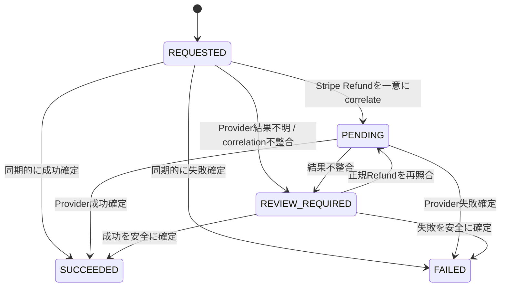

# 070 Order / Payment Specification

## 1. 目的

本書は、**off r39'x in 大阪らへん2027** Webシステムの完成形におけるOrder生成、Stripe Checkout、Payment lifecycle、Stripe Webhook、支払確定、失敗・取消・期限切れ、Refund、冪等性、外部決済とBusiness Databaseの整合性、および購入確定時のDomain effect境界を定義する。

本書は `SPEC-010`〜`SPEC-060` の上流仕様を変更または弱化せず、そこで確定したSystem Boundary、System of Record、Functional Requirement、Order / Allocation / Ticket / Karaoke / GoodsのState Machine、User Flow、Authentication / Authorization / Ownership Ruleを、Order / Payment処理として実装可能かつ追跡可能なRuleへ具体化するCanonical Ownerである。

本書がCanonical Ownerとなるのは少なくとも以下である。

- OrderとStripe Payment lifecycleの対応
- Stripe Checkout Session生成・再生成Rule
- Stripe Checkoutに送る金額・通貨・Order correlationの権威境界
- Browser ReturnとBusiness Confirmationの分離
- Webhook署名検証とEvent処理規則
- Stripe Event / Checkout Session / PaymentとOrderのcorrelation
- Payment idempotencyと並行処理規則
- Order payment transition trigger
- Payment failure / cancel / expiration / retry / resume
- Refundのfinancial lifecycle
- Payment consistency failureとRecovery境界
- Entry / Karaoke / Goods購入確定時にPayment処理から要求するDomain effect境界
- Payment failure時のAllocation / Hold解放trigger
- Stripe Receipt情報との論理関係
- Stripe障害時のPayment behavior
- Payment関連のAdministrator authorization boundary

本書は、API Endpoint / HTTP Status、DB Table / Column / Index / SQL、Page / Route、Karaoke Holdの具体時間、Ticket QR、Administrator / Staff個別画面、Recovery Runbook、Audit Event schemaをCanonicalには定義しない。

## 2. 適用範囲

本書は次のOrder Purposeへ適用する。

- `ENTRY_TICKET_PURCHASE`
- `KARAOKE_PURCHASE`
- `GOODS_PURCHASE`

本書のPaymentはStripe Checkoutによる一回払いだけを対象とする。Subscription、分割払い、Cross-domain cart、独自カード入力画面、Browser側でのPayment confirmationは対象外である。

上流仕様に追加のPayment Method要件が存在しないため、本仕様のStripe Checkoutは**card paymentのみ**をCanonicalとする。Payment Method追加は本書の単なる実装設定変更ではなく、Payment failure / pending / refund semanticsへの影響を確認する仕様変更として扱う。

## 3. 前提・依存仕様

本書は以下へ直接依存する。

- `SPEC-000`: Canonical Owner、依存関係、Upstream Change Request、正式仕様と実装フェーズの分離
- `SPEC-010`: Stripe / Hono API / Business Databaseの責務、System of Record、`INV-010-*`
- `SPEC-020`: `FR-TKT-*`, `FR-KRK-*`, `FR-GDS-*`, `FR-MYP-*`, `FR-ADM-*`, `FR-XFN-*`
- `SPEC-030`: Order / Allocation / Karaoke Hold / Reservation / Ticket / GoodsのState Machine、`BR-*`, `DI-030-*`
- `SPEC-040`: 購入、Pending、Failure、Retry、Resume、Recoveryの `UF-*`
- `SPEC-060`: Authentication、Business Profile resolution、Ownership、Role / Permission、`AR-*`

`SPEC-050` は `PG-TKT-001`, `PG-KRK-003`, `PG-GDS-002`, `PG-XFN-001`, `PG-MYP-003〜004` 等のPage / Route /表示境界のTraceabilityにのみ参照する。本書はPage ID、URL、Routeを変更しない。

## 4. Canonical Terms

| Term | 本書での意味 |
|---|---|
| Payment Authority | Stripeが保持し、本システムが署名検証済みWebhookまたはServer-to-server Stripe API取得で検証した外部決済結果 |
| Business Confirmation | Payment Authorityを根拠とし、Order Purposeに必須のDomain effectとOrder `CONFIRMED` がBusiness Databaseへ一貫して成立した状態 |
| Browser Return | Stripe CheckoutからBrowserが本システムへ戻った事実。Payment Authorityではない |
| Checkout Attempt | 1 OrderについてStripe Checkout Sessionを生成し、その生成結果を追跡する論理的なPayment-side attempt |
| Active Checkout | そのOrderについてCustomerが現在支払操作に使用してよい、Business Databaseへ正規にcorrelate済みのStripe Checkout Session |
| Payment Binding | Order / Checkout Attempt / Stripe Checkout Session / Stripe Payment object間のServer-sideで永続化された論理関連 |
| Webhook Receipt | Stripe Event ID、受信・署名検証・処理結果を重複判定可能に追跡する論理記録 |
| Business Cause | 同じDomain effectを最大1回だけ発生させる原因。Checkout生成、Payment success、Refund request等で個別に定義する |
| Payment Deadline | 当該Checkoutで新規支払を受け付けてよい期限 |
| Refund Record | Orderの支払済みPaymentに対する金融上のRefund要求とProvider結果を追跡するPayment-side record |
| Financial Refund | Stripe上で支払金額を顧客へ返金する金融処理。Ticket / Reservation / Goods取消そのものではない |
| Consistency Failure | Stripeの権威ある状態とBusiness DatabaseのOrder / Allocation / Hold / Entitlementが安全に自動一致しない状態 |

## 5. Rule ID体系

本書のNormative Ruleは以下のPrefixを用いる。

| Prefix | Category |
|---|---|
| `PAY-ORD-*` | Order / amount / Customer / purpose |
| `PAY-CHK-*` | Checkout Session / start / retry / expiry |
| `PAY-BRW-*` | Browser Return / status read |
| `PAY-WHK-*` | Webhook / Event / signature / correlation |
| `PAY-CFM-*` | Purchase confirmation / Domain effect |
| `PAY-FLR-*` | Failure / cancel / expiration |
| `PAY-IDM-*` | Idempotency / concurrency |
| `PAY-RFD-*` | Refund financial lifecycle |
| `PAY-REC-*` | Consistency / recovery boundary |
| `PAY-AZ-*` | Authentication / Authorization |
| `PAY-SEC-*` | Payment-specific security |

同一Rule IDを別の意味へ再利用してはならない。

# Part I — Order / Payment Model

## 6. Order StateとPayment上の意味

`SPEC-030` のOrder Stateをそのまま使用し、追加・改名・禁止遷移の緩和を行わない。

| Order State | Payment上の意味 | Payment側で許可する通常操作 |
|---|---|---|
| `PREPARED` | Orderと必要な一時確保は存在するが、Customerが使用可能なActive Checkoutをまだ確立できていない | 同一Checkout Attemptの回復、条件を満たすCheckout生成 / 再生成、支払前取消・失効 |
| `AWAITING_PAYMENT` | Active CheckoutがBusiness Databaseへcorrelate済みで、権威ある最終Payment outcomeまたはBusiness Confirmationを待つ | 状態照合、Webhook処理、明示cancel、expiry処理 |
| `CONFIRMED` | Payment Authorityと必須Domain effectが一貫して成立済み | read、Receipt、Refund。再確定は禁止 |
| `PAYMENT_FAILED` | 当該Orderの支払が成立しないことが権威的かつ最終的に確定済み | readのみ。再購入は新Order |
| `CANCELED` | 支払確定前に正規の取消が成立し、支払可能性と一時確保を終了済み | readのみ。再購入は新Order |
| `EXPIRED` | Payment Deadlineまたは支払前資源有効期限が終了し、一時確保を終了済み | readのみ。再購入は新Order |
| `REVIEW_REQUIRED` | 支払または内部反映を安全に自動確定できない | 状態照合、専用Recovery。通常Checkout再開は禁止 |

**PAY-ORD-001:** `CONFIRMED` / `PAYMENT_FAILED` / `CANCELED` / `EXPIRED` を通常処理で `PREPARED` / `AWAITING_PAYMENT` へ戻してはならない。

**PAY-ORD-002:** `REVIEW_REQUIRED` からの遷移は `SPEC-030` で許可された `CONFIRMED` / `PAYMENT_FAILED` / `CANCELED` だけとし、本書のPayment処理が新しい遷移を追加してはならない。

## 7. Order Customer / Purpose / Amount Authority

**PAY-ORD-003:** Purchase開始RequestごとにHono APIは `SPEC-060` に従いIdentityをServer-sideで検証し、一意に解決したBusiness ProfileをOrder Customerとする。Client指定 `user_id` / `profile_id` / owner / Customer flagをOrder Customerへ採用してはならない。

**PAY-ORD-004:** Order Purposeは作成時に `ENTRY_TICKET_PURCHASE` / `KARAOKE_PURCHASE` / `GOODS_PURCHASE` のいずれか1つとして確定し、作成後に変更しない。

**PAY-ORD-005:** Payment amountはOrder ItemのServer-side購入時価格Snapshotと数量から算出する。Clientから受け取るprice、subtotal、total、currency、discount、payment resultを権威値にしない。

**PAY-ORD-006:** 1 Order内の全Order Itemは同一currencyでなければならない。複数currencyを含むOrderはCheckoutへ進めない。

**PAY-ORD-007:** Order totalは通貨の最小単位による整数として、各Order ItemのSnapshot amount × quantityの合計から計算する。浮動小数点でPayment totalを確定してはならない。

**PAY-ORD-008:** 販売ConfigurationがOrder作成後に変更されても、既存Order Item Snapshot、Order total、currencyを暗黙に更新しない。

## 8. Stripe Payment構成

本システムのStripe Checkoutは次をCanonicalとする。

- Checkout Session `mode = payment`
- Payment Methodはcardのみ
- Line item金額・数量・currencyはOrder Item SnapshotからServer-sideで生成
- Stripe側に存在する価格値、Browser input、query parameterをBusiness DatabaseのOrder amountより優先しない
- promotion code、subscription、installment、cross-domain cartは本仕様のPayment capabilityに含めない
- `success_url` / `cancel_url` は `SPEC-050` の既存Page / Routeへ接続するだけであり、Order stateの権威入力にはしない

**PAY-ORD-009:** Stripe Checkout Sessionの `amount_total` / currencyがOrder Snapshotと一致しない場合、支払確定を行わずConsistency Failureとして扱う。

# Part II — Purchase / Checkout Start

## 9. 共通Purchase start sequence

Entry / Karaoke / GoodsのPurchase startは論理的に以下の順序で行う。

1. Authentication / Email verification / Session検証
2. Business Profile一意解決
3. `purchase.start` authorization
4. 販売期間・Sale Control・Purchase Limit・capacity / inventory / Slot availability等のDomain Rule再評価
5. 必要なEntry / Goods AllocationまたはKaraoke Holdを排他的に成立
6. Order / Order Itemを `PREPARED` としてBusiness Databaseへ永続化
7. Order Item Snapshotからamount / currencyを確定
8. Checkout Attemptを作成または既存未解決Attemptを再利用
9. Stripe Checkout Session生成
10. 生成結果とPayment BindingをBusiness Databaseへ永続化
11. 使用可能なSession URLとSession IDのcorrelationが永続化できた場合だけOrderを `AWAITING_PAYMENT` へ進める
12. BrowserへStripe Checkoutへの遷移情報を返す

**PAY-CHK-001:** Stripeへ到達可能なCheckout Sessionを作る前に、対応OrderがBusiness Database上で一意に追跡可能でなければならない。

**PAY-CHK-002:** Order / Allocation / Holdの永続化が失敗した場合、Stripe Checkout Sessionを生成してはならない。

**PAY-CHK-003:** Stripe Checkout Session作成成功後でも、Session IDとOrderのPayment BindingをBusiness Databaseへ安全に永続化できていない間はCustomerへそのSessionをActive Checkoutとして提示してはならない。

## 10. Checkout Session correlation

Checkout SessionとOrderのcorrelationはServer-sideで次を満たす。

1. Checkout Attemptは1 Orderへ所属する。
2. Stripe Checkout Session IDはPayment BindingとしてBusiness Databaseへ保存される。
3. Stripeへ渡す `client_reference_id` およびmetadataには、Serverが生成・選択した不透明なOrder referenceを補助correlation値として設定してよい。
4. `client_reference_id` / metadataだけを権威あるOrder lookupとして使用しない。
5. WebhookではまずStripe Session IDに対応するServer-side Payment Bindingを解決する。
6. metadata / client referenceは、Bindingとの不一致検出に使用する防御的なcross-checkであり、Bindingを上書きする入力ではない。
7. 1つのStripe Payment結果を複数Orderへbindしてはならない。

**PAY-CHK-004:** Clientが任意のOrder referenceをStripeへ直接設定できる経路を作らない。

**PAY-CHK-005:** Webhook上のSession IDが内部Payment Bindingへ一意に解決できない、または複数Orderへ解決される場合、Orderを確定せずConsistency Failureとする。

## 11. Checkout Session lifetime

本仕様のCheckout Session lifetimeは**作成成功時点から30分**とする。

- Stripe Sessionの `expires_at` は作成時点から30分後に設定する。
- Payment Deadlineも同じ時刻を基準とする。
- Stripe側のminimum expiry制約が変更され、30分を設定できなくなった場合は本仕様のPayment semanticsへ影響するため、単なる実装変更として吸収せずSPEC-070の変更対象とする。
- Karaoke Checkoutを開始する時点で、対応Karaoke Holdは少なくともPayment Deadlineまで支払権利を保持可能でなければならない。Holdの具体時間は `SPEC-090` が定義する。
- Entry / Goods AllocationもPayment Deadlineまで正規のPayment attemptを支えられる有効性を持たなければならない。

**PAY-CHK-006:** Checkout開始時点でAllocation / Holdの残存有効時間がPayment Deadlineまで届かない場合、そのOrderを `AWAITING_PAYMENT` へ進めてはならない。

**PAY-CHK-007:** Webhook到着時刻がPayment Deadline後であっても、Stripe上で支払がDeadline前に正規完了したことを検証できる場合は「Webhookが遅れた」ことだけを理由に失敗へ変換しない。ただし、対象Allocation / Holdが上流Domain Rule上すでに別取引へ再利用されている等、安全に権利確定できない場合は通常確定せずRecoveryへ送る。

## 12. Checkout Session生成retry

Checkout生成のBusiness Causeは **`(Order, Checkout Attempt)`** とする。

各Checkout AttemptはStripe request idempotency keyを1つ持つ。具体的な保存Columnは `SPEC-100` が定義する。

**PAY-CHK-008:** 同じCheckout AttemptのNetwork timeout、response loss、5xx等に対するretryは同じStripe idempotency keyと同じOrder Snapshotを使用する。

**PAY-CHK-009:** Session生成結果が不明なまま別idempotency keyで2つ目のSessionを作ってはならない。まず同一Attemptの再送により既存Stripe結果を回復する。

**PAY-CHK-010:** 同一AttemptのStripe結果が「Sessionは作成されていない / 再利用不能」と安全に確定でき、Orderが `PREPARED`、Allocation / Holdが有効、販売Rule再評価も成立する場合だけ、新しいCheckout Attemptを同一Orderへ作成してよい。

**PAY-CHK-011:** 1 Orderについて同時にCustomerが支払可能なActive Checkoutは最大1つとする。

**PAY-CHK-012:** 有効なActive Checkoutがすでに存在する場合、reload / double click / parallel requestはそのSessionを再利用し、新しいSessionを作らない。

## 13. Checkout作成failure

Stripe Checkout Session生成が明確に失敗した場合:

- Orderを削除しない。
- Orderは `PREPARED` に留める。
- Entry / Goods AllocationまたはKaraoke Holdがまだ有効であれば同一OrderのCheckout retryを許可する。
- Orderを `CONFIRMED` / `PAYMENT_FAILED` としない。
- Checkout未開始を「支払失敗」と表示しない。

**PAY-CHK-013:** Allocation / Holdが `RELEASED` / `EXPIRED` 等となった後、同一 `PREPARED` Orderを新しい支払待ちへ進めてはならない。`SPEC-030` の許可遷移に従い当該Orderを `EXPIRED` または `CANCELED` とし、再購入はNew Business Attemptとして新Orderを作成する。

# Part III — Browser Return / Status

## 14. Browser Return Rule

**PAY-BRW-001:** Stripe CheckoutからBrowserがsuccess URLへ戻ったこと、query parameterにSession IDがあること、Stripe-hosted pageがsuccessを表示したことのいずれもOrder `CONFIRMED` のTriggerではない。

Browser Return時は:

1. `SPEC-060` に従い認証とOrder ownershipを確認する。
2. 新しいOrderを作らない。
3. Business Database上の同じOrderを取得する。
4. Order stateをそのまま利用者向けOutcomeへ変換する。

| Order State | Browser Return / Statusの意味 |
|---|---|
| `PREPARED` | Checkout開始が完全には成立していない。購入未確定 |
| `AWAITING_PAYMENT` | Payment / Webhook / Business Database反映待ち |
| `CONFIRMED` | Business Confirmation済み。成功表示可 |
| `PAYMENT_FAILED` | 当該Orderの支払は成立していない |
| `CANCELED` | 当該購入試行は取消済み |
| `EXPIRED` | 当該購入試行は期限切れ |
| `REVIEW_REQUIRED` | 自動確定できず確認・Recoveryが必要 |

**PAY-BRW-002:** `PG-XFN-001` Purchase Statusのreload / revisit / polling相当のreadは同一Orderを参照し、新Order、Checkout Session、Ticket、Reservation、Allocation、Goods fulfillmentを作成しない。

**PAY-BRW-003:** `CONFIRMED` 以外をBusiness Confirmationとして表示してはならない。

# Part IV — Stripe Webhook

## 15. Canonical Stripe Event set

本システムがPayment / Refund処理で購読するStripe snapshot Eventは以下をCanonicalとする。

| Event type | 用途 | Orderへの直接作用 |
|---|---|---|
| `checkout.session.completed` | Checkout完了を検知し、支払成功候補を検証 | 条件を満たせばBusiness Confirmationを試行 |
| `checkout.session.expired` | Session期限切れを検知 | 未支払を確認後 `EXPIRED` 候補 |
| `refund.created` | Stripe側Refund生成の検知・correlation | Order Stateは変更しない |
| `refund.updated` | Refund status / reference等の更新追跡 | Order Stateは変更しない |
| `refund.failed` | Refund失敗の明示検知 | Order Stateは変更しない |

card paymentでは単一のカード試行失敗をOrder terminal failureへ直結させない。Stripe Checkoutは同一Session内で再入力を許し得るため、個別のカード失敗だけでOrderを `PAYMENT_FAILED` にしてはならない。

`PAYMENT_FAILED` は、Server-side Stripe照合により「当該Orderについて成功Paymentが存在せず、かつ同じOrderから将来成功へ進み得るActive Checkoutも存在しない」ことが権威的に確定し、`EXPIRED` / `CANCELED` より `SPEC-030` 上の意味として支払不成立が適切な場合にのみ使用する。

**PAY-WHK-001:** 未購読Eventを受信しても、それだけを理由にOrder stateを変更しない。

**PAY-WHK-002:** Event set変更はPayment semanticsへの影響を確認してSPEC-070を更新する。Stripe Dashboardで任意Eventを増やしただけで新しいDomain transitionを発生させてはならない。

## 16. Webhook signature verification

Webhook受信では、Stripe SDK等の正規検証手段を用いてraw request body、`Stripe-Signature`、Server-only Webhook signing secretから署名を検証する。

**PAY-WHK-003:** 署名検証が成功したEventだけをStripeからの入力として扱う。

**PAY-WHK-004:** 署名検証失敗EventはOrder、Payment Binding、Refund、Allocation、Hold、Ticket、Reservation、Inventoryを更新するBusiness inputに使用しない。

**PAY-WHK-005:** JSON parse済みbodyを再serializeした値等、署名対象raw bodyと異なるpayloadで検証を代替してはならない。

**PAY-WHK-006:** Webhook routeは一般利用者のSupabase Auth Sessionを送信元認証根拠としない。Stripe署名が外部送信元検証の根拠である。

## 17. Webhook receipt / Event idempotency

Stripe Event deliveryの同一性キーはStripe Event IDとする。

Webhook Receiptは論理的に少なくとも次の処理状態を区別する。

- `RECEIVED`: 署名検証済みで、処理開始前または処理中
- `PROCESSED`: 必要なBusiness effectが正常に成立済み
- `IGNORED`: 正規Eventだが本仕様上Business effect不要
- `FAILED_RETRYABLE`: Event自体は正規だが内部一時障害等で再処理が必要
- `REVIEW_REQUIRED`: 自動再処理だけでは安全に解決できない

**PAY-WHK-007:** 署名検証済みEventはEvent ID単位でWebhook Receiptとして重複判定可能に追跡する。

**PAY-WHK-008:** 同じEvent IDを再受信した場合、Receiptが `PROCESSED` / `IGNORED` なら既存結果を再利用し、同一Business effectを再実行しない。`FAILED_RETRYABLE` なら同じEvent / Business Causeとして安全に再処理し、新しいBusiness Causeへ置換しない。

**PAY-WHK-009:** 異なるEvent IDが同じCheckout Session / Refundを指すことがあるため、Event ID冪等性だけでOrder confirmation / Refundを保護してはならない。Business Cause単位の冪等性を追加で適用する。

### 17.1 Webhook Event処理順序

Webhookは論理的に次の順序で処理する。

1. raw request bodyとStripe signature headerを受領する。
2. Stripe Webhook signing secretで署名検証する。失敗時はBusiness処理へ進まない。
3. Event ID、Event type、environment / accountを検証し、Webhook Receiptを同一Event IDでresolveする。
4. `PROCESSED` / `IGNORED` の重複Eventなら既存結果を返して終了する。
5. Canonical Event typeへrouteする。
6. Stripe object IDからPayment Binding / Refund Record / OrderをServer-sideでcorrelateする。
7. 必要に応じStripe APIから現在object stateを取得し、Event到着順ではなく現在Authorityを再確認する。
8. Order / Refund current stateとBusiness Cause idempotencyを競合制御下で評価する。
9. 許可されたDomain transition / Payment-side updateだけを実行する。
10. 処理成功ならReceiptを `PROCESSED` または `IGNORED`、一時失敗なら `FAILED_RETRYABLE`、安全に自動解決不能なら `REVIEW_REQUIRED` として追跡する。
11. Provider retryを必要とする未完了処理を「処理済み」と偽装しない。具体的なHTTP応答・再送制御は `SPEC-110` / `SPEC-150` が定義する。

## 18. Event ordering

Stripe Eventの到着順序をDomain transition順序として信用しない。

**PAY-WHK-010:** Event `created` 時刻や受信順だけを「最新状態」の判定根拠にしない。

**PAY-WHK-011:** 同一Orderへ異なるEventが到着した場合、そのEventが指すStripe objectとBusiness Database上の現在Order stateを再評価し、現在状態から許可された遷移だけを実行する。

**PAY-WHK-012:** 先にsuccessを処理してOrderが `CONFIRMED` になった後、遅れてexpiry / failure相当Eventが到着してもOrderを失敗状態へ戻さない。

**PAY-WHK-013:** Orderが `PAYMENT_FAILED` / `CANCELED` / `EXPIRED` になった後にStripe側Payment successが検出された場合、禁止遷移で `CONFIRMED` へ変更せず、Consistency Review Caseを作成して支払済み・権利未成立の不整合として扱う。

## 19. Checkout success correlation / validation

`checkout.session.completed` を受信しても、以下をすべて検証できるまでPayment successとしてBusiness Confirmationへ進めない。

1. Webhook署名が有効
2. Event environment / accountが当該システム環境のStripe設定と一致
3. Checkout Session IDが一意なPayment Bindingへ解決
4. Binding先OrderのPurpose / Customer / Checkout Attemptが整合
5. Session `mode` がpayment
6. Sessionが正規にcompleteしている
7. `payment_status` がpaid
8. `amount_total` がOrder total Snapshotと完全一致
9. currencyがOrder currencyと完全一致
10. Server設定したOrder correlation metadataが内部Bindingと矛盾しない
11. 同じStripe Payment / Sessionが別Orderの成功原因として既に使われていない
12. Order PurposeごとのAllocation / Hold / Domain preconditionがまだ安全に確定可能

**PAY-WHK-014:** SessionのCustomer email、Browser表示名、Client reference等をOrder Ownerの本人性根拠にしない。

**PAY-WHK-015:** amount / currency / correlation / environmentの不一致は通常成功として補正せず、Orderが許可する場合 `REVIEW_REQUIRED`、Terminal OrderならConsistency Review Caseへ送る。

## 20. `checkout.session.expired`

`checkout.session.expired` 受信時は、対象Orderがまだ未確定であり、Stripe上に成功Paymentが存在しないことを確認する。

- Order `AWAITING_PAYMENT` かつ成功Paymentなし: `EXPIRED` へ進め、Payment側triggerとして一時確保解放を要求する。
- Order `PREPARED`: 当該Sessionが正規Binding済みであること自体が状態不整合であるためRecovery対象とする。
- Order `CONFIRMED`: 既存成功を保持し、expiry Eventで巻き戻さない。
- Order `PAYMENT_FAILED` / `CANCELED` / `EXPIRED`: 既存Terminal resultを再利用する。
- Stripe側成功とexpiryが矛盾: Consistency Review Case。

**PAY-WHK-016:** expiry Event処理でTicket / Reservation / Goods fulfillmentを作成してはならない。

# Part V — Business Confirmation

## 21. Confirmation共通Rule

Payment successのBusiness Causeは **`(Order, authoritative Stripe payment result)`** とする。

**PAY-CFM-001:** 同じBusiness CauseからOrder `CONFIRMED` を論理的に最大1回だけ成立させる。

**PAY-CFM-002:** Payment success Eventを受信しただけでは `CONFIRMED` にしない。Purposeに必須のDomain effectとOrder transitionが一貫して成立することを要求する。

**PAY-CFM-003:** Order `CONFIRMED` と必須Domain effectは、Business Databaseで可能な範囲を同一transaction境界として一括Commitする。具体的Transaction SQL / isolation / lockは `SPEC-100` が定義する。

**PAY-CFM-004:** 必須Domain effectの一部が成立しない場合、部分成功を `CONFIRMED` としてCommitしない。

**PAY-CFM-005:** 既存の正規Ticket / Reservation / Allocation / Goods stateが既に同じBusiness Causeから成立している場合、retryはそれを再利用し、新しい重複Entityを作らない。

## 22. Entry Ticket confirmation

`ENTRY_TICKET_PURCHASE` のBusiness Confirmationでは、少なくとも以下を一貫して成立させる。

1. 対応Entry Sales Allocationが正規に当該Orderへ属し、必要数量分 `HELD`
2. Allocation `HELD -> COMMITTED`
3. Order Item quantityに対応する正規購入数量単位ごとにEntry Ticketを最大1件発行
4. 発行TicketのOwner = Order Customer
5. Ticket初期state = `VALID`
6. Order `AWAITING_PAYMENT -> CONFIRMED` または `REVIEW_REQUIRED -> CONFIRMED`

**PAY-CFM-006:** Allocationが不足、既に別原因へ使用、またはcapacity invariantを満たせない場合、支払済みであってもTicketを捏造して通常成功にせずRecoveryへ送る。

**PAY-CFM-007:** retryで `COMMITTED` Allocationを再度commitしたり、同じ正規購入数量単位へ2枚目のEntry Ticketを発行してはならない。

## 23. Karaoke confirmation

`KARAOKE_PURCHASE` のBusiness Confirmationでは、少なくとも以下を一貫して成立させる。

1. Orderに対応するKaraoke Holdが同じCustomer / Slotへ属する
2. 支払がHold / Payment Deadlineの有効条件を満たす
3. SlotがそのHoldに対応する `HELD`
4. Hold `ACTIVE -> COMMITTED`
5. Slot `HELD -> SOLD`
6. 同一Karaoke Order ItemからReservationを最大1件生成し `CONFIRMED`
7. 同一ReservationからKaraoke Ticketを最大1件生成し `VALID`
8. Reservation / Ticket Customer = Order Customer
9. Order `AWAITING_PAYMENT -> CONFIRMED` または `REVIEW_REQUIRED -> CONFIRMED`

**PAY-CFM-008:** Holdが期限切れ、解放済み、またはSlotが別Customerへ再販売済みの場合、Payment successだけを根拠にSlotを奪い返したり2件目のReservationを作成してはならない。

**PAY-CFM-009:** Deadline後の遅延Payment success、Hold / Slot不整合、二重販売危険がある場合、Orderが `AWAITING_PAYMENT` なら `REVIEW_REQUIRED`、既にTerminalならConsistency Review Caseとし、通常成功を表示しない。

具体的なHold時間・Slot cancellation / resale ruleは `SPEC-090`、Recovery手順は `SPEC-150` が定義する。

## 24. Goods confirmation

`GOODS_PURCHASE` のBusiness Confirmationでは、少なくとも以下を一貫して成立させる。

1. Goods Sales Allocationが正規に当該Order / Goods Order Itemへ属し、必要数量分 `HELD`
2. Inventory invariantを満たす
3. Allocation `HELD -> COMMITTED`
4. Goods Order Item `PENDING_PAYMENT -> FULFILLABLE`
5. Customer = Order Customer
6. Order `AWAITING_PAYMENT -> CONFIRMED` または `REVIEW_REQUIRED -> CONFIRMED`

**PAY-CFM-010:** 在庫不足・Allocation不整合がある場合、支払済みであっても在庫を負数にしたりGoods Order Itemを無条件で `FULFILLABLE` にせずRecoveryへ送る。

**PAY-CFM-011:** retryでInventory committed quantityを二重増加させない。

# Part VI — Failure / Cancel / Expiration

## 25. Failure分類

本仕様は以下を区別する。

| Situation | Orderの通常結果 |
|---|---|
| Checkout Session生成前のStripe API failure | `PREPARED` 維持 |
| Checkout生成結果不明 | `PREPARED` 維持し同一Checkout Attemptを回復。安全に解決不能なら `REVIEW_REQUIRED` |
| UserがCheckoutから離脱しただけ | `AWAITING_PAYMENT` 維持 |
| 個別card attempt failureだがSessionは再試行可能 | `AWAITING_PAYMENT` 維持 |
| 支払不成立が権威的かつ最終的に確定 | `PAYMENT_FAILED` |
| Customerが支払前に明示cancelし、Stripe側支払可能性も停止確認済み | `CANCELED` |
| Checkout / Payment Deadline経過、未支払確認済み | `EXPIRED` |
| Webhook反映待ち | `AWAITING_PAYMENT` |
| Stripe successだが内部必須更新不可 | `REVIEW_REQUIRED` またはConsistency Review Case |
| Stripe/Auth一時障害で安全に最終判断不能 | 現在stateを保持、必要に応じ `REVIEW_REQUIRED` |

## 26. Checkout離脱

**PAY-FLR-001:** CustomerがBrowserを閉じる、戻る、cancel URLへ戻る等の行為だけではPayment failure / cancelを確定しない。

- Active Checkoutがまだ支払可能ならOrderは `AWAITING_PAYMENT`。
- Payment Deadlineまたは明示cancelまで一時確保を保持する。
- status readは同じOrderを参照する。

## 27. 支払前の明示cancel

Customerによる明示cancelはOwner authorizationを通過した同一Orderに対してのみ許可する。

1. Orderが `PREPARED` / `AWAITING_PAYMENT` であることを確認する。
2. `AWAITING_PAYMENT` ではStripe側に成功PaymentがないことをServer-sideで再確認する。
3. Active Checkoutがある場合、支払可能性を終了させるProvider operationを行い、その結果を確認する。
4. 支払成功がないことを確認できた場合だけOrderを `CANCELED` へ進める。
5. 対応Entry / Goods Allocationを `RELEASED`、Karaoke Holdを `RELEASED` とし、Slotは `SPEC-030` / `SPEC-090` のRuleに従って戻す。

**PAY-FLR-002:** Provider cancel / expire結果が不明なままAllocation / Holdを解放してはならない。支払可能性と資源再販売を同時に成立させ得る不明状態はRecovery対象とする。

## 28. Expiration

**PAY-FLR-003:** Payment Deadline到達時、Stripe Session / PaymentをServer-sideで照合し、成功Paymentがないことを確認してからOrderを `EXPIRED` とする。

**PAY-FLR-004:** `EXPIRED` 成立と同じBusiness operationで、Entry / Goods Allocationを `RELEASED`、Karaoke Holdを `EXPIRED` または上流Ruleに従う解放状態へ進める。

**PAY-FLR-005:** Expiration後に同じOrderを再決済へ戻さない。Customerが再購入する場合は現在の販売Ruleを再評価し、新Order / 新Allocation / 新Holdを作る。

## 29. Payment failure

**PAY-FLR-006:** 単一card attemptのdecline等、同じActive CheckoutでCustomerが再試行可能な失敗はOrder `PAYMENT_FAILED` のTriggerにしない。

**PAY-FLR-007:** Order `PAYMENT_FAILED` は、Stripeの権威ある現在状態から支払不成立が最終的であり、同一Orderに有効な成功Paymentも支払可能なActive CheckoutもないことをServer-sideで確認した場合だけ成立させる。

**PAY-FLR-008:** `PAYMENT_FAILED` へ進む際は当該Orderの `HELD` Entry / Goods Allocationおよび `ACTIVE` Karaoke Holdを上流Domain Ruleに従い解放する。

# Part VII — Idempotency / Concurrency

## 30. Idempotency key一覧

「冪等にする」だけでなく、本仕様ではBusiness Causeごとに同一性を定義する。

| Operation | 同一Business Cause | 2回目以降に再利用するもの | 新規作成してはいけないもの |
|---|---|---|---|
| Checkout Session生成 | `(Order, Checkout Attempt)` | 同一Stripe idempotency key、同一Session結果 | 不明結果のまま別Session |
| Checkout start double-click | 同一 `PREPARED` Orderの有効Attempt | Active Checkout / Attempt | 新Order、新Allocation、新Hold |
| Webhook delivery | Stripe Event ID | Webhook Receipt処理結果 | 同Event由来の再更新 |
| Payment confirmation | `(Order, authoritative Payment result)` | 既存 `CONFIRMED` result、既存Entitlement | 重複Ticket / Reservation / Inventory commit |
| Status reload | Order reference + verified owner | 同一Order current state | 新Order / Checkout / Entitlement |
| Refund request | 内部Refund Record / Refund Business Cause | 同一Stripe Refund / provider result | 二重Refund |
| Refund webhook | Refund ID + Event ID | 既存Refund Record | 重複金融反映 |

## 31. Checkout generation concurrency

**PAY-IDM-001:** 同一Orderに対する並行Checkout startは、最大1件だけが新しいCheckout Attempt / Active Checkoutを確立できるようにする。

**PAY-IDM-002:** 競合した後続Requestは既存Attempt / Sessionを再取得して返すか、現在stateを返し、新しいOrderを作らない。

## 32. Webhook concurrency

**PAY-IDM-003:** 同じEvent IDの並行処理は1つの論理処理結果へ収束する。

**PAY-IDM-004:** 異なるEvent IDが同じOrderへ同時到着しても、Order current stateとPayment Bindingを競合制御下で評価し、許可State transitionを最大1回だけ成立させる。

**PAY-IDM-005:** successとexpiry / failure相当Eventが競合した場合、Event到着順ではなくStripeの現在のPayment / Session authorityと `SPEC-030` の許可遷移を評価する。

## 33. Entitlement idempotency

**PAY-IDM-006:** Entry Ticketは `(Order Item, 正規購入数量単位)`、Karaoke ReservationはKaraoke Order Item、Karaoke TicketはReservationを正規発行元として最大1件を維持する。

**PAY-IDM-007:** Goods Allocation commit / Inventory committed quantityの増加は同じOrder Item / Allocationから最大1回だけ成立させる。

具体的Unique Constraint / transaction / lock / isolationは `SPEC-100` が定義する。

## 34. Administrator operationとの競合

**PAY-IDM-008:** Administratorのrefund / recovery operationとWebhook処理が競合する場合も、Role authorizationがWebhookを上書きする根拠にはならない。Stripe Authority、Order current state、Refund Recordを同じBusiness Causeとして再評価する。

**PAY-IDM-009:** Administrator操作でWebhook idempotency record、Payment Binding、既存Payment resultを削除して「再実行可能」にしてはならない。

# Part VIII — Refund

## 35. Refund scope

本システムの通常Refund capabilityは、**`CONFIRMED` Orderに対するfull refundのみ**とする。

上流Requirementにpartial refund / partial entitlement cancellationが定義されていないため、通常UI / API operationとしてpartial refundを提供しない。

Stripe側で本システム外の操作等によりpartial refundが検出された場合:

- Order stateを変更しない。
- 自動でTicket / Reservation / Goodsの一部を取消さない。
- Refund Recordへ外部差分を記録し、Consistency Review Caseとして追跡する。
- どの権利を取消すかをPayment amountだけから推測しない。

**PAY-RFD-001:** Refundを理由にOrderを `PREPARED` / `AWAITING_PAYMENT` / `PAYMENT_FAILED` へ戻さない。

## 36. Refund authorization

Customer自己操作によるRefund開始は本仕様では提供しない。

通常Refund開始は:

1. verified Administrator Identity
2. active `ADMINISTRATOR` Role
3. `recovery.exception.execute` Capability
4. 本章で定義するRefund-specific precondition
5. Domain Rule / System Invariant成立

をすべて要求する。

`orders.manage.read` はOrder / Payment状態の参照だけを許可し、Refund実行権限を含まない。

**PAY-RFD-002:** `recovery.exception.execute` は本章のfull refund operationだけに明示的に適用する特権境界であり、任意amount、任意Order、Invariant bypassを許すgeneric superuser権限ではない。

## 37. Refund Record state

RefundはOrder Stateとは別のfinancial lifecycleを持つ。

| Refund State | 意味 |
|---|---|
| `REQUESTED` | Authorized refund requestをBusiness Databaseへ永続化済みだがStripe受付結果未確定 |
| `PENDING` | Stripe Refundが一意にcorrelate済みで、金融上の最終結果待ち |
| `SUCCEEDED` | StripeがRefund成功を権威的に示す金融上のterminal state |
| `FAILED` | StripeがRefund失敗または取消等、返金未成立を示す金融上のterminal state |
| `REVIEW_REQUIRED` | Stripe Refund結果自体を安全に自動確定できない |



`SUCCEEDED` / `FAILED` は金融上のterminal stateであり、Domain entitlement cancellationの成否を理由に別金融stateへ巻き戻さない。Refund StateはPayment-side logical stateであり、`SPEC-030` のOrder Stateを追加・変更しない。

## 38. Refund precondition

通常full refundを開始できるのは少なくとも以下をすべて満たす場合である。

- Order `CONFIRMED`
- Orderへ正規の成功Paymentが一意にcorrelate済み
- 既にfull refundが成功済みでない
- 既存partial refundその他の未解決Refund差分が存在しない
- 同じOrderのRefund Recordが重複していない
- Entry Ticket購入: 対象Ticketに `USED` が存在しない
- Karaoke購入: Karaoke Ticketが `USED` でなく、Reservation取消が通常Domain Rule上可能
- Goods購入: 対象Goods Handoffが `COMPLETED` でない
- Refund後に必要となるDomain cancellationの対象を一意に特定可能
- 外部 / 内部不整合が未解決でない

**PAY-RFD-003:** 使用済みEntry / Karaoke Ticket、完了済みGoods Handoff等、通常取消できないDomain stateを持つOrderは通常full refund operationで自動処理しない。必要ならConsistency Review / Recovery対象とする。

## 39. Refund request sequence

通常Refundは次の順序で処理する。

1. Administrator authorization / current state validation
2. full refundable amountをOrderの正規成功PaymentからServer-side算出
3. Refund Record `REQUESTED` を先に永続化
4. Refund Business Causeに対応するStripe idempotency keyでfull Refundを要求
5. Stripe responseをcorrelateしてRefund IDを保存
6. Provider結果が未完了なら `PENDING`
7. Stripeが成功を権威的に示したら `SUCCEEDED`
8. Financial success後、対象Domainの正規Cancellation operationを別責務として実行
9. Cancellationが安全に成立しない場合、Refund成功を取り消したように見せずConsistency Review Caseへ送る

**PAY-RFD-004:** Stripe Refund要求結果がNetwork failure等で不明な場合、新しいRefundを作らず同じRefund Business Cause / idempotency keyで結果を回復する。

**PAY-RFD-005:** Refund request retryで同一Orderへ二重にfull amountを返金してはならない。

## 40. Refund Webhook

Refund関連Eventはsignature verificationとEvent idempotencyを通常Webhookと同じく適用する。

- `refund.created`: Refund Recordへcorrelateする。システム外起点のRefundなら未知のRefundとしてReview対象化する。
- `refund.updated`: Refundの現在status、provider reference等を同期する。
- `refund.failed`: Refund Recordを `FAILED` とし、Financial Refund未成立として扱う。

**PAY-RFD-006:** Stripe Eventだけで対象Entitlementを推測して取消しない。Refund Record → Order → Domain EntitlementのServer-side relationを解決する。

## 41. RefundとEntitlement cancellation

Financial RefundとBusiness entitlement cancellationは別Operationである。

### 41.1 Entry Ticket

- Refund `SUCCEEDED` はTicket cancellationを要求するtriggerになり得る。
- Ticket `VALID -> CANCELED` は `SPEC-030` / `SPEC-080` の正規取消Ruleで成立させる。
- `USED` Ticketを通常取消しない。
- Refundだけを理由にEntry sales capacityを回復しない。
- Capacity recoveryはTicket cancellation側のRuleが明示的に許可する場合だけ成立する。

### 41.2 Karaoke

- Refund `SUCCEEDED` はReservation / Karaoke Ticket cancellationを要求するtriggerになり得る。
- Reservation `CONFIRMED -> CANCELED` とKaraoke Ticket取消は `SPEC-030` / `SPEC-090` の正規Ruleで成立させる。
- `USED` Karaoke Ticketを通常取消しない。
- Refundだけを理由にSlotを `AVAILABLE` へ戻さない。
- Slot再販売は `SPEC-090` が定義するReservation cancellation / resale policyに従う。

### 41.3 Goods

- Refund `SUCCEEDED` はGoods Order Item cancellationを要求するtriggerになり得る。
- Goods Order Item `FULFILLABLE -> CANCELED` はHandoff未完了かつ正規取消条件成立時だけ許可する。
- Refundだけを理由にInventoryを復元しない。
- Inventory recoveryはGoods cancellationと未受け渡しを確認したDomain operationだけが行う。

**PAY-RFD-007:** Refund financial successとDomain cancellationの間で不整合が生じた場合、Order `CONFIRMED` とRefund Record `SUCCEEDED` を保持し、Consistency Review Caseとして「返金成功・Domain取消未完了」を追跡する。金融成功を `REVIEW_REQUIRED` や `FAILED` へ巻き戻して整合したように見せてはならない。

# Part IX — Receipt / Payment History

## 42. Stripe Receipt relation

ReceiptはStripeが提供するPayment情報への導線として扱い、Business Database内にカード情報やReceipt全文を複製しない。

論理関係は以下とする。

```text
Order
  -> Payment Binding
  -> Stripe Checkout Session
  -> Stripe Payment / Charge
  -> Stripe Receipt information
```

**PAY-ORD-010:** `FR-TKT-022` / `FR-MYP-010` のReceipt導線はOwner authorizationを通過したOrderに対してのみ提供する。

**PAY-ORD-011:** Receipt URLやStripe Payment identifierをOrder ownershipのAuthorization根拠にしてはならない。

**PAY-ORD-012:** Stripe Receiptが一時取得不能でも、既存 `CONFIRMED` Order / Ticket / Reservation / Goods entitlementを削除・取消しない。

# Part X — Authentication / Authorization

## 43. Purchase authorization

**PAY-AZ-001:** Purchase開始ごとに `AR-SES-*`, `AR-ID-*`, `AR-AZ-012` を適用し、検証済みIdentity → Business ProfileをCustomerとする。

**PAY-AZ-002:** Authentication Serviceが安全にIdentityを検証できない場合、新規Order、Checkout、cancel、Owner限定status readを未検証Actorへ成立させない。

**PAY-AZ-003:** Auth障害を理由に既存 `CONFIRMED` Order、Payment Binding、Ticket、Reservation、Goods entitlementを削除・Owner変更しない。

## 44. Owner read / Purchase Status

**PAY-AZ-004:** Purchase Status / Mypage Order参照は `AR-OWN-001〜007` に従い、verified Business Profile = Order CustomerをServer-sideで確認する。

**PAY-AZ-005:** Order ID、Checkout Session ID、Receipt identifier、URLを知っていることだけでOrder ownershipを成立させない。

## 45. Administrator payment read

AdministratorがOrder / Payment状態を運用確認するには:

- verified Identity
- active `ADMINISTRATOR`
- `orders.manage.read`

を要求する。

**PAY-AZ-006:** `orders.manage.read` はOrder / Payment / Stripe correlation / Refund statusの必要な運用参照を許可するが、RefundやRecovery mutationを自動的には許可しない。

**PAY-AZ-007:** Payment / Order管理UIの表示可否だけでAdministrator authorizationを成立させない。Hono APIがRequestごとにRole / Capabilityを再評価する。

# Part XI — Failure / Recovery Boundary

## 46. Consistency Failure分類

| Failure | Payment側の安全な結果 |
|---|---|
| Stripe API一時障害 | current Order保持。同一Business Cause retry |
| Checkout生成結果不明 | 同一Checkout Attempt / idempotency keyで回復。別Sessionを作らない |
| Webhook受信不能 | Stripe retry /後続reconciliationを許容。既存stateを推測変更しない |
| Webhook署名failure | Eventを無効入力として拒否。Business state変更なし |
| Payment successだがBusiness transaction failure | `AWAITING_PAYMENT -> REVIEW_REQUIRED` が可能なら遷移。Terminal OrderならConsistency Review Case |
| Payment failureだが内部state未反映 | authority再照合後、許可遷移だけ適用 |
| OrderとStripe correlation不整合 | 自動確定しない。Review対象 |
| Allocation / HoldとPayment result不整合 | Entitlementを捏造しない。Review対象 |
| Refund結果不明 | 同じRefund Business Causeを回復。二重Refund禁止 |
| Auth Service一時障害 | 新しい認証必須operationをFail Closed。既存確定Data保持 |

## 47. `REVIEW_REQUIRED` の使用境界

**PAY-REC-001:** Orderが `PREPARED` / `AWAITING_PAYMENT` であり、外部結果と内部状態を安全に自動確定できない場合、`SPEC-030` の許可遷移に従い `REVIEW_REQUIRED` を使用する。

**PAY-REC-002:** `CONFIRMED` / `PAYMENT_FAILED` / `CANCELED` / `EXPIRED` のTerminal Orderへ矛盾Eventが到着した場合、Order Stateを禁止遷移で変更せずConsistency Review Caseを作成する。

**PAY-REC-003:** `REVIEW_REQUIRED` / Consistency Review Caseを利用者へ通常成功として表示しない。

**PAY-REC-004:** Recoveryで既存の正規Payment / Entitlement / Allocationを削除して整合したように見せてはならない。

具体的な再試行回数、Backoff、reconciliation job、operator手順、Case解消Runbookは `SPEC-150` がCanonical Ownerである。

# Part XII — Payment Security Boundary

## 48. Secrets / Card data

**PAY-SEC-001:** Stripe Secret Key、Webhook signing secretその他Server-only Stripe credentialをClientへ露出してはならない。

**PAY-SEC-002:** Stripe Secretを使用するCheckout作成、Payment照合、RefundはHono API側のServer environmentで行う。

**PAY-SEC-003:** Card number、CVCその他機微なcard dataをBusiness Databaseへ保存しない。カード入力はStripe Checkoutへ委譲する。

## 49. Untrusted Client input

**PAY-SEC-004:** Clientから送られるprice、amount、currency、owner、role、payment result、inventory、slot availability、Checkout success flagをPayment Authorityとして使用しない。

**PAY-SEC-005:** Checkout Session IDはPayment correlation識別子であってAuthorization credentialではない。

**PAY-SEC-006:** Browser redirect / query parameter / frontend local stateをPayment confirmationの権威入力にしない。

**PAY-SEC-007:** Error responseで他者Order、Stripe Secret、Webhook secret、他者Payment identifier、内部recovery detailを不必要に開示しない。

CSRF / CORS / CSP / rate limit / secret rotation / key management等の詳細は `SPEC-140`、環境変数配置は `SPEC-180` がCanonical Ownerである。

# Part XIII — Downstream Canonical Owner Boundary

## 50. SPEC-070が定義しない事項

| 項目 | Canonical Owner |
|---|---|
| Authentication / Ownership / Role / Permission Matrix | `SPEC-060` |
| Page / Route / UI wording | `SPEC-050` |
| Entry Ticket / QR / Check-in / Ticket取消詳細 | `SPEC-080` |
| Karaoke Hold具体時間 / Slot / Reservation / resale詳細 | `SPEC-090` |
| DB Table / Column / Unique Constraint / Transaction SQL / Index | `SPEC-100` |
| API Endpoint / Request / Response / HTTP Status | `SPEC-110` |
| Email Template / delivery | `SPEC-120` |
| Admin / Staff個別画面・操作導線 | `SPEC-130` |
| Security Control全般 | `SPEC-140` |
| Recovery Runbook / retry回数 / reconciliation operation | `SPEC-150` |
| Audit Event schema / metrics / logs | `SPEC-160` |
| Integration / E2E test case詳細 | `SPEC-170` |
| Stripe API version pin / environment deployment | `SPEC-180` |
| System-wide acceptance | `SPEC-200` |

# Part XIV — Traceability

## 51. Order / Payment Rule Traceability

| Payment Rule | 主な上流Trace |
|---|---|
| `PAY-ORD-001〜002` | `BR-ORD-008`, Order State Machine, `UF-XFN-001`, `DI-030-002`, `DI-030-012`, `INV-010-02`, `INV-010-10` |
| `PAY-ORD-003〜008` | `FR-TKT-004〜008`, `FR-KRK-013〜014`, `FR-GDS-005〜007`, `FR-XFN-003`, `FR-XFN-016〜017`, `BR-SAL-001〜002`, `BR-ORD-002〜003`, `BR-ORD-011〜012`, `AR-ID-*`, `AR-AZ-012`, `DI-030-010〜011`, `INV-010-08〜09` |
| `PAY-CHK-001〜013` | `FR-TKT-007〜010`, `FR-KRK-010〜016`, `FR-GDS-007〜008`, `FR-XFN-009`, `FR-XFN-026〜027`, `BR-ORD-001`, `BR-ORD-009`, `BR-TKT-002〜004`, `BR-KRK-003〜007`, `BR-GDS-002〜003`, `UF-TKT-001`, `UF-KRK-002`, `UF-GDS-001`, `UF-XFN-004`, `DI-030-001`, `DI-030-004〜006`, `DI-030-012`, `INV-010-01`, `INV-010-04`, `INV-010-10` |
| `PAY-BRW-001〜003` | `FR-TKT-011`, `FR-TKT-017〜018`, `FR-KRK-017`, `FR-KRK-027`, `FR-GDS-009`, `FR-XFN-010`, `FR-XFN-028〜029`, `BR-ORD-004〜005`, `UF-XFN-001`, `PG-XFN-001`, `PG-MYP-003〜004`, `AR-OWN-*`, `INV-010-02`, `INV-010-07` |
| `PAY-WHK-001〜016` | `FR-TKT-012〜013`, `FR-KRK-017`, `FR-KRK-020`, `FR-GDS-009〜010`, `FR-XFN-010〜013`, `FR-XFN-020〜021`, `BR-ORD-005〜010`, `UF-XFN-001`, `UF-XFN-003〜004`, `DI-030-002`, `DI-030-009`, `DI-030-012`, `INV-010-02`, `INV-010-07`, `INV-010-10` |
| `PAY-CFM-001〜005` | `BR-ORD-005〜007`, `DI-030-002〜003`, `DI-030-009`, `DI-030-012`, `INV-010-02〜03`, `INV-010-07`, `INV-010-10` |
| `PAY-CFM-006〜007` | `FR-TKT-014〜016`, `FR-TKT-025〜026`, `BR-TKT-003〜007`, `UF-TKT-001`, `PG-TKT-001`, `DI-030-003〜004`, `DI-030-009`, `INV-010-03`, `INV-010-07` |
| `PAY-CFM-008〜009` | `FR-KRK-017〜023`, `BR-KRK-004〜009`, `BR-KRK-013〜020`, `UF-KRK-002`, `PG-KRK-003`, `DI-030-003`, `DI-030-005`, `DI-030-009`, `INV-010-03〜04`, `INV-010-07` |
| `PAY-CFM-010〜011` | `FR-GDS-009〜017`, `BR-GDS-003〜007`, `UF-GDS-001`, `PG-GDS-002`, `DI-030-006`, `DI-030-009`, `INV-010-07`, `INV-010-10` |
| `PAY-FLR-001〜008` | `BR-ORD-008〜010`, `BR-TKT-002〜003`, `BR-KRK-006〜007`, `BR-GDS-006`, `UF-TKT-001`, `UF-KRK-002`, `UF-GDS-001`, `UF-XFN-001`, `UF-XFN-003〜004`, `FR-XFN-027〜029`, `INV-010-01`, `INV-010-04`, `INV-010-07`, `INV-010-10` |
| `PAY-IDM-001〜009` | `FR-TKT-013〜015`, `FR-KRK-020〜023`, `FR-GDS-010〜011`, `FR-XFN-012〜014`, `BR-SAL-007`, `BR-ORD-006`, `BR-TKT-006`, `BR-KRK-014`, `BR-KRK-020`, `BR-GDS-003`, `DI-030-002〜006`, `DI-030-012`, `INV-010-02〜04`, `INV-010-10` |
| `PAY-RFD-001〜007` | `FR-TKT-024`, `FR-MYP-007〜010`, `FR-ADM-002〜006`, `FR-ADM-020〜021`, `BR-TKT-010〜011`, `BR-KRK-017〜018`, `BR-GDS-007`, `BR-ORD-011`, `DI-030-009`, `DI-030-012`, `INV-010-01`, `INV-010-07`, `INV-010-10`, `AR-ROLE-002〜005`, `AR-ROLE-014` |
| `PAY-REC-001〜004` | `FR-ADM-021`, `FR-XFN-020〜021`, `FR-XFN-024`, `BR-ORD-010`, `UF-XFN-003〜004`, `DI-030-001〜002`, `DI-030-009`, `DI-030-012`, `INV-010-01〜02`, `INV-010-07`, `INV-010-10` |
| `PAY-AZ-001〜007` | `FR-MYP-007〜010`, `FR-ADM-002〜006`, `FR-XFN-001〜004`, `FR-XFN-017`, `AR-SES-*`, `AR-ID-*`, `AR-OWN-*`, `AR-AZ-007`, `AR-AZ-012`, `AR-ROLE-*`, `AR-FAIL-*`, `INV-010-08` |
| `PAY-SEC-001〜007` | `FR-XFN-008`, `FR-XFN-011`, `FR-XFN-016〜017`, `FR-XFN-033`, `AR-AZ-008〜011`, `AR-FAIL-006`, `INV-010-08〜09` |

## 52. Functional Requirement coverage summary

本書は少なくとも以下をPayment側から具体化する。

- `FR-TKT-001〜026`: Purchase開始、Order persistence、Checkout、Webhook、Payment confirmation、Ticket発行境界、capacity、Receipt、取消 / Refund境界
- Payment / Orderに関係する `FR-KRK-007〜027`: Hold、Order、Checkout、Payment confirmation、Slot / Reservation / Ticket確定、failure / expiry
- Payment / Orderに関係する `FR-GDS-003〜017`: Order、Checkout、Inventory Allocation、fulfillment、failure / Refund境界
- `FR-MYP-007〜010`: Order state / detail / Receipt ownership-safe read
- `FR-ADM-002〜006`, `FR-ADM-020〜021`: Order / Payment運用参照、Invariant遵守、Review追跡
- `FR-XFN-008〜013`, `FR-XFN-016`, `FR-XFN-020〜021`, `FR-XFN-026〜029`: Payment共通Invariant

## 53. Page / Flow / Authorization trace summary

| 上流ID | SPEC-070での利用 |
|---|---|
| `UF-TKT-*` | Entry購入開始、Checkout failure、Pending、Payment failure、New Business Attempt |
| `UF-KRK-002` | Karaoke Hold + Payment + Reservation confirmation |
| `UF-GDS-001` | Goods Allocation + Payment + fulfillment |
| `UF-XFN-001` | Browser Return / Pending status |
| `UF-XFN-003` | `REVIEW_REQUIRED` / Consistency Review |
| `UF-XFN-004` | Stripe / Auth等の一時障害 |
| `PG-TKT-001` | Entry Purchase entry pointのPage traceのみ。Route再定義なし |
| `PG-KRK-003` | Karaoke purchase entry pointのPage traceのみ |
| `PG-GDS-002` | Goods purchase entry pointのPage traceのみ |
| `PG-XFN-001` | Purchase Status / Browser Return表示境界 |
| `PG-MYP-003〜004` | Order / Purchase history関連のPage trace。Page仕様変更なし |
| `AR-SES-*`, `AR-ID-*`, `AR-OWN-*` | Purchase / status / receiptのIdentity / Ownership |
| `AR-AZ-012` | Order CustomerのServer-side決定 |
| `AR-ROLE-*` | Administrator payment read / refund特権のRole boundary |

# Part XV — Acceptance Criteria

## 54. Acceptance Criteria

本仕様は、少なくとも以下を満たす実装を要求する。

1. Entry / Karaoke / Goodsの全購入でStripe Checkout前に `PREPARED` Orderが存在する。
2. Order CustomerはRequestごとに検証したIdentityから解決したBusiness Profileである。
3. Order Purposeは作成後不変である。
4. Payment amount / currencyはOrder Item SnapshotからServer-sideで決まり、Client priceを信用しない。
5. Checkout Session作成に失敗してもOrderを削除しない。
6. Checkout生成結果不明時に別Sessionを無条件生成せず、同一Attempt / idempotency keyで回復する。
7. 1 Orderに同時にActive Checkoutを複数持たせない。
8. Browser success returnだけでOrderを `CONFIRMED` にしない。
9. `PG-XFN-001` のreload / revisitは同一Orderを参照し、新Orderを作らない。
10. Stripe Webhookは署名検証済みEventだけを処理する。
11. Stripe Event ID重複とBusiness Cause重複の両方に冪等性がある。
12. Event順序に依存せず、遅延EventでTerminal Orderを不正遷移させない。
13. Payment success時にamount / currency / Session correlationをServer-sideで再検証する。
14. 同一PaymentからOrderを二重確定しない。
15. Entry Ticket / Karaoke Reservation / Karaoke Ticket / Goods Inventory effectを重複生成しない。
16. Order `CONFIRMED` とPurpose必須Domain effectが一貫して成立する。
17. Payment failure / cancel / expiry時に対応Allocation / Holdを上流Ruleに従って解放する。
18. Terminal failure後の再購入は新Orderであり、同じOrderを `PREPARED` へ戻さない。
19. `AWAITING_PAYMENT` status readで新Orderを作らない。
20. Karaoke Hold期限切れ等の遅延Paymentを無条件にReservationへ変換しない。
21. 外部成功・内部反映failureを `REVIEW_REQUIRED` / Consistency Review Caseで追跡できる。
22. Stripe / Auth障害で既存確定Order / Entitlementを削除しない。
23. RefundはOrder Stateを支払前へ巻き戻さない。
24. 通常Refundはfull refundのみで、partial refundを自動Domain cancellationへ解釈しない。
25. Refundだけを根拠にEntry capacity、Karaoke Slot、Goods Inventoryを自動回復しない。
26. 使用済みTicket / 完了Handoffを通常Refund + automatic cancellationで破壊しない。
27. Refund request retryで二重Refundを作らない。
28. Receipt導線はOrder ownershipを確認して提供する。
29. Administrator payment readは `ADMINISTRATOR` + `orders.manage.read` をServer-sideで要求する。
30. Refund mutationは `recovery.exception.execute` と本仕様のpreconditionを要求する。
31. Stripe Secret / Webhook Secret / card dataをClientまたはBusiness Databaseへ不適切に露出・保存しない。
32. API Endpoint / HTTP Status / DB物理設計 / Page / Admin画面 / Recovery Runbook / Audit schemaを下流Canonical Ownerから奪っていない。
33. `FR-*`, `BR-*`, `DI-030-*`, `UF-*`, `PG-*`, `AR-*`, `INV-010-*` へ追跡可能である。

## 55. 上流仕様変更要求

なし。

本仕様のRefund authorizationは `SPEC-060` 既存の `recovery.exception.execute` を、`AR-ROLE-014` が要求する「対象・Precondition・Invariant保持Ruleを明示した特定Recovery operation」として本書で限定具体化しており、新しいRole / Permissionを追加しない。
