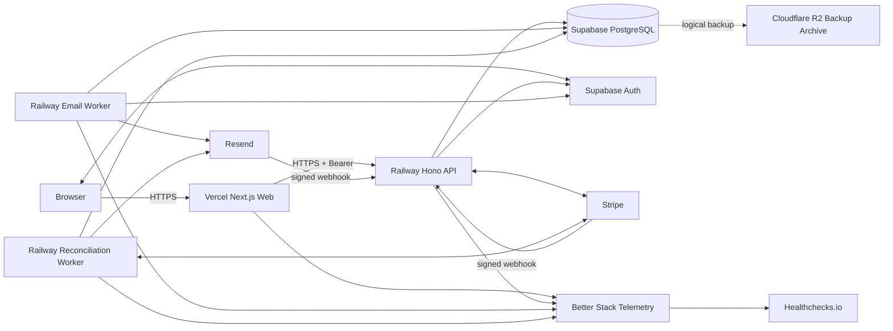

# 180 Infrastructure / Deployment

## 1. 目的

本書は、**off r39'x in 大阪らへん2027** Webシステムの完成形におけるInfrastructure Architecture、Environment Topology、Hosting、Runtime Process、Secret / Cryptographic Key Placement、Database Connection / Migration、Deployment / Rollback、Readiness / Liveness、Scheduled Worker / Reconciliation、Observability Infrastructure Wiring、Audit Infrastructure Access、Retention Purge、Backup / Restore、Production Access、および `SPEC-170` Test Gateとの接続を定義する。

本書は **Infrastructure Architecture / Environment / Hosting / Deployment / Runtime Process / Secret Placement / Migration Execution / Scheduler Wiring / Health Check / Rollback / Observability Infrastructure Wiring / Infrastructure Access BoundaryのCanonical Owner** である。

本書は、上流Canonical Ownerが定義したDomain State、Business Rule、API Route、Database Schema、Security Control、Reliability timeout / retry / reconciliation cadence、Observability event / metric / alert / retention、Test Case ContractをInfrastructure都合で変更しない。

特に次を禁止する。

- Browser / Next.js WebからBusiness Databaseを直接更新する経路を作る。
- Railway WorkerやVercel Functionを別System of Recordとして扱う。
- Provider Result Unknownをdeployment都合で成功または失敗へ確定する。
- migration failure時に旧constraintをapplication-only checkへ置換して続行する。
- `UCR-130-001〜006`、`UCR-150-001〜002`、`UCR-170-001`を反映済みとしてInfrastructureへ配置する。
- Production Secret / Production Business Data / Production QR protected material / Production Session materialをdevelopment / testへ複製する。
- external ProviderのSLA、復旧時間、backup retention等を本システムの保証値として捏造する。

本書はMVP、Step1、Step2、初期リリース等でInfrastructure要件を分断しない。長期運用される完成システムを対象とする。

---

## 2. Canonical Scope

本書は少なくとも次をCanonicalに所有する。

- `production` / `staging` / `development` / `test` のEnvironment Model
- Vercel / Railway / Supabase / Stripe / ResendのEnvironment別接続
- DNS / Domain / HTTPS境界
- Railway persistent service / worker / maintenance job topology
- Hono API / Email Worker / Reconciliation Worker runtime
- Secret store、Secret reader、rotation deployment
- QR key bundle / `OBS_CORRELATION_HMAC_KEY` placement
- PostgreSQL major version compatibility、connection、pool sizing、TLS、DB principal
- migration execution、schema readiness、expand / contract deployment
- build artifact identity、release manifest、deployment order
- readiness / liveness / startup validation
- graceful shutdown / in-flight operation termination boundary
- rollback、failed migration、failed worker deployment handling
- scheduled reconciliation / recovery execution wiring
- observability backend / dashboard / alert delivery wiring
- Audit read / purge / temporary export infrastructure access
- independent alert-delivery health path
- backup / restore / restore rehearsal / post-restore reconciliation
- Production infrastructure access / break-glass
- `SPEC-170` Test groupとPR / merge / staging / Production / nightly gateの接続

本書は次をCanonicalには再定義しない。

- API request / response / Operation ID: `SPEC-110`
- Notification Domain / Email Job lifecycle: `SPEC-120`
- Database table / column / business constraint: `SPEC-100` および限定委譲された `SPEC-160`
- Security Control値: `SPEC-140`
- retry / timeout / reconciliation cadence / Recovery Runbook: `SPEC-150`
- log / metric / dashboard / alert rule / retention semantic: `SPEC-160`
- Test Case / coverage / runner retry / quarantine: `SPEC-170`

---

## 3. 依存仕様と採用理由

| Spec | Infrastructureへ入力するCanonical Contract | 本書でwireする対象 |
|---|---|---|
| `SPEC-000` | Canonical Owner、`depends_on`、UCR、未決定事項の決定規則 | 本書の責務境界、UCR未反映扱い、次仕様生成 | 
| `SPEC-010` | Vercel / Railway / Supabase / Stripe / Resend System Boundary、System of Record、`INV-010-01〜10` | Hosting topology、Business mutation経路、failure isolation |
| `SPEC-100` | `app` schema、`pgcrypto`、`btree_gist`、migration / constraint / lock / history rule | PostgreSQL 17、extension readiness、DB principal、migration order |
| `SPEC-110` | Hono API、`/api/v1`、Stripe webhook、Runtime Validation | Railway API exposure、webhook DNS、health pathとの分離 |
| `SPEC-120` | Email Worker、Resend webhook、required config、worker HTTP endpoint禁止 | Email Worker service、Resend credentials、worker execution |
| `SPEC-140` | environment separation、DB least privilege、TLS、Secret / QR key rotation、Fail Closed | Secret store、reader matrix、TLS verify-full、startup failure |
| `SPEC-150` | failure domain、timeout / retry、worker cadence、reconciliation matrix、recovery | persistent worker scheduler、graceful shutdown、missed-run detection |
| `SPEC-160` | log / metric / dashboard / alert / Audit / retention、`OBS-ALT-037` | Better Stack wiring、Healthchecks.io independent path、Audit access/purge |
| `SPEC-170` | G1〜G10、Critical Test retry=0、Critical quarantine禁止、Provider Smoke | CI/CD gate、staging evidence、Production promotion policy |

`SPEC-060`, `SPEC-070`, `SPEC-080`, `SPEC-090`, `SPEC-130` はInfrastructureが直接再定義する対象ではなく、上記Canonical Ownerから到達する関連仕様とする。

### 3.1 未反映UCR

本書作成時点では次を**未反映**として扱う。

```text
UCR-130-001〜006
UCR-150-001〜002
UCR-170-001
```

したがって、本書は次を行わない。

- `UCR-150-001`だけに存在するdedicated Recovery APIをRailway routeへ追加する。
- `UCR-150-002`だけに存在するAdmin recovery UIをdeployment smoke対象へ登録する。
- `UCR-170-001`だけで要求されるOperation IDをlog / metric / deployment registryへ推測追加する。
- `UCR-130-001〜006`だけのCapability / API / Indexを既存Infrastructure dependencyとみなす。

---

## 4. Canonical Terms

| Term | 意味 |
|---|---|
| Canonical Environment | `production`, `staging`, `development`, `test` の4環境 |
| Deployment | 1つのsource commit / artifactを特定Environmentへ配置した実行単位 |
| Release Ref | source commit SHAを基礎とするimmutable release identifier |
| Artifact Manifest | commit、lockfile hash、migration hash、runtime、OCI digest、Vercel deployment ID等を束ねるmanifest |
| Runtime Identity | 実行中serviceがDB / Providerへ接続するmachine principal |
| Migration Identity | DDL / extension / grantを実行する専用principal |
| Incident Read Identity | incident調査専用read-only DB principal |
| Audit Read Identity | `app.audit_events`専用read-only principal |
| Audit Purge Identity | retention期限を過ぎたAudit rowだけをpurgeする専用principal |
| Emergency Recovery Identity | `SPEC-150` が許可するout-of-band recoveryだけに使用するbreak-glass identity |
| Persistent Worker | Railway上で常時稼働し、sub-5-minute cadenceを内部schedulerで実行するprocess |
| Scheduler Tick | workerがdue taskを評価する15秒のinternal tick |
| Production-class Recovery Quarantine | Production dataを扱えるが通常Web/API/Providerから切断された一時復旧環境。Canonical `test` ではない |
| Primary Observability Backend | Better Stack Telemetry |
| Independent Alert Health Backend | Healthchecks.io |
| Backup Archive | Cloudflare R2上のProduction-class encrypted logical backup bucket |

---

## 5. Rule ID体系

| Prefix | Category |
|---|---|
| `INF-ARC-*` | Infrastructure Architecture |
| `INF-ENV-*` | Environment |
| `INF-VCL-*` | Vercel |
| `INF-RWY-*` | Railway |
| `INF-DB-*` | Supabase PostgreSQL / migration |
| `INF-AUTH-*` | Supabase Auth infrastructure |
| `INF-SEC-*` | Secret / key / infrastructure access |
| `INF-PRV-*` | Stripe / Resend wiring |
| `INF-WRK-*` | Worker / scheduler / recovery execution |
| `INF-DEP-*` | Build / deployment |
| `INF-RBK-*` | Rollback |
| `INF-HLT-*` | Health / readiness |
| `INF-OBS-*` | Observability backend |
| `INF-AUD-*` | Audit infrastructure |
| `INF-BKP-*` | Backup / restore |
| `INF-TST-*` | Test / deployment gate |

同一Rule IDを別意味へ再利用してはならない。

---

# Part I — Infrastructure Architecture

## 6. Infrastructure Objective

**INF-ARC-001:** Availabilityより `INV-010-01〜10`、financial / entitlement / authorization / check-in / audit integrityを優先する。Infrastructure障害時にSecurity / DB constraint / Provider authorityを迂回してサービス継続しない。

**INF-ARC-002:** Business mutation pathは次のままとする。

```text
Browser
  -> Next.js Web / Vercel
  -> Hono API / Railway
  -> Supabase PostgreSQL
```

Supabase Auth、Stripe、Resendの例外経路は上流どおり維持する。

**INF-ARC-003:** Infrastructure support component、observability backend、backup archive、CI/CDはBusiness DatabaseのSystem of Recordにならない。

**INF-ARC-004:** API、Email Worker、Reconciliation Workerは独立Railway serviceとし、process crash / deploy / scale / secret scopeを相互分離する。

## 7. Logical topology



Better Stack、Healthchecks.io、Cloudflare R2はsupporting infrastructureであり、`SPEC-010` のBusiness System Boundary / System of Recordを変更しない。

---

# Part II — Environment Model

## 8. Canonical Environment

Canonical Environmentはexactに次の4つとする。

```text
production
staging
development
test
```

**INF-ENV-001:** Environment名をapplication config、log field、metric label、deployment manifest、database application_nameでexactに一致させる。

**INF-ENV-002:** Vercel / Railway / Supabase / Stripe / Resend / Better Stack / DB credential / QR key / correlation keyをEnvironment間共有しない。

### 8.1 Environment topology

| Environment | Vercel | Railway | Supabase | Stripe | Resend | Observability | Intended use |
|---|---|---|---|---|---|---|---|
| `production` | dedicated project | dedicated project | dedicated project | dedicated live account boundary | dedicated API key / sending identity | dedicated Production sources | real users / real money |
| `staging` | dedicated project | dedicated project | dedicated project | dedicated test-mode account boundary | dedicated nonprod key / sender | staging sources | pre-release verification |
| `development` | dedicated Vercel project + local dev | dedicated Railway project for shared dev integration | dedicated project | dedicated test-mode account boundary | dedicated dev key / sink | dev sources | developer integration |
| `test` | dedicated project used only when deployed E2E is required | dedicated project / ephemeral CI services | ephemeral PostgreSQL 17 or dedicated Supabase test project where Provider contract requires | dedicated test-mode account boundary | dedicated test key / sink | test sources | automated test |

**INF-ENV-003:** Vercel native Preview deploymentは第5のCanonical Environmentではない。PR Previewは `development` data classificationとして扱い、Production / staging Secretを受け取らない。

**INF-ENV-004:** Production Business Data、Production Secret、Production QR protected material、Production Session materialを`development` / `test`へ複製しない。

**INF-ENV-005:** `staging` にProduction SecretまたはProduction Provider credentialを配置しない。StagingはProduction-like configurationであってProduction authorityではない。

## 9. Environment identity validation

全server processは起動時に次を照合する。

```text
APP_ENV
EXPECTED_SUPABASE_PROJECT_REF
EXPECTED_STRIPE_MODE
EXPECTED_RESEND_ENV_ID
EXPECTED_OBSERVABILITY_ENV
EXPECTED_DATABASE_ENV_MARKER
```

`EXPECTED_DATABASE_ENV_MARKER` はBusiness tableを増やさず、deployment-managed database settingまたはconnection target metadataで確認する。

**INF-ENV-006:** `APP_ENV=production` でtest-mode Stripe、nonproduction Supabase project、nonproduction QR keyring、nonproduction observability tokenのいずれかが検出された場合、processはReadyにならない。

---

# Part III — Domain / DNS / HTTPS

## 10. Domain boundary

External actual domain nameはproject-ownerが所有する外部事実であるため本書で捏造しない。Infrastructure contractとして次のlogical originを必須設定とする。

```text
PUBLIC_WEB_ORIGIN
PUBLIC_API_ORIGIN
STAGING_WEB_ORIGIN
STAGING_API_ORIGIN
```

**INF-VCL-001:** Production Web custom domainはVercel Production projectだけへ向ける。

**INF-RWY-001:** Production API custom domainはRailway Production `api` serviceだけへ向ける。

**INF-ENV-007:** wildcard DNS recordでdevelopment / staging deploymentをProduction hostname配下へ自動公開しない。

## 11. HTTPS / certificate

- Production Web / APIはHTTPS only。
- TLS terminationはVercel / Railway managed certificateを使用してよい。
- applicationは `SPEC-140` のHSTS / canonical host / mixed-content policyを維持する。
- HTTPはBusiness contentを返さずHTTPS redirectまたはedge rejectとする。

**INF-VCL-002:** Vercel preview / stagingはDeployment Protectionを有効化し、公開が必要なProvider callbackだけをRailway staging APIへ限定する。

**INF-VCL-003:** Production公開Web custom domainは一般利用者へVercel Authenticationを要求しない。Vercel-generated preview deployment URLはProduction projectでも保護する。

---

# Part IV — Vercel Web Runtime

## 12. Vercel project boundary

4 Canonical Environmentは別Vercel projectとする。1 project内のEnvironment Variable scopeだけでProductionとtestを共存させない。

Canonical project logical names:

```text
r39x-web-production
r39x-web-staging
r39x-web-development
r39x-web-test
```

実Provider上の名前は組織namespace制約に合わせて変えてよいが、deployment manifestでEnvironment mappingを固定する。

## 13. Runtime

- Node.js major: **24.x**
- package manager: repository `packageManager` fieldで固定したpnpm
- Next.js App Router
- Vercel Node runtime
- Production public source map: **禁止**
- private source map: Better Stack Error TrackingへCIからupload

**INF-VCL-004:** `package.json engines.node` は `24.x` とし、Vercel project runtimeと一致させる。

**INF-VCL-005:** Web buildへDB credential、Stripe Secret、Resend Secret、QR key、Supabase service credentialを渡さない。

### 13.1 Vercel server-side Secret

Vercel Webが読めるS1/S2 materialは必要最小限とする。

- CSRF server secret / signing configuration
- Better Stack Web ingestion credential
- Supabase public/publishable configurationはSecret扱いしないがEnvironment別に分離

Hono API用DB / Provider / QR SecretはVercelへ配置しない。

---

# Part V — Railway Runtime / Process Topology

## 14. Railway project boundary

Canonical Environmentごとに別Railway projectを使用する。

各projectに最低限次のserviceを置く。

```text
api
email-worker
reconciliation-worker
```

Productionだけ次のmaintenance service / scheduled jobも持つ。

```text
audit-retention-purge
backup-export
alert-canary
```

stagingには `alert-canary` とrestore / backup testを必要時に安全なnonproduction dataで実行可能にする。

**INF-RWY-002:** `email-worker`, `reconciliation-worker`, maintenance jobにはpublic domainを付与しない。

## 15. Common Railway runtime

- OCI base: `node:24-bookworm-slim` 系をmajor/minor digestでpin
- process user: non-root
- timezone: `UTC`
- `NODE_ENV=production` for staging / production build artifact execution
- `APP_ENV` はCanonical Environmentを別途保持
- stdout/stderrはstructured log only
- graceful shutdown: `SIGTERM` handler必須

**INF-RWY-003:** API / workerは同一OCI image digestを使用し、entrypointだけを分ける。

Canonical entrypoint:

```text
api                    -> node dist/apps/api/server.js
email-worker           -> node dist/workers/email-worker.js
reconciliation-worker  -> node dist/workers/reconciliation-worker.js
audit-retention-purge  -> node dist/jobs/audit-retention-purge.js
backup-export           -> /app/bin/backup-export
alert-canary            -> node dist/jobs/alert-canary.js
```

## 16. Replica policy

| Service | production | staging | development | test |
|---|---:|---:|---:|---:|
| API | 2 | 1 | 1 | 1 |
| Email Worker | 2 | 1 | 1 | 1 |
| Reconciliation Worker | 2 | 1 | 1 | 1 |

Replica追加はDB pool budget checkを通過した場合だけ許可する。

**INF-RWY-004:** replica数を増やしてもscheduler / Business Cause / DB unique / `SKIP LOCKED` / advisory lockを無効化しない。

## 17. Graceful shutdown

Railwayから`SIGTERM`を受けたprocessは次を実行する。

1. readinessを即時`503`へ変更する。
2. 新HTTP request / worker claim / scheduled batch開始を停止する。
3. APIのin-flight requestは最大 **20秒** graceful drainする。ただし上流operation deadlineを延長しない。
4. Workerは新item claimを停止し、現在itemが安全に終了できる場合だけ上流15秒等のitem deadline内で完了する。
5. Provider call開始済みで結果不明のitemを「失敗」と書き換えない。`UNKNOWN_RESULT` / claim recoveryへ残す。
6. DB transaction中ならcommit / rollback結果を通常logicで確定する。kill deadlineを超える場合はconnection close後に`SPEC-150` commit-unknown ruleへ委譲する。
7. OpenTelemetry / log exporterを最大 **2秒** flushする。flush失敗でBusiness resultを変えない。
8. DB poolをcloseしprocess exitする。

**INF-RWY-005:** graceful shutdown中に新Provider side effectを開始しない。

---

# Part VI — Database / Supabase

## 18. Supabase project separation

4 Canonical Environmentは別Supabase projectとし、DatabaseとAuthをEnvironment単位で分離する。

**INF-DB-001:** Production Supabase projectのDatabase / Auth credentialを他Environmentへ複製しない。

**INF-AUTH-001:** Auth redirect / callback allowlistはEnvironment自身のWeb originだけを登録する。Production Authがstaging / localhost callbackを受理する設定にしない。

## 19. PostgreSQL major version

Canonical deployed PostgreSQL majorは **17** とする。

- production / staging / development / test DB integration engineはmajor 17で一致させる。
- patch/build versionはSupabase managed updateに従う。
- major upgradeはstagingでfull migration / DB / concurrency / restore Testを通した後に別releaseとして実施する。

**INF-DB-002:** CI DB testがPostgreSQL major 17以外で通ってもProduction DB compatibility evidenceとして扱わない。

**INF-DB-003:** ProductionのPostgreSQL majorが17以外になった場合、application deployを自動継続せず、SPEC-180改訂またはmajor-upgrade releaseを要求する。

## 20. Required schema / extensions

Readinessは次をexactに確認する。

```text
schema app exists
extension pgcrypto exists
extension btree_gist exists
required migration version/hash matches release manifest
```

`btree_gist` missing時にKaraoke overlap checkをapplication-onlyへfallbackしない。

## 21. Connection mode / TLS

Railway persistent runtimeはSupabase **direct Postgres connection**を使用する。

- port 5432
- `sslmode=verify-full` equivalent
- Supabase project CA certificateをserver-side protected configとしてmount / inject
- certificate verification無効化禁止
- session timezone UTC
- `application_name=r39x/<environment>/<service>`
- `statement_timeout`, `lock_timeout`は`SPEC-150`値へ接続

Migration / `pg_dump` / restoreもdirect connectionを使用する。

**INF-DB-004:** network convenienceだけを理由にtransaction-mode poolerへ切り替え、session advisory lock / migration semanticsを失わせない。

## 22. DB roles / identities

### 22.1 Role model

```text
app_runtime                NOLOGIN group role
app_api_runtime            LOGIN, API scoped
app_email_runtime          LOGIN, Email scoped
app_reconciliation_runtime LOGIN, reconciliation scoped
app_migrator               LOGIN, DDL / GRANT / extension
app_incident_reader         LOGIN or temporary LOGIN, read-only business incident scope
app_audit_reader            LOGIN or temporary LOGIN, audit-only read
app_audit_maintenance_owner NOLOGIN, owns fixed audit purge function only
app_audit_purger            LOGIN, audit retention function EXECUTE only
app_backup_reader           LOGIN, logical backup read-only
app_emergency_recovery      NOLOGIN role, break-glass only
```

**INF-DB-005:** `app_runtime` groupおよびruntime login roleはsuperuser、BYPASSRLS、replication、role creation、schema ownershipを持たない。

**INF-DB-006:** `app_migrator` credentialをAPI / worker containerへ配置しない。

### 22.2 `app_api_runtime`

- `app_runtime` baseline
- Business APIに必要なSELECT / INSERT / UPDATE
- `app.audit_events` はINSERTのみ
- generic DELETEなし
- DDL / GRANTなし

### 22.3 `app_email_runtime`

- Notification / Email support tablesと必要source readのみ
- `app.audit_events` INSERT only when upstream requires
- Order / Ticket / Reservationのarbitrary mutation権限なし

### 22.4 `app_reconciliation_runtime`

- `SPEC-150` のautomatic repair対象に必要なtableだけへSELECT / bounded UPDATE / INSERT
- detection-only対象を更新可能にするgeneric grant禁止
- DDL / role management禁止

### 22.5 `app_incident_reader`

- transaction default `READ ONLY`
- SELECTのみ
- Secret / QR raw materialを返すgeneric viewを作らない
- ordinary Administrator / Staffへcredentialを配布しない

### 22.6 `app_audit_reader`

- `app.audit_events` SELECTのみ
- Business table DMLなし
- ordinary Administrator / Staffへ付与しない

### 22.7 `app_audit_purger`

- `app.audit_events` へのdirect `DELETE`権限を持たない
- migrationで作成する固定関数 `app.purge_expired_audit_events()` への `EXECUTE` のみ
- Business table SELECT / INSERT / UPDATE / DELETEなし
- role / DDL privilegeなし
- interactive human use禁止

`app.purge_expired_audit_events()` は `SECURITY DEFINER` とし、ownerはNOLOGINの `app_audit_maintenance_owner` とする。このowner roleだけが `app.audit_events` のretention DELETEに必要な権限を持ち、runtime credentialとして配布しない。`app_migrator` はmigration時だけ当該ownerへfunction ownershipを設定できる。関数は引数を取らず、`search_path` を固定し、`PUBLIC` の `EXECUTE` をrevokeする。削除条件と1回のbatch上限を関数本体へ固定するため、purge callerがcutoffや任意SQLを指定できる構造にしてはならない。

### 22.8 `app_backup_reader`

- `app` schema logical backupに必要なSELECTのみ
- DML / DDLなし
- Auth provider credentialなし

## 23. Pool sizing

Production canonical pool max:

| Service | per replica max | replicas | max connections |
|---|---:|---:|---:|
| API | 8 | 2 | 16 |
| Email Worker | 4 | 2 | 8 |
| Reconciliation Worker | 4 | 2 | 8 |
| Incident / migration / purge / backup reserved | - | - | 8 reserved |

Application + operation budgetは**40 connections**を上限とする。

Staging: API 4、Email 2、Reconciliation 2。Development/Test: API 2、Email 1、Reconciliation 1。

- pool acquisition timeout: `SPEC-150` の2秒
- idle connection timeout: 30秒
- application pool minimum: 0

**INF-DB-007:** deploy preflightは `SHOW max_connections` 等のProvider-visible値から、configured application budgetがDB max connectionの40%を超えないことを確認する。超える場合はreleaseを停止し、replicaまたはpoolを減らすかDB capacityを増やす。

## 24. Migration lock

Migrationは1 Environmentにつき同時1件とする。

```sql
SELECT pg_advisory_lock(hashtext('r39x:schema-migration'));
```

専用single connectionで取得し、migration終了時にreleaseする。lock取得上限は60秒とし、取得不能ならdeploymentを失敗させる。

**INF-DB-008:** migration lock待ちを理由に複数migration processを並行実行しない。

---

# Part VII — Secret / Key Placement

## 25. Secret stores

Canonical placement:

- Vercel server Secret: Vercel Sensitive Environment Variables
- Railway runtime Secret: Railway Sealed Variables
- CI/CD deployment credential: GitHub Actions protected Environment Secrets
- Human break-glass / offline recovery material: project-owner-controlled encrypted recovery vault。CI / runtimeへ常時同期しない

**INF-SEC-001:** Secret valueをsource、Client bundle、Docker layer、build cache、SBOM、log、test artifact、deployment outputへ出さない。

**INF-SEC-002:** Production Secretはnonproduction Secretと共有しない。

## 26. Secret reader matrix

| Secret / protected config | Web | API | Email Worker | Recon Worker | Migrator | Purge | Backup | Human break-glass |
|---|---:|---:|---:|---:|---:|---:|---:|---:|
| Supabase service credential | No | Yes | Yes | conditional Yes | No | No | No | No |
| API runtime DB credential | No | Yes | No | No | No | No | No | No |
| Email DB credential | No | No | Yes | No | No | No | No | No |
| Recon DB credential | No | No | No | Yes | No | No | No | No |
| migration credential | No | No | No | No | Yes | No | No | emergency only |
| Stripe secret key | No | Yes | No | Yes | No | No | No | No |
| Stripe webhook signing secret | No | Yes | No | No | No | No | No | No |
| Resend API key | No | No | Yes | Yes only for same-key reconciliation | No | No | No | No |
| Resend webhook signing secret | No | Yes | No | No | No | No | No | No |
| QR HMAC keyring | No | Yes | No | Yes | No | No | No | emergency inspect prohibited |
| QR AEAD keyring | No | Yes | No | Yes | No | No | No | emergency inspect prohibited |
| `OBS_CORRELATION_HMAC_KEY` | server-side Web if emits fingerprint | Yes | Yes | Yes | No | No | No | No |
| Better Stack ingest token | Yes server-side | Yes | Yes | Yes | No | Yes | Yes | No |
| Healthchecks ping URL | No | No | No | No | No | No | alert-canary only | No |
| R2 write credential | No | No | No | No | No | No | Yes | No |
| backup decryption private identity | No | No | No | No | No | No | No | Yes |

**INF-SEC-003:** Stripe componentがQR keyを読む、Email Workerがmigration credentialを読む等のcross-domain Secret grantを禁止する。

## 27. QR keyring deployment

Canonical server config:

```text
QR_PROTECTION_CURRENT_VERSION=<integer>
QR_ALLOWED_READ_VERSIONS=<comma separated bounded integers>
QR_KEYRING=<sealed structured secret>
```

`QR_KEYRING`は各versionについて別々の32-byte HMAC key / 32-byte AEAD keyを持つ。

Startup validation:

1. current versionがexactに1つ存在
2. current versionがread allowlistに含まれる
3. allowlistはcurrent + migration中previousだけ
4. HMAC / AEAD keyは32 byte
5. 同一versionのHMAC / AEAD raw keyが異なる
6. unknown version / duplicate current / parse failureでReady=false

### 27.1 Routine rotation sequence

1. new version secret bundleをRailway API / Reconciliation Workerへsealed deployする。
2. old + newをread allowlistへ入れる。write currentはまだold。
3. readiness成功を確認する。
4. `QR_PROTECTION_CURRENT_VERSION` をnewへ切り替えて再deployする。
5. `SPEC-150` 10分cadence QR key migrationを実行する。
6. active old-version row=0を**連続2回の10分scan**で確認する。
7. old versionをread allowlist / keyringから除去して再deployする。

**INF-SEC-004:** rotation中も新規Token / rewrapはcurrentだけを使用し、decrypt不能rowを自動Token再発行しない。

## 28. `OBS_CORRELATION_HMAC_KEY`

- Environment別
- routine rotation 180日以内
- `OBS_CORRELATION_HMAC_KEY_VERSION` をnon-secret integerとして併設
- rotate後にold raw idempotency keyを保存してfingerprint再計算しない
- missing時はraw keyをlogするfallback禁止

## 29. Provider webhook Secret rotation

`SPEC-140` のcurrent + previous最大24時間をそのまま実装する。

Deployment sequence:

1. Provider側new webhook secretを生成
2. appにcurrent / previous両方をsealed配置
3. verifierがどちらでもtimestamp / event dedupeを維持して検証
4. Provider deliveryをnewへ切替
5. 最大24時間以内にoldを削除

Compromise時はoverlapせずoldを即時revokeする。

---

# Part VIII — Stripe / Resend Wiring

## 30. Stripe environment

Environmentごとにcredential / webhook endpoint / Provider object namespaceを分離する。

| Environment | Mode | Webhook target |
|---|---|---|
| production | live | `${PUBLIC_API_ORIGIN}/api/v1/webhooks/stripe` |
| staging | test | `${STAGING_API_ORIGIN}/api/v1/webhooks/stripe` |
| development | test | development API origin / controlled tunnel only when needed |
| test | test simulator or dedicated provider test account | test API origin |

**INF-PRV-001:** Production Orderへtest-mode Stripe Eventを適用しない。`SPEC-140` livemode checkを維持する。

**INF-PRV-002:** Provider Contract Smokeはstaging/test credentialだけを使用し、Production credentialを使用しない。

## 31. Resend environment

Environmentごとに次を分離する。

```text
RESEND_API_KEY
RESEND_WEBHOOK_SECRET
EMAIL_FROM
EMAIL_REPLY_TO
APP_BASE_URL
provider message identifiers
```

Production Business Email sender domainとnonproduction sender identityを混用しない。

Resend webhook target:

```text
/api/v1/webhooks/resend
```

**INF-PRV-003:** nonproduction Emailはapproved sink / test recipientだけへ送る。Production recipient listをfixture / smoke testへ使用しない。

---

# Part IX — Worker / Scheduler

## 32. Scheduler product decision

`SPEC-150` には15秒、30秒、1分、2分等のsub-5-minute cadenceが存在するため、Railway CronだけではCanonical cadenceを満たせない。

本システムは次を採用する。

- Email Worker: Railway **persistent service**
- Reconciliation Worker: Railway **persistent service**
- 5分以上で独立してよいmaintenance: Railway Cron
- worker internal scheduler tick: **15秒**

**INF-WRK-001:** in-process schedulerはBusiness stateをmemory queueだけで保持しない。毎tick、Business Databaseのcurrent row / timestamp / state predicateからdue workを再発見する。

## 33. Email Worker

### 33.1 Runtime contract

```text
runtime: Node.js 24
entrypoint: node dist/workers/email-worker.js
production replicas: 2
logical poll: 15s
claim lease: 120s
claim expiry sweep: 30s
DB pool: 4 / replica
public HTTP domain: none
health server: Railway internal/platform healthcheck only
```

- `READY` / `UNKNOWN_RESULT`かつ`next_attempt_at <= now`だけをclaimする。
- `FOR UPDATE SKIP LOCKED`を維持する。
- Provider call中DB transactionをopenしない。
- shutdown時に新claim停止。

**INF-WRK-002:** Email Worker deployment failureはAPI deployment successと分離して扱う。新Email WorkerがReadyにならない場合、Production release acceptanceを失敗とし、旧compatible workerを維持またはrollbackする。

## 34. Reconciliation Worker

### 34.1 Runtime contract

```text
runtime: Node.js 24
entrypoint: node dist/workers/reconciliation-worker.js
production replicas: 2
scheduler tick: 15s
DB pool: 4 / replica
public HTTP domain: none
```

Reconciliation jobごとにstable advisory lock keyを持つ。

```text
r39x:recon:<canonical-internal-operation-key>
```

各replicaはdue判定後、dedicated DB sessionで `pg_try_advisory_lock()` を取得できた場合だけそのjob batchを開始する。process crash / connection closeでlockは解放される。

**INF-WRK-003:** advisory lockはDomain idempotencyの代替ではない。duplicate job invocationが発生してもrow lock / Business Cause / current-state predicate / unique constraintが最終防御となる。

## 35. Canonical cadence wiring

次は `SPEC-150` の値を変更せずInfrastructure schedulerへwireする表である。

| Target | Canonical cadence / threshold wiring |
|---|---|
| Order `PREPARED` | created >5m, every 2m |
| Checkout Attempt `UNKNOWN` | immediate, every 1m, max 30m |
| Order `AWAITING_PAYMENT` | Payment Deadline +5m, every 5m |
| Order `REVIEW_REQUIRED` | every 15m, 2h boundary |
| Stripe Webhook `FAILED_RETRYABLE` | every 1m; upstream 30m / 6 attempts |
| Stripe Webhook `REVIEW_REQUIRED` | every 15m |
| Refund `REQUESTED/PENDING` | first 30m every 2m |
| Refund later phase | 30m..6h every 30m |
| Confirmed Order entitlement completeness | every 5m |
| Ticket / Check-in consistency | every 10m |
| Karaoke Hold expiry | every 1m |
| Reservation / Karaoke Ticket relation | every 10m |
| Goods Allocation / counter | every 10m |
| Goods Handoff consistency | every 10m |
| Missing Notification Request | every 5m |
| Email queue eligibility | every 15s |
| Expired Email claim | every 30s |
| unmatched Resend webhook | every 10m, max 1h |
| QR key migration incomplete | every 10m |

**INF-WRK-004:** cadenceをRailway Cronの制約に合わせて5分以上へ丸めない。

## 36. Missed run / overlap / deployment boundary

- worker startup時に全jobのcurrent due predicateを即時評価する。
- memory上の「前回実行時刻」だけをmissing-run authorityにしない。
- `r39x_reconciliation_last_success_unixtime` 等 `SPEC-160` metricでlast successを更新する。
- `SPEC-160` alertがlast-success ageを検知できるようexportする。
- deployment drain中は新batchを開始しない。
- old replicaが終了前にnew replicaが起動してもadvisory lock / row claimで重複を抑止する。

**INF-WRK-005:** scheduled runがskip / overlapしてもDomain Stateを「実行済み」とmemoryだけで記録しない。

## 37. Consistency Review processing

Reconciliation Workerはautomatic repairが上流で明示許可された対象だけstate mutationする。Detection-only対象はCase open / metric / logまでとし、Entitlement、Check-in atomicity mismatch等をblind repairしない。

**INF-WRK-006:** `UCR-150-001`未反映中はmanual dedicated Recovery HTTP routeを追加しない。Automatic reconciliationと既存Canonical operationだけをwireする。

---

# Part X — Readiness / Liveness

## 38. Health endpoint separation

各Railway persistent serviceは次を持つ。

```text
GET /internal/health/live
GET /internal/health/ready
```

Worker serviceにはpublic domainを付けないためhealth endpointはInternet公開されない。API serviceではresponseをgenericにし、Secret / schema detail / provider statusを返さない。

## 39. Liveness

Livenessはprocess自体がevent loopを処理できることだけを確認する。

- config parse完了後process main loopが動作
- internal fatal flagなし
- DB / Stripe / Resend reachabilityは判定しない

Success: `200 {"status":"ok"}`。

**INF-HLT-001:** transient Stripe / Resend障害をliveness failureにしてrestart loopを起こさない。

## 40. Readiness

Service自身が安全に受け付けられるかを確認する。

Common:

1. `APP_ENV` / environment identity valid
2. required config present and Zod validation pass
3. required Secret present / version valid
4. DB connection acquire within upstream 2s boundary
5. TLS connection verified
6. `app` schema exists
7. release-required migration hash / schema version present
8. `pgcrypto`, `btree_gist` present
9. DB timezone UTC
10. security configuration valid

API additionally:

- QR current key available
- allowed previous key set valid
- Supabase Auth issuer / audience / JWKS origin config valid syntactically
- Stripe / Resend webhook verification config present

Email Worker additionally:

- Resend API key present
- Supabase recipient-resolution credential present

Reconciliation Worker additionally:

- Stripe reconciliation credential
- QR keyring
- required Resend reconciliation credential

**INF-HLT-002:** Security Configuration invalid / current key missing / unknown key version / duplicate current keyはwarning-onlyにせずReady=falseとする。

**INF-HLT-003:** readinessはStripe / Resendへlive network requestを必須にしない。Provider outageはdependency degradationとして扱いprocessをReadyのまま維持し、mutation自体は上流Reliability / Security ruleで失敗またはreconcileする。

## 41. Railway deploy healthcheck

Railway service healthcheck pathは `/internal/health/ready` とする。

- API / Email / Reconciliationのnew deploymentが2xxを返すまでactive切替しない。
- healthcheck timeoutは **180秒** とする。
- Railway deploy-time healthcheckはcontinuous monitoringの代替にしない。

---

# Part XI — Build / Artifact / Deployment

## 42. CI/CD platform

CI/CDはGitHub ActionsをCanonicalとする。

Production EnvironmentはGitHub protected Environmentとして扱い、Production deployment jobにproject-owner approvalを要求する。複数のauthorized infrastructure operatorが存在する場合は2名承認を要求する。

## 43. Build reproducibility

Canonical build:

```text
corepack enable
pnpm install --frozen-lockfile
pnpm lint
pnpm typecheck
<SPEC-170 test gates>
pnpm build
```

- Node 24.x
- pnpm versionは`packageManager` field exact
- lockfile変更なしでdependency resolutionを行わない
- Production build中にproduction runtime Secretを参照しない

**INF-DEP-001:** deploy artifactはtestを通過したcommit以外からbuildしない。

## 44. Artifact identity

Releaseごとに `release-manifest.json` を生成する。

```json
{
  "release_ref": "<git-sha>",
  "git_sha": "<40-hex>",
  "pnpm_lock_sha256": "<hex>",
  "migration_set_sha256": "<hex>",
  "node_major": 24,
  "api_image_digest": "sha256:...",
  "source_map_bundle_sha256": "<hex>",
  "spec_versions": {
    "SPEC-180": "1.0.0"
  }
}
```

OCI imageはGitHub Container Registry等のimmutable digest-addressable registryへpushし、Railway staging / productionは**同一image digest**を使用する。

VercelはEnvironment別buildを許可するが、`git_sha`, `pnpm_lock_sha256`, `migration_set_sha256` はRailway artifactと一致しなければならない。

**INF-DEP-002:** Production deploy時に`latest` tagだけを参照しない。digest / immutable deployment IDをrelease evidenceへ保存する。

## 45. Migration sequence

### 45.1 Staging

1. source commit / manifest確定
2. `G1..G8`成功確認
3. staging backup snapshot / rollback point確認
4. staging `app_migrator`でmigration lock取得
5. extension / expand migration
6. bounded backfill
7. constraint validation
8. schema readiness check
9. Railway API / workers deploy
10. Vercel staging staged deployment
11. staging smoke / `G10` / Provider Contract Smoke

### 45.2 Production

Production releaseは次順序を固定する。

1. same commitのstaging pre-release evidence確認
2. Production backup freshness / recovery point確認
3. Production config / Secret / environment identity dry validation
4. Production migration lock取得
5. **expand-only / backward-compatible migration**実行
6. schema readiness check
7. Railway APIをsame OCI digestでdeploy
8. Railway Email Worker deploy
9. Railway Reconciliation Worker deploy
10. all Railway readiness success
11. Vercel Production deploymentを`--skip-domain`相当でstaged作成
12. staged Vercel smoke成功
13. Production domainへpromote
14. post-deploy smoke
15. deployment observation window **10分**
16. active CRITICAL/HIGH alert、readiness failure、schema mismatch、Critical smoke failureがなければrelease accepted

**INF-DEP-003:** Webを先に切り替えて新API contractだけを要求するdeploymentをしない。APIはold/new Webが共存できる後方互換性を先に持つ。

## 46. Expand / contract compatibility

Production schema evolutionは `SPEC-100` のexpand → backfill → validate → contractを維持する。

**INF-DEP-004:** destructive contract migrationは同一cutover releaseへ含めない。

Contract migrationの実行条件:

1. new schema対応releaseがProductionで成功
2. old Web / API / Worker artifactへrollbackする必要がないことを確認
3. code search / traceでold column / state / index referenceが0
4. minimum **24時間**経過
5. dedicated migration gate再実行

State rename / deletionは上流Canonical Owner変更なしに実施しない。

## 47. Migration failure

- transaction-safe migration failure: rollbackしてdeployment停止
- concurrent index等の非transactional step failure: failed object状態を確認し、forward-fix migrationを作成するまで停止
- partially applied migrationを「schema ready」としない
- application deployを先行しない

**INF-DEP-005:** Production migration failure後に旧applicationがschema-compatibleであれば旧versionを継続する。schema incompatibleになった場合はtrafficを安全に停止し、forward-fixを優先する。

---

# Part XII — Rollback

## 48. Rollback decision

Rollback trigger:

- Railway new deployment readiness failure
- Vercel staged smoke failure
- Production post-deploy Critical smoke failure
- migration compatibility failure
- release起因のSecurity Fail Closed異常
- active CRITICAL/HIGH alertがreleaseと明確に相関し、安全継続できない場合

## 49. Application rollback

### 49.1 Vercel

Vercel immutable previous deploymentへInstant Rollback / promoteを使用する。rollback先deployment IDをrelease manifestへ記録する。

### 49.2 Railway

previous known-good OCI image digestへserviceを戻す。

**INF-RBK-001:** rollbackでProvider side effect、Stripe payment、Refund、Resend acceptance、Check-in等が「なかった」ことにしない。Business Database / Provider Authority current stateをreconciliationする。

## 50. Schema rollback

- destructive down migrationをProduction rollback authorityにしない。
- backward-compatible expand schemaを残したままapplication rollbackする。
- schema defectはforward-fixを基本とする。
- historical financial / entitlement / audit rowをrollbackで削除しない。

**INF-RBK-002:** application rollback対象artifactがcurrent schemaを読めない場合はrollback禁止とし、forward-fixまたはcompatible intermediate artifactを使用する。

## 51. Worker rollback

Worker deployだけ失敗した場合:

1. API / Webのcompatibilityを確認
2. previous worker digestがcurrent schemaとcompatibleならworkerだけrollback
3. claim lease / advisory lock / Provider unknown itemはcurrent DB stateから再開
4. in-flight Provider resultを再送で推測しない

---

# Part XIII — Observability Infrastructure Wiring

## 52. Primary backend

Primary Observability Backendは **Better Stack Telemetry** とする。

使用責務:

- structured Application Log ingestion
- OpenTelemetry metrics ingestion
- source maps / error symbolication
- Dashboard implementation
- `SPEC-160` alert rule evaluation
- alert / incident metadata

**INF-OBS-001:** Better Stack上のmetric名、label、histogram bucket、alert threshold、samplingをSPEC-180独自値へ変更しない。`SPEC-160` manifestをsource of truthとしてconfig生成する。

## 53. Environment / dataset separation

Productionはretention classごとに別sourceを作る。

```text
r39x-production-info       30d logs
r39x-production-debug       7d logs
r39x-production-error      90d logs
r39x-production-security  180d logs
r39x-production-alertmeta 730d logs/incident metadata export
r39x-production-metrics   400d metrics
```

これらは `SPEC-160` retentionのInfrastructure実装であり、Provider保証値ではない。Better Stack契約 / planが必要retentionを設定できない場合、Production acceptanceを停止し、retentionを短縮して続行しない。

Staging / development / testはProduction sourceと別source / token / dashboard folder / alert routingを使用する。

**INF-OBS-002:** Production alert ruleは必ず`environment=production` filterを持ち、staging/test seriesでProduction pagingしない。

## 54. Ingestion

- API / worker: OpenTelemetry SDK + structured loggerからOTLP/HTTPへ非同期batch export
- Web server: Vercel runtime structured log + OpenTelemetry / Better Stack integration
- Browser RUMは本書の必須observability contractではない。導入する場合もsession replay / auto-captureでPIIやraw QRを収集しない設定が先行する
- exporter bufferはbounded memoryのみ
- export failureでDB transaction / Provider callを延長しない

**INF-OBS-003:** Audit EventをOTLP sinkだけへ送り、`app.audit_events` persistenceを省略しない。

## 55. Source map / deployment correlation

CIはProduction source mapをpublic assetから除外し、Better Stack Error Trackingへprivate uploadする。

release metadata:

```text
environment
release_ref
git_sha
vercel_deployment_id
railway_deployment_id
api_image_digest
```

をobservability resource attributeへ付与する。

## 56. Dashboard provisioning

`SPEC-160` のRequired DashboardをBetter Stack Dashboard as Code/APIで作成する。

Dashboard config repository path:

```text
infra/observability/dashboards/
infra/observability/alerts/
```

Alert / dashboard changeはPR review + config validation + staging applyを経てProductionへpromotionする。

**INF-OBS-004:** dashboard query failureをzeroへ表示する設定にしない。data freshness / last successful collectionを明示する。

## 57. Retention enforcement verification

Daily config drift jobはBetter Stack APIからsource retentionを読み、`SPEC-160` required valueと比較する。

Mismatch時:

- Production deploy gate failure
- existing Production runtimeはBusiness operationを継続してよい
- Security / Audit retention不足はHIGH operational incidentとして扱う

Audit 730日はBetter Stackではなく`app.audit_events`で別途維持する。

---

# Part XIV — Independent Alert Delivery Health Path

## 58. Primary alert delivery

Primary alert path:

```text
Better Stack metric/log query
  -> Better Stack alert evaluator
  -> Production escalation target(s)
```

Production escalation targetは少なくともoperator Emailとteam chat / push等の2 transportを持つ。Business Email用Resend API keyをalert delivery credentialとして再利用しない。

## 59. Independent health path

Independent backendは **Healthchecks.io** とし、Better Stackとは別account credential / projectを使用する。

### 59.1 Canary design

Railway `alert-canary` Cronを5分ごとに実行する。

1. canary専用Better Stack sourceへsynthetic pulseを送る。
2. canary alert ruleは通常Business alertと別ruleでpulse時だけFIRINGへ遷移する。
3. canary contact pointはHealthchecks.ioのsecret ping URLへ通知する。
4. Healthchecks.ioは5分周期 + 2分graceでpingを期待する。
5. 7分以内にpingが来なければHealthchecks.io自身のEmail + second channelからincidentを通知する。

このcanaryは`OBS-*` Business metric / thresholdを変更しないInfrastructure health ruleである。

**INF-OBS-005:** `OBS-ALT-037` のalert delivery failureを、失敗したBetter Stack primary deliveryだけへ再通知する循環構成にしない。

**INF-OBS-006:** Healthchecks.io ping credentialとBetter Stack ingest / alert credentialを分離する。

**INF-OBS-007:** canary自体のRailway job停止、Better Stack ingestion / evaluation / contact delivery failure、Healthchecks ping failureのいずれでもindependent missed-heartbeatとして検知可能にする。

---

# Part XV — Audit Infrastructure

## 60. `app.audit_events` access

`app.audit_events` はBusiness Database内append-only recordとして維持する。

**INF-AUD-001:** API / worker runtimeはrequired Audit EventのINSERTだけを行い、UPDATE / DELETE権限を持たない。

**INF-AUD-002:** ordinary Administrator / StaffはDB credential / SQL console / Better Stackを通じてfull Audit datasetへ直接アクセスしない。

## 61. Audit read

Full Audit readはproject-owner-authorized incident/security operatorだけが `app_audit_reader` を使用する。

Access contract:

- temporary credential、default expiration 60分
- read-only transaction
- access開始 / 終了をInfrastructure access logへ記録
- result exportはallowlisted fieldだけ
- raw QR、Secret、full provider payloadなし

## 62. Audit retention purge

Production `app.audit_events` retentionは `SPEC-160` の **730日**を維持する。

Railway Cron:

```text
job: audit-retention-purge
schedule: daily 17:15 UTC (= 02:15 JST)
principal: app_audit_purger
batch: 5000 rows / transaction
```

Canonical purge primitive:

```sql
CREATE OR REPLACE FUNCTION app.purge_expired_audit_events()
RETURNS integer
LANGUAGE plpgsql
SECURITY DEFINER
SET search_path = pg_catalog, app
AS $$
DECLARE
  deleted_count integer;
BEGIN
  WITH victims AS (
    SELECT id
    FROM app.audit_events
    WHERE occurred_at < transaction_timestamp() - interval '730 days'
    ORDER BY occurred_at, id
    LIMIT 5000
  )
  DELETE FROM app.audit_events a
  USING victims v
  WHERE a.id = v.id;

  GET DIAGNOSTICS deleted_count = ROW_COUNT;
  RETURN deleted_count;
END;
$$;

REVOKE ALL ON FUNCTION app.purge_expired_audit_events() FROM PUBLIC;
GRANT EXECUTE ON FUNCTION app.purge_expired_audit_events() TO app_audit_purger;
```

`app_audit_purger` には `app.audit_events` のdirect `DELETE`をgrantしない。Cron executionはこの関数を繰り返し呼び、戻り値が5000未満になるまでpurgeする。1 executionのwall-clock上限は10分とし、上限到達時は失敗として観測し、次回実行へ残件を持ち越す。predicate外rowをdeleteしてはならず、Business tableへDMLできない。

Purge evidence:

- release / job execution ID
- start / end timestamp
- cutoff timestamp
- deleted row count
- principal ref
- success / failure

をstructured Security/Infrastructure logとして100%記録する。Secret / deleted row bodyを記録しない。

**INF-AUD-003:** purge credentialにOrder / Ticket / Reservation / Goods / Check-in / Notificationのmutation権限を与えない。

## 63. Temporary support export

Audit / incident support exportは次を満たす。

- `app_audit_reader` / `app_incident_reader`からallowlisted query
- encrypted artifact
- project-owner-authorized recipient only
- 7日以内自動削除
- export generation / download / deletionをInfrastructure access logへ記録
- development/test datasetへimport禁止

---

# Part XVI — Backup / Restore

## 64. Production backup architecture

Productionは二層とする。

### 64.1 Provider-native backup

- Supabase Production projectでPITRを有効化する。
- configured recovery windowは**7日**とする。
- これは本システムのConfiguration Targetであり、Supabase SLA保証値とは扱わない。

Internal operational objective:

```text
RPO target: <= 15 minutes
RTO target: <= 4 hours
```

これはProvider保証ではなく本システムの運用目標である。

### 64.2 Off-site logical backup

Cloudflare R2にProduction-class encrypted logical backupを保存する。

Railway `backup-export` Cron:

```text
schedule: daily 18:30 UTC (= 03:30 JST)
source: Supabase direct connection
principal: app_backup_reader
format: pg_dump custom format
scope: app schema
compression: enabled
client-side encryption: age/X25519 recipient encryption
```

Backup workerが持つのは**encryption public recipient**だけであり、decrypt private identityを持たない。

R2 credentialはProduction backup bucketへのPut/Listに限定し、development/test bucket credentialと共有しない。

Retention:

- daily backup: 35日
- calendar month first successful backup: 400日

R2 lifecycle ruleとweekly drift checkの双方でexpiryを検証する。

**INF-BKP-001:** backup archiveをBusiness Databaseのlive read sourceにしない。

**INF-BKP-002:** backupへapplication Secret、Stripe / Resend key、QR cryptographic key、Session credentialを含めない。

## 65. Backup verification

Daily backup job success条件:

1. `pg_dump` exit 0
2. encrypted object upload 2xx
3. object size > 0
4. SHA-256 checksum / manifest保存
5. latest backup age metric更新
6. R2 HEAD/read metadataでobject存在確認

Weekly:

- latest 7 daily objectsが期待prefixに存在
- lifecycle config driftなし
- decrypt private keyなしでworkerがplaintextを読めないことを確認

## 66. Restore rehearsal

### 66.1 Monthly staging restore rehearsal

staging synthetic dataset backupをPostgreSQL 17 isolated test DBへrestoreし、次をTestする。

- all migrations / schema objects
- `pgcrypto`, `btree_gist`
- named constraints
- `app.audit_events`
- row counts / checksums
- application schema readiness
- post-restore reconciliation dry run

### 66.2 Quarterly Production recovery rehearsal

Production dataをdevelopment/testへ複製しないため、Production backup rehearsalは一時 **Production-class Recovery Quarantine** で行う。

- project-owner approval必須
- dedicated temporary Supabase projectまたはisolated PostgreSQL instance
- Vercel / normal Railway serviceを接続しない
- Stripe / Resend credentialなし
- Supabase Auth public endpointをapplicationから使用しない
- QR HMAC / AEAD keyを配布しないためraw QR表示 / scan不可
- infrastructure operatorだけがread-only verification
- rehearsal完了後24時間以内にquarantine dataを破棄

Verification:

1. backup decrypt / restore成功
2. schema version / extension一致
3. Audit Event row preservation
4. financial / entitlement row count consistency
5. foreign key / constraint validation
6. Provider IDsは外部Providerへwriteせずread-only reconciliation plan生成のみ

**INF-BKP-003:** restore rehearsalを理由にProduction Stripe / Resend credentialをquarantineへ配置しない。

## 67. Production restore authorization

Production restoreはproject-owner承認 + emergency recovery identityを要求する。

Procedure:

1. incident宣言、writes停止
2. desired recovery pointをBusiness / Provider evidenceから決定
3. source backup / PITR point checksum / timestamp記録
4. restore targetをProduction-class quarantineとして作成
5. Secretはcloneせず新規発行 / 再配置
6. schema / Audit / invariants verify
7. Stripe / Resend current authorityを**read-only**再照合
8. unknown Payment / Refund / Emailを`SPEC-150` reconciliationへ送る
9. DNS / API / Web cutover
10. post-restore reconciliation完了までhigh-risk mutationを必要に応じfail closed
11. old productionをread-only/frozen保持してincident close後に処理

**INF-BKP-004:** restoreでStripe charge / Refund / Resend acceptanceを巻き戻したことにしない。

---

# Part XVII — Production Infrastructure Access

## 68. Machine identities

Production deployはdedicated GitHub Actions deployment identityを使用する。

Credential scope:

- Vercel Production project deployのみ
- Railway Production project deployのみ
- GitHub Container Registry push/pull required repositoryのみ
- no DB runtime password unless migration job

Migration jobは別GitHub protected Environment Secretとして`app_migrator` credentialを読む。

## 69. Human access

Standing human accessを最小化する。

- normal Administrator UI role != infrastructure operator
- normal Staff role != infrastructure operator
- Supabase Dashboard Owner権限はproject-owner / approved infrastructure operatorのみ
- Production DB write SQL consoleを通常運用に使用しない
- Production Secret read-back可能なstoreを常用しない。Railwayはsealed、Vercelはsensitiveを使用する

## 70. Break-glass

Break-glass対象:

- active Administrator count=0のbootstrap
- migration/restore disaster recovery
- credential compromise rotation

Procedure:

1. project-owner approval
2. `recovery_execution_id`生成
3. temporary operator credentialを発行
4. exact runbookだけを実行
5. active Administrator bootstrapでは `SPEC-150` precondition / advisory lockを維持
6. operation終了後credential revoke
7. secret rotationが必要なら即時実行
8. Infrastructure access log + required Audit Eventを確認

**INF-SEC-005:** `recovery.exception.execute`をarbitrary SQL、generic state editor、DB superuser permissionへ変換しない。

**INF-SEC-006:** emergency recovery identityは通常API runtimeへ常時配置しない。

---

# Part XVIII — Test / Deployment Gate

## 71. Canonical Test groups

`SPEC-170` のgroupをexactに使用する。

```text
G1 unit
G2 db-migration
G3 db-integration
G4 api
G5 security
G6 reliability-recovery
G7 observability
G8 e2e
G9 provider-contract-smoke
G10 hot-concurrency
```

## 72. Gate matrix

| Stage | Required groups | Notes |
|---|---|---|
| Pull Request | G1..G8 | production Secret/dataなし。Critical retry=0 |
| Merge commit | G1..G8 | merge commit SHAで再実行、release candidate evidence生成 |
| Staging pre-release | G1..G8 + G10 + G9 | G9はprotected staging/test Provider credentialで実行 |
| Production promotion | same SHAのG1..G8 + G10 + G9 evidence required | Production credentialでTestを再実行しない |
| Nightly | G1..G8 + G10 + G9 | hot contention / recovery / provider drift検知 |

**INF-TST-001:** Production releaseではG9 credentialを必ずprovision済みにする。StagingでG9 credential outageが発生した場合はstaging deploy自体を調査可能状態に残してよいが、Production promotionはblockedとする。Production credentialで代替しない。

## 73. Retry / quarantine

- Local default runner retry: 0
- CI gating runner retry: 0
- Critical Test retry: 0
- Critical Test quarantine: 禁止
- diagnostic rerunはoriginal failure確定後のnon-gating最大1回

**INF-TST-002:** diagnostic rerun passでoriginal failureをProduction pass evidenceへ書き換えない。

## 74. Database migration gate

G2は少なくとも次をProduction deploy前に成功させる。

- PostgreSQL 17
- `pgcrypto`
- `btree_gist`
- 0から全migration
- prior supported schemaからforward migration
- Audit append-only grants
- runtime / migrator / audit / purge role grants
- schema readiness check

## 75. Production Provider Contract Smoke

G9はstaging / test Provider accountで実行する。

- Stripe Checkout / lookup / webhook contract
- Resend send / idempotency / webhook contract
- Supabase Auth verification / server lookup contract

Production Business Data、Production Email list、Production QR、Production Provider objectを使用しない。

## 76. Release evidence

Production promotionに必要なevidence:

```text
git SHA
release manifest hash
G1..G10 result set as required
runner retry count=0 evidence
critical quarantine count=0
staging deployment IDs
staging readiness/smoke result
provider contract smoke result
migration set hash
production backup freshness check
production config drift check
approval actor ref
```

---

# Part XIX — Infrastructure Failure Boundary

## 77. Failure matrix

| Failure | Infrastructure action | Forbidden action |
|---|---|---|
| Vercel deploy failure | domain promoteしない / previous保持 | partial client releaseをsuccess扱い |
| Railway API readiness failure | new deployment activateしない / rollback | DB constraint skip |
| Email Worker down | restart / old compatible worker保持 / queue DBから再発見 | Order rollback |
| Reconciliation Worker down | restart / missed due scan / alert | Provider unknownをsuccess扱い |
| DB unavailable | Ready=false where required / 503 / fail closed | empty data / sold-out偽装 |
| migration failure | deployment stop / forward-fix | application-only fallback |
| Stripe outage | API remains live but operation fails/reconciles | process restart loop / fake payment success |
| Resend outage | Email queue retains state | confirmed purchase rollback |
| observability sink outage | bounded buffering / freshness stale | unbounded memory / raw log fallback |
| Audit persistence failure | upstream high-risk transaction semanticsを維持 | external logでAudit代替 |
| alert delivery failure | independent Healthchecks path | same broken pathだけへ通知 |
| backup job failure | alert / next safe retry | backup success偽装 |
| secret invalid | Ready=false | default secret / plaintext fallback |

---

# Part XX — Traceability

## 78. Infrastructure Rule Traceability

| Infrastructure rules | Primary upstream trace |
|---|---|
| `INF-ARC-*`, `INF-ENV-*` | `INV-010-01〜10`, `SEC-KEY-*`, `OBS-SEC-*`, `TST-DAT-*` |
| `INF-VCL-*`, `INF-RWY-*` | `SEC-WEB-*`, `SEC-AUTH-*`, `REL-GEN-*`, `REL-TMO-*`, `OBS-LOG-*` |
| `INF-DB-*` | `DB-ARC-*`, `DB-MIG-*`, `DB-TXN-*`, `SEC-DB-*`, `REL-DB-*`, `TST-DB-*` |
| `INF-AUTH-*` | `SEC-AUTH-*`, `REL-AUTH-*`, relevant `API-AUTH-*` |
| `INF-SEC-*` | `SEC-KEY-*`, `SEC-QR-*`, `OBS-COR-*`, `REL-TQR-*`, `TST-SEC-*` |
| `INF-PRV-*` | relevant `API-WHK-*`, `API-WHK-EML-*`, `EML-RSD-*`, `SEC-PAY-*`, `SEC-EML-*`, `REL-PAY-*`, `REL-EML-*`, `REL-WHK-*`, `TST-PRV-*` |
| `INF-WRK-*` | `EML-*`, `REL-KRK-*`, `REL-EML-*`, `REL-REC-*`, `OBS-REC-*`, `TST-REC-*` |
| `INF-DEP-*`, `INF-RBK-*` | `DB-MIG-*`, `REL-GEN-*`, `REL-DB-*`, `TST-FLK-*`, `TST-TRC-*` |
| `INF-HLT-*` | `SEC-KEY-006`, `REL-DB-012`, `OBS-ALT-014`, `TST-SEC-*` |
| `INF-OBS-*` | `OBS-GEN-*`, `OBS-LOG-*`, `OBS-MET-*`, `OBS-ALT-*`, `OBS-SEC-*`, `TST-OBS-*` |
| `INF-AUD-*` | `OBS-AUD-*`, `SEC-PII-*`, `TST-OBS-*`, `TST-CON-AUDIT-*` |
| `INF-BKP-*` | `DB-FK-*`, `SEC-DB-011〜012`, `REL-GEN-*`, `OBS-AUD-*`, `TST-DB-*` |
| `INF-TST-*` | all `TST-*`, especially `TST-FLK-*`, `TST-TRC-*`, `TST-PRV-*`, `TST-CON-*` |

## 79. `INV-010-*` infrastructure preservation

| Invariant | Infrastructure protection |
|---|---|
| `INV-010-01` | Order DB authority、migration stop、backup / restore |
| `INV-010-02` | replica-safe DB constraint / same artifact / webhook dedupe wiring |
| `INV-010-03` | real PostgreSQL + constraint readiness、critical concurrency gate |
| `INV-010-04` | `btree_gist` readiness、Karaoke cadence、no fallback |
| `INV-010-05` | QR key fail-closed、DB atomicity、Staff API remains server-side |
| `INV-010-06` | Email Worker independent failure domain、Resend outage does not rollback |
| `INV-010-07` | migration / transaction compatibility、DB as SoR |
| `INV-010-08` | Auth / DB environment separation、least privilege、no UI-only authority |
| `INV-010-09` | Stripe secret only server-side、Client build has no authority secret |
| `INV-010-10` | worker claims / locks / same Provider key reconciliation / gate tests |

---

# Part XXI — Acceptance Criteria

## 80. Acceptance Criteria

SPEC-180は次をすべて満たしたとき受入可能とする。

1. Web=Next.js/Vercel、API=Hono/Railway、DB=Supabase PostgreSQL、Auth=Supabase Auth、Payment=Stripe、Email=Resendを維持している。
2. Browser / Next.js WebからBusiness Databaseへの直接Business mutation経路がない。
3. `production`, `staging`, `development`, `test` がVercel / Railway / Supabase / Provider credential / observabilityで分離される。
4. Production Secret / QR protected material / Session material / Business Dataがdevelopment/testへ流れない。
5. Node 24.x、PostgreSQL 17、`pgcrypto`, `btree_gist`がdeployment manifest / readiness / testで一致する。
6. runtime / migration / incident read / Audit read / Audit purge / backup / emergency recovery identityが分離される。
7. Production DB TLS certificate verificationが有効である。
8. `app_runtime`相当runtime roleがDDL / GRANT / superuser権限を持たない。
9. migration failure時にProduction deploymentが停止する。
10. schema / extension mismatchをReadyとして扱わない。
11. invalid Security Configuration、missing current Secret、unknown QR key versionをwarning-onlyにしない。
12. Hono API、Email Worker、Reconciliation Workerが独立Railway serviceである。
13. Worker public domainが存在しない。
14. Email Worker 15秒、claim expiry 30秒、Karaoke Hold expiry 1分を含む `SPEC-150` cadenceが変更なくwireされる。
15. Railway Cronの制約を理由にsub-5-minute cadenceを丸めない。
16. scheduler duplicate / overlapでもDB lock / Business Cause / constraintによりInvariantが破れない。
17. deployment中のworker drainがnew claimを停止し、Provider side effect result unknownを偽装しない。
18. ReadinessとLivenessが分離され、Stripe / Resend瞬間障害でprocess restart loopにしない。
19. Railway deploy-time healthcheckだけをcontinuous monitoringの代替にしない。
20. Secret reader matrixに不要なcross-domain Secret accessがない。
21. QR rotationがcurrent + explicit previous version、current-only write、10分migrationへ接続される。
22. `OBS_CORRELATION_HMAC_KEY` がEnvironment別かつSecretとして配置される。
23. Better Stackで `SPEC-160` log / metric / dashboard / alert / sampling / retention contractがwireされる。
24. `SPEC-160` metric名 / label / bucket / thresholdをSPEC-180で再定義していない。
25. Production log / metric / Security / alert metadata retentionがInfrastructure configとして検証される。
26. `OBS-ALT-037` alert delivery failureがHealthchecks.io independent pathで検知可能である。
27. independent alert pathがprimary Better Stack credentialと別credentialを使用する。
28. `app.audit_events` runtimeがINSERT-onlyで、ordinary Administrator / Staffがdirect readできない。
29. `app_audit_purger` がBusiness state変更権限を持たない。
30. Audit 730日purgeがfixed predicate / bounded batchで実行され、purge自身のsecurity evidenceが残る。
31. temporary support exportが7日以内に削除される。
32. Production PITR configurationとoff-site encrypted backupが存在する。
33. backup workerがbackup decrypt private keyを持たない。
34. restore rehearsalがProduction Dataをdevelopment/testへコピーしない。
35. restore後にStripe / Resend Authorityとのreconciliationが可能である。
36. rollbackでProvider side effectを消したことにしない。
37. Vercel / Railway application rollbackがschema backward compatibilityを検証する。
38. Production releaseはsame commit / artifact manifest / migration hashへ追跡できる。
39. `SPEC-170` G1..G8 merge gate、G10 pre-release、G9 nonproduction Provider smokeがProduction promotionへ接続される。
40. Critical Test runner retry=0、Critical quarantine禁止を維持する。
41. diagnostic rerun passでoriginal gate failureを上書きしない。
42. Production Provider credential / Production Business DataをTestへ使用しない。
43. `UCR-130-001〜006`, `UCR-150-001〜002`, `UCR-170-001`だけに存在するoperationをInfrastructureへ配置していない。
44. emergency recovery identityがordinary Administrator / `recovery.exception.execute`をgeneric SQLへ昇格させない。
45. deployment / rollback / worker recovery / backup restore procedureがAI実装agentにより再現可能な具体度で定義されている。

---

# Part XXII — Upstream Change Requests

## 81. 上流仕様変更要求

**なし。**

本仕様は、Infrastructure Ownerとして明示的に委譲されたEnvironment、DB principal、Secret placement、scheduler、health、deployment、Audit access/purge、observability backend、backup / restore、Test gateの具体化だけを行っている。

既存の以下のUCRは未反映のまま継承する。

```text
UCR-130-001〜006
UCR-150-001〜002
UCR-170-001
```

---

# Part XXIII — External Provider Capability Validation Note

## 82. 非Canonical参考

以下は2026-09-10時点でInfrastructure実現可能性を確認した公式資料であり、外部SLAを本システムが保証する根拠には使用しない。Provider capability変更時は本仕様のInfrastructure実装を再検証する。

- Railway Cron Jobs: https://docs.railway.com/cron-jobs
- Railway Healthchecks: https://docs.railway.com/deployments/healthchecks
- Railway Private Networking / Sealed Variables: https://docs.railway.com/networking/private-networking / https://docs.railway.com/variables
- Supabase Database Connections / SSL: https://supabase.com/docs/guides/database/connecting-to-postgres / https://supabase.com/docs/guides/platform/ssl-enforcement
- Supabase Backups / Restore: https://supabase.com/docs/guides/platform/backups
- Vercel staged promotion: https://vercel.com/changelog/stage-and-manually-promote-deployments-to-production
- Better Stack OpenTelemetry / retention API / source maps: https://betterstack.com/docs/logs/open-telemetry/ / https://betterstack.com/docs/logs/api/create-a-source/ / https://betterstack.com/docs/errors/collecting-errors/upload-source-maps/
- Healthchecks.io: https://healthchecks.io/docs/
- Cloudflare R2 S3 / lifecycle: https://developers.cloudflare.com/r2/get-started/s3/ / https://developers.cloudflare.com/r2/buckets/object-lifecycles/

---

## 83. 最終確認

本仕様は意図的に次を行っていない。

- Business System Boundaryの変更
- Browser direct DB mutation
- new Domain State / API Operationの追加
- UCR-only Recovery APIの配置
- Observability threshold / metric schemaの再定義
- Reliability cadenceの変更
- Provider Result Unknownの推測確定
- Production Secret / Production Dataのtest利用
- runtimeへのmigration superuser付与
- alert delivery failureを同じ壊れたalert pathだけで監視
- destructive down migrationをrollback authority化
- external Provider SLA / retention保証の捏造

