# シーケンス図(off r39'x)

本書は `Requirements/main_req/` の仕様書(特に040/060/070/080/090/110/130/150)、
`change-requests-spec070.md`、`payment-spec-decision-items.md` の内容をもとに、
開発メンバーが実装の設計・レビュー時に参照する主要シーケンス図をまとめたものである。

本書はCanonicalな定義の要約・可視化であり、仕様の正は常に `Requirements/main_req/` 本文にある。
各図には根拠となる仕様書番号・Rule ID(`PAY-*`, `TQR-*`, `KRK-*`, `AR-*`, `REL-*`等)を注記しているので、
詳細実装時は該当箇所を必ず参照すること。

## 目次

0. 表記方法・登場人物(Actor)の定義
1. 認証・アカウント系
   - 1.1 新規登録〜Email確認〜初回ログイン
   - 1.2 ログイン(標準認可判定順序)
   - 1.3 パスワードリセット
   - 1.4 Business Profile Provisioning
   - 1.5 Role Assignment 付与・剥奪
2. 購入・決済系(Entry Ticketを例に記述、他Domainとの差異は注記)
   - 2.1 購入開始〜Order作成(Allocation/Hold確保)
   - 2.2 Checkout Session作成〜Stripeリダイレクト
   - 2.3 Webhook受信〜決済確定(CONFIRMED) 【最重要】
   - 2.4 カード決済失敗〜同一注文内再試行
   - 2.5 Checkout Session期限切れ(EXPIRED)
   - 2.6 返金(Refund)
   - 2.7 注文取消(Cancel)
3. カラオケ予約系
   - 3.1 Slot検索〜Hold取得
   - 3.2 決済確定〜Reservation/Ticket発行
   - 3.3 予約キャンセル
   - 3.4 キャンセルとチェックインの競合
4. チケット/QR・チェックイン系
   - 4.1 QRコード表示(初回発行を含む)
   - 4.2 入場チェックイン(正常系)
   - 4.3 チェックインのエラーケース(二重利用・Purpose不一致)
   - 4.4 カラオケチェックイン(Check-in window判定)
5. 管理・運用系
   - 5.1 カラオケ枠一括生成(Administrator)
   - 5.2 グッズ引換(Goods Handoff)
   - 5.3 Consistency Review Case発生〜解消
   - 5.4 期限切れOrder/Holdの自動失効(Reconciliation)
6. 未決事項が図に与える影響のまとめ

---

## 0. 表記方法・登場人物(Actor)の定義

図は[Mermaid](https://mermaid.js.org/)の`sequenceDiagram`記法で記述する。`->>`は実線の同期呼び出し、
`-->>`は応答(点線)、`alt/else/end`は条件分岐、`Note`は補足注記を表す。

本書全体で共通して使う登場人物(参加者)は次のとおり。図ごとに必要なものだけを宣言する。

| 略称 | 実体 | 備考 |
|---|---|---|
| Customer | 利用者のBrowser | 一般利用者の操作起点 |
| Web | Next.js Web | Page/Route。業務ロジック・DBアクセスは行わない |
| API | Hono API | 業務ロジック・認可・DB更新の主体 |
| Auth | Supabase Auth | Identity/Credentialの正(System of Record) |
| DB | Business Database(Supabase PostgreSQL) | `app`スキーマ。Hono API経由でのみ更新 |
| Stripe | Stripe(Checkout/Payment/Refund) | 決済の外部Authority |
| Staff | スタッフのBrowser | 当日受付操作 |
| Admin | 運営者(Administrator)のBrowser | 管理操作 |
| Worker | Reconciliation/Scheduler | 定期実行される非同期処理(バッチ/ワーカー) |

図中のNoteでは、根拠となる仕様書のRule ID(例: `PAY-CHK-004`)を`§`記号付きで示す。
CR-070-001〜003(open、未反映)が関わる箇所は「⚠️CR-070-xxx」と明記し、現状どちらの挙動で図示しているかを注記する。

---

## 1. 認証・アカウント系

### 1.1 新規登録〜Email確認〜初回ログイン

根拠: 040 §9-11、060 §11-13、§16。

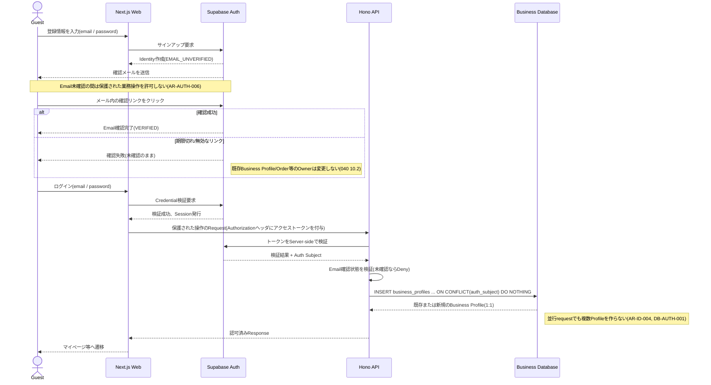
```mermaid
sequenceDiagram
    actor Customer as Guest
    participant Web as Next.js Web
    participant Auth as Supabase Auth
    participant API as Hono API
    participant DB as Business Database

    Customer->>Web: 登録情報を入力(email / password)
    Web->>Auth: サインアップ要求
    Auth-->>Web: Identity作成(EMAIL_UNVERIFIED)
    Auth-->>Customer: 確認メールを送信

    Note over Customer,Auth: Email未確認の間は保護された業務操作を許可しない(AR-AUTH-006)

    Customer->>Auth: メール内の確認リンクをクリック
    alt 確認成功
        Auth-->>Customer: Email確認完了(VERIFIED)
    else 期限切れ/無効なリンク
        Auth-->>Customer: 確認失敗(未確認のまま)
        Note right of Auth: 既存Business Profile/Order等のOwnerは変更しない(040 10.2)
    end

    Customer->>Web: ログイン(email / password)
    Web->>Auth: Credential検証要求
    Auth-->>Web: 検証成功、Session発行

    Web->>API: 保護された操作のRequest(Authorizationヘッダにアクセストークンを付与)
    API->>Auth: トークンをServer-sideで検証
    Auth-->>API: 検証結果 + Auth Subject
    API->>API: Email確認状態を検証(未確認ならDeny)

    API->>DB: INSERT business_profiles ... ON CONFLICT(auth_subject) DO NOTHING
    DB-->>API: 既存または新規のBusiness Profile(1:1)
    Note right of DB: 並行requestでも複数Profileを作らない(AR-ID-004, DB-AUTH-001)

    API-->>Web: 認可済みResponse
    Web-->>Customer: マイページ等へ遷移
```

### 1.2 ログイン(標準認可判定順序)

根拠: 060 §13、§19(Authorization判定順序)、110 §24。この判定順序は**全ての保護された操作に共通**するため、
以降の図では「標準認可チェック」として1メッセージに集約する。

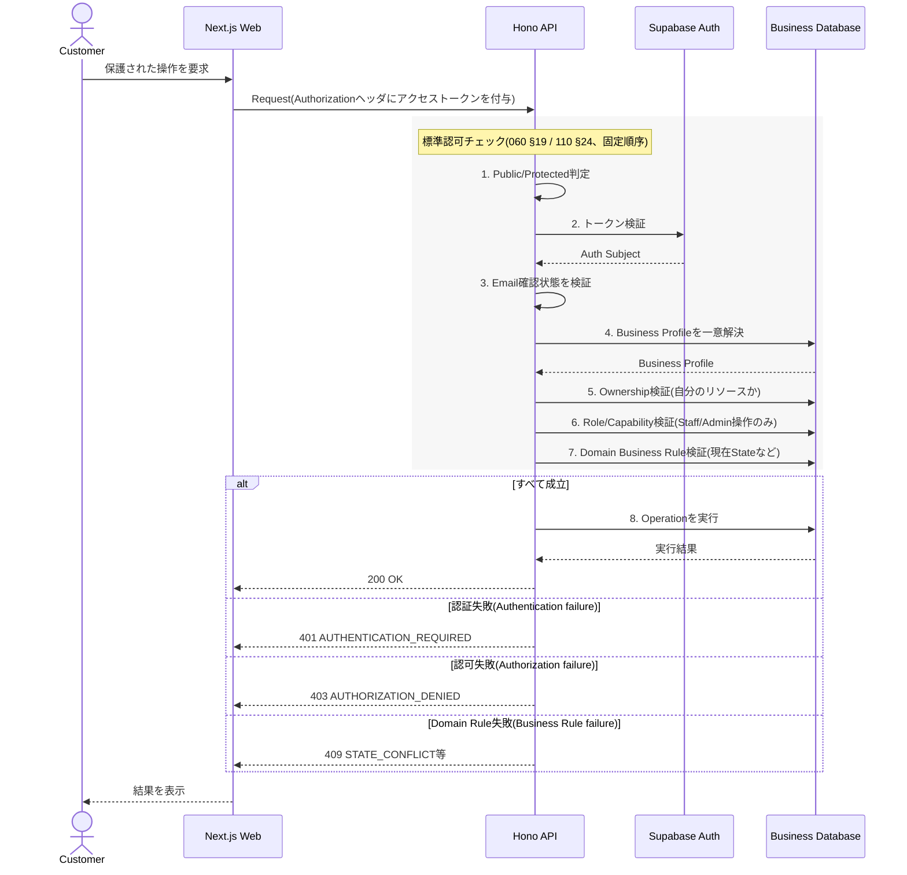
```mermaid
sequenceDiagram
    actor Customer
    participant Web as Next.js Web
    participant API as Hono API
    participant Auth as Supabase Auth
    participant DB as Business Database

    Customer->>Web: 保護された操作を要求
    Web->>API: Request(Authorizationヘッダにアクセストークンを付与)

    rect rgb(247, 247, 247)
    Note over API: 標準認可チェック(060 §19 / 110 §24、固定順序)
    API->>API: 1. Public/Protected判定
    API->>Auth: 2. トークン検証
    Auth-->>API: Auth Subject
    API->>API: 3. Email確認状態を検証
    API->>DB: 4. Business Profileを一意解決
    DB-->>API: Business Profile
    API->>DB: 5. Ownership検証(自分のリソースか)
    API->>DB: 6. Role/Capability検証(Staff/Admin操作のみ)
    API->>DB: 7. Domain Business Rule検証(現在Stateなど)
    end

    alt すべて成立
        API->>DB: 8. Operationを実行
        DB-->>API: 実行結果
        API-->>Web: 200 OK
    else 認証失敗(Authentication failure)
        API-->>Web: 401 AUTHENTICATION_REQUIRED
    else 認可失敗(Authorization failure)
        API-->>Web: 403 AUTHORIZATION_DENIED
    else Domain Rule失敗(Business Rule failure)
        API-->>Web: 409 STATE_CONFLICT等
    end
    Web-->>Customer: 結果を表示
```

Note: Authentication成功だけでAuthorization成功にしない(AR-AZ-003)。Authorization成功だけでDomain Business Ruleを
迂回しない(AR-AZ-004)。UI上のボタン非表示・Route guardは認可の代替にならない(AR-AZ-005) — Page guard通過後の
API callでも、Hono APIは必ず同じ検証を再実行する(AR-AZ-007)。

### 1.3 パスワードリセット

根拠: 040 §13、060 §14。

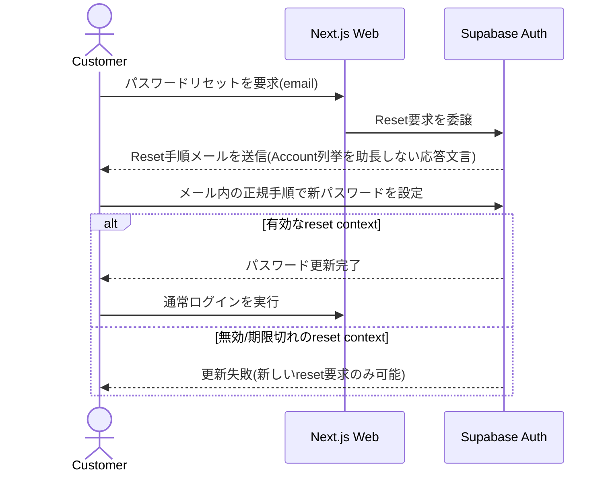
```mermaid
sequenceDiagram
    actor Customer
    participant Web as Next.js Web
    participant Auth as Supabase Auth

    Customer->>Web: パスワードリセットを要求(email)
    Web->>Auth: Reset要求を委譲
    Auth-->>Customer: Reset手順メールを送信(Account列挙を助長しない応答文言)

    Customer->>Auth: メール内の正規手順で新パスワードを設定
    alt 有効なreset context
        Auth-->>Customer: パスワード更新完了
        Customer->>Web: 通常ログインを実行
    else 無効/期限切れのreset context
        Auth-->>Customer: 更新失敗(新しいreset要求のみ可能)
    end
```

Note: パスワードリセットはBusiness Profile・Order Customer・Ticket Owner・Reservation Customer・
Goods Customerのいずれも変更しない(060 §14.2)。

### 1.4 Business Profile Provisioning

根拠: 060 §16。1.1のシーケンスに含まれる該当部分の詳細版。

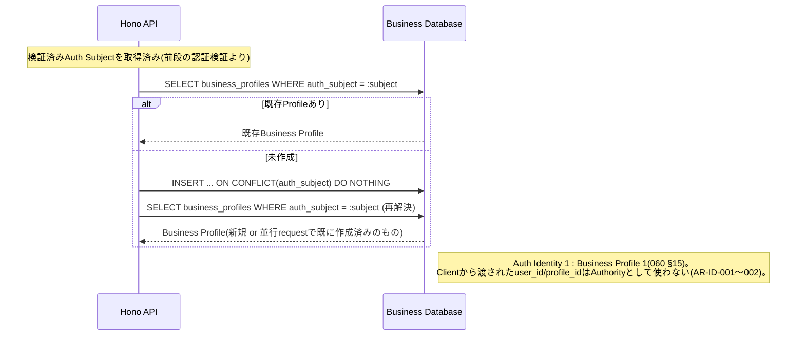
```mermaid
sequenceDiagram
    participant API as Hono API
    participant DB as Business Database

    Note over API: 検証済みAuth Subjectを取得済み(前段の認証検証より)
    API->>DB: SELECT business_profiles WHERE auth_subject = :subject
    alt 既存Profileあり
        DB-->>API: 既存Business Profile
    else 未作成
        API->>DB: INSERT ... ON CONFLICT(auth_subject) DO NOTHING
        API->>DB: SELECT business_profiles WHERE auth_subject = :subject (再解決)
        DB-->>API: Business Profile(新規 or 並行requestで既に作成済みのもの)
    end
    Note right of DB: Auth Identity 1 : Business Profile 1(060 §15)。<br/>Clientから渡されたuser_id/profile_idはAuthorityとして使わない(AR-ID-001〜002)。
```

### 1.5 Role Assignment 付与・剥奪

根拠: 060 §22、130 §37-39、150 §20(Emergency Recovery)。

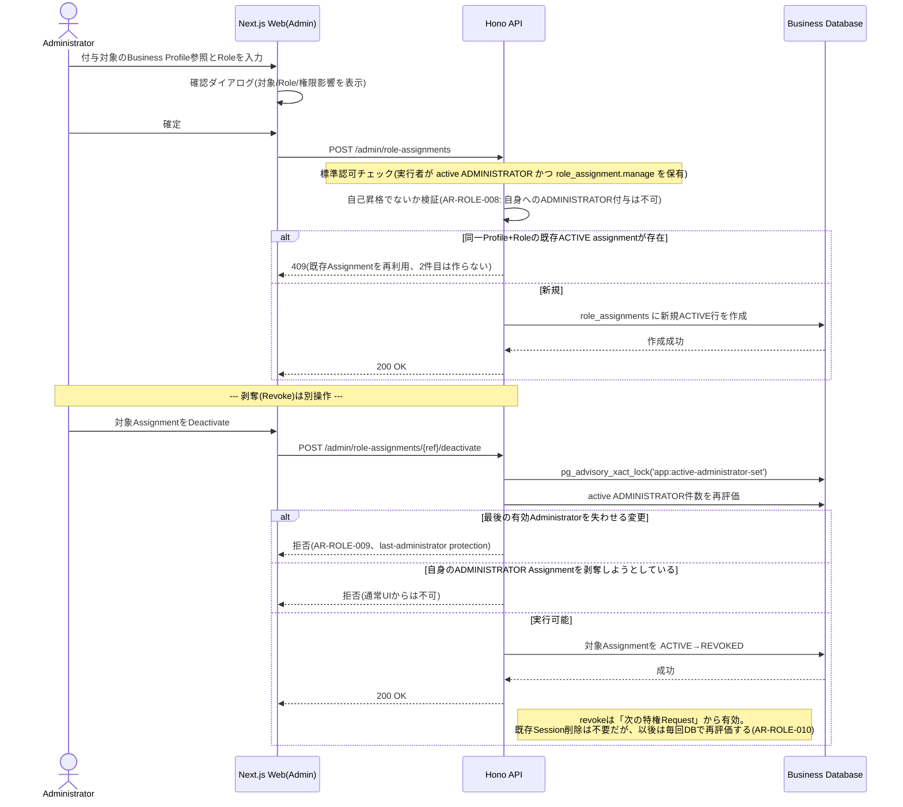
```mermaid
sequenceDiagram
    actor Admin as Administrator
    participant Web as Next.js Web(Admin)
    participant API as Hono API
    participant DB as Business Database

    Admin->>Web: 付与対象のBusiness Profile参照とRoleを入力
    Web->>Web: 確認ダイアログ(対象/Role/権限影響を表示)
    Admin->>Web: 確定
    Web->>API: POST /admin/role-assignments

    Note over API: 標準認可チェック(実行者が active ADMINISTRATOR かつ role_assignment.manage を保有)
    API->>API: 自己昇格でないか検証(AR-ROLE-008: 自身へのADMINISTRATOR付与は不可)

    alt 同一Profile+Roleの既存ACTIVE assignmentが存在
        API-->>Web: 409(既存Assignmentを再利用、2件目は作らない)
    else 新規
        API->>DB: role_assignments に新規ACTIVE行を作成
        DB-->>API: 作成成功
        API-->>Web: 200 OK
    end

    Note over Admin,API: --- 剥奪(Revoke)は別操作 ---
    Admin->>Web: 対象AssignmentをDeactivate
    Web->>API: POST /admin/role-assignments/{ref}/deactivate
    API->>DB: pg_advisory_xact_lock('app:active-administrator-set')
    API->>DB: active ADMINISTRATOR件数を再評価
    alt 最後の有効Administratorを失わせる変更
        API-->>Web: 拒否(AR-ROLE-009、last-administrator protection)
    else 自身のADMINISTRATOR Assignmentを剥奪しようとしている
        API-->>Web: 拒否(通常UIからは不可)
    else 実行可能
        API->>DB: 対象Assignmentを ACTIVE→REVOKED
        DB-->>API: 成功
        API-->>Web: 200 OK
        Note right of API: revokeは「次の特権Request」から有効。<br/>既存Session削除は不要だが、以後は毎回DBで再評価する(AR-ROLE-010)
    end
```

Emergency Recovery(active Administratorが0件になった場合)は通常APIの外で、project-owner承認済みの
infrastructure operatorが同じadvisory lockのもとで直接1件のADMINISTRATOR Assignmentを作成する
特別手順であり、通常操作フローには含まれない(150 §20、詳細は5.3のRunbook運用と同種)。

---

## 2. 購入・決済系

以下はEntry Ticket購入を主系統として記述する。Karaoke/Goodsは購入開始ステップのAllocation/Hold取得方法が
異なるのみで、Checkout以降(2.2〜2.7)は共通の骨格を持つ(Karaoke固有の詳細は3章で別途扱う)。

### 2.1 購入開始〜Order作成(Allocation/Hold確保)

根拠: 070 §9、110 §28(API-PUR-ENTRY-001)、100 §19。

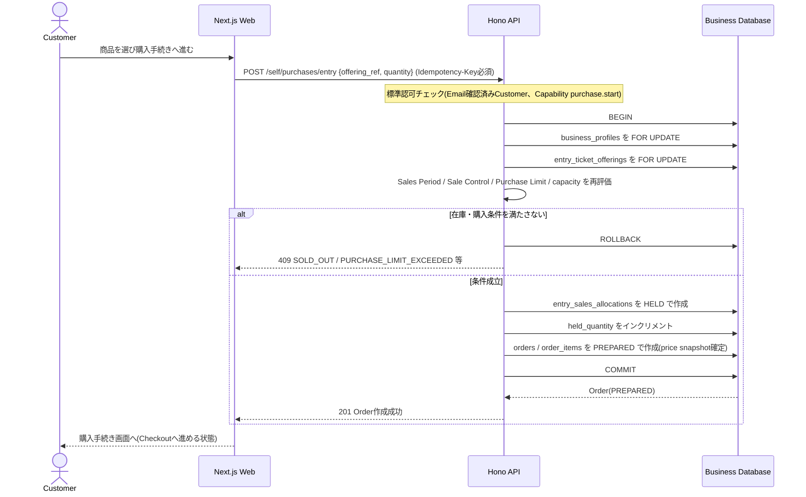
```mermaid
sequenceDiagram
    actor Customer
    participant Web as Next.js Web
    participant API as Hono API
    participant DB as Business Database

    Customer->>Web: 商品を選び購入手続きへ進む
    Web->>API: POST /self/purchases/entry {offering_ref, quantity} (Idempotency-Key必須)

    Note over API: 標準認可チェック(Email確認済みCustomer、Capability purchase.start)

    API->>DB: BEGIN
    API->>DB: business_profiles を FOR UPDATE
    API->>DB: entry_ticket_offerings を FOR UPDATE
    API->>API: Sales Period / Sale Control / Purchase Limit / capacity を再評価

    alt 在庫・購入条件を満たさない
        API->>DB: ROLLBACK
        API-->>Web: 409 SOLD_OUT / PURCHASE_LIMIT_EXCEEDED 等
    else 条件成立
        API->>DB: entry_sales_allocations を HELD で作成
        API->>DB: held_quantity をインクリメント
        API->>DB: orders / order_items を PREPARED で作成(price snapshot確定)
        API->>DB: COMMIT
        DB-->>API: Order(PREPARED)
        API-->>Web: 201 Order作成成功
    end
    Web-->>Customer: 購入手続き画面へ(Checkoutへ進める状態)
```

⚠️CR-070-001(カート機能): SPEC-070本文(`PAY-ORD-004`)は「1 Order = 1 Purpose」を明記している一方、
`payment-spec-decision-items.md`(DEC-B-04)は複数Domain商品の同一カート購入を維持する決定をしており、
その場合は全Order ItemのAllocation/Hold取得を単一DBトランザクションでAll-or-Nothingに行う(DEC-F-04)。
本図は現行SPEC-070本文(単一Purpose)ベースで記述している。[実装計画書](implementation-plan.md)の未決事項一覧を参照し、
フェーズ0での意思決定を待って確定させること。

### 2.2 Checkout Session作成〜Stripeリダイレクト

根拠: 070 §9-13、110 §29(API-CHK-001)。

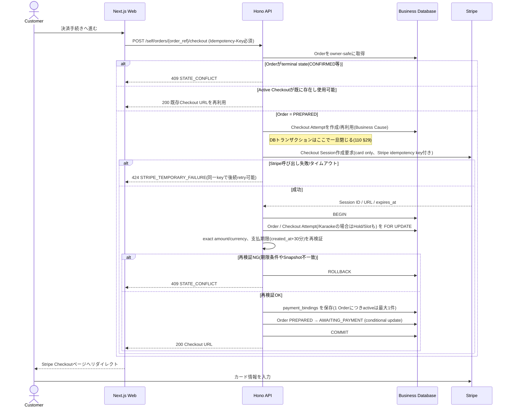
```mermaid
sequenceDiagram
    actor Customer
    participant Web as Next.js Web
    participant API as Hono API
    participant DB as Business Database
    participant Stripe

    Customer->>Web: 決済手続きへ進む
    Web->>API: POST /self/orders/{order_ref}/checkout (Idempotency-Key必須)

    API->>DB: Orderをowner-safeに取得
    alt Orderがterminal state(CONFIRMED等)
        API-->>Web: 409 STATE_CONFLICT
    else Active Checkoutが既に存在し使用可能
        API-->>Web: 200 既存Checkout URLを再利用
    else Order = PREPARED
        API->>DB: Checkout Attemptを作成/再利用(Business Cause)
        Note right of API: DBトランザクションはここで一旦閉じる(110 §29)
        API->>Stripe: Checkout Session作成要求(card only、Stripe idempotency key付き)
        alt Stripe呼び出し失敗/タイムアウト
            API-->>Web: 424 STRIPE_TEMPORARY_FAILURE(同一keyで後続retry可能)
        else 成功
            Stripe-->>API: Session ID / URL / expires_at
            API->>DB: BEGIN
            API->>DB: Order / Checkout Attempt(/Karaokeの場合はHold/Slotも) を FOR UPDATE
            API->>API: exact amount/currency、支払期限(created_at+30分)を再検証
            alt 再検証NG(期限条件やSnapshot不一致)
                API->>DB: ROLLBACK
                API-->>Web: 409 STATE_CONFLICT
            else 再検証OK
                API->>DB: payment_bindings を保存(1 Orderにつきactiveは最大1件)
                API->>DB: Order PREPARED → AWAITING_PAYMENT (conditional update)
                API->>DB: COMMIT
                API-->>Web: 200 Checkout URL
            end
        end
    end

    Web-->>Customer: Stripe Checkoutページへリダイレクト
    Customer->>Stripe: カード情報を入力
```

### 2.3 Webhook受信〜決済確定(CONFIRMED) 【最重要】

根拠: 070 Part IV/V、110 §32、150 Part VI/VIII。Browser側の成功ページ到達と、Stripe Webhookによる
サーバー側確定は**独立した非同期経路**であることが本フローの核心(`PAY-BRW-001`)。

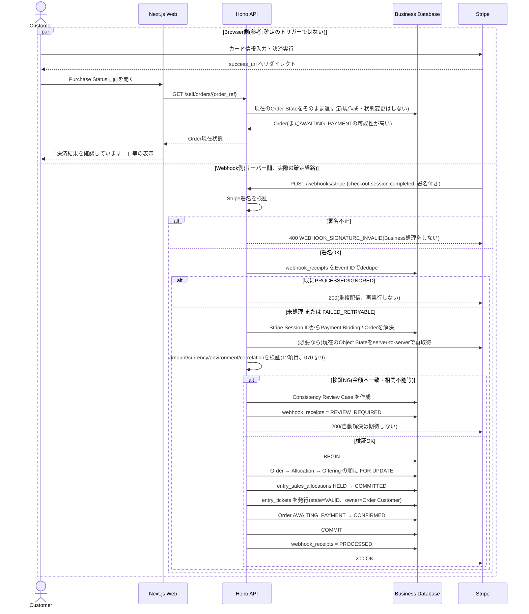
```mermaid
sequenceDiagram
    actor Customer
    participant Web as Next.js Web
    participant API as Hono API
    participant DB as Business Database
    participant Stripe

    par Browser側(参考: 確定のトリガーではない)
        Customer->>Stripe: カード情報入力・決済実行
        Stripe-->>Customer: success_url へリダイレクト
        Customer->>Web: Purchase Status画面を開く
        Web->>API: GET /self/orders/{order_ref}
        API->>DB: 現在のOrder Stateをそのまま返す(新規作成・状態変更はしない)
        DB-->>API: Order(まだAWAITING_PAYMENTの可能性が高い)
        API-->>Web: Order現在状態
        Web-->>Customer: 「決済結果を確認しています…」等の表示
    and Webhook側(サーバー間、実際の確定経路)
        Stripe->>API: POST /webhooks/stripe (checkout.session.completed, 署名付き)
        API->>API: Stripe署名を検証
        alt 署名不正
            API-->>Stripe: 400 WEBHOOK_SIGNATURE_INVALID(Business処理をしない)
        else 署名OK
            API->>DB: webhook_receipts をEvent IDでdedupe
            alt 既にPROCESSED/IGNORED
                API-->>Stripe: 200(重複配信、再実行しない)
            else 未処理 または FAILED_RETRYABLE
                API->>DB: Stripe Session IDからPayment Binding / Orderを解決
                API->>Stripe: (必要なら)現在のObject Stateをserver-to-serverで再取得
                API->>API: amount/currency/environment/correlationを検証(12項目、070 §19)
                alt 検証NG(金額不一致・相関不能等)
                    API->>DB: Consistency Review Case を作成
                    API->>DB: webhook_receipts = REVIEW_REQUIRED
                    API-->>Stripe: 200(自動解決は期待しない)
                else 検証OK
                    API->>DB: BEGIN
                    API->>DB: Order → Allocation → Offering の順に FOR UPDATE
                    API->>DB: entry_sales_allocations HELD → COMMITTED
                    API->>DB: entry_tickets を発行(state=VALID、owner=Order Customer)
                    API->>DB: Order AWAITING_PAYMENT → CONFIRMED
                    API->>DB: COMMIT
                    API->>DB: webhook_receipts = PROCESSED
                    API-->>Stripe: 200 OK
                end
            end
        end
    end
```

冪等性は二層構造(`PAY-WHK-009`): ①Webhook Receipt = Stripe Event ID単位、②Business Confirmation =
`(Order, 権威的なStripe決済結果)`単位。異なるEvent IDが同じCheckout Sessionを指す場合があるため、
①だけでは不十分で②のBusiness Cause単位のuniqueが最終防御となる。

Note: Terminal State(CONFIRMED/PAYMENT_FAILED/CANCELED/EXPIRED)到達後に矛盾するEventが遅れて届いても、
Terminal Stateは上書きしない(`PAY-WHK-012/013`) — 代わりにConsistency Review Caseを作成する(5.3参照)。

### 2.4 カード決済失敗〜同一注文内再試行

根拠: 070 §15, §25, §29。

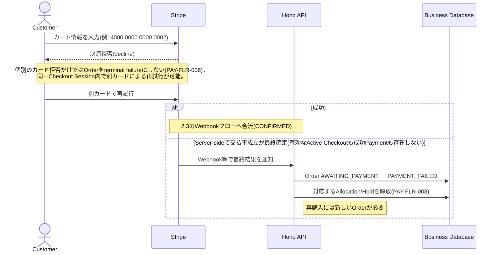
```mermaid
sequenceDiagram
    actor Customer
    participant Stripe
    participant API as Hono API
    participant DB as Business Database

    Customer->>Stripe: カード情報を入力(例: 4000 0000 0000 0002)
    Stripe-->>Customer: 決済拒否(decline)

    Note over Stripe,Customer: 個別のカード拒否だけではOrderをterminal failureにしない(PAY-FLR-006)。<br/>同一Checkout Session内で別カードによる再試行が可能。

    Customer->>Stripe: 別カードで再試行
    alt 成功
        Note over Stripe,API: 2.3のWebhookフローへ合流(CONFIRMED)
    else Server-sideで支払不成立が最終確定(有効なActive Checkoutも成功Paymentも存在しない)
        Stripe->>API: Webhook等で最終結果を通知
        API->>DB: Order AWAITING_PAYMENT → PAYMENT_FAILED
        API->>DB: 対応するAllocation/Holdを解放(PAY-FLR-008)
        Note right of API: 再購入には新しいOrderが必要
    end
```

### 2.5 Checkout Session期限切れ(EXPIRED)

根拠: 070 §20, §28。

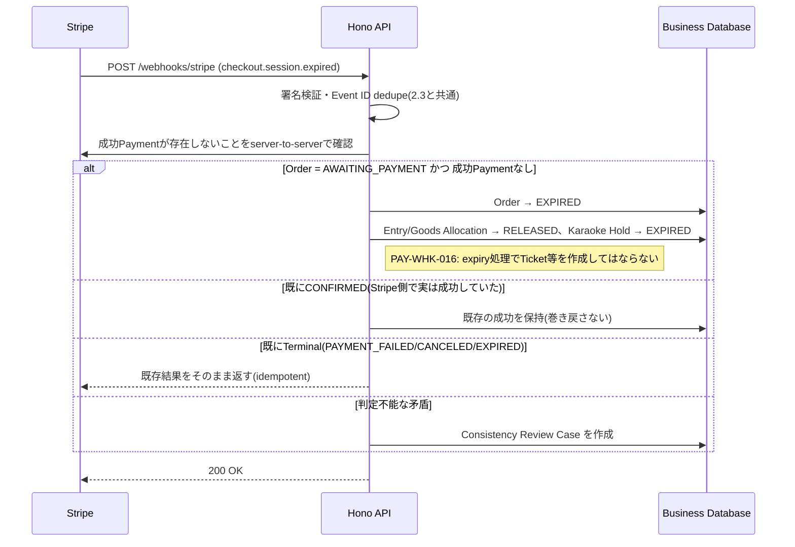
```mermaid
sequenceDiagram
    participant Stripe
    participant API as Hono API
    participant DB as Business Database

    Stripe->>API: POST /webhooks/stripe (checkout.session.expired)
    API->>API: 署名検証・Event ID dedupe(2.3と共通)
    API->>Stripe: 成功Paymentが存在しないことをserver-to-serverで確認

    alt Order = AWAITING_PAYMENT かつ 成功Paymentなし
        API->>DB: Order → EXPIRED
        API->>DB: Entry/Goods Allocation → RELEASED、Karaoke Hold → EXPIRED
        Note right of API: PAY-WHK-016: expiry処理でTicket等を作成してはならない
    else 既にCONFIRMED(Stripe側で実は成功していた)
        API->>DB: 既存の成功を保持(巻き戻さない)
    else 既にTerminal(PAYMENT_FAILED/CANCELED/EXPIRED)
        API-->>Stripe: 既存結果をそのまま返す(idempotent)
    else 判定不能な矛盾
        API->>DB: Consistency Review Case を作成
    end
    API-->>Stripe: 200 OK
```

Payment Deadline到達時も同様のロジックがWorkerによる定期照合(Reconciliation)として実行される(5.4参照)。
Webhookの到着がDeadline後でも、Stripe上でDeadline前に正規完了したことが確認できれば、それだけを理由に
失敗へ変換しない(`PAY-CHK-007`)。

### 2.6 返金(Refund)

根拠: 070 §35-41、110 §44(API-ADM-PAY-001)、130 §18-19、150 §24。

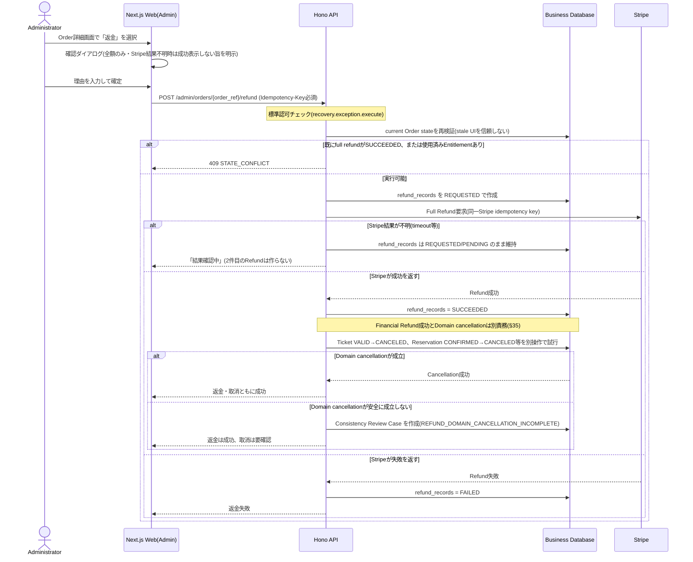
```mermaid
sequenceDiagram
    actor Admin as Administrator
    participant Web as Next.js Web(Admin)
    participant API as Hono API
    participant DB as Business Database
    participant Stripe

    Admin->>Web: Order詳細画面で「返金」を選択
    Web->>Web: 確認ダイアログ(全額のみ・Stripe結果不明時は成功表示しない旨を明示)
    Admin->>Web: 理由を入力して確定
    Web->>API: POST /admin/orders/{order_ref}/refund (Idempotency-Key必須)

    Note over API: 標準認可チェック(recovery.exception.execute)
    API->>DB: current Order stateを再検証(stale UIを信頼しない)

    alt 既にfull refundがSUCCEEDED、または使用済みEntitlementあり
        API-->>Web: 409 STATE_CONFLICT
    else 実行可能
        API->>DB: refund_records を REQUESTED で作成
        API->>Stripe: Full Refund要求(同一Stripe idempotency key)
        alt Stripe結果が不明(timeout等)
            API->>DB: refund_records は REQUESTED/PENDING のまま維持
            API-->>Web: 「結果確認中」(2件目のRefundは作らない)
        else Stripeが成功を返す
            Stripe-->>API: Refund成功
            API->>DB: refund_records = SUCCEEDED
            Note over API,DB: Financial Refund成功とDomain cancellationは別責務(§35)
            API->>DB: Ticket VALID→CANCELED、Reservation CONFIRMED→CANCELED等を別操作で試行
            alt Domain cancellationが成立
                DB-->>API: Cancellation成功
                API-->>Web: 返金・取消ともに成功
            else Domain cancellationが安全に成立しない
                API->>DB: Consistency Review Case を作成(REFUND_DOMAIN_CANCELLATION_INCOMPLETE)
                API-->>Web: 返金は成功、取消は要確認
            end
        else Stripeが失敗を返す
            Stripe-->>API: Refund失敗
            API->>DB: refund_records = FAILED
            API-->>Web: 返金失敗
        end
    end
```

Note: 返金は**全額のみ**(部分返金は非対応)。Orderのstate自体は`CONFIRMED`のまま変化しない — 返金は
Refund Recordという独立したライフサイクルを持つ(`PAY-RFD-*`)。カラオケ枠は返金後も`SOLD`のまま維持され、
再販売されない(090 §16)。

### 2.7 注文取消(Cancel)

根拠: 070 §27、`change-requests-spec070.md`(CR-070-002)、`payment-spec-decision-items.md`(DEC-B-03)。

⚠️CR-070-002: SPEC-070本文(§27)は「支払前(PREPARED/AWAITING_PAYMENT)ならCustomer自身によるセルフキャンセルを許可する」
と規定しているが、決定ログ(DEC-B-03)は「Order取消は運営操作のみとし、利用者自身の取消は一切許可しない」と
決定しており、CR-070-002(open、未反映)としてSPEC-070本文をこの決定に合わせる変更要求が出ている。
payment-mockの実装もDEC-B-03(運営限定)を採用済み。以下は**DEC-B-03(運営限定)を前提**に図示する。

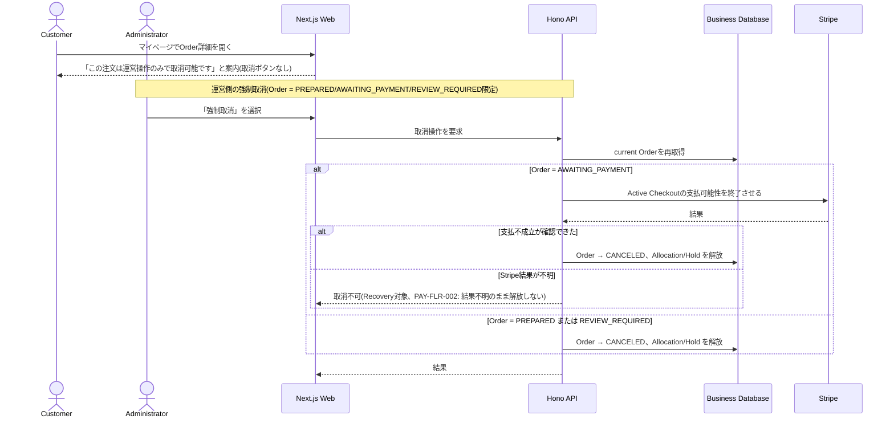
```mermaid
sequenceDiagram
    actor Customer
    actor Admin as Administrator
    participant Web as Next.js Web
    participant API as Hono API
    participant DB as Business Database
    participant Stripe

    Customer->>Web: マイページでOrder詳細を開く
    Web-->>Customer: 「この注文は運営操作のみで取消可能です」と案内(取消ボタンなし)

    Note over Admin,API: 運営側の強制取消(Order = PREPARED/AWAITING_PAYMENT/REVIEW_REQUIRED限定)
    Admin->>Web: 「強制取消」を選択
    Web->>API: 取消操作を要求
    API->>DB: current Orderを再取得

    alt Order = AWAITING_PAYMENT
        API->>Stripe: Active Checkoutの支払可能性を終了させる
        Stripe-->>API: 結果
        alt 支払不成立が確認できた
            API->>DB: Order → CANCELED、Allocation/Hold を解放
        else Stripe結果が不明
            API-->>Web: 取消不可(Recovery対象、PAY-FLR-002: 結果不明のまま解放しない)
        end
    else Order = PREPARED または REVIEW_REQUIRED
        API->>DB: Order → CANCELED、Allocation/Hold を解放
    end
    API-->>Web: 結果
```

Payment Deadline経過による自動`EXPIRED`遷移(2.5, 5.4)はこのCR-070-002の対象外であり、
利用者が明示キャンセルできなくてもCheckoutから離脱すればDeadline経過で自動的に`EXPIRED`になる。

---

## 3. カラオケ予約系

### 3.1 Slot検索〜Hold取得

根拠: 090 §9-11、110 §28(API-PUR-KRK-001)、100 §31。

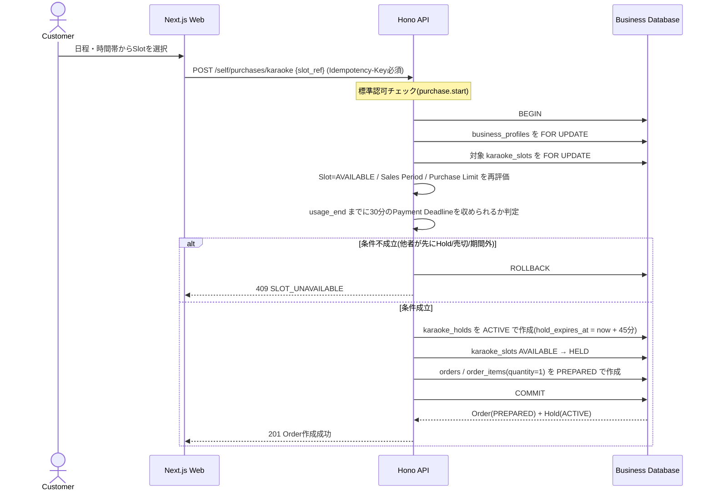
```mermaid
sequenceDiagram
    actor Customer
    participant Web as Next.js Web
    participant API as Hono API
    participant DB as Business Database

    Customer->>Web: 日程・時間帯からSlotを選択
    Web->>API: POST /self/purchases/karaoke {slot_ref} (Idempotency-Key必須)

    Note over API: 標準認可チェック(purchase.start)
    API->>DB: BEGIN
    API->>DB: business_profiles を FOR UPDATE
    API->>DB: 対象 karaoke_slots を FOR UPDATE
    API->>API: Slot=AVAILABLE / Sales Period / Purchase Limit を再評価
    API->>API: usage_end までに30分のPayment Deadlineを収められるか判定

    alt 条件不成立(他者が先にHold/売切/期間外)
        API->>DB: ROLLBACK
        API-->>Web: 409 SLOT_UNAVAILABLE
    else 条件成立
        API->>DB: karaoke_holds を ACTIVE で作成(hold_expires_at = now + 45分)
        API->>DB: karaoke_slots AVAILABLE → HELD
        API->>DB: orders / order_items(quantity=1) を PREPARED で作成
        API->>DB: COMMIT
        DB-->>API: Order(PREPARED) + Hold(ACTIVE)
        API-->>Web: 201 Order作成成功
    end
```

Note: 同一Slotへの並行Requestは、DB上で`AVAILABLE→HELD`とHold作成をCommitできた最大1件のみが成立する
(Exclusion制約 + 行ロック + partial unique、`KRK-HLD-003〜005`)。敗者はHold/Order/Reservationを
一切成立させない(部分Commit禁止)。

### 3.2 決済確定〜Reservation/Ticket発行

根拠: 090 §12-14、110 §32、130の時間関係(Hold 45分/Payment Deadline 30分/Safety Buffer 5分)。

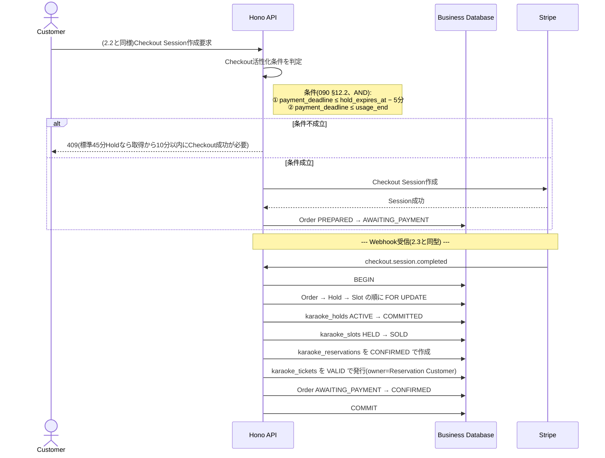
```mermaid
sequenceDiagram
    actor Customer
    participant API as Hono API
    participant DB as Business Database
    participant Stripe

    Customer->>API: (2.2と同様)Checkout Session作成要求
    API->>API: Checkout活性化条件を判定
    Note right of API: 条件(090 §12.2、AND):<br/>① payment_deadline ≤ hold_expires_at − 5分<br/>② payment_deadline ≤ usage_end
    alt 条件不成立
        API-->>Customer: 409(標準45分Holdなら取得から10分以内にCheckout成功が必要)
    else 条件成立
        API->>Stripe: Checkout Session作成
        Stripe-->>API: Session成功
        API->>DB: Order PREPARED → AWAITING_PAYMENT
    end

    Note over Stripe,API: --- Webhook受信(2.3と同型) ---
    Stripe->>API: checkout.session.completed
    API->>DB: BEGIN
    API->>DB: Order → Hold → Slot の順に FOR UPDATE
    API->>DB: karaoke_holds ACTIVE → COMMITTED
    API->>DB: karaoke_slots HELD → SOLD
    API->>DB: karaoke_reservations を CONFIRMED で作成
    API->>DB: karaoke_tickets を VALID で発行(owner=Reservation Customer)
    API->>DB: Order AWAITING_PAYMENT → CONFIRMED
    API->>DB: COMMIT
```

Note: Webhookが遅延しても、権威的な支払完了がDeadline内かつHold有効区間内で、Hold/Slotがまだ当該取引に
排他保持されているなら成功へ進めてよい。Holdが既に`EXPIRED`/`RELEASED`、Slotが他者に再利用済みの場合は
奪い返さず`REVIEW_REQUIRED`/Consistency Reviewへ送る(`KRK-CFM-006〜008`)。

### 3.3 予約キャンセル

根拠: 090 §15-16。

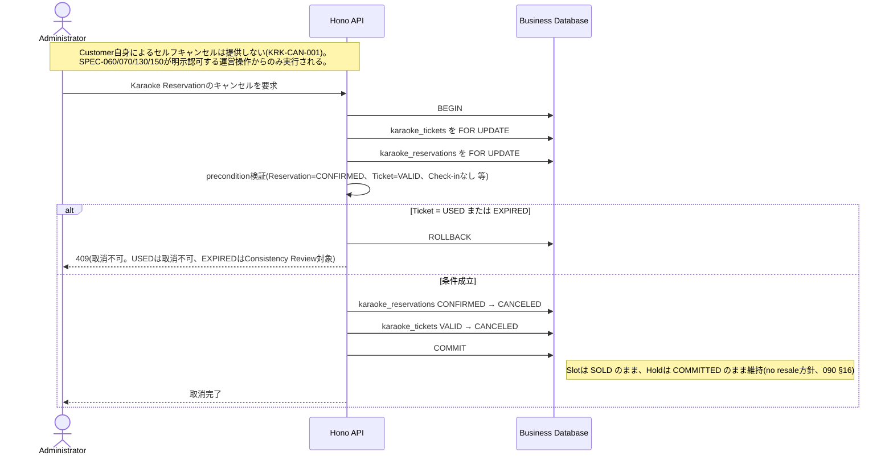
```mermaid
sequenceDiagram
    actor Admin as Administrator
    participant API as Hono API
    participant DB as Business Database

    Note over Admin,API: Customer自身によるセルフキャンセルは提供しない(KRK-CAN-001)。<br/>SPEC-060/070/130/150が明示認可する運営操作からのみ実行される。

    Admin->>API: Karaoke Reservationのキャンセルを要求
    API->>DB: BEGIN
    API->>DB: karaoke_tickets を FOR UPDATE
    API->>DB: karaoke_reservations を FOR UPDATE
    API->>API: precondition検証(Reservation=CONFIRMED、Ticket=VALID、Check-inなし 等)

    alt Ticket = USED または EXPIRED
        API->>DB: ROLLBACK
        API-->>Admin: 409(取消不可。USEDは取消不可、EXPIREDはConsistency Review対象)
    else 条件成立
        API->>DB: karaoke_reservations CONFIRMED → CANCELED
        API->>DB: karaoke_tickets VALID → CANCELED
        API->>DB: COMMIT
        Note right of DB: Slotは SOLD のまま、Holdは COMMITTED のまま維持(no resale方針、090 §16)
        API-->>Admin: 取消完了
    end
```

Note: 確定済みReservationの取消後もSlotは再販売しない。理由はDomain State Machineに`SOLD→AVAILABLE`が
存在しないこと、二重販売防止を優先すること。将来resaleを導入する場合は上流(SPEC-030)への変更要求が必要。

### 3.4 キャンセルとチェックインの競合

根拠: 090 §15.5(`KRK-CAN-008`)。

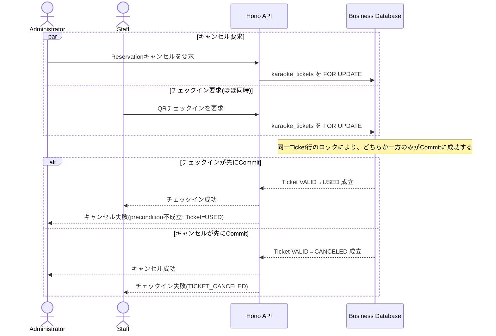
```mermaid
sequenceDiagram
    actor Admin as Administrator
    actor Staff
    participant API as Hono API
    participant DB as Business Database

    par キャンセル要求
        Admin->>API: Reservationキャンセルを要求
        API->>DB: karaoke_tickets を FOR UPDATE
    and チェックイン要求(ほぼ同時)
        Staff->>API: QRチェックインを要求
        API->>DB: karaoke_tickets を FOR UPDATE
    end

    Note over DB: 同一Ticket行のロックにより、どちらか一方のみがCommitに成功する

    alt チェックインが先にCommit
        DB-->>API: Ticket VALID→USED 成立
        API-->>Staff: チェックイン成功
        API-->>Admin: キャンセル失敗(precondition不成立: Ticket=USED)
    else キャンセルが先にCommit
        DB-->>API: Ticket VALID→CANCELED 成立
        API-->>Admin: キャンセル成功
        API-->>Staff: チェックイン失敗(TICKET_CANCELED)
    end
```

Note: 先に成立したterminal effectを削除・巻き戻して後発を勝者にすることは禁止。判定基準はClient timestamp
ではなくDB上のatomic transition結果そのもの。

---

## 4. チケット/QR・チェックイン系

### 4.1 QRコード表示(初回発行を含む)

根拠: 080 §12-15、110 §33-34。

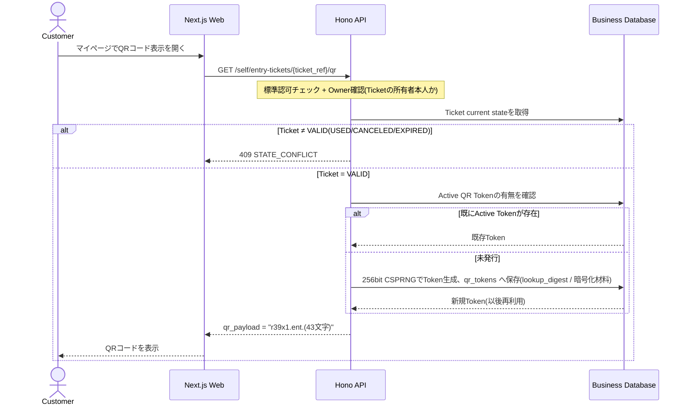
```mermaid
sequenceDiagram
    actor Customer
    participant Web as Next.js Web
    participant API as Hono API
    participant DB as Business Database

    Customer->>Web: マイページでQRコード表示を開く
    Web->>API: GET /self/entry-tickets/{ticket_ref}/qr

    Note over API: 標準認可チェック + Owner確認(Ticketの所有者本人か)
    API->>DB: Ticket current stateを取得
    alt Ticket ≠ VALID(USED/CANCELED/EXPIRED)
        API-->>Web: 409 STATE_CONFLICT
    else Ticket = VALID
        API->>DB: Active QR Tokenの有無を確認
        alt 既にActive Tokenが存在
            DB-->>API: 既存Token
        else 未発行
            API->>DB: 256bit CSPRNGでToken生成、qr_tokens へ保存(lookup_digest / 暗号化材料)
            DB-->>API: 新規Token(以後再利用)
        end
        API-->>Web: qr_payload = "r39x1.ent.(43文字)"
        Web-->>Customer: QRコードを表示
    end
```

Note: QR Tokenは支払確定前に生成・提供してはならない(080 §12)。Token生成の失敗はTicketの正規stateに
影響させない(Token表示だけを一時的な失敗として扱う、`TQR-TOK-011`)。Token存在自体をPayment confirmedの
根拠にしてはならない(`TQR-TOK-012`)。

### 4.2 入場チェックイン(正常系)

根拠: 080 §19-27、110 §36-39(API-STF-CHK-001)。

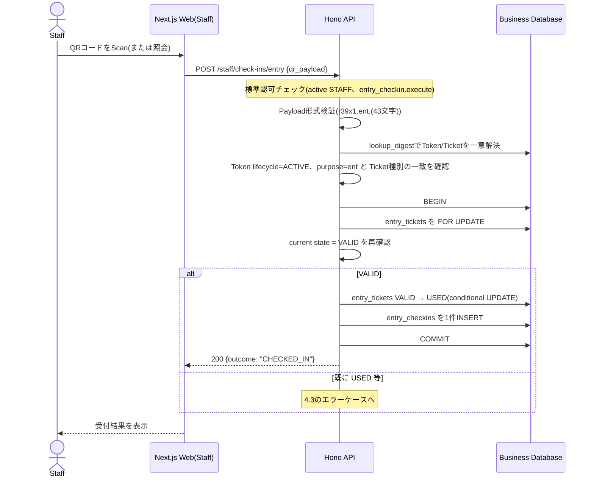
```mermaid
sequenceDiagram
    actor Staff
    participant Web as Next.js Web(Staff)
    participant API as Hono API
    participant DB as Business Database

    Staff->>Web: QRコードをScan(または照会)
    Web->>API: POST /staff/check-ins/entry {qr_payload}

    Note over API: 標準認可チェック(active STAFF、entry_checkin.execute)
    API->>API: Payload形式検証(r39x1.ent.(43文字))
    API->>DB: lookup_digestでToken/Ticketを一意解決
    API->>API: Token lifecycle=ACTIVE、purpose=ent と Ticket種別の一致を確認

    API->>DB: BEGIN
    API->>DB: entry_tickets を FOR UPDATE
    API->>API: current state = VALID を再確認
    alt VALID
        API->>DB: entry_tickets VALID → USED(conditional UPDATE)
        API->>DB: entry_checkins を1件INSERT
        API->>DB: COMMIT
        API-->>Web: 200 {outcome: "CHECKED_IN"}
    else 既に USED 等
        Note over API: 4.3のエラーケースへ
    end
    Web-->>Staff: 受付結果を表示
```

### 4.3 チェックインのエラーケース(二重利用・Purpose不一致)

根拠: 080 §21, §26-27、110 §39(Outcome mapping表)。

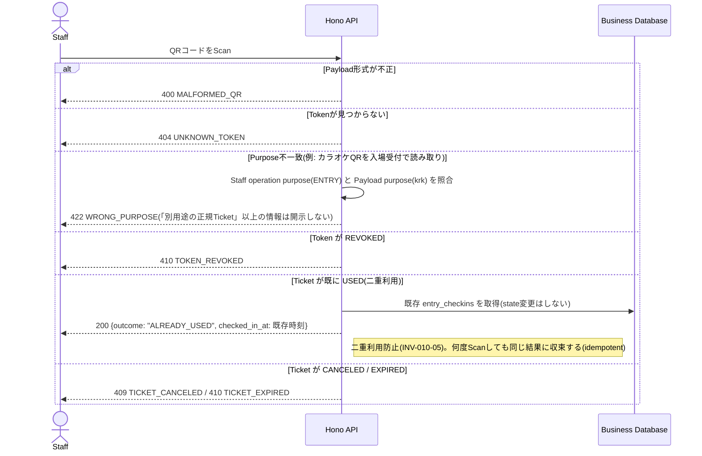
```mermaid
sequenceDiagram
    actor Staff
    participant API as Hono API
    participant DB as Business Database

    Staff->>API: QRコードをScan

    alt Payload形式が不正
        API-->>Staff: 400 MALFORMED_QR
    else Tokenが見つからない
        API-->>Staff: 404 UNKNOWN_TOKEN
    else Purpose不一致(例: カラオケQRを入場受付で読み取り)
        API->>API: Staff operation purpose(ENTRY) と Payload purpose(krk) を照合
        API-->>Staff: 422 WRONG_PURPOSE(「別用途の正規Ticket」以上の情報は開示しない)
    else Token が REVOKED
        API-->>Staff: 410 TOKEN_REVOKED
    else Ticket が既に USED(二重利用)
        API->>DB: 既存 entry_checkins を取得(state変更はしない)
        API-->>Staff: 200 {outcome: "ALREADY_USED", checked_in_at: 既存時刻}
        Note right of API: 二重利用防止(INV-010-05)。何度Scanしても同じ結果に収束する(idempotent)
    else Ticket が CANCELED / EXPIRED
        API-->>Staff: 409 TICKET_CANCELED / 410 TICKET_EXPIRED
    end
```

Note: 並行Scanでも同様で、DB上でCommitできた最大1件だけが`CHECKED_IN`となり、他は`ALREADY_USED`を返す
(勝敗はClient timestampではなくDB上のatomic transition結果で決まる、`TQR-IDM-003`)。

### 4.4 カラオケチェックイン(Check-in window判定)

根拠: 090 §20(`KRK-CHK-001〜011`)、080との連携。

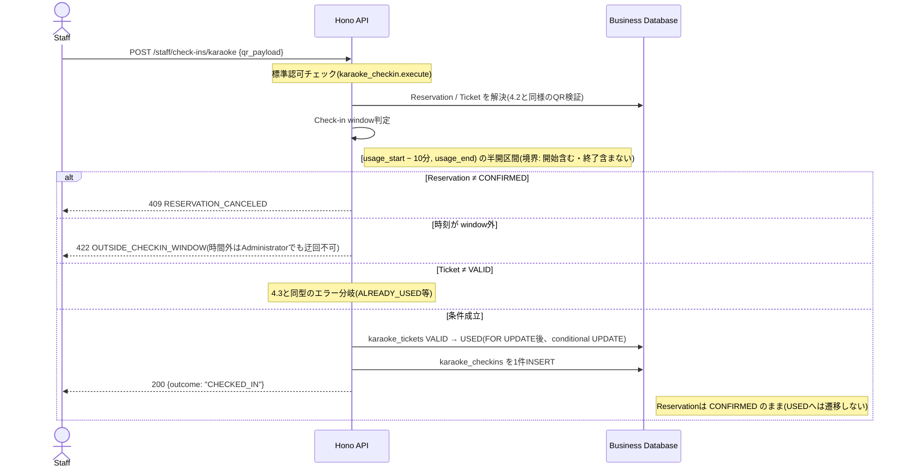
```mermaid
sequenceDiagram
    actor Staff
    participant API as Hono API
    participant DB as Business Database

    Staff->>API: POST /staff/check-ins/karaoke {qr_payload}
    Note over API: 標準認可チェック(karaoke_checkin.execute)
    API->>DB: Reservation / Ticket を解決(4.2と同様のQR検証)

    API->>API: Check-in window判定
    Note right of API: [usage_start − 10分, usage_end) の半開区間(境界: 開始含む・終了含まない)

    alt Reservation ≠ CONFIRMED
        API-->>Staff: 409 RESERVATION_CANCELED
    else 時刻が window外
        API-->>Staff: 422 OUTSIDE_CHECKIN_WINDOW(時間外はAdministratorでも迂回不可)
    else Ticket ≠ VALID
        Note over API: 4.3と同型のエラー分岐(ALREADY_USED等)
    else 条件成立
        API->>DB: karaoke_tickets VALID → USED(FOR UPDATE後、conditional UPDATE)
        API->>DB: karaoke_checkins を1件INSERT
        API-->>Staff: 200 {outcome: "CHECKED_IN"}
        Note right of DB: Reservationは CONFIRMED のまま(USEDへは遷移しない)
    end
```

---

## 5. 管理・運用系

### 5.1 カラオケ枠一括生成(Administrator)

根拠: 090 §17-19、110 §42(API-ADM-KRK-003)、130 §24。

```mermaid
sequenceDiagram
    actor Admin as Administrator
    participant Web as Next.js Web(Admin)
    participant API as Hono API
    participant DB as Business Database

    Admin->>Web: 対象Scope・window(開始/終了)・標準テンプレートを入力
    Web-->>Admin: 生成candidateのプレビュー表示(表示目的のみ、生成可否の根拠にはしない)
    Admin->>Web: 内容を確認して確定
    Web->>API: POST /admin/karaoke/slots/generate (Idempotency-Key必須)

    Note over API: 標準認可チェック(karaoke_slots.manage)
    API->>DB: BEGIN
    API->>DB: 対象Scope行をInternal ID昇順でFOR UPDATE
    API->>API: 15分利用+5分整備でcandidateをdeterministicに算出

    alt 既存Slotとexact match
        API->>DB: 既存Slotを再利用(新規生成なし)
    else non-identicalなoverlapが1件でも存在
        API->>DB: ROLLBACK
        API-->>Web: 409 SLOT_GENERATION_OVERLAP(生成0件、部分成功にしない)
    else すべて新規かつ重複なし
        API->>DB: 新規Slotを AVAILABLE で一括INSERT
        API->>DB: COMMIT
        API-->>Web: 200 生成結果(新規/既存reuseの内訳)
    end
```

### 5.2 グッズ引換(Goods Handoff)

根拠: 130 §49、150 §REL-GDS-005〜008、110(API-STF-GDS-001)。

```mermaid
sequenceDiagram
    actor Staff
    participant Web as Next.js Web(Staff)
    participant API as Hono API
    participant DB as Business Database

    Staff->>Web: Goods Order ItemのPublic Referenceを入力
    Web->>API: 事前確認(Item/Handoff現状態の取得)
    API-->>Web: Item=FULFILLABLE かつ Handoff=PENDING の場合のみ「完了」操作を表示

    Staff->>Web: 「完了」を確定
    Web->>API: POST /staff/goods-handoffs/{goods_item_ref}/complete

    API->>DB: goods_order_items / goods_handoffs を FOR UPDATE
    alt Item=FULFILLABLE かつ Handoff=PENDING
        API->>DB: goods_handoffs PENDING → COMPLETED(conditional UPDATE)
        API-->>Web: 200 完了
    else 既に COMPLETED
        API-->>Web: 200(既存の完了結果を返す。二重完了にはしない)
    else VOID または Item非対象状態
        API-->>Web: 409 STATE_CONFLICT
    end
```

Note: 完了後は通常`PENDING`へ戻せない。在庫の自動回復も行わない(`REL-GDS-008`)。

### 5.3 Consistency Review Case発生〜解消

根拠: 150 §43-57、130 §40-41。

```mermaid
sequenceDiagram
    participant Worker as Reconciliation Worker
    participant API as Hono API
    participant DB as Business Database
    actor Admin as Administrator

    Note over Worker,API: 何らかの不整合を検知(例: 支払済みだがBusiness Confirmation未成立)
    Worker->>DB: dedupe_key で既存Caseの有無を確認
    alt 同一incidentのCaseが既存
        Worker->>DB: 新規作成しない(既存Caseへ収束)
    else 新規incident
        Worker->>DB: consistency_review_cases を作成(reason_code付き)
    end

    Admin->>API: 未解決一覧を取得(GET /admin/consistency-review-cases)
    API->>DB: resolved_at IS NULL を oldest-first で取得
    DB-->>Admin: 一覧表示

    Admin->>API: Case詳細を取得
    API-->>Admin: 詳細 + 実行可能な操作(既存の正規Operationのみ。任意SQLは提供しない)

    Admin->>API: 該当Runbookに従い正規操作を実行(例: 返金/QR Rotation/予約取消)
    API->>DB: current stateを再取得(Case snapshotには依存しない)
    API->>API: 上流許可されたtransitionのみ実行

    alt 解消に成功
        API->>DB: resolved_at を設定(Case解消)
    else 未解消
        API-->>Admin: 引き続きオープン(source historyは削除しない)
    end
```

Note: 別の(immutableな)原因で再発した場合は新しい`cause_discriminator`で新規Case作成、同一incidentの
retryではCaseを増やさない。

### 5.4 期限切れOrder/Holdの自動失効(Reconciliation)

根拠: 150 Part XIII §42(Reconciliation Matrix)、090 §23。

```mermaid
sequenceDiagram
    participant Worker as Scheduler/Worker
    participant DB as Business Database
    participant Stripe

    loop 1分ごと(Karaoke Holdの例)
        Worker->>DB: state=ACTIVE かつ hold_expires_atが現在時刻以前のHoldをscan
        alt 対応するOrder/Checkoutの支払結果が不明
            Worker->>Stripe: read-onlyで現在の権威状態を確認
            alt まだ判定不能
                Worker->>DB: Slotは解放せず、Payment Reconciliationへ委譲
            else 未支払が確定
                Worker->>DB: Hold → EXPIRED、Slot → AVAILABLE
            end
        else 未支払が既に確定している
            Worker->>DB: Hold → EXPIRED、Slot → AVAILABLE
        end
    end

    loop 1分ごと(Checkout Attempt Unknownの例)
        Worker->>DB: creation_result=UNKNOWN のCheckout Attemptをscan
        Worker->>Stripe: 同一Idempotency Keyで結果を再取得
        alt Session存在確認
            Worker->>DB: Payment Bindingとして正規化
        else 非作成が確定
            Worker->>DB: Attempt = FAILED(Order/Allocation/Holdが有効なら新Attempt許可)
        else 30分経過しても判定不能
            Worker->>DB: Order = REVIEW_REQUIRED + Consistency Review Case作成
        end
    end
```

Note: 自動修復は「現在の権威(Stripe等)から結果が一意に定まる」かつ「上流が許可するtransitionのみを使う」
場合に限る。1件の判定失敗が他のitemに影響しないよう、各対象は独立したtransaction/lock境界で処理する
(`REL-REC-001〜003`)。

---

## 6. 未決事項が図に与える影響のまとめ

[implementation-plan.md](implementation-plan.md)の未決事項一覧と対応する。実装着手前にフェーズ0で解消すべき事項。

| ID | 影響する図 | 現状の図示方針 |
|---|---|---|
| CR-070-001(カート機能) | 2.1 | SPEC-070本文(1 Order = 1 Purpose)ベースで図示。決定ログ(DEC-B-04、複数Domain許可)を採用する場合はAll-or-NothingでのHold取得(DEC-F-04)に差し替える必要がある |
| CR-070-002(Order取消主体) | 2.7 | 決定ログ(DEC-B-03、運営限定)を採用して図示。SPEC-070本文の「利用者セルフキャンセル」は反映していない |
| CR-070-003(Konbini対応) | 2.2〜2.5 | 未反映。本書はcard onlyの標準フローのみを図示している。Konbini採用時は`checkout.session.async_payment_succeeded/failed`を用いた非同期承認フローを別途追加する必要がある |
| OPEN-PAY-020(Idempotency-Key発行単位) | 2.2 | 単位未確定のため図では「Idempotency-Key必須」とのみ記載し、Order単位/Checkout Attempt単位のどちらかは明示していない |
| UCR-130系(Admin API不足) | 5.1, 5.2 | 一部のAdmin操作(事前確認read等)は現行API仕様に未反映。該当箇所は仕様確定後に見直すこと |
